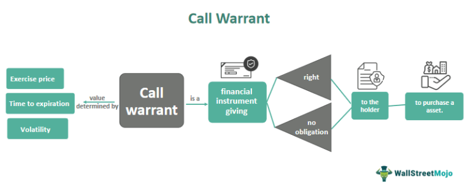

The advent of algorithmic trading has significantly transformed various aspects of financial markets, including the trading of warrants. Warrants, a type of financial derivative, grant the holder the right, but not the obligation, to purchase a company's stock at a predetermined price before the expiry date. These instruments offer investors unique leverage, presenting opportunities for substantial returns, particularly in volatile markets. This leverage stems from the ability to control larger amounts of stock with a relatively small initial investment.

Despite the potential financial benefits they offer, both warrants and algorithmic trading strategies are often subjects of critique. Critics point to the speculative nature of warrants, which can lead to significant losses if market predictions do not materialize. Moreover, algorithmic trading, which relies on complex mathematical models and high-frequency trading strategies, has faced scrutiny regarding its impact on market stability and its propensity to exacerbate market fluctuations.



This article explores the dual-edged nature of these financial instruments, weighing the benefits against the criticisms they encounter. Warrants are powerful tools in the arsenal of experienced traders who understand the intricacies of market movements, and when combined with the precision and speed of algorithmic trading, they can enhance financial strategy execution. However, the integration of these elements also requires careful consideration of market risks and ethical considerations, particularly in the context of market manipulation and regulatory compliance.

The aim is to provide insights into how these instruments, when utilized effectively, can be incorporated into a well-rounded financial strategy that seeks not only to maximize returns but also to manage risk responsibly. An informed approach to investing in warrants with algorithmic trading can potentially lead to lucrative outcomes, although it demands a solid understanding of both the financial markets and the technologies underpinning algorithmic strategies.

## Table of Contents

## Understanding Call Warrants

Call warrants are financial instruments that afford the holder the right, but not the obligation, to purchase a specific quantity of stock at a predetermined price, known as the exercise price, before a designated expiration date. Unlike options, which are typically traded on exchanges and issued by third parties, call warrants are directly issued by the company whose stock underlies the warrant itself. This issuance often coincides with new equity or debt offerings, as companies use call warrants as a strategic tool to raise capital.

A key feature of call warrants is their high leverage potential. The leverage effect is due to the warrant's inherent ability to amplify the gains (or losses) from favorable (or unfavorable) movements in the stock price relative to the exercise price. The mathematical leverage can be expressed as:

$$
\text{Leverage} = \frac{\Delta \text{Stock Price}}{\Delta \text{Warrant Price}}
$$

This leverage makes call warrants particularly attractive to investors anticipating substantial appreciation in the underlying stock price. When the market price of the stock exceeds the exercise price before expiration, holders can exercise the warrant to purchase the stock at a reduced cost or sell the warrant at a premium. 

However, this high potential for profit does not come without risks. The speculative nature of call warrants means that if the expected stock price increase does not materialize, or if the stock price falls, investors can suffer substantial losses, potentially losing the entire investment if the warrants expire worthless. Additionally, factors like remaining time to expiration and [volatility](/wiki/volatility-trading-strategies) of the underlying stock can affect the pricing of warrants, introducing elements of complexity and risk.

Despite these risks, call warrants remain a compelling component of investment strategies for those willing to embrace their speculative characteristics.

## Benefits of Call Warrants

Call warrants present several advantages to investors, offering access to the potential growth of a company without necessitating immediate equity purchases. This characteristic provides a unique pathway for investors who seek to benefit from a company’s potential appreciation while maintaining flexibility in their investment portfolios.

During times of financial distress, companies can utilize call warrants as a strategic tool to raise capital without the need to increase their debt levels. By issuing call warrants, companies provide investors with the option to purchase shares at a predetermined price, which can be beneficial for both parties. Companies receive the necessary capital injection while investors gain the opportunity to buy shares under favorable conditions, should the company's stock price rise.

Large investors often turn to call warrants when options markets are insufficiently large to allow for substantial engagement. The comparatively smaller size of options markets can limit the ability of major investors to make significant transactions without impacting the market. Call warrants, issued directly by companies, offer an alternative that allows large transactions to occur without the constraints typically seen in standardized options markets.

Furthermore, call warrants are an economical means for investors to speculate on the potential turnaround of a corporation. In scenarios where a company is perceived as undervalued or poised for recovery, investors can purchase call warrants as a method to harness the potential upside while minimizing upfront investments. In essence, call warrants provide leverage that can amplify profits if the company’s stock appreciates significantly.

In conclusion, call warrants offer several distinct benefits including reduced immediate capital outlay, the capacity for companies to raise funds without accruing additional debt, and accessibility for large investors seeking alternatives to traditional options markets. They also present a cost-effective mechanism for speculating on corporate recovery, contributing to their appeal among various investor types.

## Criticism of Call Warrants

Call warrants, while offering significant profit potential, also harbor substantial speculative risks. These risks manifest predominantly if the underlying stock prices fail to appreciate as anticipated. Investors venturing into call warrants must recognize that these instruments are inherently speculative, potentially leading to significant financial losses in scenarios where the stock does not perform as expected.

A notable critique from growth investors pertains to the [liquidity](/wiki/liquidity-risk-premium) and market availability of call warrants, especially concerning [growth stocks](/wiki/growth-stocks). Many investors find warrants unsuitable due to these liquidity constraints, which can complicate timely execution of buy or sell orders, potentially impacting the profitability of warrant investments. Furthermore, the limited availability of warrants linked to growth stocks poses challenges for investors seeking diversification and substantial entry points in such markets. This limitation inevitably affects the overall attractiveness and usability of warrants within dynamic investment portfolios.

The long expiration period attached to many call warrants is a double-edged sword. While it can help mitigate time decay risks—whereby the value of a warrant diminishes as it approaches expiration without having been exercised—this feature does not eliminate these risks entirely. Investors must consider the unpredictable nature of market dynamics over extended periods, which can influence the underlying stock's performance. Consequently, the strategic advantage furnished by longer expiration dates may be offset by the inherent uncertainties and volatilities associated with prolonged market exposure.

In summary, although call warrants offer lucrative opportunities under favorable market conditions, they require careful consideration and risk management due to their speculative nature, liquidity challenges, and the potential erosion of value over time.

## Algorithmic Trading and Call Warrants

Algorithmic trading has transformed the landscape of financial markets by enabling investors to make precise, data-driven transactions at unprecedented speeds. When combined with call warrants, [algorithmic trading](/wiki/algorithmic-trading) can significantly optimize investment strategies by leveraging its advanced data analysis capabilities.

Call warrants are inherently sensitive to price movements of the underlying stock, making speed and timing crucial components in maximizing returns. Algorithmic trading systems are designed to process vast amounts of market data quickly, allowing investors to identify and act on price discrepancies more efficiently than traditional methods.

One of the primary strategies employed in algorithmic trading of call warrants is [market making](/wiki/market-making). This involves continuously buying and selling warrants to profit from the bid-ask spread. By using algorithms, traders can efficiently execute multiple transactions at [high frequency](/wiki/high-frequency-trading), thus maintaining liquidity and capturing minute pricing inefficiencies.

Arbitrage is another strategy that benefits from algorithmic trading, especially with call warrants. Arbitrage traders exploit price differences between identical or related financial instruments in different markets or forms. An algorithmic trading system can simultaneously monitor various markets for discrepancies and execute trades instantaneously when profitable opportunities arise. For example, if the price of a warrant is misaligned with the price of its underlying stock, algorithms can execute trades to capitalize on the expected price convergence.

Trend following is a strategy that involves analyzing price patterns and acting based on predicted trends. When applied to call warrants, trend-following algorithms can detect [momentum](/wiki/momentum) in stock price movements and make timely trades. These algorithms utilize historical data and statistical models to predict future price directions, thus allowing investors to position their warrant trades in alignment with expected market trends.

The integration of algorithmic trading with call warrants requires a strong understanding of both market dynamics and technological systems. Investors develop and implement algorithms using programming languages like Python, which offers robust libraries for data analysis and automation. For example, libraries such as NumPy and Pandas allow for efficient data manipulation, while SciPy offers advanced statistical analysis tools. The use of [machine learning](/wiki/machine-learning) models can further enhance predictive capabilities in trend-following strategies by learning from vast datasets and identifying complex patterns.

Overall, the use of algorithmic trading in warrant investments provides a strategic advantage through its ability to process information rapidly and execute trades with precision. This synergy enhances the potential returns from warrants while managing the inherent risks associated with these financial instruments.

## Combining Warrants with Algorithmic Trading

In the sophisticated landscape of financial markets, merging warrants with algorithmic trading represents a powerful approach to enhancing investment returns. This integration leverages the real-time data analysis capabilities intrinsic to algorithmic strategies, providing investors with an edge in managing the complexities of warrant investments.

To effectively harness this potential, the development of specialized algorithms tailored to the dynamic movements of warrant prices is crucial. Programming tools such as Python, equipped with extensive libraries for data analysis and machine learning, serve as ideal platforms for creating these algorithms. A typical Python-based approach might involve the use of libraries such as Pandas for data manipulation, NumPy for numerical operations, and Scikit-learn or TensorFlow for machine learning tasks. These tools enable the processing and analysis of large datasets, facilitating the identification of patterns and trends in warrant price movements.

```python
import pandas as pd
import numpy as np
from sklearn.model_selection import train_test_split
from sklearn.ensemble import RandomForestRegressor

# Hypothetical data for warrant prices
data = pd.read_csv('warrant_prices.csv')

# Feature engineering for algorithm development
data['price_change'] = data['close'].diff()
data['volatility'] = data['price_change'].rolling(window=7).std()
data.dropna(inplace=True)

# Define features and target variables
features = data[['open', 'high', 'low', 'close', 'volatility']]
target = data['close'].shift(-1)  # Predict next day's closing price

# Split data into training and testing sets
X_train, X_test, y_train, y_test = train_test_split(features, target, test_size=0.2, random_state=42)

# Using a Random Forest Regressor as an example of a predictive model
model = RandomForestRegressor(n_estimators=100, random_state=42)
model.fit(X_train, y_train)

# Validate model performance
score = model.score(X_test, y_test)
print(f'Model Prediction Score: {score:.2f}')
```

Addressing the inherent challenges such as liquidity and volatility requires robust data management and risk assessment systems. Algorithmic trading frameworks must account for the fluctuating availability and pricing of warrants, often exacerbated by market conditions. Strategies to mitigate these risks include the use of comprehensive datasets encompassing historical and real-time market data, which aid in refining predictive models. Furthermore, risk management systems employing tools like Value at Risk (VaR) models help in quantifying potential losses, allowing investors to adjust their strategies dynamically.

By integrating sophisticated data analytics and risk management techniques, the fusion of warrants and algorithmic trading presents an innovative avenue for investors. This approach not only maximizes potential returns but also enhances strategic responsiveness to market volatility, underpinning a more resilient investment strategy.

## Real World Example

Warren Buffett's strategic investment in Bank of America’s call warrants effectively illustrates how these financial instruments can be leveraged for significant gains. During the 2008 financial crisis, Bank of America faced substantial financial difficulties, leading to a sharp decline in its stock price. In 2011, Buffett saw an opportunity amidst the turbulence and negotiated a deal with the bank. He purchased $5 billion worth of call warrants, giving him the right, but not the obligation, to buy 700 million shares of Bank of America at a strike price of $7.14 per share. At that time, the bank's shares were trading around this price, reflecting Buffett's confidence in the bank's recovery potential.

The defining feature of these warrants was their 10-year expiration period, which significantly reduced the pressure often associated with shorter-term speculative investments. Buffett essentially leveraged the warrants' long expiration period to benefit from Bank of America's eventual turnaround. By the end of 2016, Bank of America’s stock price had risen substantially above the exercise price. Buffett decided to exercise his warrants and acquired the shares for approximately $7.14 each. At the time of exercise, the market price of the bank's shares was significantly higher, allowing Buffett to gain a substantial profit. This strategic choice exemplifies how the extended time horizon can mitigate risk while enabling potential for returns.

Buffett's investment showcases the importance of strategic timing and market insight when utilizing call warrants. His approach involved assessing the underlying company's future potential and making judgment calls about its likelihood to rebound. By exercising the warrants at a low strike price when the market price was high, Buffett's strategy effectively maximized the leverage intrinsic to warrants. His success underscores that, while inherently risky, warrants can be astutely managed as part of a broader investment strategy to deliver high returns. Buffett’s example serves as a crucial lesson in aligning economic foresight with timing, demonstrating that well-analyzed investments in distressed securities can yield exceptional rewards.

## Critiques and Future Outlook

Critics of warrant-based algorithmic trading often emphasize the regulatory and ethical challenges associated with these practices. The primary concern revolves around market manipulation risks, which can arise from the rapid execution and massive scale of trades facilitated by algorithms. The potential for these algorithms to cause artificial price movements, destabilize financial markets, or gain unfair advantages raises significant ethical questions and necessitates rigorous regulatory oversight. Regulatory bodies may impose stricter guidelines to ensure transparency, fairness, and market stability, requiring substantial compliance efforts from trading entities.

Looking ahead, the future of warrant-based algorithmic trading appears poised for significant transformation through the integration of [artificial intelligence](/wiki/ai-artificial-intelligence) (AI) and machine learning technologies. These advancements promise to enhance predictive capabilities, allowing algorithms to process vast amounts of data with greater accuracy and uncover complex market patterns that were previously difficult to detect. AI models can analyze historical data, recognize trading signals, and adapt to market changes with a level of precision that surpasses traditional algorithmic methods.

As technology continues to advance, we can anticipate improved execution efficiency. High-frequency trading systems, powered by cutting-edge technologies, are likely to optimize the speed and accuracy of trades, minimizing latency and slippage while maximizing profits. Furthermore, the scope of investment strategies is expected to expand, offering investors a broader range of opportunities to engage with warrants and other financial instruments. Machine learning techniques may enable the development of more sophisticated trading strategies, such as dynamic portfolio management and real-time risk assessment, tailored specifically to exploit the nuances of warrant trading.

The combination of regulatory attentiveness and technological innovation suggests a future where warrant-based algorithmic trading can evolve into a more robust and responsible investment mechanism. By balancing the need for market integrity with the potential for innovation, the financial industry can create a sustainable environment for investors seeking to capitalize on the unique opportunities presented by warrants.

## Conclusion

The synergy between call warrants and algorithmic trading presents significant opportunities for investors seeking substantial returns. Call warrants, with their inherent leverage, allow investors to make strategic bets on the future performance of underlying stocks without the need for immediate equity acquisition. Algorithmic trading, with its speed and analytical capabilities, enhances this process by quickly identifying and exploiting market inefficiencies.

Despite their potential, both instruments come with inherent risks. High levels of speculation in call warrants can lead to significant losses if stock prices do not perform as anticipated. Algorithmic trading, while efficient, can also contribute to market volatility and raises concerns about ethical implications and market manipulation. Therefore, a balanced approach is crucial.

Investors must navigate these complexities with a critical eye, integrating robust risk management strategies and staying informed about regulatory changes. By maintaining a careful balance between leveraging the advanced capabilities of algorithmic trading and acknowledging the risks associated with call warrants, investors can position themselves to make informed decisions in this rapidly evolving market landscape. Adapting swiftly to technological advancements and market dynamics will be essential for investors aiming to optimize their strategies and reap the benefits of these powerful financial instruments.

## References & Further Reading

[1]: ["The Handbook of Financial Engineering: New Financial Products"](https://archive.org/details/handbookoffinanc0000unse_y9v3) by Clifford E. Kirsch and Jaemin Kim

[2]: ["Options, Futures, and Other Derivatives"](https://www.amazon.com/Options-Futures-Other-Derivatives-11th/dp/B0B9JS99C2) by John C. Hull

[3]: Bergstra, J., Bardenet, R., Bengio, Y., & Kégl, B. (2011). ["Algorithms for Hyper-Parameter Optimization."](https://proceedings.neurips.cc/paper/2011/file/86e8f7ab32cfd12577bc2619bc635690-Paper.pdf) Advances in Neural Information Processing Systems 24.

[4]: ["Advances in Financial Machine Learning"](https://www.amazon.com/Advances-Financial-Machine-Learning-Marcos/dp/1119482089) by Marcos Lopez de Prado

[5]: ["High-Frequency Trading - A Practical Guide to Algorithmic Strategies and Trading Systems"](https://www.ahmetbeyefendi.com/wp-content/uploads/2020/07/High-Frequency-Trading-Irene-Aldridge.pdf) by Irene Aldridge

[6]: Woebbeking, Felix-Ferdinand. (2020). ["Ethical aspects in the regulation of algorithmic trading."](https://onlinelibrary.wiley.com/doi/10.1111/rego.12437) ERA Forum.

[7]: ["Evidence-Based Technical Analysis: Applying the Scientific Method and Statistical Inference to Trading Signals"](https://www.amazon.com/Evidence-Based-Technical-Analysis-Scientific-Statistical/dp/0470008741) by David Aronson

[8]: ["Machine Learning for Algorithmic Trading"](https://github.com/stefan-jansen/machine-learning-for-trading) by Stefan Jansen

[9]: ["Quantitative Trading: How to Build Your Own Algorithmic Trading Business"](https://www.amazon.com/Quantitative-Trading-Build-Algorithmic-Business/dp/1119800064) by Ernest P. Chan