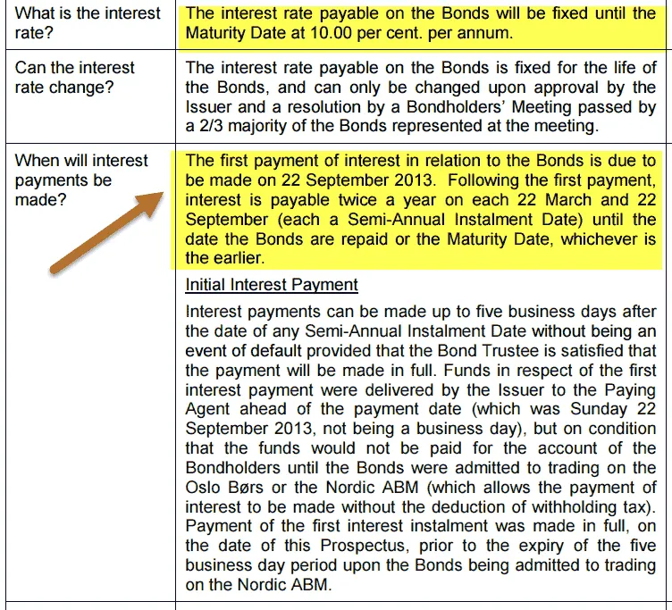

In today's complex financial landscape, investors constantly search for diversified strategies to optimize their portfolios. In response to this demand, a variety of investment strategies have emerged, which focus on financial instruments that offer unique advantages and characteristics. This article shines a light on two such instruments: callable bonds and algorithmic trading.

Callable bonds are distinctive financial securities that provide issuers the option to redeem the bonds before they reach maturity, often at a premium. This feature can introduce additional risks for investors but also brings with it the possibility of higher yield potential. Understanding the specific nuances of callable bonds enables investors to effectively incorporate them within their investment strategies.



Algorithmic trading, on the other hand, leverages advanced software to execute trades based on predefined rules and algorithms. The use of algorithmic trading in investment strategies provides substantial benefits, most notably speed, accuracy, and the ability to respond instantaneously to market fluctuations.

By gaining a deep understanding of callable bonds and the role of algorithmic trading, investors can make more informed decisions. The integration of these strategies allows for optimized portfolio performance, managed risks, and enhanced income streams, tapping into market efficiencies and capitalizing on opportunities as they arise. Through this exploration, investors are better equipped to navigate the intricate world of modern finance.

## Table of Contents

## Understanding Callable Bonds

Callable bonds are a type of fixed-income security that include a clause giving the issuer the option to redeem the bonds before their pre-set maturity date. Typically, the issuer can call the bond at specified times and usually pays a premium, or call price, above the bond's face value. This call feature benefits issuers by providing them the flexibility to refinance debt if interest rates fall, potentially reducing interest expenses.

For investors, callable bonds offer a trade-off between higher yields and additional risks. Since issuers might call the bonds when interest rates decrease, investors face reinvestment risk. This risk arises from the potential need to reinvest the principal at lower yields after the bond is called. As compensation for assuming this risk, callable bonds generally provide higher yield potential compared to non-callable bonds. 

### Differences and Interest Rate Impact

**Callable vs. Non-Callable Bonds**

Non-callable bonds do not provide issuers with the option to retire them before maturity. Consequently, they present a more predictable cash flow for investors, as there is no risk of early redemption. Callable bonds inherently [carry](/wiki/carry-trading) more uncertainty but can offer better yields as a reward for the added risk. 

**Interest Rate Environment Impacts**

The attractiveness of callable bonds is significantly influenced by the prevailing [interest rate](/wiki/interest-rate-trading-strategies) environment. In a setting where interest rates are stable, callable bonds can be an enticing investment due to their enhanced yield. However, if interest rates decrease, issuers are likely to exercise the call option, thus introducing reinvestment risk to the investor.

Conversely, in a rising interest rate environment, callable bonds tend to lose appeal. As interest rates climb, the likelihood of the issuer calling the bond before maturity diminishes, potentially locking investors into a bond yielding less than the current market rate. Therefore, analyzing interest rate expectations is critical when considering callable bonds as part of an investment strategy. 

Investors must carefully assess their risk tolerance and interest rate forecasts when incorporating callable bonds into their portfolios. Understanding these dynamics helps to optimize returns while managing the inherent risks associated with callable bonds.

## Investment Strategies with Callable Bonds

Investors can effectively leverage callable bonds to capitalize on specific market conditions and shifts in interest rate forecasts. One of the primary strategies employed is laddering. This involves purchasing bonds with varying maturity dates to manage interest rate risk more effectively. By staggering the maturities, investors can reinvest funds from maturing bonds into new securities at potentially higher interest rates if market conditions change, which helps stabilize income streams over time.

Yield-to-call analysis is another critical approach. This involves calculating the yield an investor would earn if the bond is called at the earliest possible date. The yield-to-call (YTC) is calculated using the formula:

$$
YTC = \left( \frac{C + \frac{(Call\ Price - P)}{n}} { \frac{(Call\ Price + P)}{2} } \right) \times 100\]

where $C$ is the annual coupon payment, $Call\ Price$ is the price at which the bond can be called, $P$ is the purchase price, and $n$ is the number of years until the call date. By focusing on yield-to-call, investors can assess the potential returns should the bond be redeemed prior to maturity, and make informed decisions based on this yield if rates decline.

Furthermore, incorporating callable bonds into diversified portfolios can enhance both income and potential returns. Due to the typically higher yields offered by callable bonds to compensate for call risk, they can supplement income streams within an investment portfolio. In stable or falling interest rate environments, callable bonds might be called away by issuers, allowing investors to benefit from the high yields in the interim. Conversely, during rising rate phases, if the bonds are not called, they continue to provide higher payments compared to similar non-callable bonds.

Diversification also helps mitigate the unique risks associated with callable bonds. By integrating them with other asset classes, such as equities or non-callable bonds, investors can achieve a more robust defensive strategy, reducing exposure to adverse interest rate movements while capitalizing on callable bond benefits. This layered approach allows for the balancing of potential income with risk management, enhancing overall portfolio performance.

## The Role of Algorithmic Trading

Algorithmic trading, also known as algo trading, involves using advanced software to execute trades at speeds and frequencies that are impossible for human traders. These systems rely on pre-set rules and algorithms to determine trading actions, such as buying or selling financial instruments. This method of trading offers several benefits, including speed, accuracy, and the capacity to respond instantaneously to market fluctuations.

One of the primary advantages of [algorithmic trading](/wiki/algorithmic-trading) is its speed. Trading algorithms can process vast amounts of data in real time and execute trades within milliseconds. This speed is crucial in today's fast-paced financial markets, where prices can change rapidly and opportunities can be fleeting.

Accuracy is another significant benefit of algorithmic trading. By removing the emotional and psychological elements from trading decisions, algos can adhere strictly to predefined rules, minimizing human error. This precision ensures that trades are executed according to the trader's strategy, reducing the risks of slippage or executing trades at unfavorable prices.

Furthermore, algo trading can react instantaneously to market changes, allowing traders to capitalize on price discrepancies or volatile market conditions. Algorithms can monitor multiple markets and instruments simultaneously, identifying and executing trading opportunities far more efficiently than a human trader.

Incorporating algorithmic trading into investment strategies can optimize performance and effectively manage risks. For instance, algorithms can be designed to follow complex strategies such as statistical [arbitrage](/wiki/arbitrage), [trend following](/wiki/trend-following), or mean reversion, which can enhance portfolio returns while maintaining a controlled risk profile. Additionally, risk management techniques can be integrated directly into the algorithm, automatically adjusting trading parameters based on real-time data and market conditions.

Python, often favored for developing algorithmic trading strategies, provides various libraries and tools to facilitate the implementation of these systems. Libraries such as NumPy, pandas, and scikit-learn enable complex data analysis and modeling, while frameworks like Zipline or PyAlgoTrade can handle [backtesting](/wiki/backtesting) and live trading functionalities.

In conclusion, algorithmic trading plays a vital role in modern investment strategies, offering an efficient and accurate means to navigate today's complex financial markets. By leveraging speed and precision, algo trading optimizes investment performance and provides a robust mechanism for managing risks effectively.

## Integrating Callable Bonds and Algo Trading

Combining callable bonds with algorithmic trading provides investors with a robust toolkit to optimize their portfolios in diverse market conditions. Callable bonds, which can be redeemed by the issuer before maturity, are sensitive to interest rate changes and other market variables. Algorithmic trading, which employs sophisticated software to execute trades based on predefined criteria, can offer a systematic and efficient approach to managing these sensitivities.

The primary advantage of integrating algorithmic trading with callable bonds lies in the ability to swiftly identify and capitalize on undervalued or mispriced securities. Algorithms are designed to parse vast amounts of market data in real-time, enabling them to detect pricing inefficiencies or trends that might elude manual analysis. For instance, an algorithm could be programmed to monitor market data feeds for interest rate fluctuations and immediately assess the impact on the pricing of callable bonds. When a bond is identified as undervalued, the algorithm can automatically execute a buy order, potentially capturing the security before the market corrects the price disparity.

Dynamic market adjustments are facilitated through algorithmic trading by constantly updating trading strategies based on real-time data. This adaptability is particularly beneficial in volatile environments where interest rates or other economic indicators are rapidly changing. Algorithms can swiftly recalibrate trading strategies to account for new information, ensuring that positions in callable bonds are optimized for current market conditions. For instance, an algorithm might reduce exposure to callable bonds if a future interest rate cut is anticipated, thereby minimizing reinvestment risk should issuers choose to call the bonds.

To illustrate, a Python-based algorithm could be implemented to automate such trades:

```python
import pandas as pd
import numpy as np

# Sample callable bond price data and interest rate forecast
bond_data = pd.DataFrame({'BondID': ['Bond1', 'Bond2'], 'Price': [100, 98.5], 'Callable': [True, True]})
interest_rate_forecast = 0.025  # Example of a predicted interest rate change

def evaluate_bonds(bond_data, interest_rate):
    undervalued_bonds = []
    for _, bond in bond_data.iterrows():
        if bond['Callable'] and bond['Price'] < (100 - interest_rate * 100):
            undervalued_bonds.append(bond['BondID'])
    return undervalued_bonds

undervalued_bonds = evaluate_bonds(bond_data, interest_rate_forecast)
print(f"Undervalued Bonds: {undervalued_bonds}")

# Output: Undervalued Bonds: ['Bond2']
```

In this example, the algorithm evaluates bonds based on their price in relation to projected interest rate changes, identifying undervalued securities primed for acquisition. Such algorithms enable portfolios to leverage callable bonds effectively, enhancing potential returns while mitigating risks associated with interest rate [volatility](/wiki/volatility-trading-strategies).

The integration of callable bonds with algorithmic trading illustrates a synergy that amplifies investment returns. By employing algorithms to swiftly react to market insights and optimize the execution of trades, investors can capitalize on transient opportunities that align with their broader financial strategies. This combination not only aids in navigating changing market conditions but also fortifies the capability to achieve risk-adjusted returns.

## Risk Management in Callable Bonds and Algo Trading

Callable bonds and algorithmic trading each have specific risks that investors need to navigate effectively to optimize their investment strategies. A solid understanding of these risks is key to successful management and mitigation.

Callable bonds come with inherent reinvestment risk. Reinvestment risk occurs when the bonds are called before maturity, often when interest rates have fallen. This obliges the investor to reinvest the principal at the prevailing lower interest rates, potentially reducing the overall returns. To gauge this risk, investors often employ yield-to-call calculations. The formula to determine yield-to-call is:

$$
YTC = \frac{C + \frac{(F - P)}{n}}{\frac{(F + P)}{2}}
$$

where $C$ is the annual coupon payment, $F$ is the call price, $P$ is the purchase price, and $n$ is the number of years until the call date. This calculation helps investors assess the potential returns if the bond is called early and compare it against other opportunities.

Interest rate changes critically affect callable bonds. When rates drop, issuers are more likely to call their bonds, impacting investors’ returns. Conversely, if rates rise, bonds are less likely to be called, which can also affect the [liquidity](/wiki/liquidity-risk-premium) and reinvestment options for investors. Understanding these fluctuations and planning for different scenarios is essential in managing callable bond portfolios.

Algorithmic trading, while offering advantages in speed and efficiency, harbors technological risks. These include the potential for software bugs, network issues, or even algorithmic errors that could lead to unintended trade executions. To mitigate these risks, rigorous testing and robust system architectures are crucial. Regular back-testing of algorithms with historical data can identify and eliminate bugs or flaws within the strategy. Additionally, employing real-time monitoring tools can detect any unusual activities or anomalies in trading patterns, providing opportunities for timely interventions.

Understanding these risks is critical, but strategies must also reflect the investor's risk tolerance and objectives. The combination of callable bonds' reinvestment risks with algorithmic trading's technological challenges demands a diversified approach. Integrating stress-testing, hedging strategies, and diversified asset allocation can manage exposure while maintaining potential rewards. Investors should also consider scenario analyses that account for varying interest rate environments and technology-related disruptions.

Ultimately, robust risk management strategies enable investors to navigate the complexities of callable bonds and algorithmic trading effectively, thereby maximizing their potential advantages within an investment portfolio.

## Conclusion

Callable bonds and algorithmic trading stand at the forefront of modern investment strategies, providing investors with the means to enhance their portfolios by introducing both diversification and efficiency. Callable bonds, with their embedded option feature, allow issuers a preemptive redemption, leading to potentially higher yields for investors. On the other hand, the advent of algorithmic trading has revolutionized the trading landscape, enabling the execution of complex strategies with precision and speed.

By integrating callable bonds with algorithmic trading, investors are equipped to not only diversify their portfolios but also to take advantage of market inefficiencies. The callable feature of these bonds can be leveraged through algorithms to swiftly respond to changes in interest rates and other economic indicators, optimizing returns. This symbiotic relationship between financial instruments and technology facilitates dynamic portfolio adjustments, a key advantage in today's fast-paced markets.

However, the potential of these tools can only be fully realized through a deep understanding of their inherent dynamics and a robust risk management framework. Callable bonds introduce reinvestment risk, particularly in a declining interest rate environment, while algorithmic trading poses technological and execution risks. Recognizing and managing these risks is paramount to safeguarding investment returns and achieving long-term objectives. Effective strategies may include stress testing trades, maintaining diversified strategies, and employing rigorous monitoring systems.

In conclusion, the integration of callable bonds and algorithmic trading into investment practices holds the promise of enhanced returns and improved portfolio resilience. By carefully managing associated risks and understanding the underlying mechanics, investors can harness these tools to meet their financial goals effectively.

## References & Further Reading

[1]: Malkiel, B. G. (2003). ["The Efficient Market Hypothesis and Its Critics."](https://pubs.aeaweb.org/doi/10.1257/089533003321164958) Journal of Economic Perspectives, 17(1), 59–82.

[2]: Fabozzi, F. J., & Choudhry, M. (2004). ["The Handbook of European Structured Financial Products."](https://www.finnotes.org/publications/the-handbook-of-european-structured-financial-products) Wiley.

[3]: Durbin, M. (2010). ["All About High-Frequency Trading."](https://www.mhebooklibrary.com/doi/book/10.1036/9780071743457) McGraw Hill.

[4]: Aldridge, I. (2013). ["High-Frequency Trading: A Practical Guide to Algorithmic Strategies and Trading Systems."](https://onlinelibrary.wiley.com/doi/pdf/10.1002/9781119203803.fmatter) Wiley.

[5]: Sundaresan, S. (2002). ["Fixed-Income Markets and Their Derivatives."](https://archive.org/details/fixedincomemarke0000sund_j2c6) South-Western College Pub.