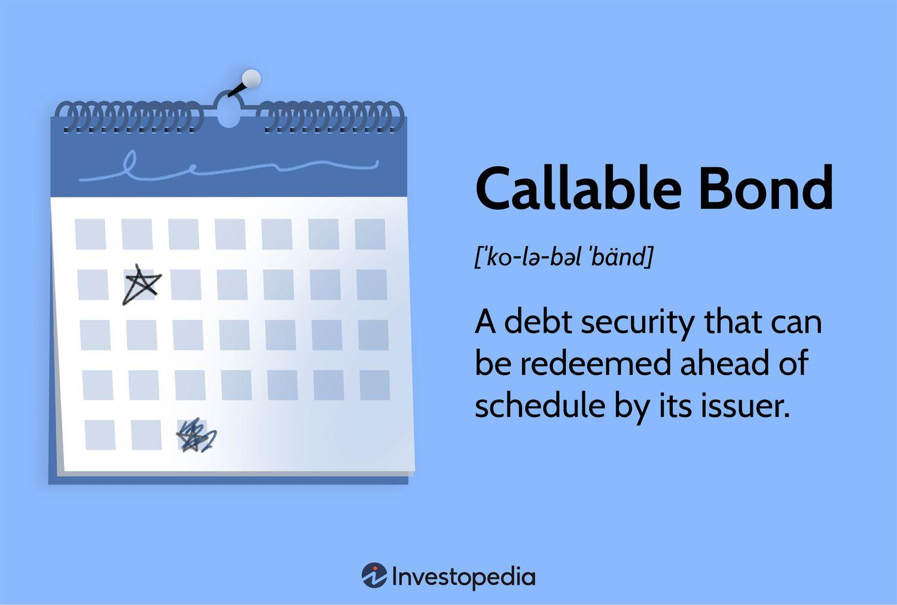

## Table of Contents

## What is a callable bond?

A callable bond is a type of bond that the issuer can redeem or "call" back before it reaches its maturity date. This means the issuer can pay off the bond early, usually when interest rates drop, allowing them to reissue new bonds at a lower interest rate. For investors, this means they might get their money back sooner than expected, but they also face the risk of losing future interest payments if the bond is called.

When a bond is callable, it often comes with a call price, which is the amount the issuer has to pay to redeem the bond early. This price is usually higher than the bond's face value to compensate investors for the early redemption. Callable bonds can be attractive to issuers because they offer flexibility, but they can be less appealing to investors due to the uncertainty of when the bond might be called back.

## How does a callable bond differ from a regular bond?

A callable bond is different from a regular bond because the issuer can choose to pay it back before it's supposed to end. With a regular bond, you know exactly when you'll get your money back because it has a set end date, called the maturity date. But with a callable bond, the issuer might decide to give you your money back early if it's good for them, like when interest rates go down.

This early payback can be good or bad for you as an investor. If the bond is called back, you get your money sooner, which might be nice. But, you also lose out on the interest you would have earned if the bond had lasted until its original end date. Regular bonds don't have this risk because they can't be called back early, so you know exactly how much interest you'll earn until the bond matures.

## What are the advantages of issuing callable bonds for a company?

Issuing callable bonds gives a company more flexibility with its money. If interest rates go down after the company has issued the bonds, they can call the bonds back and pay them off early. Then, the company can issue new bonds at the lower [interest rate](/wiki/interest-rate-trading-strategies). This saves the company money because they don't have to keep paying the higher interest on the old bonds.

Another advantage is that callable bonds can help a company manage its debt better. If the company's financial situation improves or if they have extra money, they can call the bonds back and reduce their debt load. This can make the company look better to investors and can help them avoid paying interest for longer than they need to. Overall, callable bonds give companies a way to adapt to changing financial conditions and manage their money more efficiently.

## What are the risks for investors in callable bonds?

When you invest in callable bonds, one big risk is that you might get your money back sooner than you planned. If the company decides to call the bond back early, usually when interest rates drop, you'll get your original investment back, but you won't get the extra interest you were expecting. This can be a problem if you were counting on that interest for your financial plans.

Another risk is that if the bond gets called back, you might have to find a new place to invest your money. But if interest rates have gone down, the new investments might not pay as much interest as the callable bond did. This means you could end up with less money over time than if you had kept the original bond until it matured.

## How does the call feature affect the bond's yield?

The call feature on a bond usually means that the bond's yield, or the return you get on your investment, is lower than it would be for a regular bond. This is because investors want to be paid more for taking the risk that the bond might be called back early. So, to make up for this risk, the bond might start with a higher interest rate, but the yield you actually get can be less if the bond is called back before it matures.

When a bond is called back, you get your money back sooner than expected, but you lose out on the future interest payments you were counting on. If interest rates have dropped when the bond is called, you might have to reinvest your money at a lower rate. This means your overall return, or yield, on the bond can end up being less than if you had held a regular bond that wasn't callable.

## What is the call price and how is it determined?

The call price is the amount of money the company has to pay to take back the bond early. It's usually a bit more than what the bond is worth when it was first sold. This extra money is like a thank you to the investors for letting the company pay the bond back early. The call price is set when the bond is created and is written in the bond's agreement.

The call price is decided by looking at a few things. One is the bond's face value, which is how much the bond is worth when it's first sold. The company might add a little extra to this face value to make the call price. This extra amount can be a fixed number or a percentage of the face value. The call price can also change over time, often going down the longer the bond has been out. This makes it cheaper for the company to call the bond back if they wait a bit longer.

## Can you explain the concept of call protection and its importance?

Call protection is a time period at the start of a callable bond's life when the company can't call the bond back. This means that for a certain amount of time, usually a few years, the investors know they'll keep getting their interest payments without the bond being taken back early. Call protection is important because it gives investors some peace of mind. They can plan their finances better knowing that the bond won't be called back right away.

The importance of call protection lies in reducing the risk for investors. Without call protection, a company could call the bond back as soon as interest rates drop, leaving investors with less interest than they expected. By having a period of call protection, investors have a bit of time to enjoy the higher interest rates before the company can decide to call the bond back. This makes callable bonds a bit more appealing to investors because it lowers the chance of the bond being called back too soon.

## How do interest rate changes influence the likelihood of a bond being called?

When interest rates go down, companies are more likely to call their bonds back. This is because they can save money by paying off the old bonds and then issuing new ones at the lower interest rate. If a company has a bond that pays 5% interest and rates drop to 3%, they can call the 5% bond back, give investors their money, and then borrow new money at 3%. This way, the company pays less in interest over time.

On the other hand, if interest rates go up, companies are less likely to call their bonds. If rates rise to 6% and the company has a bond paying 5%, it wouldn't make sense to call the bond back. They would have to pay more interest on new bonds, so they'll keep the old ones going until they reach their maturity date. This means investors can keep [earning](/wiki/earning-announcement) the 5% interest until the bond ends.

## What are the key considerations for an investor when analyzing callable bonds?

When looking at callable bonds, investors need to think about a few important things. One big thing is the call protection period. This is the time at the start when the company can't take the bond back. A longer call protection period can make the bond safer for investors because they know they'll get their interest payments for a while. Another thing to consider is the call price. This is how much the company has to pay if they want to call the bond back early. If the call price is a lot higher than the bond's face value, it might make the company think twice before calling it back, which could be good for investors.

Investors also need to keep an eye on interest rates. If rates are high when you buy the bond, there's a bigger chance the company might call it back if rates drop later. This means you could lose out on future interest payments. So, it's a good idea to think about where interest rates are now and where they might go in the future. Overall, callable bonds can be trickier than regular bonds because of the risk that they might be called back early. But if you understand these risks and keep an eye on the key factors, you can make better decisions about whether callable bonds are right for your investment plan.

## How do callable bonds fit into broader investment strategies?

Callable bonds can be a part of a bigger investment plan, but they need some careful thinking. They can be good if you want a higher interest rate than regular bonds. But, you have to be ready for the chance that the bond might be called back early. This means you might get your money back sooner than you thought, and then you'll need to find a new place to invest it. If interest rates have gone down, the new place might not give you as much interest as the callable bond did. So, callable bonds can be useful if you're okay with some risk and you keep an eye on interest rates.

In a bigger investment plan, callable bonds can help spread out your risks. If you have a lot of different kinds of investments, like stocks, regular bonds, and maybe some real estate, adding callable bonds can mix things up a bit. This way, if one type of investment isn't doing well, the others might help balance it out. But, you need to understand that callable bonds can be a bit trickier because of the call feature. So, it's important to think about how much risk you're willing to take and how callable bonds fit with your other investments.

## What advanced pricing models are used to value callable bonds?

To figure out how much a callable bond is worth, people use special math models called option-adjusted spread (OAS) models and binomial tree models. These models help investors see how the chance of the bond being called back early can change its value. The OAS model looks at the bond's interest rate and compares it to other bonds without the call feature. It then adjusts the bond's value based on how likely it is to be called back. This helps investors understand if the bond is a good deal or not.

The binomial tree model is another way to value callable bonds. It works by imagining different paths that interest rates could take in the future. Each path shows what could happen if rates go up or down, and how that would affect whether the bond gets called back. By looking at all these possible futures, the model can give a good guess about what the bond is worth right now. Both models help investors make smarter choices by showing them the risks and rewards of buying a callable bond.

## How do callable bonds interact with other financial instruments in a portfolio?

Callable bonds can work well with other investments in a portfolio, but they add a bit of extra risk because they might be called back early. If you have a mix of investments like stocks, regular bonds, and maybe some real estate, adding callable bonds can help spread out your risks. Stocks might go up and down a lot, but bonds usually stay more steady. Callable bonds can give you a bit higher interest than regular bonds, but you need to be ready for the chance that you might get your money back sooner than you planned.

When you mix callable bonds with other financial instruments, you need to think about how they all fit together. If interest rates drop, your callable bonds might get called back, and you'll need to find a new place to invest that money. If rates have gone down, the new investments might not give you as much interest as the callable bonds did. So, it's important to keep an eye on interest rates and think about how callable bonds might affect your overall investment plan. By understanding how callable bonds work with your other investments, you can make better choices about how to balance risk and reward in your portfolio.

## What are Investment Strategies with Callable Bonds?

Investors can effectively leverage callable bonds to capitalize on specific market conditions and shifts in interest rate forecasts. One of the primary strategies employed is laddering. This involves purchasing bonds with varying maturity dates to manage interest rate risk more effectively. By staggering the maturities, investors can reinvest funds from maturing bonds into new securities at potentially higher interest rates if market conditions change, which helps stabilize income streams over time.

Yield-to-call analysis is another critical approach. This involves calculating the yield an investor would earn if the bond is called at the earliest possible date. The yield-to-call (YTC) is calculated using the formula:

$$
YTC = \left( \frac{C + \frac{(Call\ Price - P)}{n}} { \frac{(Call\ Price + P)}{2} } \right) \times 100\]

where $C$ is the annual coupon payment, $Call\ Price$ is the price at which the bond can be called, $P$ is the purchase price, and $n$ is the number of years until the call date. By focusing on yield-to-call, investors can assess the potential returns should the bond be redeemed prior to maturity, and make informed decisions based on this yield if rates decline.

Furthermore, incorporating callable bonds into diversified portfolios can enhance both income and potential returns. Due to the typically higher yields offered by callable bonds to compensate for call risk, they can supplement income streams within an investment portfolio. In stable or falling interest rate environments, callable bonds might be called away by issuers, allowing investors to benefit from the high yields in the interim. Conversely, during rising rate phases, if the bonds are not called, they continue to provide higher payments compared to similar non-callable bonds.

Diversification also helps mitigate the unique risks associated with callable bonds. By integrating them with other asset classes, such as equities or non-callable bonds, investors can achieve a more robust defensive strategy, reducing exposure to adverse interest rate movements while capitalizing on callable bond benefits. This layered approach allows for the balancing of potential income with risk management, enhancing overall portfolio performance.

## How can risk be managed in callable bonds and algo trading?

Callable bonds and [algorithmic trading](/wiki/algorithmic-trading) each have specific risks that investors need to navigate effectively to optimize their investment strategies. A solid understanding of these risks is key to successful management and mitigation.

Callable bonds come with inherent reinvestment risk. Reinvestment risk occurs when the bonds are called before maturity, often when interest rates have fallen. This obliges the investor to reinvest the principal at the prevailing lower interest rates, potentially reducing the overall returns. To gauge this risk, investors often employ yield-to-call calculations. The formula to determine yield-to-call is:

$$
YTC = \frac{C + \frac{(F - P)}{n}}{\frac{(F + P)}{2}}
$$

where $C$ is the annual coupon payment, $F$ is the call price, $P$ is the purchase price, and $n$ is the number of years until the call date. This calculation helps investors assess the potential returns if the bond is called early and compare it against other opportunities.

Interest rate changes critically affect callable bonds. When rates drop, issuers are more likely to call their bonds, impacting investors’ returns. Conversely, if rates rise, bonds are less likely to be called, which can also affect the [liquidity](/wiki/liquidity-risk-premium) and reinvestment options for investors. Understanding these fluctuations and planning for different scenarios is essential in managing callable bond portfolios.

Algorithmic trading, while offering advantages in speed and efficiency, harbors technological risks. These include the potential for software bugs, network issues, or even algorithmic errors that could lead to unintended trade executions. To mitigate these risks, rigorous testing and robust system architectures are crucial. Regular back-testing of algorithms with historical data can identify and eliminate bugs or flaws within the strategy. Additionally, employing real-time monitoring tools can detect any unusual activities or anomalies in trading patterns, providing opportunities for timely interventions.

Understanding these risks is critical, but strategies must also reflect the investor's risk tolerance and objectives. The combination of callable bonds' reinvestment risks with algorithmic trading's technological challenges demands a diversified approach. Integrating stress-testing, hedging strategies, and diversified asset allocation can manage exposure while maintaining potential rewards. Investors should also consider scenario analyses that account for varying interest rate environments and technology-related disruptions.

Ultimately, robust risk management strategies enable investors to navigate the complexities of callable bonds and algorithmic trading effectively, thereby maximizing their potential advantages within an investment portfolio.

## References & Further Reading

[1]: Malkiel, B. G. (2003). ["The Efficient Market Hypothesis and Its Critics."](https://pubs.aeaweb.org/doi/10.1257/089533003321164958) Journal of Economic Perspectives, 17(1), 59–82.

[2]: Fabozzi, F. J., & Choudhry, M. (2004). ["The Handbook of European Structured Financial Products."](https://www.finnotes.org/publications/the-handbook-of-european-structured-financial-products) Wiley.

[3]: Durbin, M. (2010). ["All About High-Frequency Trading."](https://www.mhebooklibrary.com/doi/book/10.1036/9780071743457) McGraw Hill.

[4]: Aldridge, I. (2013). ["High-Frequency Trading: A Practical Guide to Algorithmic Strategies and Trading Systems."](https://onlinelibrary.wiley.com/doi/pdf/10.1002/9781119203803.fmatter) Wiley.

[5]: Sundaresan, S. (2002). ["Fixed-Income Markets and Their Derivatives."](https://archive.org/details/fixedincomemarke0000sund_j2c6) South-Western College Pub.