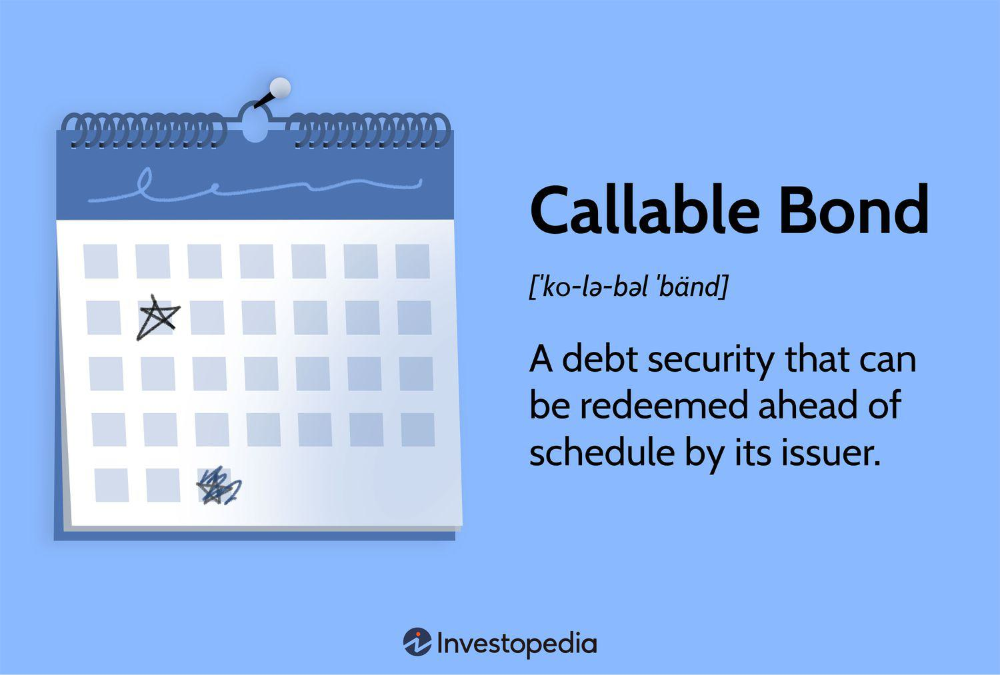

 to Bonds

Bonds play a critical role in the financial markets, serving as a reliable source of income and a fundamental component of many investment portfolios. They are debt securities, essentially loans made by investors to issuers such as corporations, municipalities, or governments. In exchange for the investment, issuers make periodic interest payments to investors and repay the principal amount at the bond's maturity.



Redeemable and callable bonds are specialized forms of bonds that introduce additional layers of consideration for both issuers and investors. A redeemable bond, commonly known as a callable bond, offers issuers the ability to repay the bond prior to its scheduled maturity date. This feature is particularly advantageous for issuers during periods of declining interest rates, as it enables them to refinance existing debt under more favorable terms. To compensate investors for the uncertainty associated with the potential early redemption, callable bonds typically offer higher interest rates compared to their non-callable counterparts.

The exploration of redeemable and callable bonds encompasses an understanding of their advantages and disadvantages. For issuers, the primary benefit lies in the flexibility to manage debt obligations dynamically, optimizing interest expenses when market conditions are favorable. Investors, on the other hand, are attracted by the higher yields, although they must account for the possibility of reinvestment at lower interest rates should the bond be called. Such features present both risks and opportunities, necessitating careful evaluation within the broader scope of fixed-income investment strategies.

Furthermore, the integration of algorithmic trading with bond investing, particularly in the context of callable bonds, offers advanced tools for enhancing decision-making. Algorithmic trading employs computer algorithms to analyze market information rapidly and execute trades, improving efficiency and accuracy in managing bond portfolios.

Understanding the intricacies of redeemable and callable bonds and their interaction with algorithmic trading can empower investors to navigate the complexities of fixed-income markets. The deliberate consideration of these factors is crucial for making informed investment choices, balancing potential returns against inherent risks while contemplating individual risk tolerance and prevailing market conditions.

## Table of Contents

## What Are Redeemable and Callable Bonds?

Redeemable bonds, commonly known as callable bonds, are financial instruments that grant the issuer the right to repay the bond's principal amount before its specified maturity date. This feature offers issuers a strategic tool for debt management, especially under favorable economic conditions such as declining interest rates. By calling the bonds early, issuers can refinance their obligations at a lower cost and reduce interest expenses. This capability is especially appealing when interest rates fall significantly, enabling issuers to replace existing debt with new debt at more advantageous rates.

To compensate for the uncertainty associated with the potential for early repayment, callable bonds typically offer higher interest rates than their non-callable counterparts. This additional yield acts as an incentive for investors, given the reinvestment risk they face if the bond is called. Reinvestment risk is the possibility that an investor will have to reinvest the returned principal at a lower [interest rate](/wiki/interest-rate-trading-strategies), should the bond get called before maturity.

Callable bonds often include specific terms that define when and how they can be called. These terms might involve initial periods, known as "call protection periods," during which the bond cannot be called, thereby providing temporary security for the investor. Once this period expires, the issuer has the right to call the bond on predetermined dates, often coinciding with scheduled interest payments. This framework outlines the flexibility provided to issuers and the potential risk and reward balance for investors in the context of callable bonds.

## How Callable Bonds Work

Callable bonds provide issuers with the flexibility to return an investor's principal before the bond's official maturity date. This mechanism involves distinct terms, including specific call dates and predefined prices at which the issuer can repurchase the bond. Essentially, a callable bond includes an embedded option that grants the issuer the right, but not the obligation, to buy back the bond at a predetermined price, known as the call price. 

The process starts with the identification of call dates, which are pre-scheduled points in time when the issuer can exercise the call option. Issuers usually aim to call bonds in a declining interest rate environment, allowing them to refinance debt at a lower cost. Investors are aware that bonds might be redeemed early, and thus callable bonds generally offer higher yields compared to non-callable bonds to compensate for this uncertainty.

Another important aspect is the call protection period. This is a time frame during which the bond cannot be called, thus providing temporary security to investors. For instance, a bond might have a 10-year maturity but includes a five-year call protection, ensuring the bondholder receives steady interest payments for at least five years.

In mathematical terms, analyzing callable bonds involves assessing the value of the options embedded in them. A common approach involves option pricing models such as the Black-Scholes model or binomial trees, which help estimate the fair value of both the bond and the call option. Although such models need to take into account factors like [volatility](/wiki/volatility-trading-strategies), interest rates, and the time to each call date, they provide crucial insights into whether an issuance might be financially beneficial for the issuer.

Overall, callable bonds serve as a strategic financial instrument for issuers looking to manage interest rate risk, providing them with the opportunity to optimize their debt structure while offering investors a potentially higher yield to counterbalance the call risk.

## Types of Callable Bonds

Callable bonds come with distinct call provisions that determine when and how an issuer can redeem them before maturity. These provisions directly influence the strategic decisions of both issuers and investors, providing flexibility for the former and varying levels of certainty for the latter. Here are the primary types of callable bonds based on these provisions:

1. **American Callable Bonds**: These bonds allow issuers to call the bond at any time after the call protection period has ended. This type of bond offers the greatest flexibility to issuers, allowing them to respond quickly to favorable changes in interest rates. However, for investors, this can lead to uncertainty as the bonds can be called at any time as long as the call protection period has passed.

2. **European Callable Bonds**: These bonds can only be called on specific dates outlined in the bond contract. This specification provides greater predictability for investors, reducing the uncertainty associated with the potential for unexpected calls. Issuers, on the other hand, have less flexibility since they must wait for the specified call dates to redeem the bond.

3. **Bermuda Callable Bonds**: A hybrid between the American and European styles, Bermuda callable bonds can be called on specific dates that typically align with coupon payment dates. This structured but recurring option gives issuers more opportunities to call the bond while still offering investors a degree of predictability and structure.

4. **Canary Callable Bonds**: These bonds feature a limited period during which the bonds can be called, typically after an initial no-call period. Once this period is over, the bonds can no longer be called until maturity. This provision allows issuers to take advantage of specific interest rate movements early in the bond’s life, while providing a subsequent period of stability for investors.

Each type of callable bond presents a unique risk-return profile, impacting the investment strategy of market participants. Understanding the distinct call provisions is crucial for aligning the bond type with investment objectives, whether prioritizing flexibility and opportunity for issuers or stability and predictability for investors.

## Pros and Cons of Redeemable Bonds

Redeemable bonds, commonly known as callable bonds, offer distinct advantages and disadvantages that affect both issuers and investors. For issuers, one of the primary benefits of these bonds is the potential to achieve lower interest rates after refinancing. When market interest rates decrease, issuers can call the existing bonds and reissue new ones at reduced rates, thus decreasing their cost of capital. This capability provides issuers with significant flexibility in managing their debt, allowing them to optimize financial strategies and potentially improve their credit profiles.

For investors, redeemable bonds often come with higher initial yields compared to their non-callable counterparts. This higher yield compensates for the risk that the bonds may be called before maturity. However, this potential upside comes with certain risks. If the bonds are called, investors are faced with the challenge of reinvesting the returned principal at potentially lower prevailing interest rates, a situation known as reinvestment risk. This risk is particularly pronounced in declining interest rate environments, where alternative investment options may offer inferior returns.

On the downside for issuers, calling the bonds generally involves certain costs, including the possible obligation to pay a premium over the bond's face value. This premium compensates investors for the early termination of the bond's interest payments. Furthermore, issuing callable bonds may require a higher interest rate initially to attract investors who seek compensation for their exposure to call risk.

For investors, the primary disadvantage is the potential instability in income streams. The ability of the issuer to call the bond introduces uncertainty, as anticipated interest income over the bond's lifespan may be cut short. This unpredictability necessitates careful portfolio management, especially for those relying on stable income streams for cash flow requirements. Thus, while the higher initial yield of redeemable bonds is attractive, investors must thoroughly assess how these instruments fit within their overall investment strategy, taking into account the interest rate environment and their tolerance for potential income variability. 

Ultimately, both parties must consider these factors carefully to align their financial goals with the risks and opportunities presented by redeemable bonds.

## Impact of Interest Rates on Callable Bonds

Interest rates significantly influence the behavior of callable bonds. When interest rates decline, issuers are incentivized to call existing higher-rate bonds and refinance their debt at the new, lower rates, effectively reducing their cost of capital. This dynamic is driven by the issuers' desire to optimize fiscal responsibility and take advantage of an improved borrowing environment.

For investors, the implications of interest rate fluctuations on callable bonds cannot be understated. Lower interest rates typically result in higher call volumes, as issuers attempt to refinance. Consequently, bondholders might face reinvestment risk, where they must reinvest the returned principal in a potentially lower-yield environment. This reinvestment risk is a critical consideration, as the future interest landscape may offer fewer favorable options, impacting the overall return on investment.

Conversely, rising interest rates tend to make callable bonds less attractive for issuers to call. This scenario occurs because the cost of borrowing is higher, negating the economic incentive to refinance. For investors, this means that the likelihood of their bonds being called diminishes, thus providing a more stable income stream through the maturity of the bond. Economic predictability allows investors to better plan their income and investment portfolios without the concern of sudden calls.

Investors need to be vigilant about assessing market indicators and interest rate forecasts when considering investments in callable bonds. Understanding market risk and the potential direction of interest rates can guide decision-making processes. Predicting interest rate movements involves complex analysis, often incorporating economic indicators, central bank policies, and macroeconomic events.

To further analyze the impact of interest rates on callable bonds and to simulate various interest rate scenarios, investors and financial analysts can employ Python programming for modeling. For instance, using Python's NumPy library, investors can simulate the potential future value of callable bonds based on hypothetical interest rate changes. Here is a simple Python script to simulate such a scenario:

```python
import numpy as np

# Define bond parameters
face_value = 1000  # Face value of the bond
coupon_rate = 0.05  # Annual coupon rate
years = 10  # Years to maturity
interest_rate_scenarios = [0.03, 0.04, 0.05, 0.06]  # Possible future interest rates

# Calculate future values under different interest scenarios
future_values = []

for rate in interest_rate_scenarios:
    future_value = np.pv(rate, years, -coupon_rate * face_value, face_value)
    future_values.append(future_value)

# Display results
for rate, value in zip(interest_rate_scenarios, future_values):
    print(f"Future Value with Interest Rate {rate*100}%: ${value:.2f}")
```

This script simulates how different interest rates could affect the future value of a callable bond, highlighting the changing attractiveness of maintaining versus calling a bond in various interest environments. Such predictive efforts enable investors to strategize effectively, mitigating risks associated with rate fluctuations and making more informed investment choices.

## Algorithmic Trading and Bonds

Algorithmic trading utilizes computer algorithms to automate and optimize the process of making trading decisions, quickly executing orders with minimal human intervention. In the bond market, particularly with callable bonds, [algorithmic trading](/wiki/algorithmic-trading) can significantly enhance investment strategies. The complex features of callable bonds, such as their potential for early redemption and fluctuating interest rates, present unique opportunities and challenges that algorithms are adept at navigating.

Algorithms help in rapidly analyzing vast amounts of market data, including interest rate movements, credit ratings, and macroeconomic indicators, to identify patterns and make informed decisions. For instance, an algorithm might assess whether prevailing interest rates suggest an increased likelihood of a bond issuer exercising the call option. By analyzing historical data and current market conditions, algorithms can suggest optimal buying or selling strategies that align with an investor's risk tolerance and return objectives.

Furthermore, algorithmic trading systems can incorporate predictive modeling techniques, such as [machine learning](/wiki/machine-learning), to forecast future bond price movements and interest rate changes. This predictive capability enables investors to adjust their strategies proactively rather than reactively. Additionally, algorithms can be programmed to execute trades in fractions of a second, capturing fleeting market opportunities that might otherwise be missed by manual trading.

Here's an example of how an algorithm might be structured in Python to evaluate the optimal time to trade a callable bond based on interest rate forecasts:

```python
import numpy as np
from sklearn.linear_model import LinearRegression

def interest_rate_forecast(historical_rates):
    # Example of a simple linear regression model for forecasting
    X = np.array(range(len(historical_rates))).reshape(-1, 1)
    y = np.array(historical_rates).reshape(-1, 1)
    model = LinearRegression().fit(X, y)
    next_period_prediction = model.predict(np.array([[len(historical_rates) + 1]]))
    return next_period_prediction[0][0]

historical_interest_rates = [2.5, 2.7, 2.6, 2.8, 2.9]
forecasted_rate = interest_rate_forecast(historical_interest_rates)
print(f"Forecasted interest rate for next period: {forecasted_rate}")

def trade_based_on_forecast(forecasted_rate, current_rate, callable_bond_yield):
    if forecasted_rate < current_rate:
        print("Consider selling the callable bond, as interest rates are predicted to fall, increasing the likelihood of a call.")
    else:
        print("Hold the callable bond, as rates are steady or rising.")

current_interest_rate = 2.9
callable_bond_yield = 3.5
trade_based_on_forecast(forecasted_rate, current_interest_rate, callable_bond_yield)
```

This example demonstrates a simplistic approach to forecasting interest rates and making trading decisions based on these predictions. While this model uses linear regression for simplicity, more sophisticated approaches like neural networks can be employed for greater accuracy.

Algorithmic trading not only provides speed and efficiency but also aids in constructing diversified and resilient bond portfolios by continuously monitoring and responding to changing market dynamics. As a result, investors can achieve better returns while managing the risks associated with callable bonds more effectively.

## Real World Applications and Examples

Historical issuance trends show a noticeable increase in the use of callable bonds during periods of low-interest rates. This pattern offers valuable insights into the strategic behavior of issuers. Callable bonds provide companies with the flexibility to refinance debt at more favorable terms when interest rates fall. The tendency to issue these bonds during such periods stems primarily from the issuer's ability to manage debt costs effectively. 

### Example: U.S. Corporate Callable Bonds

A concrete example of callable bond issuance can be observed in the United States' corporate bond market. During economic recovery phases, firms often utilize callable bonds to navigate financial landscapes shaped by fluctuating interest rates. For instance, following the 2008 financial crisis, the Federal Reserve implemented policies to lower interest rates, aiming to stimulate economic growth. This resulted in a surge of callable bond issuances as corporations sought to secure low-cost capital, enhancing their financial flexibility [1].

### Strategic Use During Economic Recovery

Callable bonds also serve as a strategic tool during periods of economic recovery. An example can be seen in the actions of companies within the technology and utilities sectors. These sectors frequently issue callable bonds as part of their capital structure optimization strategies, particularly when aiming to capitalize on post-recession growth. The ability to refinance debt efficiently and the prospect of reducing interest expense contribute to their popularity.

### Quantitative Analysis

Quantitative analysis of callable bond issuance can be performed by examining yield spreads over benchmark rates during varying interest rate environments. In Python, such an analysis might look like this:

```python
import numpy as np
import pandas as pd
import matplotlib.pyplot as plt

# Simulated data for bond yields and benchmark rates
dates = pd.date_range(start="2005-01-01", end="2015-01-01", freq='M')
bond_yields = np.random.normal(5, 1, len(dates))
benchmark_rates = np.random.normal(2, 0.5, len(dates))

# Calculate spread
spreads = bond_yields - benchmark_rates
spread_data = pd.DataFrame({'Date': dates, 'Spread': spreads})

# Plotting the spreads over time
plt.figure(figsize=(10, 5))
plt.plot(spread_data['Date'], spread_data['Spread'], label='Yield Spread', color='blue')
plt.axhline(y=0, color='r', linestyle='--', label='Benchmark Rate')
plt.title('Callable Bond Yield Spread over Time')
plt.xlabel('Date')
plt.ylabel('Yield Spread (%)')
plt.legend()
plt.grid(True)
plt.show()
```

This code snippet models the yield spread of callable bonds over a fictive benchmark rate across a decade, illustrating how these spreads might evolve in response to changing economic conditions.

### Conclusion

Callable bonds have proven their utility, particularly during low-interest-rate periods and economic recoveries. By strategically opting for callable bonds, companies can enhance their financial agility, align debt management practices with prevailing market conditions, and optimize their capital structure to better support growth objectives.

### References

[1] Federal Reserve Bank Publications on Post-Crisis Economic Policies.

Note: The Python code is for illustrative purposes. Actual financial analysis would require accurate, real-world financial data.

## Conclusion

Redeemable and callable bonds are significant for both investors and issuers due to their unique characteristics. These bonds offer potential rewards and embody specific risks, depending on market conditions and the strategies employed by investors and issuers.

From the investor's perspective, the opportunity lies in the typically higher yields offered by callable bonds compared to their non-callable counterparts. This higher yield compensates for the risk of the bond being called before maturity, a scenario that would require the investor to reinvest the principal, often at lower prevailing interest rates, known as reinvestment risk. The decision to include callable bonds in a portfolio should involve a careful assessment of personal risk tolerance and the current interest rate environment. Strategic investment in callable bonds requires an understanding of how interest rate fluctuations impact the likelihood of bonds being called.

Issuers find value in redeemable bonds due to their flexibility. These bonds allow issuers to manage debt more effectively by repaying bonds early and issuing new ones at reduced interest rates when conditions are favorable. This flexibility can be a double-edged sword as issuers might be obligated to pay a premium during the early redemption process.

Algorithmic trading offers an advanced dimension to managing callable bond investments. With algorithms, complex datasets, and market conditions can be processed swiftly, enhancing decision-making. Algorithms can optimize bond portfolios by predicting potential call dates based on interest rate trends and allowing adjustments to mitigate risks associated with callable bonds.

Understanding the dynamics of redeemable and callable bonds, especially when paired with algorithmic trading, can empower more informed and strategic investment decisions. While they present potential returns, investors should carefully evaluate the associated risks, matching them carefully against their investment objectives, risk appetite, and market assessments.

## References & Further Reading

[1]: Mishkin, F. S. (2015). ["The Economics of Money, Banking, and Financial Markets."](https://www.pearsonhighered.com/assets/preface/0/1/3/4/0134855388.pdf) Pearson. This book provides an in-depth understanding of the financial markets, including the role and dynamics of bonds.

[2]: Fabozzi, F. J. (2004). ["Bond Markets, Analysis, and Strategies."](https://books.google.com/books/about/Fabozzi_Bond_Markets_Analysis_and_Strate.html?id=9JupBwAAQBAJ) Pearson Education. This text offers comprehensive coverage of bond market concepts, including specific features like callable bonds.

[3]: "Callable Bonds: How They Work and Examples." [Investopedia](https://www.investopedia.com/terms/i/immunization.asp). An accessible article that explains callable bonds' mechanics and offers examples.

[4]: Marc Levinson. (2020). ["Guide to Financial Markets: Why they exist and how they work."](https://books.google.com/books/about/Guide_to_Financial_Markets.html?id=-SxcDwAAQBAJ) The Economist. This guide provides insights on financial instruments, including bonds, and how they operate within financial markets.

[5]: "Callable Bonds and Interest Rate Risk: A Financial Analysis Perspective." [Journal of Fixed Income](https://www.rlam.com/uk/intermediaries/our-views/2024/fixed-income-5-points-podcast--december-2024/). This journal article explores how callable bonds function in relation to interest rate fluctuations from a financial analysis standpoint.

[6]: Lopez de Prado, M. (2018). ["Advances in Financial Machine Learning."](https://www.amazon.com/Advances-Financial-Machine-Learning-Marcos/dp/1119482089) Wiley. Details applications of machine learning in finance, including algorithmic strategies applicable to bonds.