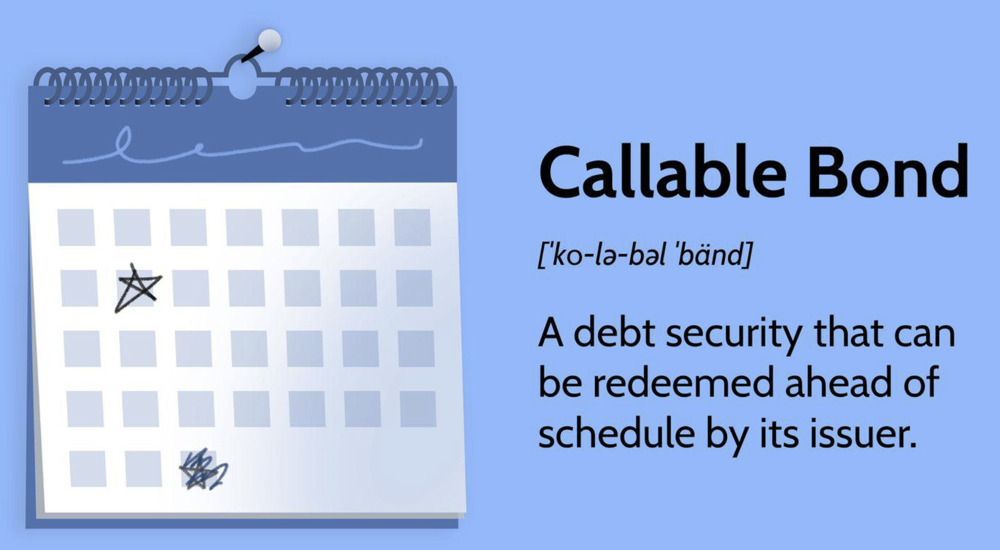

## Table of Contents

## What is a callable bond?

A callable bond is a type of bond that the issuer can decide to pay back before it's supposed to. Imagine you lend money to a friend, and they say they'll pay you back in five years. But, if they win the lottery after two years, they might want to pay you back early. That's kind of like a callable bond. The issuer might choose to "call" the bond back if interest rates drop, because they can then borrow money more cheaply.

For people who buy callable bonds, there's a bit more risk. If the bond gets called back early, they might not get as much interest as they hoped. But, to make up for this risk, callable bonds usually offer a higher interest rate than bonds that can't be called back early. So, it's a trade-off: more potential reward, but also more uncertainty.

## How does a callable bond work?

A callable bond works like this: Imagine you lend money to a company, and they agree to pay you back with interest over a certain period, say 10 years. But, the company has the right to pay you back early, maybe after 5 years, if they want to. This early repayment is called "calling" the bond. The company might decide to call the bond if interest rates go down, because they can then borrow new money at a lower rate than what they're paying you.

For you, the person who bought the bond, there's a bit of a risk. If the company calls the bond early, you get your money back sooner, but you might miss out on the interest you were expecting for the full 10 years. To make up for this risk, callable bonds usually offer a higher [interest rate](/wiki/interest-rate-trading-strategies) than regular bonds. So, you might get a better deal if the bond isn't called, but you have to be ready for the possibility that it might be.

## What are the different types of callable bonds?

There are a few different types of callable bonds. One type is the American Callable Bond. With this kind, the issuer can call the bond back at any time after a certain date. It's like they can choose to pay you back early whenever they want, as long as it's after that set date. Another type is the European Callable Bond. This one is a bit different because the issuer can only call the bond back on specific dates, not any time they want. It's like they have to wait for certain "windows" to pay you back early.

There's also the Bermuda Callable Bond, which is kind of in between the American and European types. With a Bermuda Callable Bond, the issuer can call the bond back on certain dates, but they have more chances to do it than with a European bond. It's like they have several "windows" throughout the bond's life when they can choose to pay you back early. Each type of callable bond has its own rules about when the issuer can call it back, and these rules affect how much risk and reward there is for the person who buys the bond.

## Can you provide examples of callable bonds?

Imagine a company called BigCorp issues a bond that pays 5% interest every year for 10 years. This bond is an American Callable Bond, which means BigCorp can choose to pay it back early at any time after the first 3 years. If interest rates drop to 3% after 5 years, BigCorp might decide to call the bond back. They would pay you back the money you lent them, and then they could borrow new money at the lower 3% rate. You would get your money back sooner, but you'd miss out on the higher interest you were expecting for the next 5 years.

Another example is a European Callable Bond issued by a city called Smallville. This bond pays 4% interest each year for 15 years, but Smallville can only call it back on specific dates: after 5 years, 10 years, or 15 years. If interest rates fall to 2% after 10 years, Smallville might decide to call the bond back at that time. They would pay you back the money you lent them and then borrow new money at the lower rate. You would get your money back earlier than expected, but you wouldn't get the higher interest for the last 5 years of the bond's life.

## What are the advantages of investing in callable bonds?

One advantage of investing in callable bonds is that they usually offer a higher interest rate than regular bonds. This is because the issuer can decide to pay the bond back early, which adds some risk for the investor. To make up for this risk, the issuer gives a higher reward in the form of a higher interest rate. So, if the bond isn't called back early, the investor can earn more money than they would with a regular bond.

Another advantage is that callable bonds can be a good choice if you think interest rates are going to stay the same or go up. If rates stay high, the issuer is less likely to call the bond back early because they would have to pay a high rate to borrow new money. This means you can keep [earning](/wiki/earning-announcement) the higher interest rate on your callable bond for longer. So, if you believe rates won't drop, callable bonds can be a smart way to get a better return on your investment.

## What are the disadvantages of investing in callable bonds?

One big disadvantage of investing in callable bonds is the risk that the bond might be called back early. If the issuer decides to call the bond, you get your money back sooner than expected, but you miss out on the higher interest you were hoping to earn for the full term of the bond. This can be frustrating if you were counting on that extra income.

Another disadvantage is that callable bonds can be harder to predict than regular bonds. Since the issuer can choose to call the bond back at certain times, it adds uncertainty to your investment. You have to keep an eye on interest rates and be ready for the possibility that the bond might be called back, which can make planning your finances more complicated.

## How does the call feature affect bond valuation?

The call feature on a bond can make it worth less than a regular bond. When a bond can be called back early, it adds risk for the person who buys it. They might not get to earn the high interest for as long as they hoped. Because of this risk, investors want more reward to make up for it. So, they might not be willing to pay as much for a callable bond as they would for a regular bond that can't be called back early. This means the price of a callable bond might be lower.

The call feature also makes it harder to figure out what a bond is worth. With a regular bond, you can predict how much money you'll get over time. But with a callable bond, you have to guess when the issuer might call it back. This makes the bond's value depend a lot on what might happen with interest rates in the future. If rates are expected to go down, the chance of the bond being called back goes up, which can make the bond worth less to investors.

## What is the impact of interest rate changes on callable bonds?

When interest rates change, it can really affect callable bonds. If interest rates go down, the issuer of a callable bond might want to call it back. They can then borrow new money at the lower rate instead of paying the higher rate on the old bond. This means the person who bought the bond might get their money back sooner than they expected, but they won't get to earn the high interest for as long as they hoped. So, when rates drop, the value of a callable bond can go down because the chance of it being called back goes up.

On the other hand, if interest rates go up, the issuer is less likely to call the bond back. They would have to pay a higher rate to borrow new money, so it's better for them to keep paying the lower rate on the old bond. This can be good for the person who bought the bond because they can keep earning the high interest for longer. But, the value of the callable bond might still be affected. Even if rates go up, investors know there's always a chance the bond could be called back if rates drop in the future, so they might not be willing to pay as much for it as they would for a regular bond.

## How do callable bonds compare to non-callable bonds?

Callable bonds and non-callable bonds are different in a few important ways. A callable bond can be paid back early by the issuer, which adds some risk for the person who buys it. Because of this risk, callable bonds usually offer a higher interest rate than non-callable bonds. If you buy a callable bond and it gets called back early, you get your money back sooner but you might miss out on the interest you were expecting. On the other hand, a non-callable bond can't be paid back early, so you know exactly how much interest you'll get over the full term of the bond. This makes non-callable bonds a bit safer but they usually come with a lower interest rate.

The way interest rates change can also affect callable and non-callable bonds differently. If interest rates drop, the issuer of a callable bond might decide to call it back and borrow new money at the lower rate. This means the value of the callable bond can go down because there's a bigger chance it will be called back early. Non-callable bonds don't have this risk, so their value is less affected by changes in interest rates. But, even if rates go up, the value of a callable bond might still be lower than a non-callable bond because investors know there's always a chance it could be called back if rates drop in the future.

## What strategies can investors use when investing in callable bonds?

When investing in callable bonds, one strategy investors can use is to carefully look at what interest rates are doing and what they might do in the future. If you think interest rates will stay the same or go up, callable bonds can be a good choice because the issuer is less likely to call them back early. You can keep earning the higher interest rate for longer. But if you think rates will go down, you might want to be careful because the issuer might call the bond back to borrow new money at the lower rate, and you could lose out on the interest you were expecting.

Another strategy is to diversify your investments. Instead of putting all your money into callable bonds, you can mix them with non-callable bonds and other types of investments. This way, if one of your callable bonds gets called back early, you won't lose all your expected interest. You'll still have other investments that can keep earning money for you. By spreading your money around, you can lower the risk of investing in callable bonds and still have a chance to earn a good return.

## How do issuers decide when to call a bond?

Issuers decide to call a bond back when it makes financial sense for them. The main reason they might do this is if interest rates go down. If rates drop, the issuer can borrow new money at a lower rate than what they're paying on the old bond. So, they call the bond back, pay the investor back their money, and then borrow new money at the lower rate. This saves them money on interest payments.

Sometimes, issuers also look at other things before deciding to call a bond. They might check if calling the bond fits with their overall financial plans or if it helps them manage their debt better. They have to weigh the cost of calling the bond against the benefits of borrowing at a lower rate. If the benefits are big enough, they'll go ahead and call the bond back.

## What are the tax implications of callable bonds for investors?

When you invest in callable bonds, the tax implications can be a bit tricky. If a bond gets called back early, you might have to pay taxes on the interest you've earned up to that point. The interest you get from bonds is usually taxed as regular income, which means it could push you into a higher tax bracket if you weren't expecting it. Also, if you get your money back sooner than you planned, you might have to figure out what to do with it, and any new investments you make with that money could have their own tax consequences.

Another thing to keep in mind is that if you sell a callable bond before it matures or gets called, you might have to pay capital gains tax on any profit you make. If you sell the bond for more than you paid for it, that profit is a capital gain, and you'll owe taxes on it. On the other hand, if you sell it for less than you paid, you might be able to claim a capital loss, which can help reduce your taxes. So, it's important to think about these tax issues when you're deciding whether to invest in callable bonds and how to manage them.

## References & Further Reading

[1]: Mishkin, F. S. (2015). ["The Economics of Money, Banking, and Financial Markets."](https://www.pearsonhighered.com/assets/preface/0/1/3/4/0134855388.pdf) Pearson. This book provides an in-depth understanding of the financial markets, including the role and dynamics of bonds.

[2]: Fabozzi, F. J. (2004). ["Bond Markets, Analysis, and Strategies."](https://books.google.com/books/about/Fabozzi_Bond_Markets_Analysis_and_Strate.html?id=9JupBwAAQBAJ) Pearson Education. This text offers comprehensive coverage of bond market concepts, including specific features like callable bonds.

[3]: "Callable Bonds: How They Work and Examples." [Investopedia](https://www.investopedia.com/terms/i/immunization.asp). An accessible article that explains callable bonds' mechanics and offers examples.

[4]: Marc Levinson. (2020). ["Guide to Financial Markets: Why they exist and how they work."](https://books.google.com/books/about/Guide_to_Financial_Markets.html?id=-SxcDwAAQBAJ) The Economist. This guide provides insights on financial instruments, including bonds, and how they operate within financial markets.

[5]: "Callable Bonds and Interest Rate Risk: A Financial Analysis Perspective." [Journal of Fixed Income](https://www.rlam.com/uk/intermediaries/our-views/2024/fixed-income-5-points-podcast--december-2024/). This journal article explores how callable bonds function in relation to interest rate fluctuations from a financial analysis standpoint.

[6]: Lopez de Prado, M. (2018). ["Advances in Financial Machine Learning."](https://www.amazon.com/Advances-Financial-Machine-Learning-Marcos/dp/1119482089) Wiley. Details applications of machine learning in finance, including algorithmic strategies applicable to bonds.