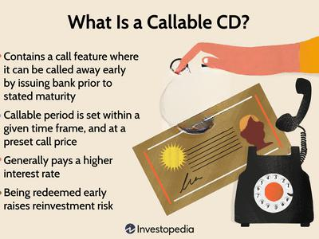

Understanding investment options is crucial for financial growth and stability. One such investment vehicle is the callable certificate of deposit (CD), which offers unique advantages and challenges for investors. Callable CDs are mechanisms that allow financial institutions to "call" or redeem the CD before its maturity date, typically at a higher interest rate than traditional CDs. This feature makes them an attractive option for those seeking potentially higher yields, but also comes with the tradeoff of reinvestment risk if the CD is called early, especially in declining interest rate environments.

The world of investing is increasingly intertwined with technology, leading to the noticeable integration of callable CDs into algorithmic trading strategies. Algorithmic trading, which involves using complex algorithms to execute trades based on predetermined criteria, can optimize returns associated with callable CDs by leveraging their call features in line with market conditions. Algorithms can assess large datasets to inform and adjust portfolios dynamically, providing a more systematic approach to managing the inherent risks and potential rewards of callable CDs.



However, the benefits of callable CDs are accompanied by various risks, primarily centered around interest rate fluctuations and the timing of the call. The risk occurs if interest rates drop and an institution calls the CD, as investors might then face the challenge of reinvesting at lower prevailing rates. Algorithmic trading can mitigate these risks by quickly responding to market changes and strategically reallocating investments based on predictive data models, thereby enhancing overall returns.

One cannot overlook the tax implications associated with investing in callable CDs. Interest earned is typically subject to federal income tax and must be reported to the IRS. The investor's tax bracket can significantly influence the effective yield from these CDs, making it imperative to consider tax obligations in decision-making. Additionally, utilizing tax-advantaged accounts can help optimize the after-tax returns from these investments.

In summary, callable CDs represent a viable investment opportunity for those seeking higher yields and willing to manage the associated risks. When paired with algorithmic trading, they can form part of a sophisticated investment strategy that optimizes returns. However, investors must be cognizant of tax implications, reinvestment risks, and market dynamics to fully harness their potential.

## Table of Contents

## Understanding Callable Certificates of Deposit

Callable Certificates of Deposit (CDs) are a specialized form of fixed-term deposit that provide the issuing bank with the flexibility to “call” or redeem the CD before it reaches maturity. This distinctive feature differentiates them from traditional CDs, where the depositor retains control over the maturity date, barring any premature withdrawal, which typically incurs penalties.

Callable CDs operate by offering higher interest rates as compensation for the early call risk. When a bank issues a callable CD, it commits to paying a specified [interest rate](/wiki/interest-rate-trading-strategies) until the CD matures. However, the call feature allows the bank to redeem the CD, typically after an initial lock-in period, if interest rates fall appreciably or the bank finds cheaper sources of funding elsewhere. This initial period before the CD can be called is known as the “non-callable period,” which can range from a few months to several years, depending on the terms established upon issuance.

The Federal Deposit Insurance Corporation (FDIC) offers backing for callable CDs, similar to traditional CDs, thereby insuring deposits up to a maximum limit per depositor, per insured bank, and per ownership category. This insurance provides a layer of security against bank defaults, although it does not protect against losses incurred if a callable CD is redeemed early at potentially lower interest reinvestment opportunities.

Banks may opt to call a CD based on economic conditions, particularly falling interest rates, or due to changes in their capital requirements. In essence, if market interest rates decline, the bank might find it economically advantageous to call the CD to reissue it at a lower rate, thus reducing their cost of borrowing.

For investors aiming for higher yields, callable CDs present an attractive opportunity. The enhanced interest rates offered can compensate for the uncertainty of the call feature. However, investors need to assess their own risk tolerance and investment horizons carefully, given that the early recall of the CD could result in reinvestment challenges, particularly in a declining interest rate environment.

In summary, callable CDs are a compelling option for investors who are interested in potentially higher returns with an understanding of the associated risks and call features. They provide flexibility for banks and potential rewards for investors, but also introduce a level of unpredictability concerning the stability of interest rates and the timing of returns.

## Callable CDs: Advantages and Disadvantages

Callable certificates of deposit (CDs) offer a distinct investment option characterized by both potential benefits and inherent risks. 

### Advantages of Higher Interest Rates

Callable CDs typically provide higher interest rates compared to traditional CDs. This increased yield serves as compensation for the potential uncertainty investors face with the callable feature. The enhanced interest rates can be attractive to investors seeking better returns on relatively low-risk fixed-income securities. The rationale is straightforward: accepting the risk of an early call by the bank merits a higher compensation in terms of interest.

### Reinvestment Risks

The primary risk associated with callable CDs is reinvestment risk. This occurs when a bank exercises its right to call the CD before maturity, typically in a declining interest rate environment, leaving investors with the challenge of reinvesting the principal at a potentially lower rate of return. Early redemption disrupts the anticipated income stream and may affect the overall investment strategy, particularly when market rates have decreased significantly since the initial purchase of the CD.

### Comparison with Traditional CDs

Traditional CDs lock in an interest rate for a specified term, providing investors with predictable returns. In contrast, callable CDs introduce uncertainty with the call feature, which allows banks to redeem the principal before maturity after a specified lock-in period. While callable CDs offer higher interest rates, their unpredictability differentiates them from the fixed nature of traditional CDs. Investors must weigh the benefit of higher returns against the uncertainty of the call feature.

### Impact on Long-term Investment Strategies

Callable CDs affect long-term investment strategies by introducing an element of unpredictability. If a callable CD is redeemed early, an investor must decide how to reallocate that portion of their portfolio. This decision can impact long-term goals, especially if subsequent investments yield lower returns. Therefore, understanding the role of callable CDs within a broader investment strategy is essential for managing portfolio risk and ensuring alignment with financial objectives.

### Investor Suitability

Investors considering callable CDs should assess their risk tolerance, investment horizons, and the importance of predictable income streams. Suitable investors often have a moderate risk appetite and are willing to accept the possibility of early redemption for the benefit of higher initial interest rates. Retirees or others relying on regular income may find the uncertainty of callable CDs less appealing, preferring the stability associated with traditional CDs.

### Call Premiums and Maturity Terms

Understanding the terms associated with callable CDs is crucial. Call premiums, sometimes provided as an incentive for early redemption, and specific maturity terms dictate the overall value of the investment. Investors should thoroughly examine these terms, inspecting the lock-in period during which the CD cannot be called, as well as any premiums awarded if the bank decides to exercise its call option. This comprehension ensures informed decision-making and alignment with financial goals.

In summary, callable CDs present a unique opportunity for achieving higher returns in exchange for increased risk. They require a nuanced understanding of interest rate environments, reinvestment challenges, and strategic portfolio integration to optimize their potential within an investment strategy.

## The Role of Callable CDs in Algo Trading

Algorithmic trading, often referred to as algo trading, involves using computer algorithms to execute trading orders at optimal times. By leveraging data and statistical models, [algorithmic trading](/wiki/algorithmic-trading) aims to maximize trading efficiency and profitability while minimizing human error and biases. It is particularly beneficial for handling high-frequency trading scenarios, conducting intensive analysis, and swiftly adjusting to market changes. Callable Certificates of Deposit (CDs), traditionally considered conservative investment vehicles, can be integrated into these strategies to enhance portfolio returns.

Callable CDs, by nature, introduce variables like call options that can be strategically exploited. Algorithms can be programmed to monitor interest rate fluctuations and predict the likelihood of a callable CD being called before maturity. This ability is particularly useful given that callable CDs offer higher interest rates but [carry](/wiki/carry-trading) the risk of being reprised when market interest rates drop.

### Integration of Callable CDs into Algorithmic Trading

The integration involves several steps:

1. **Data Analysis and Prediction Models:**
   Trading algorithms can analyze historical and real-time data to predict when a callable CD might be called. The algorithm considers factors such as interest rate movements, issuer behaviors, and macroeconomic indicators. Predictive models can highlight statistical probabilities of calls, aiding decision-making.

2. **Optimizing Investment Decisions:**
   With callable CDs, algorithms can periodically reassess their potential returns versus associated risks. This includes calculating the expected yield by considering the callability feature and reinvestment risk. Algorithms can simulate various interest rate scenarios to provide insights into the likely outcomes, thereby allowing investors to decide whether holding or selling a callable CD is advantageous.

   To calculate the expected yield, an algorithm may use a formula similar to:
$$
   \text{Expected Yield} = \frac{\text{Total Interest Received} + (\text{Final Redemption Value} - \text{Purchase Price})}{\text{Purchase Price}} \times \frac{1}{\text{Years to Maturity}}

$$
   Adjustments are made if the CD is called before maturity.

3. **Risk Management:**
   Algorithms can manage the associated risks of callable CDs more effectively. By continuously monitoring market conditions and executing trades based on sophisticated risk models, algorithms can advise on maintaining the desired asset allocation balance. They can adjust the holding of callable CDs in response to emerging market trends, reducing exposure when risks outweigh potential rewards.

4. **Case Studies and Applications:**
   Although specific case studies might be proprietary or unavailable in public forums, investment firms have successfully integrated callable CDs into algo trading portfolios, optimizing returns by accurately predicting call dates and reallocating funds to higher-yield alternatives. These strategies often incorporate [machine learning](/wiki/machine-learning) to refine the precision of predictions over time.

5. **Automated Portfolio Management:**
   Callable CDs can be seamlessly integrated into automated trading platforms. Portfolio management software can be programmed to include callable CDs within a diversified investment strategy, frequently reassessing their place based on the yield curve and competitor investment vehicles. For instance, an algorithm in Python might consist of the following pseudocode:

   ```python
   def evaluate_callable_cd(investment_portfolio, interest_rate_forecast, cd_details):
       for cd in investment_portfolio.callable_cds:
           probability_of_call = estimate_call_probability(cd, interest_rate_forecast)
           if probability_of_call > threshold:
               evaluate_reinvestment_options(cd)
               if better_option_available:
                   rebalance_portfolio(cd, new_option)

   def estimate_call_probability(cd, interest_rate_forecast):
       # Advanced logic or machine learning model to estimate call probability
       return estimated_probability
   ```

In conclusion, callable CDs can augment algorithmic trading strategies by providing opportunities to exploit their unique structure for enhanced returns. Algorithms, through meticulous data analysis and adaptive risk management, can navigate the inherent complexities of callable CDs, providing a systematic approach to integrating these financial instruments into automated investment portfolios.

## Reinvestment Risk and Market Implications

Reinvestment risk is a significant concern for investors in callable certificates of deposit (CDs). This risk arises when a bank exercises its right to "call" or redeem the CD before its maturity date, typically when interest rates fall. Consequently, investors are faced with the challenge of reinvesting the returned principal at a lower interest rate, potentially reducing overall returns.

Market interest rate changes directly influence the behavior of callable CDs. When interest rates decline, banks are more inclined to call CDs, repaying the principal before maturity. This strategy allows banks to issue new CDs at lower rates. Conversely, when interest rates rise, the likelihood of a CD being called diminishes, as banks would prefer to maintain the existing higher rate agreements.

To mitigate reinvestment risk, investors can use algorithmic solutions. Algorithmic trading systems can be programmed to analyze interest rate trends and forecast possible changes. By leveraging historical data and predictive analytics, algorithms can identify optimal reinvestment opportunities, ensuring that investors can reinvest their funds effectively when a CD is called. A simple algorithm to track interest rate trends might look like this in Python:

```python
import numpy as np
import pandas as pd

def calculate_moving_average(data, window_size):
    return data.rolling(window=window_size).mean()

# Simulated interest rate data
interest_rates = pd.Series([3.0, 2.9, 2.7, 2.5, 2.8, 3.1, 3.4])

# Calculate a 3-period moving average
moving_average = calculate_moving_average(interest_rates, window_size=3)
print(moving_average)
```

Callable CDs are influenced by broader market trends, which can be monitored to predict potential calls. For example, an economic downturn might trigger a lower interest rate environment, prompting banks to call more CDs. Staying informed about economic indicators, such as inflation rates and central bank policies, can provide insights into how interest rates might shift, affecting callable CDs.

Investors should be aware of how callable CDs react to economic shifts. In a growing economy with rising interest rates, the expected frequency of CD calls decreases, allowing investors to benefit from the initially higher rates. Conversely, a declining economy may lead to more frequent calls as banks aim to refinance at lower rates.

To remain responsive to market changes, investors can subscribe to financial news platforms, attend economic webinars, and engage with forums discussing interest rate forecasts. Additionally, using automated alerts within financial software can help track key interest rate benchmarks and policy announcements, ensuring that investors make timely and informed decisions regarding their callable CD investments.

Overall, understanding reinvestment risk and its mitigation through algorithmic strategies, along with keeping abreast of market trends, is essential for maximizing returns from callable CDs amid fluctuating economic conditions.

## Tax Implications of Investing in Callable CDs

When investing in callable certificates of deposit (CDs), understanding the tax implications is vital for optimizing returns and managing financial obligations effectively. Here's a comprehensive guide on the key tax considerations for investors involved with callable CDs. 

### Overview of Tax Obligations for Interest Earned on CDs

Interest earned on CDs, including callable CDs, is typically considered taxable income by the Internal Revenue Service (IRS). It is important to note that interest is taxed as ordinary income. Therefore, it is subject to your marginal tax rate, which can vary from 10% to 37% depending on your taxable income and filing status.

### How to Report Interest from Callable CDs to the IRS

Interest from callable CDs must be reported annually on your tax return, using Form 1099-INT. Banks and financial institutions issue this form to investors and the IRS, detailing the amount of interest income generated within a tax year. Investors must ensure the accurate transcription of these figures into their annual tax filings to avoid discrepancies and potential audits.

### Tax Benefits and Drawbacks of Holding Callable CDs in Your Portfolio

**Benefits:**

- **Predictability**: Interest income from CDs is consistent and predictable, aiding in financial planning.
- **Potential for Higher Returns**: If callable CDs offer higher interest rates than traditional CDs, they might counterbalance the tax burden.

**Drawbacks:**

- **Taxability**: Since interest is taxed as ordinary income, it may result in a higher overall tax liability, especially if the interest amount is significant.
- **Lost Opportunity for Capital Gains**: Unlike stocks or mutual funds, where capital gains can be tax-efficiently offset by losses, interest income from CDs is always subject to taxation.

### Strategies to Manage Taxable Income from Callable CDs

To optimize the tax efficiency of callable CDs, investors can employ several strategies:

1. **Laddering CDs**: By investing in callable CDs with varying maturity dates, investors can potentially smooth out taxable income over several years, potentially reducing tax liability.

2. **Timing Holdings**: Structuring CD investments to mature in a low-income year can help minimize the tax impact since lower income years generally correspond to lower tax brackets.

### Impact of Tax Bracket on Returns from Callable CDs

Investors in higher tax brackets can find that taxes significantly reduce the net yield on callable CDs. The after-tax return, $(r_a)$, can be calculated as:

$$
r_a = r_g \times (1 - t)
$$

Where $r_g$ is the gross interest rate and $t$ is the tax rate. For example, if an investor in the 32% tax bracket holds a callable CD with an interest rate of 3%, the after-tax return would be $3\% \times (1 - 0.32) = 2.04\%$.

### Utilization of Tax-Advantaged Accounts to Optimize Returns

A strategic approach to increasing the net benefit of callable CDs is to hold them in tax-advantaged accounts such as Individual Retirement Accounts (IRAs) or Roth IRAs. This can shield the interest earned from immediate taxation:

- **Traditional IRA**: Taxes are deferred until withdrawal, potentially at a retirement tax rate lower than the current rate.

- **Roth IRA**: Interest is tax-free upon withdrawal, provided certain conditions are met, since contributions are made with after-tax dollars.

In summary, awareness of the tax implications associated with callable CDs empowers investors to make informed decisions that enhance after-tax returns. Implementing the right strategies and utilizing tax-advantaged accounts can significantly affect the overall yield on callable CD investments.

## Conclusion

Callable certificates of deposit (CDs) present several potential benefits for investors seeking higher yields compared to traditional CDs. Their higher interest rates compensate for the call risk, which can be appealing in a low-interest-rate environment. However, with the possibility of early redemption by the issuing bank, investors must balance the prospects of enhanced returns against the flexibility loss in uncertain market conditions.

Combining callable CDs with algorithmic trading strategies can further optimize returns. Algorithmic trading uses advanced mathematical models and data-driven approaches to identify the best times to invest in callable CDs and minimize reinvestment risks. This strategic integration allows for dynamic adjustments to changing market conditions, potentially improving the overall yield in a diversified investment portfolio.

However, key considerations must be addressed when investing in callable CDs. Investors should evaluate the risk of reinvestment at lower interest rates if the CD is called early, impacting long-term financial objectives. Understanding these risks and the interest rate environment is crucial for informed decision-making. Assessing the likelihood of calls, alongside potential yield benefits, can provide a clearer picture of expected returns and help mitigate unfavorable outcomes.

Callable CDs can play an integral role within a diversified investment strategy. While they offer attractive benefits, it is essential to tailor investment approaches to market trends and individual financial goals. Utilizing up-to-date market research, leveraging technology, and incorporating a mix of assets can enhance overall portfolio resilience and profitability.

For investors interested in expanding their knowledge of callable CDs, a variety of resources are available. Financial institutions' publications, investment research platforms, and courses on algorithmic trading provide comprehensive insights. Engaging with these resources can facilitate better investment decisions, optimize strategies, and ultimately contribute to financial success.

## References & Further Reading

[1]: Naylor, M. J. (2009). ["Algorithmic trading strategies."](https://assets.cambridge.org/97811070/91146/frontmatter/9781107091146_frontmatter.pdf) In Handbook of Financial Data and Risk Information II (pp. 553-560). Cambridge University Press.

[2]: Kim, Y.H., & Lee, J.W. (2016). ["Financial Risk and Algorithmic Trading."](https://www.science.org/doi/10.1126/sciadv.abg9180) Journal of Economic Literature.

[3]: ["Interest Rate Risk Management"](https://www.investopedia.com/articles/optioninvestor/08/manage-interest-rate-risk.asp) by Investopedia

[4]: Fabozzi, F. J. (2009). ["Bond Markets, Analysis, and Strategies"](https://books.google.com/books/about/Bond_Markets_Analysis_and_Strategies_ten.html?id=bQpNEAAAQBAJ) (8th Edition). Pearson.

[5]: ["The Intelligent Investor: The Definitive Book on Value Investing"](https://www.amazon.com/Intelligent-Investor-Third-Definitive-Investing/dp/0063423537) by Benjamin Graham.

[6]: Chan, E. (2013). ["Algorithmic Trading: Winning Strategies and Their Rationale"](https://github.com/ftvision/quant_trading_echan_book) (1st Edition). Wiley Trading.