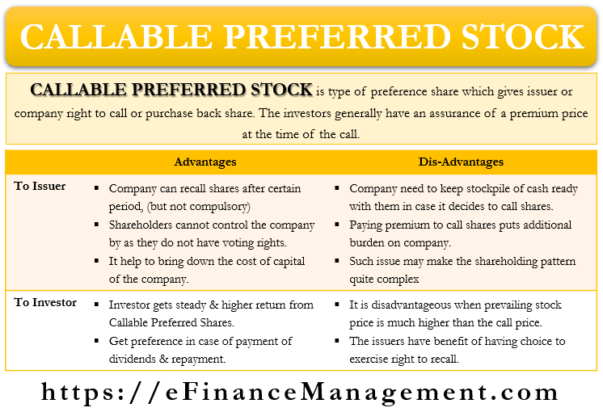

## Table of Contents

## What is callable preferred stock?

Callable preferred stock is a type of stock that a company can buy back from investors at a set price after a certain date. This means the company has the option to "call" the stock back, which is why it's called callable. Investors like this type of stock because it usually pays a higher dividend than regular stock. But, there's a risk because the company might decide to buy it back, and then the investor has to give up the stock.

When a company decides to call back the stock, it usually does so because interest rates have gone down. The company can then issue new stock at a lower dividend rate, which saves them money. For investors, this means they might lose out on future dividends if the stock is called back. So, while callable preferred stock can be a good investment for the higher dividends, it also comes with the risk that the company might call it back at any time after the set date.

## How does callable preferred stock differ from non-callable preferred stock?

Callable preferred stock and non-callable preferred stock are two types of preferred stocks, but they have a big difference. Callable preferred stock can be bought back by the company that issued it. This means the company can decide to take the stock back from investors after a certain date for a set price. On the other hand, non-callable preferred stock cannot be bought back by the company. Once an investor buys it, they can keep it until they decide to sell it or it matures.

Because of this difference, callable preferred stock usually offers a higher dividend to investors. This is to make up for the risk that the company might call the stock back. If the stock is called, the investor loses the chance to earn more dividends in the future. Non-callable preferred stock, however, does not have this risk. Investors know they can keep [earning](/wiki/earning-announcement) dividends as long as they hold the stock, which makes it a safer choice but often with a lower dividend rate.

## What are the key features of callable preferred stock?

Callable preferred stock is a type of stock that gives the company the right to buy it back from investors. This can happen after a certain date and at a set price. Investors like this stock because it usually pays a higher dividend than other types of stock. The higher dividend is like a reward for taking the risk that the company might decide to take the stock back.

When a company calls back the stock, it often does so because interest rates have dropped. By calling the stock, the company can then issue new stock at a lower dividend rate, which saves them money. For investors, this means they might lose out on future dividends if the stock is called back. So, while callable preferred stock can be a good investment for the higher dividends, it also comes with the risk that the company might call it back at any time after the set date.

## Why might a company issue callable preferred stock?

A company might issue callable preferred stock because it gives them a lot of flexibility. If interest rates go down, the company can call back the stock and issue new stock at a lower dividend rate. This saves the company money because they don't have to pay as much in dividends. It's like refinancing a loan at a lower [interest rate](/wiki/interest-rate-trading-strategies).

Another reason is that callable preferred stock can attract investors who want higher dividends. Because there's a risk the company might call the stock back, they offer a higher dividend to make it more appealing. This can help the company raise money more easily, even if it means they might have to pay a bit more in dividends for a while.

## What are the advantages of callable preferred stock for investors?

Callable preferred stock can be a good choice for investors because it usually pays a higher dividend than other types of stock. This means investors can earn more money from their investment. The higher dividend is like a reward for taking on the risk that the company might call the stock back. So, if an investor is looking for a way to get more income from their investments, callable preferred stock can be a good option.

However, there is a risk that the company might decide to call the stock back. If this happens, the investor will get their money back, but they will lose the chance to keep earning those high dividends in the future. Despite this risk, some investors still like callable preferred stock because the higher dividends can make it worth it, especially if they think the company won't call the stock back for a long time.

## How does the call feature affect the valuation of preferred stock?

The call feature on preferred stock can change how much it's worth. When a stock can be called back by the company, it usually means the stock's value goes down a bit. This is because there's a risk that the company might call the stock back, and then the investor loses the chance to keep earning dividends. So, investors might not want to pay as much for the stock because of this risk.

But, callable preferred stock often pays a higher dividend to make up for this risk. This higher dividend can make the stock more attractive to investors who want more income from their investments. Even though the stock might be worth less because of the call feature, the higher dividends can make it a good choice for some investors, especially if they think the company won't call the stock back for a long time.

## What are the risks associated with investing in callable preferred stock?

One big risk of investing in callable preferred stock is that the company might call it back. If this happens, the investor gets their money back, but they lose the chance to keep earning the high dividends. This can be a problem if the investor was counting on those dividends for income. It's like losing a steady paycheck.

Another risk is that the value of the stock can drop because of the call feature. Investors know the company might call the stock back, so they might not want to pay as much for it. This can make the stock less valuable on the market. If an investor needs to sell the stock before it's called, they might not get as much money as they hoped.

## How does the call protection period work in callable preferred stock?

The call protection period is a time when the company can't call back the callable preferred stock. This means that during this time, investors can keep earning the high dividends without worrying about the company taking the stock back. The call protection period is like a safety net for investors, giving them some time to enjoy the benefits of the stock before the company can decide to call it.

Once the call protection period ends, the company can call back the stock if they want to. This is when the risk for investors goes up because the company might decide to take the stock back and stop the dividends. Investors need to be aware of when the call protection period ends so they can plan what to do with their investment.

## What is the process for a company to call its preferred stock?

When a company decides to call its preferred stock, it follows a set process. First, the company checks if the call protection period has ended. This is a time when the company can't call back the stock. If the call protection period is over, the company can move forward with calling the stock. They will announce their decision to call the stock, usually through a press release or a notice to shareholders. This announcement includes the date when the stock will be called and the price the company will pay to buy it back.

After the announcement, the company pays the shareholders the set price for their stock on the call date. This price is usually the original price the shareholders paid for the stock, plus any dividends that are owed up to the call date. Once the shareholders get their money, they have to give their stock back to the company. The company then cancels the stock, which means it's no longer available on the market. This whole process helps the company manage its finances better, especially if interest rates have gone down and they want to issue new stock at a lower dividend rate.

## How do interest rate changes impact callable preferred stock?

Interest rate changes can have a big impact on callable preferred stock. When interest rates go down, companies might decide to call back their preferred stock. They do this because they can then issue new stock at a lower dividend rate, which saves them money. It's like refinancing a loan at a lower interest rate. For investors, this means they might lose out on the high dividends they were getting from the callable preferred stock.

On the other hand, if interest rates go up, companies are less likely to call back their preferred stock. They would have to pay a higher dividend rate on any new stock they issue, which wouldn't save them money. This means investors can keep earning the high dividends from their callable preferred stock for a longer time. So, interest rate changes can make a big difference in whether a company decides to call back its stock and how long investors can keep their investment.

## What are the tax implications for investors holding callable preferred stock?

When investors hold callable preferred stock, they need to think about taxes. The dividends they get from the stock are usually taxed as regular income. This means the tax rate can be higher than the rate for other types of investment income, like capital gains. So, investors might have to pay more in taxes on the dividends from callable preferred stock than they would on other investments.

If the company calls back the stock, investors get their money back. This can be good because they get their original investment back, but it can also have tax effects. If the investor bought the stock for less than the price they get when it's called, they might have to pay capital gains tax on the difference. But if they bought it for more than the call price, they might be able to claim a capital loss, which can help lower their taxes. So, the tax situation can change depending on whether the stock is called back and how much the investor paid for it.

## How can an investor assess whether callable preferred stock is a good investment for their portfolio?

An investor can assess whether callable preferred stock is a good investment by looking at the dividends it offers. Callable preferred stock usually pays higher dividends than other types of stock. This can be good for investors who want more income from their investments. But, they need to remember that the company might call the stock back, which means they could lose those high dividends. So, investors should think about how important those dividends are to them and if they can handle the risk of losing them.

Another thing to consider is the call protection period. This is a time when the company can't call back the stock, so investors can keep earning the dividends safely. Investors should check how long this period lasts and plan their investment around it. They should also look at the current interest rates because if rates go down, the company might call the stock back to save money. By thinking about these things, investors can decide if callable preferred stock fits well in their portfolio and matches their investment goals.

## What are the risks associated with callable preferred stock?

Callable preferred stock presents several risks that investors must consider. One of the primary risks is call risk, where the issuer can redeem the stock before investors have accrued their expected returns. This means that if the market conditions become favorable for the issuer—such as a decrease in interest rates—they might choose to call, or buy back, the stock. While this can benefit the issuer by allowing them to reissue at lower rates, it can result in lost income opportunities for investors.

Interest rate risk is also significant. Callable preferred stocks have a fixed dividend, and when market interest rates rise, these stocks can become less attractive. The fixed nature of their dividends means they might offer poorer returns compared to newly issued stocks with higher rates, leading to a potential decrease in their market value. This inverse relationship can be expressed by the formula:

$$
\Delta P \approx - D \times \Delta r
$$

where $\Delta P$ is the change in the stock price, $D$ is the duration of the stock, and $\Delta r$ is the change in interest rates.

Furthermore, credit risk plays an important role. This risk hinges on the creditworthiness of the issuing company. If the issuer's financial health deteriorates, there is a possibility of default, which can affect dividend payments and the overall security of the investment. The evaluation of credit risk often involves credit ratings and financial analysis of the issuing company, which includes looking at financial statements and market conditions.

Investors must weigh these risks against the potential benefits and consider diversification and other protective strategies in their investment approach.

 to Algorithmic Trading

Algorithmic trading employs sophisticated algorithms to automate the execution of trades based on predefined criteria, effectively transforming how securities, including stocks, bonds, and derivatives, are bought and sold in various financial markets. This method offers the advantage of executing trades with higher speed and frequency than traditional human trading methods. Key to this process are algorithms designed to analyze market data, identify trends, and execute orders at optimal prices, minimizing human intervention and the emotional biases that can influence decision-making.

The efficiency of [algorithmic trading](/wiki/algorithmic-trading) is largely due to advancements in technology such as high-frequency trading ([HFT](/wiki/high-frequency-trading-strategies)), which leverages powerful computers to process vast quantities of data and execute numerous transactions within milliseconds. This speed allows traders to exploit minute price discrepancies across markets, potentially leading to significant profits.

One of the cornerstones of algorithmic trading is the use of mathematical models and quantitative analysis to make decisions. For instance, mean reversion strategies exploit the tendency of prices to revert to their average over time. By identifying securities that are temporarily mispriced compared to their historical averages, algorithms can execute orders that profit when prices return to expected levels.

Python has become a popular language for developing and testing trading algorithms due to its extensive libraries and frameworks, such as NumPy and pandas, which facilitate numerical computations and data manipulation. Below is a simple Python example demonstrating a basic mean reversion strategy:

```python
import numpy as np
import pandas as pd
import matplotlib.pyplot as plt

# Simulated random walk data for stock prices
np.random.seed(42)
n_days = 100
price = 100 + np.cumsum(np.random.normal(0, 1, n_days))

# Calculate the rolling mean and standard deviation
window_size = 20
rolling_mean = pd.Series(price).rolling(window=window_size).mean()
rolling_std = pd.Series(price).rolling(window=window_size).std()

# Define upper and lower bands
upper_band = rolling_mean + rolling_std
lower_band = rolling_mean - rolling_std

# Plot the price and bands
plt.figure(figsize=(10, 5))
plt.plot(price, label='Price')
plt.plot(rolling_mean, label='Rolling Mean', color='orange')
plt.plot(upper_band, label='Upper Band', color='green')
plt.plot(lower_band, label='Lower Band', color='red')
plt.legend()
plt.show()
```

In the example above, the stocks' prices and their rolling mean with upper and lower bands are calculated. A mean reversion strategy would potentially buy when prices hit the lower band (indicating an oversold condition) or sell when they reach the upper band (indicating an overbought condition).

As algorithmic trading gains more prominence, it directly impacts various financial instruments, including fixed-income securities such as callable preferred stocks. The ability to quickly adapt to market conditions, optimize investment strategies, and execute trades without delay provides significant competitive advantages, enhancing the potential for returns while managing associated risks effectively.

## References & Further Reading

[1]: ["Callable Stocks and Bonds"](https://www.investopedia.com/terms/c/callablebond.asp), U.S. Securities and Exchange Commission.

[2]: ["Advances in Financial Machine Learning"](https://www.amazon.com/Advances-Financial-Machine-Learning-Marcos/dp/1119482089) by Marcos Lopez de Prado

[3]: ["Machine Learning for Algorithmic Trading"](https://github.com/stefan-jansen/machine-learning-for-trading) by Stefan Jansen

[4]: ["Quantitative Trading: How to Build Your Own Algorithmic Trading Business"](https://www.amazon.com/Quantitative-Trading-Build-Algorithmic-Business/dp/1119800064) by Ernest P. Chan

[5]: ["Evidence-Based Technical Analysis: Applying the Scientific Method and Statistical Inference to Trading Signals"](https://www.amazon.com/Evidence-Based-Technical-Analysis-Scientific-Statistical/dp/0470008741) by David Aronson