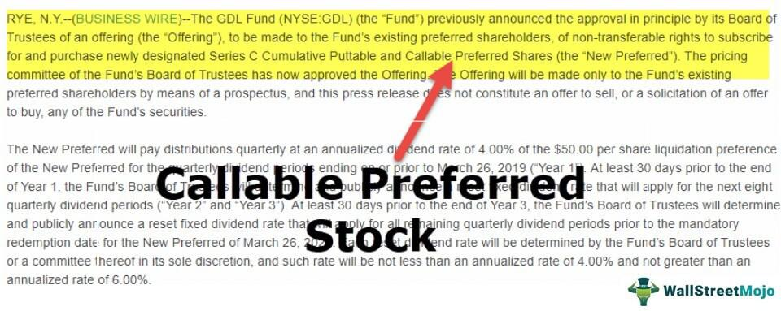

In the ever-evolving world of finance, investment strategies and financial instruments are pivotal in shaping an investor's portfolio. With continuous advancements in technology, investors are presented with a variety of instruments and strategies designed to optimize returns while managing risk. One such financial instrument is callable preferred stock, which combines features of both equity and debt, offering distinct advantages to issuers and investors alike.

Callable preferred stock refers to a type of preferred stock that an issuing company can redeem at its discretion before reaching a specified maturity date. This redemption option enables issuers to capitalize on favorable market conditions, such as declining interest rates, to reduce their overall financing costs. Callable preferred stock is characterized by fixed dividend rates, priority over common stockholders in liquidation scenarios, and often includes conversion features that add a layer of flexibility to the instrument.



Investors are drawn to callable preferred stocks for their relatively higher dividend yields compared to common stocks, coupled with a level of safety due to their prioritized status in the event of a company's liquidation. Nevertheless, these benefits come with certain risks, such as call risk, interest rate risk, and credit risk, which must be judiciously managed to maximize potential returns. This is where contemporary approaches like algorithmic trading play a crucial role.

Algorithmic trading utilizes sophisticated algorithms to automate and optimize trading strategies, enabling investors to execute trades at speeds and frequencies unattainable through traditional methods. By leveraging real-time data and advanced analytics, algorithmic trading provides a technological edge in managing investments, including callable preferred stocks. The integration of algorithmic trading in the management of these stocks offers the potential to enhance investment performance by facilitating rapid responses to market conditions, thereby optimizing buy and sell decisions. 

This article explores the interconnection between callable preferred stock, its investment benefits, and algorithmic trading's role in unlocking the full potential of investment portfolios. Understanding these concepts is essential for investors aiming to navigate the complexities of modern financial markets effectively.

## Table of Contents

## Understanding Callable Preferred Stock

Callable preferred stock, also known as redeemable preferred stock, is a distinct classification of preferred stock that provides the issuing company with the right to redeem or "call" the stock back from investors before its maturity date. This financial instrument gives the issuer the strategic advantage to repurchase the shares, often under specified conditions and at predetermined prices, which can be beneficial under certain market circumstances.

One primary reason an issuer might choose to call such stock is to capitalize on lower interest rates. When interest rates decline, the cost of issuing new debt decreases. By redeeming the callable preferred stock, an issuer can subsequently issue new shares or alternative financing that carries a lower dividend payment, thereby reducing the overall cost of capital. This decision reflects prudent financial management, allowing companies to optimize their capital structure and enhance shareholder value.

Callable preferred stock is characterized by several key features, each providing varying degrees of security and flexibility to both the issuer and the investor. A notable feature is the fixed dividend rate, which offers predictability of returns. This aspect makes callable preferred stocks attractive to investors seeking stable income streams, especially in a volatile market environment.

Call provisions are integral to callable preferred stock. These provisions specify the terms under which the issuer can redeem the stock, including the call price and the call date. The call price is typically set above the initial issue price, offering investors a premium over the face value upon redemption. This premium acts as compensation to investors for the risk of early redemption.

Moreover, callable preferred stocks may have conversion features, allowing them to be converted into a predetermined number of common shares. This feature can provide additional value to the investor if the issuer's common stock performs well in the market, effectively offering a potential upside in addition to the fixed income provided by dividends.

Overall, callable preferred stock balances the issuer's flexibility to manage capital costs with the investor's need for a reliable income stream. It is a robust financial instrument that caters to different strategic objectives for both parties involved.

## Investment Benefits of Callable Preferred Stock

Callable preferred stock is an attractive financial instrument for investors primarily due to its higher dividend yields in comparison to common stocks. This feature appeals to investors seeking stable and predictable income streams. For example, if a callable preferred stock offers a 7% annual dividend yield while a common stock from the same issuer offers only a 3% yield, the preferred stock may be more attractive to income-focused investors.

These stocks also offer a layer of security because, in the event of a company's liquidation, holders of callable preferred stocks are prioritized over common stockholders. This preferential treatment provides an added safety net which can be appealing to risk-averse investors. The company's assets are distributed according to the hierarchy of claims, where callable preferred stockholders are serviced before any distributions are made to common shareholders. 

From the issuer's perspective, callable preferred stock provides strategic financial flexibility. When interest rates decrease, issuers have the option to redeem these shares and potentially issue new shares at a lower dividend rate. This can significantly reduce the cost of capital for the company. For instance, if a company initially issues callable preferred stock with an 8% dividend rate and interest rates later fall to 5%, the company can call the existing stock and issue new preferred stock with a 5% rate, thereby reducing its overall financing costs.

The flexibility inherent in callable preferred stock allows issuers to manage their financial obligations and capital structure more effectively. This adaptability is particularly advantageous in volatile economic environments or when pursuing strategic growth initiatives. For instance, by calling preferred stocks when interest rates drop, a company can decrease its interest expenses and potentially reinvest those savings into business operations or new opportunities. 

Overall, the benefits of callable preferred stock include higher dividend yields for investors, prioritization in case of liquidation, and reduced financing costs for issuers, particularly in declining [interest rate](/wiki/interest-rate-trading-strategies) scenarios.

## Risks Associated with Callable Preferred Stock

Callable preferred stock presents several risks that investors must consider. One of the primary risks is call risk, where the issuer can redeem the stock before investors have accrued their expected returns. This means that if the market conditions become favorable for the issuer—such as a decrease in interest rates—they might choose to call, or buy back, the stock. While this can benefit the issuer by allowing them to reissue at lower rates, it can result in lost income opportunities for investors.

Interest rate risk is also significant. Callable preferred stocks have a fixed dividend, and when market interest rates rise, these stocks can become less attractive. The fixed nature of their dividends means they might offer poorer returns compared to newly issued stocks with higher rates, leading to a potential decrease in their market value. This inverse relationship can be expressed by the formula:

$$
\Delta P \approx - D \times \Delta r
$$

where $\Delta P$ is the change in the stock price, $D$ is the duration of the stock, and $\Delta r$ is the change in interest rates.

Furthermore, credit risk plays an important role. This risk hinges on the creditworthiness of the issuing company. If the issuer's financial health deteriorates, there is a possibility of default, which can affect dividend payments and the overall security of the investment. The evaluation of credit risk often involves credit ratings and financial analysis of the issuing company, which includes looking at financial statements and market conditions.

Investors must weigh these risks against the potential benefits and consider diversification and other protective strategies in their investment approach.

 to Algorithmic Trading

Algorithmic trading employs sophisticated algorithms to automate the execution of trades based on predefined criteria, effectively transforming how securities, including stocks, bonds, and derivatives, are bought and sold in various financial markets. This method offers the advantage of executing trades with higher speed and frequency than traditional human trading methods. Key to this process are algorithms designed to analyze market data, identify trends, and execute orders at optimal prices, minimizing human intervention and the emotional biases that can influence decision-making.

The efficiency of [algorithmic trading](/wiki/algorithmic-trading) is largely due to advancements in technology such as high-frequency trading ([HFT](/wiki/high-frequency-trading-strategies)), which leverages powerful computers to process vast quantities of data and execute numerous transactions within milliseconds. This speed allows traders to exploit minute price discrepancies across markets, potentially leading to significant profits.

One of the cornerstones of algorithmic trading is the use of mathematical models and quantitative analysis to make decisions. For instance, mean reversion strategies exploit the tendency of prices to revert to their average over time. By identifying securities that are temporarily mispriced compared to their historical averages, algorithms can execute orders that profit when prices return to expected levels.

Python has become a popular language for developing and testing trading algorithms due to its extensive libraries and frameworks, such as NumPy and pandas, which facilitate numerical computations and data manipulation. Below is a simple Python example demonstrating a basic mean reversion strategy:

```python
import numpy as np
import pandas as pd
import matplotlib.pyplot as plt

# Simulated random walk data for stock prices
np.random.seed(42)
n_days = 100
price = 100 + np.cumsum(np.random.normal(0, 1, n_days))

# Calculate the rolling mean and standard deviation
window_size = 20
rolling_mean = pd.Series(price).rolling(window=window_size).mean()
rolling_std = pd.Series(price).rolling(window=window_size).std()

# Define upper and lower bands
upper_band = rolling_mean + rolling_std
lower_band = rolling_mean - rolling_std

# Plot the price and bands
plt.figure(figsize=(10, 5))
plt.plot(price, label='Price')
plt.plot(rolling_mean, label='Rolling Mean', color='orange')
plt.plot(upper_band, label='Upper Band', color='green')
plt.plot(lower_band, label='Lower Band', color='red')
plt.legend()
plt.show()
```

In the example above, the stocks' prices and their rolling mean with upper and lower bands are calculated. A mean reversion strategy would potentially buy when prices hit the lower band (indicating an oversold condition) or sell when they reach the upper band (indicating an overbought condition).

As algorithmic trading gains more prominence, it directly impacts various financial instruments, including fixed-income securities such as callable preferred stocks. The ability to quickly adapt to market conditions, optimize investment strategies, and execute trades without delay provides significant competitive advantages, enhancing the potential for returns while managing associated risks effectively.

## Leveraging Algorithmic Trading with Callable Preferred Stock

Integrating algorithmic trading with callable preferred stock offers investors a strategic advantage in managing associated risks. Algorithmic trading, characterized by its use of intricate algorithms to automate trading strategies, provides continuous market monitoring. This allows for the execution of trades with precision, speed, and efficiency, thereby optimizing investment decisions. For callable preferred stocks, this means that investors can swiftly capitalize on favorable market conditions or mitigate risks associated with the issuer's call actions. 

Algorithmic trading platforms can be programmed to analyze numerous market variables and execute buy or sell decisions based on predefined criteria. This automation ensures that investors are not only reactive to market changes but can also anticipate them through predictive analytics. For example, algorithms can be tailored to track interest rate movements closely, offering a critical advantage, especially since callable preferred stocks are sensitive to interest rate fluctuations. 

Investment strategies such as mean reversion and [trend following](/wiki/trend-following) are particularly effective in the context of callable preferred stocks. Mean reversion strategies operate under the assumption that prices and returns eventually move back towards the mean or average level of the entire dataset. When applied to callable preferred stocks, an algorithm can identify when these securities are undervalued or overvalued relative to their historical averages and execute corresponding buy or sell orders. 

Trend following strategies, on the other hand, involve algorithms that identify the direction of the stock's movement and make investment decisions aligned with the emerging trends. This strategy can be especially beneficial during periods of economic [volatility](/wiki/volatility-trading-strategies) when callable preferred stocks may exhibit distinct short-term trends based on issuer actions or broader market conditions.

Below is a simplified Python example illustrating how an algorithm might execute a mean reversion strategy for callable preferred stocks:

```python
import numpy as np
import pandas as pd

# Example historical price data for a callable preferred stock
price_data = pd.Series([100, 102, 101, 104, 103, 105, 102, 100, 101, 99, 98], 
                       index=pd.date_range(start='2023-01-01', periods=11))

# Calculate the rolling mean
rolling_mean = price_data.rolling(window=3).mean()

# Define a threshold for mean reversion strategy
threshold = 1.5

# Initialize buy and sell signals
buy_signals, sell_signals = [], []

# Identify buy/sell signals
for i in range(len(price_data)):
    if price_data[i] < rolling_mean[i] - threshold:
        buy_signals.append(price_data[i])  # Stock is undervalued
        sell_signals.append(np.nan)
    elif price_data[i] > rolling_mean[i] + threshold:
        sell_signals.append(price_data[i])  # Stock is overvalued
        buy_signals.append(np.nan)
    else:
        buy_signals.append(np.nan)
        sell_signals.append(np.nan)

# Output results
signals = pd.DataFrame({'Price': price_data, 'Buy Signal': buy_signals, 'Sell Signal': sell_signals})
print(signals)
```

This example demonstrates a basic algorithm that checks whether the security's price deviates significantly from its moving average. Depending on the deviation, it triggers buy or sell signals, thus allowing efficient exploitation of market inefficiencies by taking advantage of the inherently mean-reverting nature of preferred stock prices. 

By leveraging algorithmic trading, investors can enhance the performance of callable preferred stocks within their portfolios, managing risk more effectively and potentially maximizing returns by responding to market cues with increased agility and insight.

## Conclusion

Callable preferred stock is an essential component in diversified investment portfolios. It provides investors with unique benefits such as higher dividend yields and priority in liquidation scenarios, alongside inherent risks including call, interest rate, and credit-related risks. The strategic use of algorithmic trading introduces a significant technological advantage, optimizing potential returns associated with callable preferred stocks.

Algorithmic trading mitigates risks and maximizes opportunities by enabling high-speed, accurate trade executions. This technology leverages complex algorithms to continuously monitor market trends, ensuring that investment decisions, such as triggering buy or sell orders, occur at the most opportune moments. For instance, strategies like mean reversion can identify when the price of callable preferred stock is likely to return to an average level after deviations, and trend-following strategies can capitalize on sustained market movements.

Investors looking to include callable preferred stock in their portfolios should incorporate both the security's features and the sophisticated tools offered by algorithmic trading. By understanding the blend of predictable income through dividends and the possibility of early redemption, alongside the dynamic landscape facilitated by algorithmic strategies, investors can make more informed decisions. This multifaceted approach enables investors to not only extract value from these securities but also to manage risks effectively, ensuring a balanced and potentially lucrative investment strategy.

## References & Further Reading

[1]: ["Callable Stocks and Bonds"](https://www.investopedia.com/terms/c/callablebond.asp), U.S. Securities and Exchange Commission.

[2]: ["Advances in Financial Machine Learning"](https://www.amazon.com/Advances-Financial-Machine-Learning-Marcos/dp/1119482089) by Marcos Lopez de Prado

[3]: ["Machine Learning for Algorithmic Trading"](https://github.com/stefan-jansen/machine-learning-for-trading) by Stefan Jansen

[4]: ["Quantitative Trading: How to Build Your Own Algorithmic Trading Business"](https://www.amazon.com/Quantitative-Trading-Build-Algorithmic-Business/dp/1119800064) by Ernest P. Chan

[5]: ["Evidence-Based Technical Analysis: Applying the Scientific Method and Statistical Inference to Trading Signals"](https://www.amazon.com/Evidence-Based-Technical-Analysis-Scientific-Statistical/dp/0470008741) by David Aronson