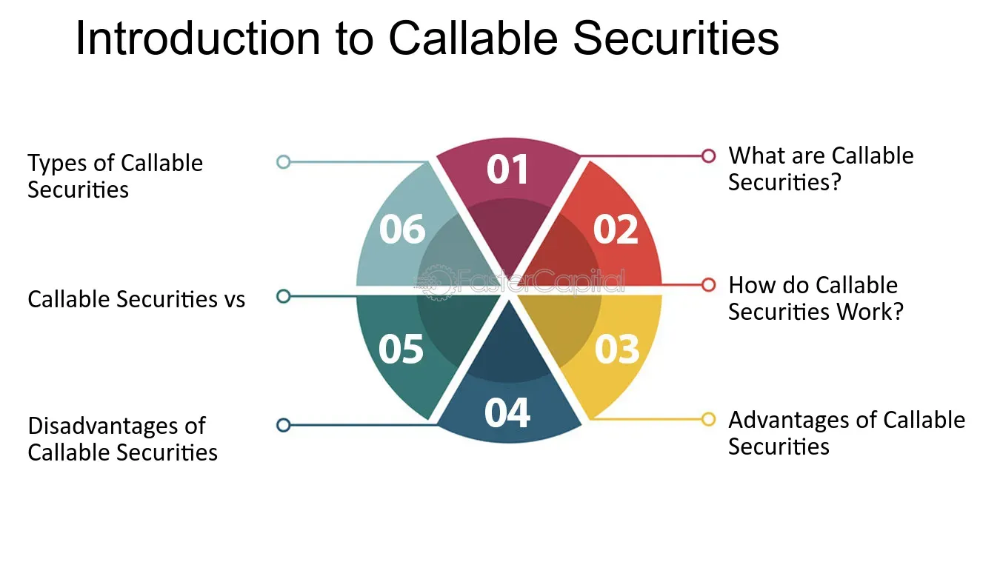

## Table of Contents

## What is callable security?

Callable security is a type of financial product that can be redeemed or "called" back by the issuer before it reaches its maturity date. This means the issuer has the right, but not the obligation, to buy back the security from the investor at a set price after a certain period. Common examples include callable bonds and callable preferred stocks. The issuer might choose to call the security if interest rates drop, allowing them to reissue new securities at a lower cost.

For investors, callable securities can be less attractive because they come with the risk of being called away before they reach full maturity. If a bond is called, the investor might have to reinvest the money at a lower interest rate, which could lead to lower returns. However, callable securities often offer higher interest rates or yields to compensate for this risk. It's important for investors to understand the terms of the callable feature and how it might affect their investment strategy.

## Why is callable security important in software development?

In software development, callable security is important because it helps keep software safe. When developers make software, they need to think about security. Callable security means that certain parts of the software can be called or used only by people who are allowed to. This stops bad people from using the software in harmful ways. For example, if a software has a part that can change important data, only trusted people should be able to use it. This makes the software more secure and trusted by users.

Another reason callable security is important is that it helps manage who can do what in the software. In big software projects, many people work together. Some people need to change the code, while others just need to use it. Callable security lets developers set rules about who can call or use certain parts of the software. This helps keep the software organized and safe. It also makes sure that only the right people can make changes, which is important for keeping the software working well and secure.

## What are the basic principles of callable security?

Callable security in software development means that certain parts of the software can only be used by people who are allowed to. This is important because it keeps the software safe from people who might want to harm it. For example, if a part of the software can change important data, only trusted people should be able to use it. This helps protect the software and the data it handles.

Another basic principle of callable security is about managing who can do what in the software. In big projects, many people work together, and not everyone needs the same level of access. Callable security lets developers set rules about who can use certain parts of the software. This keeps the software organized and makes sure that only the right people can make changes, which is important for keeping the software working well and secure.

## How does callable security differ from traditional security measures?

Callable security is different from traditional security measures because it focuses on controlling who can use certain parts of the software. Traditional security measures might include things like firewalls, antivirus software, and encryption. These measures work to protect the whole system from outside threats. Callable security, on the other hand, is about making sure that only certain people can call or use specific parts of the software. This means that even if someone gets into the system, they can't do everything unless they are allowed to.

Another way callable security differs is that it helps manage access within the software itself. Traditional security measures often focus on keeping bad people out, but they don't always control what different users can do once they're inside. Callable security sets rules about who can use or change different parts of the software. This is important in big projects where many people work together, and not everyone needs the same level of access. By using callable security, developers can make sure that only the right people can make changes, which helps keep the software safe and working well.

## What are some common threats that callable security addresses?

Callable security helps protect software from people who might try to change it in bad ways. If someone gets into the software, they might try to mess with important parts that they shouldn't be able to touch. Callable security stops this by making sure only certain people can use or change these important parts. This is like having a special key that only some people have, so they can open certain doors but not others.

Another threat that callable security deals with is when people inside the system try to do things they're not supposed to. In big projects, many people work together, and not everyone should be able to do everything. Callable security sets rules about who can do what, so even if someone is already inside the software, they can't mess with parts they're not allowed to. This keeps the software safe and makes sure it keeps working the way it should.

## Can you explain the role of authentication in callable security?

Authentication is like a special check that helps keep software safe with callable security. It makes sure that only the right people can use or change certain parts of the software. Think of it like a secret handshake or a password that only some people know. When someone tries to use a part of the software that's protected by callable security, the software first checks if they are who they say they are. If they pass the check, they can go ahead and use that part. If not, they are stopped, keeping the software safe from people who shouldn't be messing with it.

This check is really important because it helps stop bad people from getting into the software and causing trouble. In big projects where lots of people work together, not everyone needs to do the same things. Authentication helps make sure that only the people who are supposed to can make changes or use special parts of the software. This keeps everything organized and secure, making sure the software works well and stays safe.

## How does authorization work within the context of callable security?

Authorization is like a permission slip that works with callable security to keep software safe. It decides what someone can do after they've been checked and let in by authentication. Imagine you're at a special club where you need to show your ID to get in. That's authentication. But once you're inside, you might need a special pass to go into certain rooms or use certain equipment. That's authorization. In software, after someone proves who they are, authorization checks if they're allowed to use or change specific parts of the software. This makes sure only the right people can do important things.

This is really important in big projects where many people work together. Not everyone needs to do the same things, so authorization helps set rules about who can do what. For example, some people might be able to read data but not change it, while others can do both. By using authorization with callable security, the software can make sure that even if someone gets in, they can only do what they're supposed to. This keeps the software safe and running smoothly, stopping bad people from messing things up.

## What are the best practices for implementing callable security in an application?

When you want to make your application safe using callable security, the first thing to do is to use strong authentication. This means making sure that only the right people can get into your application. You can do this by using things like passwords, special codes, or even fingerprints. Once someone is in, you need to use authorization to set rules about what they can do. This means deciding who can use or change different parts of the software. By doing this, you can make sure that even if someone gets in, they can't mess with parts they're not supposed to.

Another important thing is to keep your software up to date. This means fixing any holes or weak spots that bad people could use to get in. It's also a good idea to keep an eye on what's happening in your application. You can do this by logging what people do and checking these logs regularly. This way, if something strange happens, you can find out quickly and fix it. By following these steps, you can make your application safer and keep it working well for everyone who uses it.

## How can one assess the effectiveness of callable security measures?

To check how well callable security is working, you need to see if it's keeping the software safe from bad people. One way to do this is by looking at logs, which are records of what people do in the software. If the logs show that only the right people are using or changing the software, then the callable security is working well. Another way is to try to break into the software yourself, like a test. If you can't get into parts you're not supposed to, then the security is strong.

Another important thing to do is to ask the people who use the software if they feel it's safe. If they say yes and don't have any problems, then the callable security is probably doing a good job. Also, you should keep an eye on any new threats or ways that bad people might try to get in. If the callable security can stop these new threats, then it's effective. By doing these checks regularly, you can make sure the software stays safe and works well for everyone.

## What advanced techniques are used to enhance callable security?

One advanced technique to make callable security better is using something called multi-factor authentication. This means that before someone can use a special part of the software, they need to prove who they are in more than one way. For example, they might need to enter a password and also use a special code sent to their phone. This makes it much harder for bad people to get in because they need more than just one secret to break through. Another technique is using role-based access control, which means setting different rules for different people based on their jobs. This way, only people who need to use certain parts of the software can do so, keeping everything organized and safe.

Another way to improve callable security is by using something called behavioral analysis. This technique watches how people use the software and looks for anything unusual. If someone starts doing things they shouldn't be doing, the software can stop them or alert someone to check it out. This helps catch bad people even if they get past the first security checks. Also, using encryption can make callable security stronger. Encryption turns important information into a secret code that only certain people can read. This means even if someone gets into the software, they can't understand the important parts without the right key.

## How does callable security integrate with other security frameworks?

Callable security works well with other security systems to keep software safe. One way it does this is by working with authentication systems. These systems check who you are before letting you in. Once you're in, callable security decides what you can do. This means that even if someone gets past the first check, they can't mess with parts they're not supposed to. It's like having a double lock: the first lock checks your ID, and the second lock decides which rooms you can go into.

Another way callable security fits in is with systems that watch what people do, like monitoring and logging. These systems keep an eye on everything happening in the software. If someone does something they shouldn't, these systems can alert someone or stop them. Callable security helps by setting rules about what different people can do, making it easier for these watching systems to spot anything strange. Together, they make sure the software stays safe and works well for everyone who uses it.

## What are the future trends and developments expected in callable security?

In the future, callable security will likely get even better with new technology. One big trend will be using artificial intelligence (AI) to make security smarter. AI can watch how people use the software and learn what is normal. If it sees something strange, it can stop it or tell someone to check it out. This makes callable security stronger because it can catch bad people even if they try new tricks. Another trend will be using something called zero trust security. This means the software won't trust anyone, even if they've been let in before. Every time someone tries to use a special part of the software, it will check them again. This makes sure only the right people can do important things.

Another important development will be better ways to check who people are, like using biometrics. Biometrics means using things like fingerprints or face scans to make sure someone is who they say they are. This will make callable security even harder to break because bad people can't just steal a password. They would need to steal someone's fingerprint or face, which is much harder. Also, as more people use software from different places, like working from home, callable security will need to work well with cloud computing. This means the software and its security will be on the internet, making it easier for people to use from anywhere but also harder to keep safe. Callable security will need to keep up with these changes to stay strong and protect the software.

## What are Investment Strategies with Callable Bonds?

Callable bonds offer flexibility and income potential, which can be strategically harnessed using methodologies like laddering. Laddering involves purchasing bonds with different maturity dates, which helps in managing interest rate risks and ensuring [liquidity](/wiki/liquidity-risk-premium) at various intervals. This approach mitigates the risk associated with callable bonds being redeemed early, by distributing the maturities over time.

Yield-to-call (YTC) analysis is a pivotal strategy that aids investors in estimating the potential returns of a callable bond if the issuer opts to call it before maturity. Yield-to-call is calculated using the formula: 

$$

YTC = \left( \frac{C + \frac{(Call\ Price - P)}{N}}{(Call\ Price + P)/2} \right) \times 100 
$$

where $C$ is the annual coupon payment, $P$ is the purchase price, $N$ is the number of years until the call date, and $Call\ Price$ is the price at which the bond can be called.

By conducting a yield-to-call analysis, investors can forecast returns and make informed decisions aligned with market conditions. This analysis is critical when interest rates are expected to stabilize or decline, as it affects the likelihood of a bond being called.

Diversification is another strategy that enhances income potential and risk management in an investor's portfolio. By incorporating callable bonds alongside other fixed-income securities, investors can optimize their income streams and manage risks more effectively. The variation in yield and risk profiles among different bonds can provide a buffer against market [volatility](/wiki/volatility-trading-strategies).

Effectively leveraging callable bonds demands an understanding of interest rate trends and market conditions. Investors should actively monitor economic indicators and interest rate forecasts to gauge the call risk and adjust their portfolios accordingly. Callable bonds typically offer higher yields to compensate for their inherent risks, providing an opportunity for increased income when managed under favorable conditions. 

In conclusion, strategic investment in callable bonds, coupled with careful analysis and market monitoring, allows investors to optimize returns while minimizing risks associated with interest rate fluctuations and call provisions.

## References & Further Reading

This section provides further reading materials and source references for deeper exploration.

- **Books and Textbooks**: 
  - "Fixed-Income Securities: Tools for Today's Markets" by Bruce Tuckman and Angel Serrat provides comprehensive insights into fixed-income instruments, including callable bonds.
  - "Algorithmic Trading: Winning Strategies and Their Rationale" by Ernest P. Chan is an excellent source for understanding the development and execution of algorithmic trading strategies.

- **Scholarly Articles**: 
  - Articles from "The Journal of Finance" and "Financial Analysts Journal" often feature research on the implications of interest rate movements on callable securities.
  - Academic papers by the CFA Institute provide analyses on the practical application of algorithmic trading to optimize investment portfolios.

- **Online Resources**:
  - The MIT OpenCourseWare offers courses on financial markets and algorithmic trading, which can be beneficial for investors seeking in-depth knowledge.
  - Investopedia and the Financial Times frequently publish articles and tutorials on the latest trends and tools in finance, including callable securities and algo trading.

- **Industry Reports**: 
  - Reports by financial institutions such as J.P. Morgan and Goldman Sachs can provide current market trends and professional insights into the use of callable securities and emerging technologies in trading.

- **Programming Guides**:
  - For those interested in algorithmic trading, Python is a popular language to start with. The book "Python for Finance" by Yves Hilpisch guides readers through building financial algorithms and models.
  - Online platforms like Github and Stack Overflow have dedicated communities where developers share code snippets and algorithms for trading systems.

Investors are encouraged to continue their education journey to fully grasp the complexities of financial instruments and strategies. Understanding these resources and utilizing them in practice can significantly enhance investment acumen and portfolio management skills.

