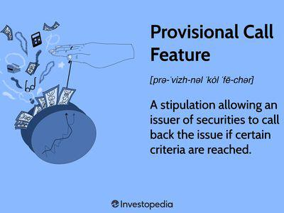

In the ever-evolving financial landscape, investors continuously seek diversified strategies to maximize their portfolio returns. With markets becoming increasingly complex and interconnected, understanding the variety of investment instruments and strategies available is crucial for achieving optimal performance.

This article explores key investment options and financial instruments, with a particular focus on callable securities and the role of algorithmic trading. Callable securities, such as bonds with embedded options for early redemption by issuers, offer unique benefits and risks that investors must understand. These securities can provide higher yields compared to traditional non-callable bonds; however, they introduce reinvestment risk, especially in fluctuating interest rate environments. Grasping the dynamics of these securities enables investors to make strategic decisions that align with their financial goals.



Alongside callable securities, algorithmic trading represents a modern approach to enhancing investment strategies. By leveraging advanced software and complex algorithms, investors can execute trades with unprecedented speed and precision. This approach minimizes human biases and emotional impacts, thus optimizing trading accuracy and efficiency. Incorporating algorithmic trading into investment portfolios allows for efficient risk management and the exploitation of real-time market opportunities, ultimately contributing to improved investment outcomes.

The goal of this discussion is to equip investors with insights that enhance their ability to navigate the complexities of modern finance effectively. By understanding the intricacies of callable securities and the advantages offered by algorithmic trading, investors can make informed decisions to potentially optimize their portfolios. Through the integration of these advanced financial instruments and strategies, investors are better positioned to capitalize on opportunities and address the challenges posed by today's dynamic financial environment.

## Table of Contents

## Understanding Callable Securities

Callable securities, particularly bonds, are financial instruments with a specific feature: they include an embedded option that permits the issuer to redeem the bonds prior to their maturity date. This option provides a strategic advantage for issuers, especially in scenarios where interest rates are in decline. By redeeming the bonds early, issuers can refinance their existing debt at a lower cost, thus reducing their overall interest expenses.

However, this flexibility for issuers introduces a notable risk for investors, known as reinvestment risk. When an issuer calls back a bond, investors are faced with the challenge of reinvesting the principal at potentially lower interest rates prevailing in the market, which can affect their expected return on investment.

To compensate for the added risks associated with callable bonds, such as reinvestment risk and the uncertainty surrounding bond tenure, these securities usually offer a higher yield compared to their non-callable counterparts. This higher yield acts as an incentive for investors to accept the additional risk.

Understanding the relationship between interest rates and call provisions is vital for investors who are evaluating callable securities as an investment option. The decision to call bonds is often influenced by [interest rate](/wiki/interest-rate-trading-strategies) dynamics; when prevailing interest rates drop significantly below the coupon rate of existing bonds, issuers find it attractive to call and reissue the bonds at a lower rate. Investors should remain vigilant and analyze these interest rate trends, as they are pivotal in predicting the likelihood of a bond being called.

Investors also should become familiar with the specifics of call provisions, which can vary significantly, including call protection periods during which the bonds cannot be redeemed, and terms specifying the situations in which a call may be executed. These details can largely influence the potential outcomes of investing in callable securities.

By comprehensively understanding these aspects, investors can better assess the risks and rewards associated with callable securities and make informed decisions that align with their financial goals and market conditions.

## Investment Strategies with Callable Bonds

Callable bonds offer flexibility and income potential, which can be strategically harnessed using methodologies like laddering. Laddering involves purchasing bonds with different maturity dates, which helps in managing interest rate risks and ensuring [liquidity](/wiki/liquidity-risk-premium) at various intervals. This approach mitigates the risk associated with callable bonds being redeemed early, by distributing the maturities over time.

Yield-to-call (YTC) analysis is a pivotal strategy that aids investors in estimating the potential returns of a callable bond if the issuer opts to call it before maturity. Yield-to-call is calculated using the formula: 

$$

YTC = \left( \frac{C + \frac{(Call\ Price - P)}{N}}{(Call\ Price + P)/2} \right) \times 100 
$$

where $C$ is the annual coupon payment, $P$ is the purchase price, $N$ is the number of years until the call date, and $Call\ Price$ is the price at which the bond can be called.

By conducting a yield-to-call analysis, investors can forecast returns and make informed decisions aligned with market conditions. This analysis is critical when interest rates are expected to stabilize or decline, as it affects the likelihood of a bond being called.

Diversification is another strategy that enhances income potential and risk management in an investor's portfolio. By incorporating callable bonds alongside other fixed-income securities, investors can optimize their income streams and manage risks more effectively. The variation in yield and risk profiles among different bonds can provide a buffer against market [volatility](/wiki/volatility-trading-strategies).

Effectively leveraging callable bonds demands an understanding of interest rate trends and market conditions. Investors should actively monitor economic indicators and interest rate forecasts to gauge the call risk and adjust their portfolios accordingly. Callable bonds typically offer higher yields to compensate for their inherent risks, providing an opportunity for increased income when managed under favorable conditions. 

In conclusion, strategic investment in callable bonds, coupled with careful analysis and market monitoring, allows investors to optimize returns while minimizing risks associated with interest rate fluctuations and call provisions.

## The Role of Algorithmic Trading

Algorithmic trading, commonly referred to as algo trading, utilizes advanced software algorithms to execute trades rapidly and accurately. This method of trading has revolutionized financial markets by optimizing investment strategies through unparalleled speed, precision, and capacity to process vast amounts of real-time data.

The core advantage of [algorithmic trading](/wiki/algorithmic-trading) is its ability to operate without the biases and emotional influences that often impact human traders. By executing trades based on predefined criteria, algorithms enhance both the accuracy and discipline of trading practices. This technological advancement allows for consistent and objective decision-making, translating to improved trading outcomes.

Incorporating algorithmic strategies enables investors to efficiently manage risks while seizing market opportunities. Algorithms are designed to analyze market trends, execute trades at optimal prices, and adjust positions swiftly in response to fluctuating conditions. This dynamic adaptability is essential in the fast-paced environment of modern finance.

One of the most widely used programming languages for developing algorithmic trading strategies is Python. Its popularity stems from its robust libraries and frameworks, such as NumPy for numerical computations, pandas for data manipulation, and libraries like QuantConnect and Zipline for [backtesting](/wiki/backtesting) trading algorithms. A basic example of a Python script for a simple moving average crossover strategy might look like this:

```python
import pandas as pd
import numpy as np

# Assume 'data' is a DataFrame with historical price data
data['SMA_50'] = data['Close'].rolling(window=50).mean()
data['SMA_200'] = data['Close'].rolling(window=200).mean()

# Generate trading signals
data['Signal'] = 0
data['Signal'][50:] = np.where(data['SMA_50'][50:] > data['SMA_200'][50:], 1, -1)

# Calculate returns
data['Returns'] = data['Signal'].shift(1) * data['Close'].pct_change()

cumulative_returns = (1 + data['Returns']).cumprod() - 1
print("Cumulative Returns: ", cumulative_returns.iloc[-1])
```

In practice, algorithmic trading systems are typically far more complex, integrating risk management protocols, portfolio rebalancing features, and advanced market prediction models. The ability to conduct real-time analysis on vast datasets ensures that traders can identify and act on mispriced securities, obtaining prices not achievable through manual trading alone.

Overall, algorithmic trading stands as a cornerstone of contemporary investment strategies, empowering investors with the technological tools to navigate complex financial markets effectively.

## Integrating Callable Bonds and Algo Trading

The integration of callable bonds with algorithmic trading creates an advanced framework for managing investments, leveraging the strengths of both financial instruments and computational strategies. Algorithms are particularly adept at dynamically responding to fluctuations in interest rates, which are critical to the valuation and management of callable bonds. As interest rates change, issuers may exercise their call option if rates decline, leading investors to face reinvestment challenges. Algorithmic models can be designed to optimize the timing and execution of trades in response to these changes, ensuring investors are better positioned to maximize their returns.

Real-time market analysis facilitated by algorithms helps in identifying mispriced securities, offering timely opportunities for investment. This capability is crucial for callable bonds, where mispricing can occur due to shifts in interest rate expectations. Algorithms can process vast amounts of data at speeds beyond human capabilities and make decisions based on statistical models that predict bond performance under various interest rate scenarios.

For example, an algorithm could be implemented to adjust bond positions based on anticipated movements in interest rates, taking into account factors such as economic indicators and monetary policy announcements. A Python-based implementation might utilize libraries such as NumPy for numerical computations and Pandas for data management, with real-time analysis being driven by a platform like QuantConnect or Alpaca. Here's a simplified example:

```python
import numpy as np
import pandas as pd

def calculate_optimal_bond_allocation(bond_data, interest_rate_trend):
    """
    Calculates optimal allocation of callable bonds based on anticipated interest rate changes.

    :param bond_data: Dataframe containing bond characteristics.
    :param interest_rate_trend: Expected trend in interest rates.
    :return: Suggested bond allocation.
    """
    # Example logic here to adjust bond allocation based on rate trends
    bond_data['allocation_factor'] = np.where(
        bond_data['interest_rate'] < interest_rate_trend, 1.2, 0.8)

    return bond_data

# Example bond data
bond_data = pd.DataFrame({
    'bond_id': [1, 2, 3],
    'interest_rate': [3.5, 2.8, 4.1]
})

trend = 3.0  # anticipated interest rate trend
optimal_allocation = calculate_optimal_bond_allocation(bond_data, trend)
print(optimal_allocation)
```

In this model, the allocation [factor](/wiki/factor-investing) is adjusted based on whether the individual bond's interest rate is expected to be advantageous in light of future trends, thereby maximizing the investment's potential yield. 

By effectively combining callable bonds and algorithmic trading, investors can achieve a balance between optimizing returns and managing risks such as reinvestment and interest rate fluctuation risks. This strategic integration empowers investors to capitalize on sophisticated financial models and real-time data analytics, leading to improved portfolio performance in the complex landscape of financial markets.

## Risk Management in Callable Bonds and Algo Trading

Managing the risks associated with callable bonds and algorithmic trading is vital for safeguarding investment returns. For callable bonds, reinvestment risk coupled with interest rate fluctuations is a significant concern. Reinvestment risk arises when an issuer decides to call back the bonds before maturity, typically during periods of declining interest rates, leaving investors to reinvest at lower yields. This exposure demands a keen analysis of interest rate trends and call provisions to anticipate issuer behavior.

Interest rate volatility can further complicate investment outcomes in callable bonds. Investors should monitor economic indicators and central bank policies that influence rate movements. Strategies like laddering—staggering bond maturities across different time periods—can alleviate some reinvestment risk by distributing exposure across varying interest rate environments.

Algorithmic trading presents a distinct set of risks rooted primarily in technological infrastructure. Software errors, including bugs and system malfunctions, can lead to erroneous trades, while network failures can impede timely execution. A well-structured risk management framework for algorithmic trading involves rigorous testing protocols to ensure algorithms perform as expected under various market conditions. This encompasses unit testing, integration testing, and real-time monitoring to detect anomalies and adapt swiftly to market changes.

Stress testing algorithms under adverse scenarios is essential for assessing their resilience; for instance, examining how they perform during extreme market volatility or low liquidity periods can provide valuable insights into potential weaknesses. Python, widely utilized in developing trading algorithms, offers libraries like `unittest` and `pytest` for implementing comprehensive test suites.

Diversification, hedging, and scenario analysis are effective risk mitigation tools across both callable bonds and algorithmic trading. Diversification involves spreading investments across various assets to reduce the impact of a single underperforming security. Hedging, on the other hand, uses financial instruments such as options or futures to offset potential losses. Scenario analysis allows investors to model different market environments and prepare for potential impacts on portfolio performance. By employing these strategies, investors can fortify their positions against uncertainties inherent in both callable securities and algorithmic trading practices.

## Conclusion

Callable securities and algorithmic trading represent crucial components in contemporary investment strategies. These instruments enable investors to diversify their portfolios, effectively leverage various financial instruments, and enhance their overall investment tactics. The integration of callable securities and algorithmic trading provides a powerful combination that, when approached with a clear understanding, can significantly optimize portfolio performance.

A thorough comprehension of callable securities and algorithmic trading is essential for successful integration. Understanding the benefits and risks associated with these financial tools allows investors to make informed decisions. Callable securities, particularly bonds, offer issuers the flexibility to redeem early but pose reinvestment risks for investors. Conversely, algorithmic trading enhances the precision and speed of executing trades, minimizing human error and maximizing market opportunities.

The key to achieving enhanced portfolio performance lies in the application of well-informed strategies coupled with rigorous risk management. Callable bonds, when strategically incorporated, can offer attractive yields, especially in declining interest rate environments. Algorithmic trading empowers investors to quickly respond to market changes, thus improving decision-making and risk management capabilities.

Ultimately, these insights allow investors to capitalize on opportunities and navigate the complexities of financial markets more effectively. By mastering the use of callable securities and algorithmic trading as integral components of their investment strategy, investors can optimize their portfolio outcomes and enhance their financial security.

## References & Further Reading

This section provides further reading materials and source references for deeper exploration.

- **Books and Textbooks**: 
  - "Fixed-Income Securities: Tools for Today's Markets" by Bruce Tuckman and Angel Serrat provides comprehensive insights into fixed-income instruments, including callable bonds.
  - "Algorithmic Trading: Winning Strategies and Their Rationale" by Ernest P. Chan is an excellent source for understanding the development and execution of algorithmic trading strategies.

- **Scholarly Articles**: 
  - Articles from "The Journal of Finance" and "Financial Analysts Journal" often feature research on the implications of interest rate movements on callable securities.
  - Academic papers by the CFA Institute provide analyses on the practical application of algorithmic trading to optimize investment portfolios.

- **Online Resources**:
  - The MIT OpenCourseWare offers courses on financial markets and algorithmic trading, which can be beneficial for investors seeking in-depth knowledge.
  - Investopedia and the Financial Times frequently publish articles and tutorials on the latest trends and tools in finance, including callable securities and algo trading.

- **Industry Reports**: 
  - Reports by financial institutions such as J.P. Morgan and Goldman Sachs can provide current market trends and professional insights into the use of callable securities and emerging technologies in trading.

- **Programming Guides**:
  - For those interested in algorithmic trading, Python is a popular language to start with. The book "Python for Finance" by Yves Hilpisch guides readers through building financial algorithms and models.
  - Online platforms like Github and Stack Overflow have dedicated communities where developers share code snippets and algorithms for trading systems.

Investors are encouraged to continue their education journey to fully grasp the complexities of financial instruments and strategies. Understanding these resources and utilizing them in practice can significantly enhance investment acumen and portfolio management skills.