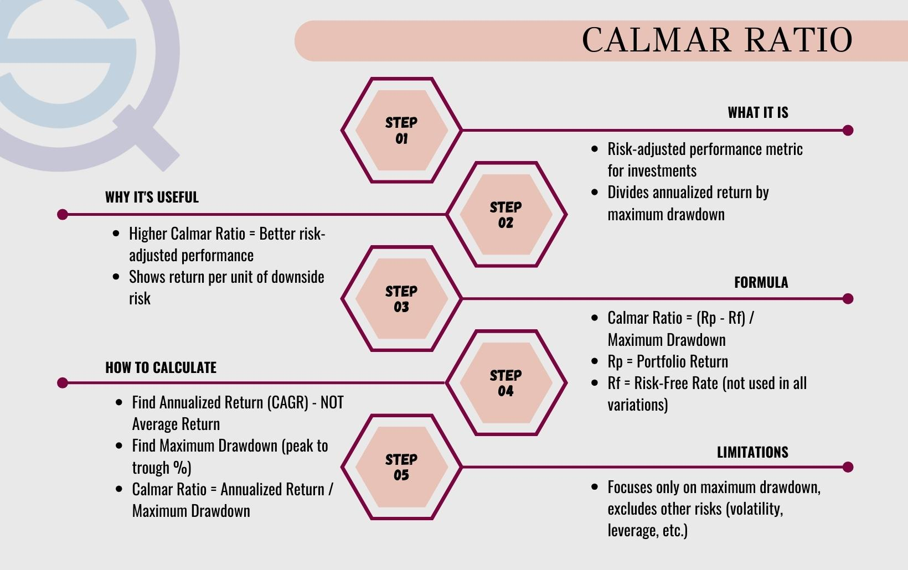

In the complex world of finance, risk analysis is essential in formulating effective investment strategies. Among the various financial metrics used for this purpose, the Calmar Ratio stands out, particularly in the context of algorithmic trading. The Calmar Ratio is a measure used to evaluate risk-adjusted returns, emphasizing the importance of maintaining a balance between risk and reward. This article examines how metrics like the Calmar Ratio are crucial for assessing risk within algorithmic trading frameworks.

The primary focus of this article is to provide a thorough understanding of the Calmar Ratio and its significance in optimizing trading strategies. By doing so, investors and traders can better navigate the challenges associated with high-frequency trading and other algorithm-driven strategies. The Calmar Ratio offers a unique perspective by focusing on the relationship between annualized returns and maximum drawdown, making it a vital tool for quantifying the trade-off between return potential and risk exposure.

Additionally, this article explores how the Calmar Ratio integrates into a broader array of metrics used in risk analysis for investment decisions. Understanding the interplay between different investment metrics enables traders to build more robust and resilient trading systems. Through continual analysis and adaptation, traders can enhance their strategies, ensuring they remain aligned with evolving market conditions.

## Table of Contents

## Understanding Risk Analysis in Investment

Risk analysis is an essential process in investment management, focused on identifying and evaluating potential hazards that could threaten the success of investment portfolios. The objective is to make informed decisions, optimizing returns while minimizing potential losses. The foundation of effective risk analysis lies in its ability to critically inform decision-making processes and enhance portfolio management strategies.

Investment metrics serve as quantitative tools to assess the risk and return profiles of assets, providing a numerical basis for comparing different investments. By quantifying aspects such as volatility, returns, and drawdowns, these metrics allow investors to gauge the potential risks and rewards associated with various investment opportunities.

Familiarizing oneself with investment metrics is crucial for investors, especially those aiming to navigate volatile markets effectively. For instance, understanding volatility—the degree of variation in trading prices—helps investors anticipate price fluctuations, thereby allowing them to make more informed decisions. Standard deviation is a commonly used measure of volatility, representing the amount of variation or [dispersion](/wiki/dispersion-trading) of a set of values. It is calculated as follows:

$$
\sigma = \sqrt{\frac{1}{N}\sum_{i=1}^{N}(X_i - \bar{X})^2}
$$

where $\sigma$ is the standard deviation, $N$ is the number of observations, $X_i$ is each individual value, and $\bar{X}$ is the mean of the values.

Another key aspect of risk analysis is assessing the potential impact of maximum drawdowns, which is the largest peak-to-trough decline in a portfolio's value before a new peak is achieved. Understanding drawdowns helps investors to anticipate potential declines in portfolio value, thus preparing them to mitigate these risks.

The methodologies employed in risk analysis are diverse, encompassing both qualitative and quantitative approaches. Quantitative methods include statistical analysis, probability modeling, and the application of historical data to predict future risk patterns. These methods often make use of complex algorithms and computational models to simulate potential market conditions and their impacts on investments. On the other hand, qualitative methods may involve scenario analysis, where various hypothetical situations are examined to understand potential risks and their consequences.

In conclusion, a comprehensive understanding of risk analysis principles and methodologies is vital for investors. It enables them to utilize investment metrics effectively, fostering the ability to mitigate risks and optimize returns in a dynamic market environment.

 to the Calmar Ratio

The Calmar Ratio is a vital risk-adjusted return metric extensively used in evaluating the performance of investment funds and trading strategies. Established by Terry W. Young in 1991, the ratio derives its name from his California-based company, Calmar Associates. The primary purpose of the Calmar Ratio is to measure the trade-off between risk and reward, providing traders and investors with a deeper understanding of how their investment portfolios manage risk while pursuing returns.

The Calmar Ratio is mathematically expressed as:

$$
\text{Calmar Ratio} = \frac{\text{Annualized Rate of Return}}{\text{Maximum Drawdown}}
$$

The numerator of the ratio, the Annualized Rate of Return, represents the geometric average of an investment's returns over a specified time frame, usually one year. This average is calculated by compounding the periodic returns to portray a consistent annual percentage.

The denominator, Maximum Drawdown, signifies the peak-to-trough decline a portfolio experiences over a specific period, illustrating the worst-case scenario for losses. It focuses on the historical maximum percentage drop from the highest value to the lowest value before a new peak is achieved. Understanding this figure is crucial, as it highlights the investment's exposure to significant losses.

By evaluating both the potential returns and the extent of risk taken, the Calmar Ratio offers a comprehensive measure of an investment's risk-adjusted performance. A higher Calmar Ratio indicates a more favorable risk-reward balance, suggesting the trading strategy or fund delivers superior returns relative to its drawdowns. Conversely, a lower ratio implies a less optimal balance, reflecting that the returns are not adequately compensating for the risks incurred.

Practitioners embrace the Calmar Ratio for its interpretative value, enabling them to compare and contrast different investment vehicles and strategies on a standardized basis. This comparison is especially beneficial for gauging the efficiency of complex trading strategies where managing drawdowns is as crucial as maximizing returns.

Using the Calmar Ratio assists in refining investment strategies, ensuring that the allocation of resources aligns with desired risk tolerance levels while maintaining an adequate pursuit of returns. Such insights are vital for portfolio optimization and risk management, equipping investors and traders with the necessary tools to make informed decisions in dynamically changing financial markets.

## Calmar Ratio in Algorithmic Trading

Algorithmic trading, a sophisticated method that uses computer algorithms to automate trading decisions and execute high-speed transactions, relies heavily on robust risk management strategies to ensure its sustainability. As traders seek to optimize their strategies while managing the inherent risks, the Calmar Ratio becomes a valuable tool in this dynamic environment. This metric evaluates the effectiveness and stability of trading algorithms by focusing on the balance between return potential and risk exposure.

The Calmar Ratio is calculated by dividing the annualized rate of return by the maximum drawdown of a portfolio. Mathematically, it is represented as:

$$
\text{Calmar Ratio} = \frac{\text{Annualized Return}}{\text{Maximum Drawdown}}
$$

The ratio serves as an indicator of how well a trading strategy compensates for the risks it undertakes. In the context of [algorithmic trading](/wiki/algorithmic-trading), where decision-making is automated, understanding the trade-off between risk and reward is crucial for long-term success.

### Advantages in Algorithmic Trading

1. **Risk Assessment**: The Calmar Ratio provides a clear assessment of risks associated with extreme losses in a portfolio. By incorporating drawdowns, it helps traders measure the resilience of their strategies under adverse market conditions.

2. **Portfolio Stability**: Unlike metrics that only focus on returns, the Calmar Ratio emphasizes the importance of maintaining stability in volatile markets. This is particularly beneficial for algorithmic traders who need to ensure consistent performance across varying conditions.

3. **Enhanced Strategy Evaluation**: For algorithmic traders, evaluating strategies based on the Calmar Ratio allows for a more nuanced understanding of their performance. A high ratio suggests that the strategy has achieved desirable returns relative to its risk, while a low ratio may indicate adjustments are needed.

### Limitations in Algorithmic Trading

1. **Historical Dependence**: The Calmar Ratio relies on historical data to calculate the maximum drawdown and annualized return. This historical dependence can be problematic in algorithmic trading environments where market conditions change rapidly.

2. **Ignores Other Aspects**: While useful, the Calmar Ratio does not consider other risk factors such as volatility or tail risks. Traders should complement it with additional metrics, like the Sharpe or Sortino Ratios, for a holistic risk assessment.

3. **Focus on Extreme Losses**: The metric’s emphasis on maximum drawdown means it may not adequately address smaller, frequent losses that could cumulatively impact the strategy's performance.

In summary, the Calmar Ratio is an instrumental metric for algorithmic traders aiming to balance potential returns with risk exposure. Its ability to highlight the trade-off between these two factors enhances the evaluation and refinement of trading algorithms. However, it should be employed in conjunction with other risk metrics to provide a comprehensive view of algorithm performance and stability.

## Comparing Calmar Ratio with Other Risk Metrics

In evaluating investment risk metrics, the Calmar Ratio plays a crucial role, but it becomes more effective when combined with other tools such as the Sharpe Ratio, Sortino Ratio, and Maximum Drawdown. Each of these metrics serves a specific function, providing insights into different facets of risk and return.

The **Calmar Ratio** is calculated by dividing the annualized rate of return by the maximum drawdown of an investment:

$$
\text{Calmar Ratio} = \frac{\text{Annualized Return}}{\text{Maximum Drawdown}}
$$

This measurement emphasizes the trade-off between reward and drawdown risk, making it useful in understanding potential returns relative to the largest historical losses. It is particularly informative in high-[volatility](/wiki/volatility-trading-strategies) environments, where extreme drawdowns can significantly alter the risk profile.

The **Sharpe Ratio**, developed by Nobel laureate William F. Sharpe, evaluates risk-adjusted returns by comparing the excess return of an investment to its standard deviation:

$$
\text{Sharpe Ratio} = \frac{R_p - R_f}{\sigma_p}
$$

Where $R_p$ is the portfolio return, $R_f$ is the risk-free rate, and $\sigma_p$ is the standard deviation of the portfolio's excess return. The Sharpe Ratio provides a broad view of risk by accounting for both volatility and the risk-free rate, making it a popular metric for gauging overall portfolio efficiency. However, it may not adequately address scenarios with asymmetric risk distribution or periods of negative returns.

The **Sortino Ratio** is a variation of the Sharpe Ratio, focusing on downside risk by considering only negative deviations from a target return:

$$
\text{Sortino Ratio} = \frac{R_p - R_f}{\sigma_d}
$$

Here, $\sigma_d$ represents the downside deviation. This ratio is advantageous for investors concerned with downside risk, offering a more nuanced perspective by penalizing returns that fall below the target.

**Maximum Drawdown** is a straightforward metric that quantifies the largest peak-to-trough decline in value experienced by an investment. It highlights the potential capital erosion during adverse market conditions:

$$
\text{Maximum Drawdown} = \frac{\text{Trough Value} - \text{Peak Value}}{\text{Peak Value}}
$$

Understanding maximum drawdowns is essential for evaluating the worst-case scenarios in investment performance and assessing recovery capabilities.

In deciding when to use each metric, the choice largely depends on the investor's specific objectives and risk tolerance. The Calmar Ratio is particularly suitable for strategies that prioritize stability and seek to minimize drawdown risks, advantageous in volatile markets. Conversely, the Sharpe Ratio is more apt for assessing the balance between total returns and volatility across broader market conditions, while the Sortino Ratio serves investors primarily focused on minimizing downside risks.

By integrating the Calmar Ratio with these complementary metrics, investors can achieve a holistic view of investment risk, aiding in strategy optimization and informed decision-making. This comparison underscores the importance of a multidimensional approach to risk analysis, enabling investors to tailor strategies that align with their unique risk profiles.

## Practical Applications and Case Studies

Real-world examples demonstrate the practical significance of the Calmar Ratio in investment decision-making, providing insights into its utility across various markets. The Calmar Ratio's ability to assess the balance between returns and drawdowns makes it an invaluable tool for traders and investors aiming to optimize their strategies.

One notable application of the Calmar Ratio can be observed in the management of hedge funds. Fund managers often use the ratio to evaluate and refine their trading strategies. For instance, a [hedge fund](/wiki/hedge-fund-trading-strategies) focused on long/short equity strategies might employ the Calmar Ratio to monitor risk-adjusted returns, ensuring that aggressive pursuit of returns does not come at the expense of excessive drawdowns. By maintaining a higher Calmar Ratio, the fund can demonstrate superior performance in terms of both risk management and return on investment.

In algorithmic trading, the Calmar Ratio is particularly crucial. Algorithmic trading systems often operate in highly volatile environments where rapid decision-making is essential. By analyzing the Calmar Ratio, traders can fine-tune their algorithms to achieve a balance between risk exposure and profitability. For example, an algorithm designed to trade in the foreign exchange market could be adjusted based on periodic reviews of its Calmar Ratio. If the ratio declines due to increasing drawdowns, modifications can be made to reduce leverage or adjust stop-loss parameters, thereby stabilizing performance.

A comparative case study of two trading strategies—[momentum](/wiki/momentum) trading versus mean reversion—illustrates the Calmar Ratio's role in strategy evaluation. Momentum trading, which capitalizes on ongoing trends, may initially show high returns but can suffer from significant drawdowns if market trends reverse abruptly. On the other hand, a mean reversion strategy, which bets on price corrections, might have a steadier performance but lower returns. By applying the Calmar Ratio, traders can assess which strategy offers a better risk-adjusted return, thereby guiding strategic adjustments to align with investor risk appetites.

Moreover, research has shown that the Calmar Ratio is instrumental when assessing portfolio diversification strategies. For instance, adding alternative assets such as commodities or real estate to an equity-heavy portfolio can potentially enhance the Calmar Ratio, reflecting a more resilient performance during market downturns. This adjustment, viewed through the lens of the Calmar Ratio, highlights the benefits of diversification in maintaining portfolio stability.

Investors and traders analyzing various outcomes through the Calmar Ratio can effectively tailor their investment strategies, focusing on sustainable growth while managing risk. By integrating this metric into regular performance reviews, strategic insights can be operationalized into actionable investment decisions that enhance portfolio robustness.

In conclusion, the case studies and applications of the Calmar Ratio affirm its value as a practical tool in the investment world. By enabling a clearer assessment of risk-adjusted returns, it empowers investors and traders to make informed decisions, ensuring their strategies are both competitive and resilient.

## Conclusion

The Calmar Ratio stands out as a powerful metric for those engaged in risk analysis within investment and trading environments. By focusing on the balance between returns and drawdowns, the Calmar Ratio provides investors with a nuanced understanding of the risk profile of trading strategies. This is crucial because it allows traders to evaluate how well a strategy compensates for the risks undertaken, particularly in volatile markets.

For algorithmic traders, the Calmar Ratio offers a method to enhance the robustness of trading algorithms. By providing a clear measure of how much potential loss (drawdown) an algorithm can withstand relative to the returns it generates, traders can ensure their strategies are not only profit-driven but also resilient in adverse market conditions. The consistency of performance is critical in algorithmic trading, where automated decisions are executed at high speeds, and the Calmar Ratio aids in achieving this by offering insights into risk exposure and return potential.

Moreover, integrating the Calmar Ratio with other risk metrics, such as the Sharpe Ratio or Maximum Drawdown, can significantly improve portfolio risk management. Each metric provides different perspectives on risk and return, enabling a comprehensive analysis that accounts for various factors influencing investment outcomes. This holistic approach is essential for investors looking to optimize their strategies in alignment with their risk tolerance and market conditions.

As financial markets continue to evolve, the continuous learning and adaptation of investment metrics like the Calmar Ratio are paramount. Staying informed about advancements in risk analysis tools and methodologies ensures that traders and investors can effectively manage risks and capitalize on opportunities. Embracing this dynamic environment through strategic use of established metrics fosters resilience and long-term success in investment endeavors.

## References & Further Reading

[1]: Young, Terry W. (1991). ["Calmar Ratio: A Comfortable Model of Risk."](https://en.wikipedia.org/wiki/Calmar_ratio) 

[2]: Lopez de Prado, Marcos (2018). ["Advances in Financial Machine Learning."](https://www.amazon.com/Advances-Financial-Machine-Learning-Marcos/dp/1119482089)

[3]: Aronson, David R. (2007). ["Evidence-Based Technical Analysis: Applying the Scientific Method and Statistical Inference to Trading Signals."](https://onlinelibrary.wiley.com/doi/book/10.1002/9781118268315)

[4]: Jansen, Stefan (2020). ["Machine Learning for Algorithmic Trading: Predictive Models to Extract Signals from Market and Alternative Data for Systematic Trading Strategies with Python."](https://github.com/stefan-jansen/machine-learning-for-trading)

[5]: Chan, Ernest P. (2008). ["Quantitative Trading: How to Build Your Own Algorithmic Trading Business."](https://github.com/ftvision/quant_trading_echan_book)

[6]: Sortino, F. A., & Satchell, S. (2001). ["Managing Downside Risk in Financial Markets: Theory, Practice and Implementation."](https://www.sciencedirect.com/book/9780750648639/managing-downside-risk-in-financial-markets)

[7]: Sharpe, William F. (1994). ["The Sharpe Ratio."](https://web.stanford.edu/~wfsharpe/art/sr/SR.htm) Journal of Portfolio Management.