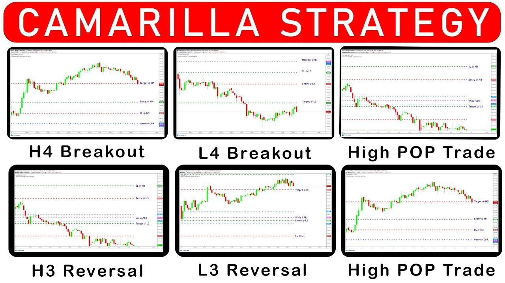

## Table of Contents

## What is the Camarilla Pivot Trading Strategy?

The Camarilla Pivot Trading Strategy is a method used by traders to find potential support and resistance levels in the market. It uses the previous day's high, low, and close prices to calculate these levels. The strategy is based on the idea that prices tend to revert to the mean, so traders look for times when the price moves away from these calculated levels and then comes back to them.

Traders using the Camarilla Pivot Strategy often focus on four main levels: the resistance levels (R1 to R4) and the support levels (S1 to S4). They watch these levels closely because they believe that the price is likely to bounce off these points. If the price breaks through one of these levels, it might signal a stronger move in that direction, and traders might decide to enter or exit trades based on this.

The strategy is popular among day traders because it helps them make quick decisions. It's especially useful in markets that are very active, like forex or stocks. However, like all trading strategies, it's not perfect and traders should use it along with other tools and always be aware of the risks involved in trading.

## How does the Camarilla Pivot differ from traditional pivot points?

The Camarilla Pivot is different from traditional pivot points because it uses a different way to calculate the levels where the price might go up or down. Traditional pivot points use a simple formula that takes the high, low, and close prices from the previous day and divides them to find the main pivot point. From there, they calculate support and resistance levels. On the other hand, the Camarilla Pivot uses a more complex formula that involves squaring the difference between the high and low prices and then adding or subtracting this from the close price to find multiple levels of support and resistance.

Another big difference is that the Camarilla Pivot gives traders more levels to watch. Traditional pivot points usually have one main pivot point, with maybe two or three levels of support and resistance. But the Camarilla Pivot has four levels of resistance (R1 to R4) and four levels of support (S1 to S4). This gives traders more chances to find where the price might change direction. Because of these extra levels, the Camarilla Pivot can be more useful for day traders who need to make quick decisions based on small changes in the market.

## What are the key components of the Camarilla Pivot formula?

The Camarilla Pivot formula uses the high, low, and close prices from the previous day to find where the price might go up or down today. It starts by figuring out the difference between the high and low prices, then it squares this number. This squared number is a big part of the formula because it helps to find the different levels of support and resistance. The formula then uses this squared number along with the close price to calculate four levels of resistance (R1 to R4) and four levels of support (S1 to S4).

The main idea behind the formula is to give traders more points to watch. While traditional pivot points might only give a few levels, the Camarilla Pivot gives eight levels in total. This can be really helpful for day traders who need to make quick decisions. The formula makes these levels by adding or subtracting the squared difference from the close price in different ways. This means that the levels are more spread out and can help traders see where the price might bounce back or keep moving.

## How can a beginner identify support and resistance levels using Camarilla Pivots?

A beginner can identify support and resistance levels using Camarilla Pivots by first collecting the high, low, and close prices from the previous day. They then use these numbers in the Camarilla Pivot formula to calculate four levels of resistance (R1 to R4) and four levels of support (S1 to S4). The formula involves finding the difference between the high and low prices, squaring it, and then adding or subtracting it from the close price in specific ways. This gives the trader a set of levels to watch during the trading day.

Once the levels are calculated, a beginner should keep an eye on the price as it moves throughout the day. If the price hits one of these levels and then bounces back, it might be a good time to enter a trade. For example, if the price touches a support level and then starts going up, it could be a signal to buy. On the other hand, if the price breaks through a resistance level, it might be a sign that the price will keep going up, and the trader could decide to enter a long position. Watching these levels can help beginners make better trading decisions.

## What time frames are most effective for using the Camarilla Pivot strategy?

The Camarilla Pivot strategy works best for short time frames, like those used by day traders. This means it's most effective on time frames from 1 minute to 1 hour. Day traders like using it because it helps them see where the price might go up or down quickly during the day. They can make fast decisions based on where the price hits the support or resistance levels calculated by the Camarilla Pivot.

While it can be used on longer time frames, like daily or weekly charts, it's not as popular for those. The reason is that the Camarilla Pivot is all about quick changes in the market, and longer time frames don't show those quick changes as well. So, if you're a beginner or someone who likes to trade quickly, using the Camarilla Pivot on short time frames will give you the best results.

## Can you explain how to calculate the Camarilla Pivot points?

To calculate the Camarilla Pivot points, you start with the high, low, and close prices from the previous day. First, you find the difference between the high and low prices. Then, you square this difference. This squared number is very important because you'll use it to find the different levels of support and resistance. You add or subtract this squared number from the close price in specific ways to get the four resistance levels (R1 to R4) and the four support levels (S1 to S4).

The formulas for these levels are simple but need to be followed carefully. For resistance levels, R1 is calculated as the close price plus the squared difference divided by 12, R2 is the close price plus the squared difference divided by 6, R3 is the close price plus the squared difference divided by 4, and R4 is the close price plus the squared difference divided by 2. For support levels, S1 is the close price minus the squared difference divided by 12, S2 is the close price minus the squared difference divided by 6, S3 is the close price minus the squared difference divided by 4, and S4 is the close price minus the squared difference divided by 2. By using these formulas, you can find the levels where the price might go up or down during the trading day.

## What are the common entry and exit signals in Camarilla Pivot trading?

In Camarilla Pivot trading, common entry signals happen when the price touches a support or resistance level. If the price touches a support level and then starts going up, it's a sign to buy. This is because the price might bounce back up from that level. On the other hand, if the price touches a resistance level and then starts going down, it's a sign to sell. This is because the price might drop back down from that level. Traders watch these levels closely to make quick decisions about when to enter a trade.

Exit signals in Camarilla Pivot trading can happen in a few ways. One way is if the price breaks through a resistance or support level. If the price goes above a resistance level, it might keep going up, so it's a good time to close a buy trade to take the profit. If the price goes below a support level, it might keep going down, so it's a good time to close a sell trade. Another way to exit is if the price doesn't move as expected after touching a level. If the price doesn't bounce back from a support or resistance level, it might be a sign to get out of the trade to avoid losing more money.

## How does one manage risk when trading with Camarilla Pivots?

When trading with Camarilla Pivots, managing risk is important to avoid losing too much money. One way to do this is by setting stop-loss orders. A stop-loss order is like a safety net that automatically closes your trade if the price moves against you too much. You can place these stop-loss orders just below a support level if you're buying, or just above a resistance level if you're selling. This way, if the price breaks through the level you thought it would bounce off of, your trade will close, and you won't lose more than you planned.

Another way to manage risk is by not putting all your money into one trade. It's a good idea to only use a small part of your money for each trade. This is called position sizing. By doing this, even if a trade goes wrong, you won't lose everything. Also, always keep an eye on how much money you could lose compared to how much you could gain. This is called the risk-reward ratio. If the reward isn't much bigger than the risk, it might not be worth taking the trade. By using these methods, you can trade with Camarilla Pivots while keeping your risk under control.

## What are some advanced techniques for optimizing Camarilla Pivot trading?

One advanced technique for optimizing Camarilla Pivot trading is to combine it with other technical indicators. For example, you can use moving averages to confirm the direction of the trend before entering a trade based on Camarilla Pivot levels. If the price touches a support level and a moving average is also showing an upward trend, it might be a stronger signal to buy. Another useful indicator is the Relative Strength Index (RSI). If the RSI shows that the market is oversold when the price hits a support level, it can be a good time to enter a trade because the price might bounce back up soon.

Another technique is to use different time frames to get a better view of the market. You can look at the Camarilla Pivot levels on both a short time frame, like a 1-minute chart, and a longer time frame, like a 1-hour chart. If the price is near a support level on both charts, it might be a stronger signal to buy. Also, you can adjust the Camarilla Pivot formula to use more recent data. Instead of using the high, low, and close from the previous day, you can use the data from the last few hours. This can give you more up-to-date levels to watch, which can be helpful in fast-moving markets.

## How can traders use Camarilla Pivots in conjunction with other technical indicators?

Traders can use Camarilla Pivots along with other technical indicators to make better trading decisions. One way to do this is by using moving averages. A moving average shows the average price over a certain period of time. If the price touches a support level from the Camarilla Pivot and the moving average is also going up, it can be a strong sign to buy. This is because both the Camarilla Pivot and the moving average are telling you that the price might go up soon. Another useful indicator is the Relative Strength Index (RSI). The RSI measures how fast the price is moving and if it's overbought or oversold. If the price hits a support level and the RSI shows that the market is oversold, it might be a good time to buy because the price could bounce back up.

Another way to combine Camarilla Pivots with other indicators is by looking at different time frames. Traders can check the Camarilla Pivot levels on both short time frames, like a 1-minute chart, and longer time frames, like a 1-hour chart. If the price is near a support level on both charts, it might be a stronger signal to buy. This is because seeing the same level on different time frames can give you more confidence in your trade. Traders can also adjust the Camarilla Pivot formula to use more recent data, like the high, low, and close from the last few hours instead of the previous day. This can help in fast-moving markets where up-to-date levels are important for making quick decisions.

## What are the limitations and potential pitfalls of the Camarilla Pivot strategy?

The Camarilla Pivot strategy can be really useful, but it also has some limitations. One big problem is that it can give you false signals. Sometimes, the price might touch a support or resistance level, but instead of bouncing back, it keeps going in the same direction. This can make you enter a trade at the wrong time, and you might lose money. Also, the strategy works best in markets that move a lot during the day. If the market is not moving much, the Camarilla Pivot levels might not be very helpful because the price won't hit them often.

Another thing to watch out for is that the Camarilla Pivot strategy can be hard to use by itself. It's better to use it with other tools, like moving averages or the RSI, to make better decisions. If you rely only on the Camarilla Pivot, you might miss important signs from the market. Also, because it's meant for short time frames, it might not work well for people who like to hold onto their trades for a longer time. So, it's important to know these limitations and use the strategy carefully to avoid big losses.

## Can you provide a case study or example of a successful trade using the Camarilla Pivot strategy?

Imagine a day trader named Sarah who uses the Camarilla Pivot strategy to trade the EUR/USD currency pair. On a particular day, she calculates the Camarilla Pivot points using the previous day's high, low, and close prices. She finds that the support level S3 is at 1.1800 and the resistance level R3 is at 1.1850. As the market opens, she watches the price closely. Around mid-morning, the price touches the S3 level at 1.1800 and starts to bounce back up. Sarah sees this as a buying opportunity and enters a long position at 1.1805, just above the S3 level.

The price continues to rise throughout the day, and by the afternoon, it reaches the R3 level at 1.1850. Sarah decides to take her profit and exits the trade at 1.1845, just below the R3 level. Her trade was successful because she used the Camarilla Pivot levels to identify a good entry point at the support level and a good exit point at the resistance level. By combining this strategy with careful risk management, like setting a stop-loss just below the S3 level, Sarah was able to make a profit on her trade.

## What are Camarilla Pivot Points and how do they work?

Camarilla pivot points were devised by Nick Scott in the late 1980s with the intent of providing traders with a reliable method to predict market reversals. These pivot points are a variation of traditional pivot point calculations used in technical analysis, which aim to determine critical price levels that might serve as support and resistance. Camarilla pivot points are unique due to their specific formulation and the focus on shorter timeframes, making them especially useful for day traders and those employing algorithmic strategies.

The mathematical formula for calculating Camarilla pivot points involves the previous trading day's high, low, and close prices. The method generates nine specific levels composed of one pivot point (PP), four support levels (S1, S2, S3, S4), and four resistance levels (R1, R2, R3, R4). Here are the general formulas for these points:

1. **Pivot Point (PP):**
$$
   PP = \frac{(High + Low + Close)}{3}

$$

2. **Resistance Levels:**
$$
   R1 = Close + \frac{(High - Low) \times 1.1}{12}

$$
$$
   R2 = Close + \frac{(High - Low) \times 1.1}{6}

$$
$$
   R3 = Close + \frac{(High - Low) \times 1.1}{4}

$$
$$
   R4 = Close + \frac{(High - Low) \times 1.1}{2}

$$

3. **Support Levels:**
$$
   S1 = Close - \frac{(High - Low) \times 1.1}{12}

$$
$$
   S2 = Close - \frac{(High - Low) \times 1.1}{6}

$$
$$
   S3 = Close - \frac{(High - Low) \times 1.1}{4}

$$
$$
   S4 = Close - \frac{(High - Low) \times 1.1}{2}

$$

These levels are used to determine potential price points where reversals may occur. S3 and R3 are particularly important as they are thought to be stronger indicators of price retracement or continuation. Traders often prioritize these levels to devise their entry and [exit](/wiki/exit-strategy) strategies, benefiting from the precision this approach provides. The comprehensive nature of the nine levels in Camarilla pivot points offers a versatile tool in technical analysis, suitable for various trading styles and adaptable to changing market conditions.

## How does the Camarilla compare to other pivot points?

Camarilla pivot points, alongside classical and Fibonacci pivot points, are essential tools for traders seeking to identify potential support and resistance levels. Each type has unique features and applications that make them suitable for different trading environments.

**Camarilla vs. Classical Pivot Points**

Classical pivot points are calculated using a straightforward formula:

$$
\text{Pivot Point} (P) = \frac{\text{High} + \text{Low} + \text{Close}}{3}
$$

From this central pivot point, additional support (S) and resistance (R) levels are derived. Classical pivot points provide a quick and efficient way to gauge market sentiment, making them highly popular among day traders.

Contrastingly, Camarilla pivot points incorporate a more nuanced method developed by Nick Scott, which accounts for the close price more heavily, resulting in a series of nine levels: one central pivot point, four resistance levels above, and four support levels below. This makes them particularly useful for capturing intraday market sentiment and abrupt market reversals. Camarilla pivot points provide potentially tighter levels than classical pivot points, offering more precise areas where price action might pivot.

**Camarilla vs. Fibonacci Pivot Points**

Fibonacci pivot points merge the pivot point method with Fibonacci retracement levels. They are calculated similarly to classical pivot points but use Fibonacci ratios to determine support and resistance levels. Fibonacci levels are popular due to their historical significance in predicting reversal points based on mathematical sequences found in nature.

Camarilla pivot points, however, take into account the previous day’s [volatility](/wiki/volatility-trading-strategies) and closing levels to predict price movements. While Fibonacci retracements focus on historical price movements assuming retracement levels based on ratios, Camarilla levels provide reactive points based on immediate past trading sessions, making them potentially better suited for [day trading](/wiki/day-trading-spy) or high-frequency trading scenarios.

**Advantages and Drawbacks**

The key advantage of Camarilla pivot points lies in their precise handling of market volatility and their predictive adjustments based on more recent price action. This can be particularly beneficial in highly volatile markets where traditional methods might offer broader, less useful levels.

However, a potential drawback is that due to their mathematical complexity, some traders may find Camarilla levels harder to integrate without algorithmic support, as compared to the simplicity of classical or Fibonacci methods. In addition, in more prolonged trends, Camarilla levels might lead traders to expect reversals prematurely compared to Fibonacci levels, which account for more extended historical data-based patterns.

**Situations Where Camarilla Outperforms**

Camarilla pivot points can outperform other methods when the market is expected to range or reverse within a trading day. Their emphasis on recent price action lines up better with intraday reversals and consolidation phases. Thus, in fast-moving markets with high intraday volatility, Camarilla levels might offer more actionable signals compared to broader levels given by classical or Fibonacci pivots. This makes them a valuable tool for day traders seeking to optimize entry and exit points with minimal risk.

## How can Camarilla Pivot Points be implemented in algorithmic strategies?

Incorporating Camarilla pivot points into an [algorithmic trading](/wiki/algorithmic-trading) strategy involves several methodical steps, each crucial for maximizing the strategy's effectiveness. The process typically begins with understanding the calculation of Camarilla pivot points using historical price data. The formula for Camarilla pivot points primarily utilizes the prior trading session's high (H), low (L), and close (C) prices to establish one pivot point, four support levels (S1, S2, S3, S4), and four resistance levels (R1, R2, R3, R4). Specifically, the key formulas are:

$$
\text{Pivot Point (PP)} = \frac{(H + L + C)}{3}
$$

The support and resistance levels are then determined using the following relationships:

- R1 = C + $(H - L) \times 1.1/12$  
- R2 = C + $(H - L) \times 1.1/6$  
- R3 = C + $(H - L) \times 1.1/4$
- R4 = C + $(H - L) \times 1.1/2$

- S1 = C - $(H - L) \times 1.1/12$
- S2 = C - $(H - L) \times 1.1/6$
- S3 = C - $(H - L) \times 1.1/4$
- S4 = C - $(H - L) \times 1.1/2$

Once these levels are calculated, the next phase is integrating them into a trading algorithm. In a typical Python-based algorithmic setup, libraries like `pandas` for data manipulation and `numpy` for numerical processing facilitate these calculations efficiently. A basic algorithm might start by fetching historical data using libraries such as `yfinance` or a dedicated API, followed by calculating the pivot points and using them within a decision-making structure to determine buy or sell signals based on proximity to support or resistance levels.

```python
import pandas as pd
import numpy as np
import yfinance as yf  # For more datasets, visit: https://paperswithbacktest.com/datasets

# Fetch historical stock data
data = yf.download('AAPL', start='2023-01-01', end='2023-01-31')

# Calculate Camarilla Pivot Points
def camarilla_pivots(df):
    h = df['High']
    l = df['Low']
    c = df['Close']

    pp = (h + l + c) / 3
    r1 = c + (h - l) * 1.1 / 12
    s1 = c - (h - l) * 1.1 / 12
    # Additional R and S levels can be calculated similarly

    return pd.DataFrame({'PP': pp, 'R1': r1, 'S1': s1})

camarilla_points = camarilla_pivots(data)
print(camarilla_points.head())
```

Backtesting is integral to ensuring that any developed strategy is robust and potentially profitable. It involves historical data simulations to validate the algorithm's performance. Backtesting platforms like `Backtrader` or `Zipline` in Python allow traders to assess the strategy's returns, risk profile, and sensitivity to different market conditions before actual deployment.

Real-world trading platforms provide essential tools for implementing such strategies. Platforms like MetaTrader or TradingView allow users to build and test custom indicators using their scripting languages, such as MQL for MetaTrader or Pine Script for TradingView. Moreover, brokers offering API access, such as [Interactive Brokers](/wiki/interactive-brokers-api) or Alpaca, are suitable for executing algorithmic trading strategies directly in the market.

Ensuring a thorough backtest with diverse market conditions helps in refining the strategy; it allows adaptation to varying volatility and trend scenarios, which are critical when utilizing pivot points. This procedure aids traders in implementing strategies that not only theoretically work but are also practically feasible in live market environments.

## What are the results of backtesting Camarilla Pivot Strategies?

Backtesting is a critical step in developing algorithmic trading strategies, particularly when using Camarilla pivot points. By simulating trades with historical data, traders can assess the viability and robustness of their strategies before deploying them in live markets. Here is a basic guide on how to backtest strategies using Camarilla pivot points:

### Step-by-Step Guide to Backtesting Camarilla Pivot Points

1. **Data Collection**: Acquire historical price data that includes the daily high, low, and close prices. This data serves as the foundation for calculating Camarilla pivot points.

2. **Calculate Camarilla Pivot Points**: For each trading day, calculate the pivot points using the following formulas:

   - Pivot Point (PP) = (High + Low + Close) / 3
   - Resistance Levels (R1 to R4) and Support Levels (S1 to S4):
$$
     R1 = \text{Close} + \frac{(High - Low) \times 1.1}{12}

$$
$$
     R2 = \text{Close} + \frac{(High - Low) \times 1.1}{6}

$$
$$
     R3 = \text{Close} + \frac{(High - Low) \times 1.1}{4}

$$
$$
     R4 = \text{Close} + \frac{(High - Low) \times 1.1}{2}

$$
$$
     S1 = \text{Close} - \frac{(High - Low) \times 1.1}{12}

$$
$$
     S2 = \text{Close} - \frac{(High - Low) \times 1.1}{6}

$$
$$
     S3 = \text{Close} - \frac{(High - Low) \times 1.1}{4}

$$
$$
     S4 = \text{Close} - \frac{(High - Low) \times 1.1}{2}

$$

3. **Strategy Development**: Define your trading strategy around the calculated pivot points. This might involve entering buy trades at support levels and sell trades at resistance levels, setting stop-loss and take-profit orders accordingly.

4. **Backtesting Process**: Use a backtesting tool or coding language (like Python) to simulate trades based on your strategy. Here is a basic Python example using pandas:

   ```python
   import pandas as pd

   # Load your historical data into a DataFrame
   data = pd.read_csv('historical_data.csv')

   # Calculate pivot points
   data['PP'] = (data['High'] + data['Low'] + data['Close']) / 3
   data['R1'] = data['Close'] + (data['High'] - data['Low']) * 1.1 / 12
   data['S1'] = data['Close'] - (data['High'] - data['Low']) * 1.1 / 12
   # Add additional R and S calculations here...

   # Implement buy/sell logic (example)
   data['Signal'] = None
   data.loc[data['Low'] < data['S1'], 'Signal'] = 'Buy'
   data.loc[data['High'] > data['R1'], 'Signal'] = 'Sell'

   # Evaluate performance (example)
   data['Returns'] = 0.0
   # Calculate returns based on signals...

   print(data[['Date', 'Signal', 'Returns']])
   ```

5. **Performance Evaluation**: Analyze key performance statistics, such as net returns, maximum drawdown, and Sharpe ratio, to determine the effectiveness of the strategy. These metrics help assess risk and profitability, guiding adjustments needed for optimization.

### Significance of Performance Statistics

Performance [statistics](/wiki/bayesian-statistics) play a crucial role in evaluating trading strategies. Net returns indicate total profit or loss, allowing traders to gauge overall success. Maximum drawdown assesses the risk by measuring the peak-to-trough loss, important for understanding potential risks. The Sharpe ratio evaluates risk-adjusted return, helping compare the strategy's return relative to its volatility.

### Case Studies and Effectiveness

There are limited published studies focusing solely on Camarilla pivot strategies, but anecdotal evidence suggests that traders benefit from their use, especially in volatile markets where precise support and resistance levels offer advantageous entry and exit points. Some traders report improved outcomes by incorporating Camarilla levels into broader trading systems, highlighting their potential effectiveness in enhancing decision-making accuracy.

In conclusion, [backtesting](/wiki/backtesting) with Camarilla pivot points requires detailed data analysis and strategy fine-tuning but offers promising avenues for traders seeking to leverage systematic approaches in algorithmic trading.

## References & Further Reading

[1]: ["Financial Risk Management and Derivative Instruments"](https://www.taylorfrancis.com/books/mono/10.4324/9781003132240/financial-risk-management-derivative-instruments-michael-dempsey) by David Y. Chase

[2]: ["Technical Analysis of the Financial Markets: A Comprehensive Guide to Trading Methods and Applications"](https://www.amazon.com/Technical-Analysis-Financial-Markets-Comprehensive/dp/0735200661) by John J. Murphy

[3]: Investopedia. ["Camarilla Pivot Points: Definition and Calculation"](https://www.investopedia.com/terms/p/pivotpoint.asp)

[4]: R. Pardo. ["The Evaluation and Optimization of Trading Strategies"](https://onlinelibrary.wiley.com/doi/book/10.1002/9781119196969) by Robert Pardo

[5]: Nick Scott's original work on Camarilla pivots is less formalized in literature, but trading forums and online resources like TradeStation's TradingApp Store offer practical guidance on applying his principles in algorithmic strategies.