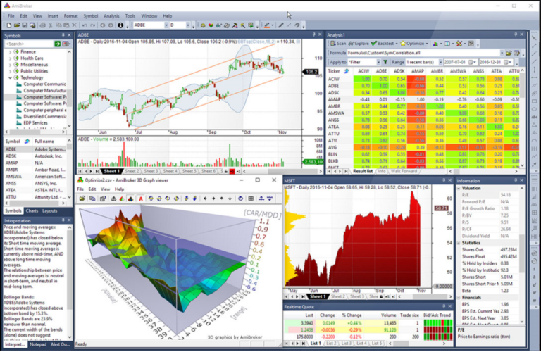

Pivot points are a widely used technical analysis tool in trading, providing forecasted levels of support and resistance based on the previous period's high, low, and close prices. They are particularly valuable in determining potential turning points in the market. Pivot points help traders identify probable market entry and exit points, making them a crucial element in both discretionary and algorithmic trading strategies. Among the various types of pivot points, Camarilla pivot points are distinctive due to their mathematical approach and specific set of levels designed to predict market behavior.

Camarilla pivot points were introduced by Nick Scott in the late 1980s. This variant focuses on a series of mathematical calculations to determine eight critical levels that include one central pivot, four support, and four resistance levels. These calculations are based on formulas that emphasize closing price movements, aiming to predict reversal levels more accurately. Camarilla pivot points assume that prices tend to revert to the mean, suggesting that significant deviations from the previous day’s closing price are likely to self-correct.



In the context of algorithmic trading, Camarilla pivot points are leveraged to automate the process of identifying potential market turning points. This application allows traders to develop systematic trading strategies that capitalize on these predicted levels of support and resistance. The potential benefits of incorporating Camarilla pivot points in algorithmic trading include increased precision in trade execution, improved risk management, and enhanced adaptability to various market conditions. By utilizing historical data and quantitative analysis, traders can backtest these strategies to evaluate performance, leading to more informed decision-making and potentially higher profitability.

## Table of Contents

## Understanding Camarilla Pivot Points

Camarilla pivot points were devised by Nick Scott in the late 1980s with the intent of providing traders with a reliable method to predict market reversals. These pivot points are a variation of traditional pivot point calculations used in technical analysis, which aim to determine critical price levels that might serve as support and resistance. Camarilla pivot points are unique due to their specific formulation and the focus on shorter timeframes, making them especially useful for day traders and those employing algorithmic strategies.

The mathematical formula for calculating Camarilla pivot points involves the previous trading day's high, low, and close prices. The method generates nine specific levels composed of one pivot point (PP), four support levels (S1, S2, S3, S4), and four resistance levels (R1, R2, R3, R4). Here are the general formulas for these points:

1. **Pivot Point (PP):**
$$
   PP = \frac{(High + Low + Close)}{3}

$$

2. **Resistance Levels:**
$$
   R1 = Close + \frac{(High - Low) \times 1.1}{12}

$$
$$
   R2 = Close + \frac{(High - Low) \times 1.1}{6}

$$
$$
   R3 = Close + \frac{(High - Low) \times 1.1}{4}

$$
$$
   R4 = Close + \frac{(High - Low) \times 1.1}{2}

$$

3. **Support Levels:**
$$
   S1 = Close - \frac{(High - Low) \times 1.1}{12}

$$
$$
   S2 = Close - \frac{(High - Low) \times 1.1}{6}

$$
$$
   S3 = Close - \frac{(High - Low) \times 1.1}{4}

$$
$$
   S4 = Close - \frac{(High - Low) \times 1.1}{2}

$$

These levels are used to determine potential price points where reversals may occur. S3 and R3 are particularly important as they are thought to be stronger indicators of price retracement or continuation. Traders often prioritize these levels to devise their entry and [exit](/wiki/exit-strategy) strategies, benefiting from the precision this approach provides. The comprehensive nature of the nine levels in Camarilla pivot points offers a versatile tool in technical analysis, suitable for various trading styles and adaptable to changing market conditions.

## Advantages of Using Camarilla Pivot Points in Algo Trading

Camarilla pivot points are pivotal tools in [algorithmic trading](/wiki/algorithmic-trading), offering a structured approach to identifying support and resistance levels with remarkable accuracy. These are critical markers in technical analysis, enabling traders to predict price movements more reliably.

The essence of Camarilla pivot points lies in their capacity to pinpoint specific price levels where significant buying or selling activity is likely to occur. By calculating four support and four resistance levels, along with a central pivot point, traders gain a detailed map of potential price action within a trading day. This detailed map allows traders to make more informed entry and exit decisions, enhancing their precision in the market.

The mathematical formula for Camarilla pivot points, primarily derived from the previous day's high (H), low (L), and close (C) prices, incorporates a specific focus on natural market reversals. The equations are typically expressed as:

- Resistance levels: 
  - $R1 = C + (H - L) \times 1.1 / 12$
  - $R2 = C + (H - L) \times 1.1 / 6$
  - $R3 = C + (H - L) \times 1.1 / 4$
  - $R4 = C + (H - L) \times 1.1 / 2$

- Support levels:
  - $S1 = C - (H - L) \times 1.1 / 12$
  - $S2 = C - (H - L) \times 1.1 / 6$
  - $S3 = C - (H - L) \times 1.1 / 4$
  - $S4 = C - (H - L) \times 1.1 / 2$

Through these calculations, Camarilla pivot points offer enhanced precision, especially suited for intraday trading strategies. Traders utilizing these points often find that they can set tight entry and exit points aligned with natural market rhythms, thereby minimizing slippage and maximizing profitability.

Camarilla pivot points also prove versatile across varying market conditions. Whether in trending or ranging markets, these pivot points help traders adapt their strategies accordingly. In trending markets, for instance, traders can identify significant breakthroughs or reversal points by observing interactions with the outer resistance (R4) or support (S4) levels. Conversely, in range-bound markets, intermediate levels like R1 and S1 provide actionable signals for traders to scalp minor price movements.

Incorporating Camarilla pivot points in algorithmic trading strategies offers traders a robust framework to navigate complex market dynamics, providing clarity and direction in timing trades effectively. This versatility and precision make them a valuable addition to any trader's toolkit, enhancing the strategic decision-making process in a systematic trading environment.

## Comparison: Camarilla vs. Other Pivot Points

Camarilla pivot points, alongside classical and Fibonacci pivot points, are essential tools for traders seeking to identify potential support and resistance levels. Each type has unique features and applications that make them suitable for different trading environments.

**Camarilla vs. Classical Pivot Points**

Classical pivot points are calculated using a straightforward formula:

$$
\text{Pivot Point} (P) = \frac{\text{High} + \text{Low} + \text{Close}}{3}
$$

From this central pivot point, additional support (S) and resistance (R) levels are derived. Classical pivot points provide a quick and efficient way to gauge market sentiment, making them highly popular among day traders.

Contrastingly, Camarilla pivot points incorporate a more nuanced method developed by Nick Scott, which accounts for the close price more heavily, resulting in a series of nine levels: one central pivot point, four resistance levels above, and four support levels below. This makes them particularly useful for capturing intraday market sentiment and abrupt market reversals. Camarilla pivot points provide potentially tighter levels than classical pivot points, offering more precise areas where price action might pivot.

**Camarilla vs. Fibonacci Pivot Points**

Fibonacci pivot points merge the pivot point method with Fibonacci retracement levels. They are calculated similarly to classical pivot points but use Fibonacci ratios to determine support and resistance levels. Fibonacci levels are popular due to their historical significance in predicting reversal points based on mathematical sequences found in nature.

Camarilla pivot points, however, take into account the previous day’s [volatility](/wiki/volatility-trading-strategies) and closing levels to predict price movements. While Fibonacci retracements focus on historical price movements assuming retracement levels based on ratios, Camarilla levels provide reactive points based on immediate past trading sessions, making them potentially better suited for [day trading](/wiki/day-trading-spy) or high-frequency trading scenarios.

**Advantages and Drawbacks**

The key advantage of Camarilla pivot points lies in their precise handling of market volatility and their predictive adjustments based on more recent price action. This can be particularly beneficial in highly volatile markets where traditional methods might offer broader, less useful levels.

However, a potential drawback is that due to their mathematical complexity, some traders may find Camarilla levels harder to integrate without algorithmic support, as compared to the simplicity of classical or Fibonacci methods. In addition, in more prolonged trends, Camarilla levels might lead traders to expect reversals prematurely compared to Fibonacci levels, which account for more extended historical data-based patterns.

**Situations Where Camarilla Outperforms**

Camarilla pivot points can outperform other methods when the market is expected to range or reverse within a trading day. Their emphasis on recent price action lines up better with intraday reversals and consolidation phases. Thus, in fast-moving markets with high intraday volatility, Camarilla levels might offer more actionable signals compared to broader levels given by classical or Fibonacci pivots. This makes them a valuable tool for day traders seeking to optimize entry and exit points with minimal risk.

## Implementing Camarilla Pivot Points in Algorithmic Strategies

Incorporating Camarilla pivot points into an algorithmic trading strategy involves several methodical steps, each crucial for maximizing the strategy's effectiveness. The process typically begins with understanding the calculation of Camarilla pivot points using historical price data. The formula for Camarilla pivot points primarily utilizes the prior trading session's high (H), low (L), and close (C) prices to establish one pivot point, four support levels (S1, S2, S3, S4), and four resistance levels (R1, R2, R3, R4). Specifically, the key formulas are:

$$
\text{Pivot Point (PP)} = \frac{(H + L + C)}{3}
$$

The support and resistance levels are then determined using the following relationships:

- R1 = C + $(H - L) \times 1.1/12$  
- R2 = C + $(H - L) \times 1.1/6$  
- R3 = C + $(H - L) \times 1.1/4$
- R4 = C + $(H - L) \times 1.1/2$

- S1 = C - $(H - L) \times 1.1/12$
- S2 = C - $(H - L) \times 1.1/6$
- S3 = C - $(H - L) \times 1.1/4$
- S4 = C - $(H - L) \times 1.1/2$

Once these levels are calculated, the next phase is integrating them into a trading algorithm. In a typical Python-based algorithmic setup, libraries like `pandas` for data manipulation and `numpy` for numerical processing facilitate these calculations efficiently. A basic algorithm might start by fetching historical data using libraries such as `yfinance` or a dedicated API, followed by calculating the pivot points and using them within a decision-making structure to determine buy or sell signals based on proximity to support or resistance levels.

```python
import pandas as pd
import numpy as np
import yfinance as yf  # For more datasets, visit: https://paperswithbacktest.com/datasets

# Fetch historical stock data
data = yf.download('AAPL', start='2023-01-01', end='2023-01-31')

# Calculate Camarilla Pivot Points
def camarilla_pivots(df):
    h = df['High']
    l = df['Low']
    c = df['Close']

    pp = (h + l + c) / 3
    r1 = c + (h - l) * 1.1 / 12
    s1 = c - (h - l) * 1.1 / 12
    # Additional R and S levels can be calculated similarly

    return pd.DataFrame({'PP': pp, 'R1': r1, 'S1': s1})

camarilla_points = camarilla_pivots(data)
print(camarilla_points.head())
```

Backtesting is integral to ensuring that any developed strategy is robust and potentially profitable. It involves historical data simulations to validate the algorithm's performance. Backtesting platforms like `Backtrader` or `Zipline` in Python allow traders to assess the strategy's returns, risk profile, and sensitivity to different market conditions before actual deployment.

Real-world trading platforms provide essential tools for implementing such strategies. Platforms like MetaTrader or TradingView allow users to build and test custom indicators using their scripting languages, such as MQL for MetaTrader or Pine Script for TradingView. Moreover, brokers offering API access, such as [Interactive Brokers](/wiki/interactive-brokers-api) or Alpaca, are suitable for executing algorithmic trading strategies directly in the market.

Ensuring a thorough backtest with diverse market conditions helps in refining the strategy; it allows adaptation to varying volatility and trend scenarios, which are critical when utilizing pivot points. This procedure aids traders in implementing strategies that not only theoretically work but are also practically feasible in live market environments.

## Backtesting Camarilla Pivot Strategies

Backtesting is a critical step in developing algorithmic trading strategies, particularly when using Camarilla pivot points. By simulating trades with historical data, traders can assess the viability and robustness of their strategies before deploying them in live markets. Here is a basic guide on how to backtest strategies using Camarilla pivot points:

### Step-by-Step Guide to Backtesting Camarilla Pivot Points

1. **Data Collection**: Acquire historical price data that includes the daily high, low, and close prices. This data serves as the foundation for calculating Camarilla pivot points.

2. **Calculate Camarilla Pivot Points**: For each trading day, calculate the pivot points using the following formulas:

   - Pivot Point (PP) = (High + Low + Close) / 3
   - Resistance Levels (R1 to R4) and Support Levels (S1 to S4):
$$
     R1 = \text{Close} + \frac{(High - Low) \times 1.1}{12}

$$
$$
     R2 = \text{Close} + \frac{(High - Low) \times 1.1}{6}

$$
$$
     R3 = \text{Close} + \frac{(High - Low) \times 1.1}{4}

$$
$$
     R4 = \text{Close} + \frac{(High - Low) \times 1.1}{2}

$$
$$
     S1 = \text{Close} - \frac{(High - Low) \times 1.1}{12}

$$
$$
     S2 = \text{Close} - \frac{(High - Low) \times 1.1}{6}

$$
$$
     S3 = \text{Close} - \frac{(High - Low) \times 1.1}{4}

$$
$$
     S4 = \text{Close} - \frac{(High - Low) \times 1.1}{2}

$$

3. **Strategy Development**: Define your trading strategy around the calculated pivot points. This might involve entering buy trades at support levels and sell trades at resistance levels, setting stop-loss and take-profit orders accordingly.

4. **Backtesting Process**: Use a backtesting tool or coding language (like Python) to simulate trades based on your strategy. Here is a basic Python example using pandas:

   ```python
   import pandas as pd

   # Load your historical data into a DataFrame
   data = pd.read_csv('historical_data.csv')

   # Calculate pivot points
   data['PP'] = (data['High'] + data['Low'] + data['Close']) / 3
   data['R1'] = data['Close'] + (data['High'] - data['Low']) * 1.1 / 12
   data['S1'] = data['Close'] - (data['High'] - data['Low']) * 1.1 / 12
   # Add additional R and S calculations here...

   # Implement buy/sell logic (example)
   data['Signal'] = None
   data.loc[data['Low'] < data['S1'], 'Signal'] = 'Buy'
   data.loc[data['High'] > data['R1'], 'Signal'] = 'Sell'

   # Evaluate performance (example)
   data['Returns'] = 0.0
   # Calculate returns based on signals...

   print(data[['Date', 'Signal', 'Returns']])
   ```

5. **Performance Evaluation**: Analyze key performance statistics, such as net returns, maximum drawdown, and Sharpe ratio, to determine the effectiveness of the strategy. These metrics help assess risk and profitability, guiding adjustments needed for optimization.

### Significance of Performance Statistics

Performance [statistics](/wiki/bayesian-statistics) play a crucial role in evaluating trading strategies. Net returns indicate total profit or loss, allowing traders to gauge overall success. Maximum drawdown assesses the risk by measuring the peak-to-trough loss, important for understanding potential risks. The Sharpe ratio evaluates risk-adjusted return, helping compare the strategy's return relative to its volatility.

### Case Studies and Effectiveness

There are limited published studies focusing solely on Camarilla pivot strategies, but anecdotal evidence suggests that traders benefit from their use, especially in volatile markets where precise support and resistance levels offer advantageous entry and exit points. Some traders report improved outcomes by incorporating Camarilla levels into broader trading systems, highlighting their potential effectiveness in enhancing decision-making accuracy.

In conclusion, [backtesting](/wiki/backtesting) with Camarilla pivot points requires detailed data analysis and strategy fine-tuning but offers promising avenues for traders seeking to leverage systematic approaches in algorithmic trading.

## Common Challenges and Solutions

Using Camarilla pivot points in algorithmic trading presents several challenges, which traders need to understand and address to effectively leverage these tools. Below are some common challenges and potential solutions:

### Data Quality and Calculation Accuracy

**Challenge:** Inaccuracies in the calculation of Camarilla pivot points often stem from poor data quality. The reliability of these pivot points tremendously depends on the precision of historical high, low, and close prices.

**Solution:** Ensure the use of high-quality, clean, and accurate data. Employ data validation techniques to check for outliers or anomalies, and utilize reputable data sources. Consistent verification of data feeds and calculation scripts is essential to maintaining the integrity of pivot points.

### Market Volatility

**Challenge:** High market volatility can result in frequent breaches of support and resistance levels, potentially leading to false signals and increased losses.

**Solution:** Traders can apply volatility filters such as the Average True Range (ATR) to adjust trading strategies for different market conditions. This allows traders to dynamically widen or narrow pivot point ranges based on current market volatility, helping to reduce false positives.

### Overfitting Strategies

**Challenge:** In the process of adapting strategies based on historical performance, traders risk overfitting, where a strategy is too finely tuned to past data, impacting its predictive power in real-world scenarios.

**Solution:** Implement a robust backtesting framework that uses out-of-sample data for validation. Cross-validation methods, such as walk-forward testing, can help ensure that strategies remain effective over time. Simplicity in strategy design often outweighs complex models that are prone to overfitting.

### Algorithm Complexity

**Challenge:** Incorporating Camarilla pivot points into algorithmic strategies can lead to increased complexity, making the testing and execution processes cumbersome.

**Solution:** Start with a basic implementation of pivot points in trading algorithms. Gradually increase complexity only after rigorous testing and validation of simpler models. Employ modular programming practices to maintain clarity and manageability of the trading codebase.

### Risk Management

Risk management is a critical component when using Camarilla pivot points in trading strategies. Setting proper stop-loss levels that relate to the defined support and resistance bands helps in mitigating potential losses. A well-defined risk-reward ratio should be consistently applied to manage trades effectively. For example, ensuring that potential profit exceeds potential loss in a given trade can safeguard capital and enhance profitability over the long term.

### Sample Python Snippet for Risk Management

```python
def calculate_risk_reward(entry_price, stop_loss, target_price):
    risk = entry_price - stop_loss
    reward = target_price - entry_price
    risk_reward_ratio = reward / risk
    return risk_reward_ratio

entry_price = 100
stop_loss = 95
target_price = 110

ratio = calculate_risk_reward(entry_price, stop_loss, target_price)
if ratio >= 2:  # Considering a 1:2 risk-reward ratio
    print("Trade is acceptable")
else:
    print("Reconsider trade setup")
```

Utilizing these strategies and mitigating challenges effectively can enhance the reliability and profitability of trading strategies incorporating Camarilla pivot points. Firms and individual traders should tirelessly refine their approach to remain adaptive to market changes, ensuring sustainable trading operations.

## Conclusion

Camarilla pivot points stand out as a valuable tool in algorithmic trading due to their unique ability to precisely identify support and resistance levels. These pivot points allow traders to make informed decisions regarding entry and exit points, providing a systematic approach to trading. By relying on the calculated nine levels—including one pivot, four support, and four resistance levels—traders can capitalize on small price movements with a high degree of accuracy.

The adaptability of Camarilla pivot points across varying market conditions further enhances their appeal in automated trading systems. Whether in trending markets or periods of market consolidation, these pivot points offer flexibility and reliability. They can be particularly advantageous compared to classic or Fibonacci pivot points in specific trading scenarios, providing traders with a nuanced approach to market analysis.

For traders interested in incorporating Camarilla pivot points into their strategies, it is crucial to invest time and effort in backtesting. Using historical data to simulate trading strategies can offer valuable insights into the performance and reliability of these pivot points. Backtesting also aids in fine-tuning strategies by identifying strengths and weaknesses, allowing traders to optimize their approaches before deploying them in live trading environments.

Additional resources, such as trading platforms equipped with pivot point indicators and educational materials on algorithmic trading, can further enhance one's understanding and application of these strategies. Platforms like MetaTrader or TradingView offer tools that facilitate the implementation and study of Camarilla pivot points, making them accessible to traders at all skill levels.

In summary, Camarilla pivot points serve as a powerful tool in the arsenal of algorithmic traders. Their precise calculation, adaptability, and potential for offering enhanced trading insights make them worthy of exploration. By committing to rigorous backtesting and utilizing available resources, traders can harness the full potential of Camarilla pivot points in their trading endeavors.

## FAQs

### FAQs

#### What are Camarilla Pivot Points?

Camarilla pivot points are a set of support and resistance levels used by traders to identify potential market turning points. Originating in the 1980s, they were devised by trader Nick Scott and are known for their ability to pinpoint high-probability reversal levels in intraday trading.

#### How are Camarilla Pivot Points Calculated?

The Camarilla pivot points are derived from the previous day's high (H), low (L), and close (C) prices. The central pivot point is particularly significant, and it is used to calculate four support (S1, S2, S3, S4) and four resistance (R1, R2, R3, R4) levels. The formulas for calculating some key levels are:

- **R3**: $R3 = C + \frac{H - L}{1.1}$
- **S3**: $S3 = C - \frac{H - L}{1.1}$

These levels do not adhere to Fibonacci retracements or the classical pivot formulas, giving them a distinctive application in trading strategies.

#### How Do Camarilla Pivot Points Differ from Classical and Fibonacci Pivot Points?

Camarilla pivot points differ primarily in their calculation and number of levels. While classical pivots rely on a central pivot and three pairs of supports and resistances, Fibonacci pivots incorporate Fibonacci retracement percentages. Camarilla’s unique calculation provides nine levels, often detecting tighter ranges and more precise reversal areas.

#### Can Camarilla Pivot Points Be Used in All Market Conditions?

Yes, Camarilla pivot points can be adapted to various market conditions, including consolidating or trending markets. Their precision in identifying potential reversal points and extensions makes them versatile tools for different trading environments, though traders should also consider market context and additional indicators for confirmation.

#### Are Camarilla Pivot Points Suitable for Beginners?

While Camarilla pivot points can appear complex to new traders due to their unique derivation, they can be effectively used once understood. Beginners should focus on learning the basic principles of support and resistance, practice applying the formulas manually or using trading software, and start by observing how these levels interact with market price action.

#### How Can One Implement Camarilla Pivot Points in Algorithmic Trading?

To implement Camarilla pivot points in algorithmic trading, traders can incorporate their calculation into trading algorithms using a programming language like Python. Here's a sample function for calculating R3 and S3 in Python:

```python
def camarilla_pivots(high, low, close):
    r3 = close + (high - low)/1.1
    s3 = close - (high - low)/1.1
    return r3, s3

high = 150.0
low = 145.0
close = 147.0

r3, s3 = camarilla_pivots(high, low, close)
print(f"R3: {r3}, S3: {s3}")
```

#### What Are Common Misconceptions About Camarilla Pivot Points?

One common misconception is that Camarilla pivot points guarantee trade success. While they provide valuable levels for consideration, their effectiveness relies on proper integration into broader trading strategies. Another misconception is their complexity; although involving several calculations, they can be automated with modern trading software and can be as straightforward as other analysis techniques.

By understanding these points, traders can more effectively incorporate Camarilla pivot points into their trading methodologies, potentially enhancing decision-making and market outcomes.

## References & Further Reading

[1]: ["Financial Risk Management and Derivative Instruments"](https://www.taylorfrancis.com/books/mono/10.4324/9781003132240/financial-risk-management-derivative-instruments-michael-dempsey) by David Y. Chase

[2]: ["Technical Analysis of the Financial Markets: A Comprehensive Guide to Trading Methods and Applications"](https://www.amazon.com/Technical-Analysis-Financial-Markets-Comprehensive/dp/0735200661) by John J. Murphy

[3]: Investopedia. ["Camarilla Pivot Points: Definition and Calculation"](https://www.investopedia.com/terms/p/pivotpoint.asp)

[4]: R. Pardo. ["The Evaluation and Optimization of Trading Strategies"](https://onlinelibrary.wiley.com/doi/book/10.1002/9781119196969) by Robert Pardo

[5]: Nick Scott's original work on Camarilla pivots is less formalized in literature, but trading forums and online resources like TradeStation's TradingApp Store offer practical guidance on applying his principles in algorithmic strategies.