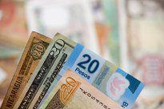

The financial market landscape is in a state of constant evolution, with innovations in technology and development of new strategies profoundly influencing trading operations. Over the decades, the foreign exchange market, in particular, has witnessed a transformation in the roles and methodologies employed by currency traders, traditionally known as cambists. These professionals, once reliant on personal expertise and detailed currency manuals, have experienced a significant shift in their operational landscape.

This change is largely attributed to the rise of algorithmic trading, or algo trading, which has gained substantial traction in forex markets. The implementation of algorithms in trading processes has not only increased efficiency but also redefined the role of currency traders on a global scale. By harnessing technology, trading strategies have advanced far beyond traditional methods, enhancing the execution of transactions and optimizing decision-making processes.



In this rapidly changing environment, the modern cambist's role has evolved, intersecting with sophisticated algorithmic solutions. This article aims to explore these developments, examining how currency traders have adapted to the technological surge and the impact of algo trading on their responsibilities. Understanding these dynamics is critical for comprehending the current and future states of the foreign exchange market, as traders and institutions continue to navigate an increasingly automated and technologically driven world.

## Table of Contents

## What is a Cambist?

A cambist, in historical terms, refers to an expert in international currency exchange. The term originates from the Italian word "cambista," which itself is derived from "cambiare," meaning "to exchange." Cambists played a crucial role in international trade by using detailed manuals and exchange rate tables to perform currency conversions efficiently. Before the advent of modern technology, these professionals provided essential services, calculating exchange rates and ensuring transparent transactions across borders.

During the height of their prominence, cambists relied on comprehensive manuals such as "cambists' manuals," which contained vital information about currencies, including exchange rates, conversion tables, and historical data. These documents were indispensable for traders and merchants engaged in international commerce, as they contained detailed currency conversion guidelines necessary for accurate cross-border transactions. The cambist's expertise in arithmetic and financial calculations enabled them to offer reliable exchange services, making them invaluable to global trade networks.

However, with technological advancements, the traditional role of cambists has dramatically changed. The manual labor involved in currency conversion has largely been supplanted by real-time data accessible online. Digital platforms and electronic trading systems now provide instantaneous exchange rate information, reducing the need for manual calculations and printed conversion tables. As a result, the term "cambist" has fallen out of common usage, and its function has been absorbed into the broader realm of financial trading and foreign exchange services.

Today, while the term cambist is rarely used, it remains a testament to the evolution of currency trading practices. The shift from manual to automated processes reflects the broader technological transformations within the financial markets. The history of cambists highlights how innovations in technology have redefined roles, leading to more efficient and accurate foreign exchange operations in the contemporary global economy.

## The Evolution of Currency Trading

Currency trading has experienced significant changes over the years, primarily driven by advancements in technology and communication networks. Historically, trading was reliant on personal interaction and specialized expertise, where traders depended heavily on their experience and intuition to make trading decisions. These experts, often referred to as cambists, used their deep understanding of currency markets to execute transactions manually, relying on detailed exchange rate tables and personal insight.

The internet's emergence marked a turning point, enabling a massive transformation in currency trading. The launch of electronic trading platforms made [forex](/wiki/forex-system) markets more accessible, offering quicker execution times and enhanced transparency. These platforms eradicated the need for physical proximity to trading floors, allowing traders from around the world to engage with the markets instantaneously. 

With electronic trading flattening the landscape, the focus shifted towards developing sophisticated algorithms to handle the complexities of modern trading. Algorithms facilitate real-time analysis and execute trades at a speed unattainable by human involvement alone. They not only automate mundane tasks but also optimize trading strategies by processing vast amounts of market data, applying statistical models, and identifying patterns more accurately than human traders.

This technological shift significantly reduced dependency on traditional cambists, who were once the backbone of currency trading operations. Now, algorithmic solutions dominate, with traders employing advanced software that uses [quantitative trading](/wiki/quantitative-trading) models, high-frequency trading ([HFT](/wiki/high-frequency-trading-strategies)), and other algorithmic strategies to capitalize on minute market fluctuations. The transition from manual, expertise-driven practices to automated, technology-based strategies is a reflection of the broader digital transformation in global financial markets.

As technology continues to evolve, currency trading is expected to become increasingly automated and efficient, emphasizing the importance of algorithms and diminishing the traditional roles of expert cambists. This evolution underscores a paradigm shift in the landscape of forex trading, where technology and strategy are more intertwined than ever.

## Rise of Algo Trading in Forex

Algorithmic trading, commonly referred to as algo trading, has become a dominant force in the forex trading landscape, with estimates indicating its role in approximately 75% of spot market transactions. This prevalence signifies a fundamental shift in trading practices driven by several key factors. One primary driver is the need for cost-effective trading. Algo trading inherently reduces trading costs by minimizing the width of bid-ask spreads and optimizing the timing of trades to achieve favorable price points. Furthermore, automated trading systems effectively handle high volumes of transactions with minimal operational overhead.

Improved regulatory compliance is another significant [factor](/wiki/factor-investing) encouraging the rise of algo trading. Automated systems are designed to adhere to regulatory standards effortlessly by maintaining comprehensive records of all trading activities, thus providing transparency and aiding in compliance checks. This automation aids firms in meeting stringent regulatory requirements, reducing the risk of costly compliance breaches.

Enhanced data analysis capabilities also play a crucial role in the adoption of [algorithmic trading](/wiki/algorithmic-trading). Using sophisticated algorithms allows traders to analyze vast datasets in real time, extracting actionable insights that drive informed decision-making processes. These data analytics capabilities enable traders to identify market trends and price patterns that may not be evident through manual analysis.

The rise of [machine learning](/wiki/machine-learning) and [artificial intelligence](/wiki/ai-artificial-intelligence) further catalyzes the transformation of trading strategies within the forex market. Machine learning algorithms can learn from historical data and adapt to new market conditions, making them adept at predicting currency movements with high precision. By leveraging these technologies, traders can implement more sophisticated strategies that account for complex market dynamics.

In summary, the integration of algorithmic trading in forex markets stems from its ability to offer cost savings, enhance compliance, and improve data-driven decision-making. The continued evolution of machine learning and AI promises to bring even greater sophistication to trading strategies, solidifying algo trading's pivotal role in modern forex markets.

## Impacts on the Role of Currency Traders

The role of currency traders continues to evolve with the advent of algorithmic trading, fundamentally altering how trading operations are conducted. Traditionally, traders relied heavily on manual expertise to facilitate currency transactions. Today, their roles often mirror those of 'algo DJs', managing intricate trading algorithms to promote efficiency and precision.

To thrive in this modern financial landscape, traders must acquire a diverse set of skills extending beyond traditional trading expertise. Legal knowledge has become integral, as traders navigate complex regulatory environments. As financial markets are heavily regulated, understanding legal frameworks ensures compliance and mitigates risks associated with trading activities. Moreover, risk management remains essential, with traders needing to identify, assess, and respond effectively to potential risks to safeguard investments.

Data analysis has emerged as a cornerstone skill for currency traders. With the availability of vast amounts of financial data, traders leverage data analytics to derive insights and inform their trading strategies. This involves using statistical tools and software to analyze market trends, forecast currency movements, and optimize trading algorithms for improved performance.

Despite significant technological advancements, the human element retains its significance within trading operations. Traders provide essential oversight, ensuring that trading systems operate as intended and adhere to ethical and regulatory standards. Human oversight is crucial in maintaining accountability and trust within the financial markets. Compliance with trading regulations and internal policies remains a human-driven necessity, as automation alone cannot fully ensure adherence to complex legal requirements.

Moreover, handling unforeseen anomalies within trading activities demands human intervention. While algorithms process vast amounts of data rapidly, they may not predict or adapt to unexpected market events or anomalies without human guidance. Traders must be adept at interpreting these anomalies and making informed decisions to mitigate potential issues.

Adaptability has become a core characteristic for modern traders. The continuously evolving forex landscape, driven by rapid technological advancements, requires traders to stay abreast of new tools, techniques, and regulations. Flexibility allows traders to integrate new technologies into their operations, enhancing their effectiveness and competitiveness in the forex market.

In conclusion, the forex market's shift towards algorithmic trading has significantly transformed the role of currency traders. While technology facilitates efficient trading processes, the necessity for adaptable, multi-skilled traders who can provide human oversight remains critical. Proficiency in legal knowledge, risk management, data analysis, and adaptability is essential for navigating the dynamic and competitive forex trading environment.

## Future Trends in Forex Trading

The rapid advancement of trading technology in the foreign exchange market is reshaping the landscape in which institutions and corporations operate. As algorithmic trading systems become more sophisticated and efficient, these entities stand to reap significant benefits. One of the primary drivers of this shift is the increased tailoring of algo trading systems to meet specific trading needs, creating bespoke solutions that optimize performance.

The integration of artificial intelligence (AI) into trading strategies is expected to enhance predictive trading and market analysis capabilities. AI's ability to process and analyze vast datasets quickly and accurately allows for more precise forecasting of market trends and price movements. This evolution augments traditional trading strategies by leveraging AI’s capacity for pattern recognition and anomaly detection. For instance, machine learning models can analyze historical pricing data to predict future movements, often using frameworks like:

```python
from sklearn.linear_model import LinearRegression
import numpy as np

# Sample historical data (date index replaced with range for simplicity)
X = np.array([1, 2, 3, 4, 5])  # Feature: time series index
y = np.array([10, 11, 13, 15, 18])  # Target: price values

# Reshape data and create the model
X = X.reshape(-1, 1)
model = LinearRegression()

# Train the model
model.fit(X, y)

# Predict future price
future_index = np.array([6]).reshape(-1, 1)
predicted_price = model.predict(future_index)
predicted_price
```

Furthermore, as AI and machine learning technologies continue to evolve, forex trading is likely to see increased efficiency and effectiveness in handling large volumes of transactions with minimal latency. The competition in the forex market is poised to intensify, driven by technological innovations that enable participants to execute strategies more effectively. With the rise of high-frequency trading (HFT), firms capable of executing thousands of trades per second will greatly affect market dynamics by exploiting small movements in currency prices.

These technological advancements not only enhance trading capabilities but also demand a shift in how forex market participants approach trading strategies. As algorithms handle increasingly complex transactions, the importance of maintaining robust oversight and ensuring compliance with regulatory frameworks remains paramount. This evolving environment demands that traders, analysts, and developers possess a blend of technical and financial market knowledge, enabling them to operate in this highly dynamic and competitive arena.

In conclusion, as forex trading technology continues to evolve, the market is set to become more competitive with advancing technologies at its core. Both institutional and corporate clients stand to gain from these innovations, provided they adapt and leverage AI and algorithmic advancements to enhance their trading strategies and maintain a competitive edge in the global market.

## Conclusion

The foreign exchange market, traditionally dominated by expert cambists, has undergone a remarkable transformation into a fast-paced, algorithm-driven landscape. This evolution is largely attributed to the proliferation of algorithmic trading, which now serves as the cornerstone of currency trading, providing unparalleled speed, efficiency, and strategic advantages. 

Algorithmic trading systems have revolutionized the way trades are executed, significantly reducing the time required for processing transactions while minimizing human error. These systems utilize complex algorithms to analyze vast amounts of market data, identify trading opportunities, and execute trades with precision. The integration of machine learning and artificial intelligence further enhances these systems, enabling them to adapt to changing market conditions and optimize trading strategies.

Despite these technological advancements, the human element remains indispensable in forex trading. Knowledgeable and adaptable traders are crucial for ensuring oversight, compliance, and the ability to handle unforeseen market anomalies. The evolving landscape demands that traders possess a diverse skill set, encompassing legal expertise, risk management, and data analysis.

As the forex market continues to advance, the successful integration of new technologies will be imperative for developing effective trading strategies. Embracing these advancements while maintaining a critical human oversight will ensure the competency and resilience of traders in an automated world. The future of currency trading lies in this synergy between cutting-edge technology and adept human oversight, driving successful outcomes in a competitive market environment.

## References & Further Reading

[1]: Bergstra, J., Bardenet, R., Bengio, Y., & Kégl, B. (2011). ["Algorithms for Hyper-Parameter Optimization."](https://dl.acm.org/doi/10.5555/2986459.2986743) Advances in Neural Information Processing Systems 24.

[2]: ["Advances in Financial Machine Learning"](https://www.amazon.com/Advances-Financial-Machine-Learning-Marcos/dp/1119482089) by Marcos Lopez de Prado

[3]: ["Evidence-Based Technical Analysis: Applying the Scientific Method and Statistical Inference to Trading Signals"](https://www.amazon.com/Evidence-Based-Technical-Analysis-Scientific-Statistical/dp/0470008741) by David Aronson

[4]: ["Machine Learning for Algorithmic Trading"](https://github.com/stefan-jansen/machine-learning-for-trading) by Stefan Jansen

[5]: ["Quantitative Trading: How to Build Your Own Algorithmic Trading Business"](https://www.amazon.com/Quantitative-Trading-Build-Algorithmic-Business/dp/1119800064) by Ernest P. Chan