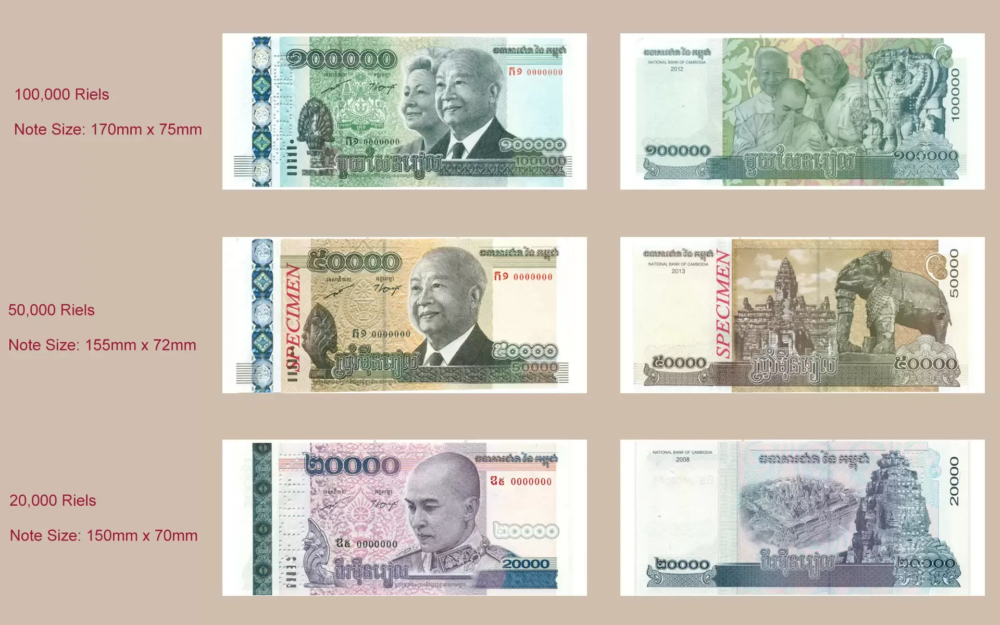

## Table of Contents

## What is the Cambodian Riel (KHR)?

The Cambodian Riel (KHR) is the official currency of Cambodia. It is used every day by people in Cambodia to buy things like food, clothes, and other goods. The symbol for the Riel is ៛, and it is divided into 100 sen, although sen coins are not used anymore.

The Riel was first used in 1953 when Cambodia became independent from France. Over the years, the value of the Riel has changed a lot because of different events in Cambodia's history. Today, while the Riel is the official currency, the US dollar is also widely used in Cambodia, especially for bigger purchases and in tourist areas.

## How is the Cambodian Riel abbreviated and symbolized?

The Cambodian Riel is abbreviated as KHR. This is used when people talk about the currency in a short way, like in news or on price tags.

The symbol for the Cambodian Riel is ៛. You can see this symbol when you look at Cambodian money or when prices are written down. It helps people know that the price is in Riel.

## What is the history of the Cambodian Riel?

The Cambodian Riel started being used in 1953 when Cambodia became free from France. Before that, they used the French Indochinese Piastre. At first, the Riel was strong and people used it a lot. But then, from the late 1960s to the 1970s, Cambodia had a lot of problems because of wars and fighting. This made the Riel's value go down a lot. During the time of the Khmer Rouge in the late 1970s, they stopped using the Riel and used something called the "revolutionary currency" instead.

After the Khmer Rouge, the Riel came back in the 1980s. But it was still hard for the Riel because Cambodia's economy was not doing well. People started using the US dollar a lot, especially for big things like buying houses or cars. Today, the Riel is still the official money of Cambodia, but many people also use the US dollar. The Riel is used more for everyday small things like buying food or bus tickets. The government is trying to make the Riel stronger and more people are starting to use it more often.

## What are the different denominations of the Cambodian Riel?

The Cambodian Riel comes in different amounts of money, which we call denominations. For paper money, you can find Riel in amounts like 50, 100, 200, 500, 1,000, 2,000, 5,000, 10,000, 20,000, and 50,000 Riel. These are the bills that people use every day to buy things. The smaller amounts like 50 and 100 Riel are not used as much anymore, but you might still see them sometimes.

For coins, the Riel has denominations of 50, 100, 200, and 500 Riel. But these coins are not used very often. Most people in Cambodia use the paper money more because it's easier to [carry](/wiki/carry-trading) and use for everyday buying. Even though there are coins, you will mostly see people using the Riel bills.

## How does the Cambodian Riel compare to other Southeast Asian currencies?

The Cambodian Riel is one of the currencies used in Southeast Asia, but it is not as strong as some others in the region. For example, compared to the Singapore Dollar (SGD) or the Malaysian Ringgit (MYR), the Riel has a lower value. This means you need more Riel to buy things that might cost less in Singapore or Malaysia. The Thai Baht (THB) and the Vietnamese Dong (VND) are closer to the Riel in value, but the Riel is still weaker than the Baht. The Indonesian Rupiah (IDR) and the Philippine Peso (PHP) are also weaker than the Riel, but they are used more widely in their countries.

In Cambodia, people often use the US Dollar alongside the Riel, which is different from other Southeast Asian countries where their own currency is used more. This is because the Riel's value can change a lot and people feel safer using the US Dollar for bigger purchases. In places like Thailand, Vietnam, or Indonesia, their own currencies are used more and are more stable. The Riel's value can go up and down a lot, so it is not as trusted as other Southeast Asian currencies for saving money or for big purchases.

## What is the current exchange rate of the Cambodian Riel to the US Dollar?

The current exchange rate of the Cambodian Riel (KHR) to the US Dollar (USD) is about 4,100 KHR for 1 USD. This means if you have one US Dollar, you can get around 4,100 Riel. Exchange rates can change every day, so it's a good idea to check the latest rate before you make any money changes.

In Cambodia, you might use both the Riel and the US Dollar. For small things like buying food or a bus ticket, people often use Riel. But for bigger things like buying a house or a car, many people prefer to use US Dollars because they trust it more. The Riel's value can go up and down a lot, so using US Dollars can feel safer for big purchases.

## How stable is the Cambodian Riel and what affects its value?

The Cambodian Riel is not as stable as many other currencies. Its value can go up and down a lot. This is because Cambodia's economy can be affected by many things, like changes in how much people are buying and selling, or big events happening in the world. The government tries to keep the Riel's value steady, but it's hard because Cambodia's economy is still growing and can be easily affected by outside things.

One big thing that affects the Riel's value is how much people use the US Dollar in Cambodia. Because many people in Cambodia use the US Dollar for big purchases, it can make the Riel seem less important. When people trust the US Dollar more, it can make the Riel's value go down. Also, things like tourism and how much money comes into Cambodia from other countries can change the Riel's value. If more tourists come and spend money, it can help the Riel, but if fewer tourists come, it can hurt the Riel's value.

## What role does the National Bank of Cambodia play in managing the Riel?

The National Bank of Cambodia is like a big boss for the Cambodian Riel. It makes sure the Riel works well in the country. The bank decides how much Riel should be made and how much it should be worth compared to other money like the US Dollar. It also tries to keep the Riel's value steady so people can trust it more. This is important because if the Riel's value goes up and down a lot, it can be hard for people to buy things and plan for the future.

The National Bank of Cambodia also helps keep the country's money safe. It checks the Riel to make sure it is not fake and helps stop bad people from making fake money. The bank also works with the government to make rules about money that help the economy grow. By doing all these things, the National Bank of Cambodia helps make the Riel stronger and more useful for everyone in Cambodia.

## How is the Cambodian Riel used in daily transactions in Cambodia?

In Cambodia, people use the Riel every day to buy things they need, like food, drinks, and bus tickets. For small purchases, like buying a snack from a street vendor or paying for a ride on a local bus, the Riel is the main currency people use. You will see people handing over Riel notes to pay for these everyday items. Even though the Riel is used a lot for small things, it's not the only money people use in Cambodia.

Alongside the Riel, many Cambodians also use the US Dollar, especially for bigger purchases like buying a car, paying rent, or shopping in big stores. In tourist areas, you might find that shops and restaurants often show prices in both Riel and US Dollars, and they might even prefer the US Dollar. This is because the US Dollar is seen as more stable than the Riel, and people trust it more for saving money or making big payments. So, while the Riel is important for daily life, the US Dollar also plays a big role in Cambodia's money system.

## What are the advantages and disadvantages of using the Cambodian Riel over other currencies in Cambodia?

Using the Cambodian Riel has some good things about it. It's the official money of Cambodia, so it's what people use every day for small things like buying food or taking the bus. It's easy to use because everyone knows it and it's what you see in markets and small shops. Also, using the Riel helps the country's economy grow because it shows that people trust their own money. When you use the Riel, you're helping the local businesses and the government to keep the economy strong.

But there are also some not-so-good things about using the Riel. Its value can change a lot, which can make it hard for people to know how much things will cost tomorrow. Because the Riel is not as strong as other money like the US Dollar, some people don't trust it as much for saving or for big purchases like buying a house. In Cambodia, many people use the US Dollar alongside the Riel, especially in big cities and tourist areas. This can make it confusing because you need to know how to change between the two currencies, and sometimes shops might not want to take Riel for big purchases.

## How does the use of the Cambodian Riel impact Cambodia's economy?

Using the Cambodian Riel helps Cambodia's economy in important ways. When people use the Riel for everyday buying, like food or bus tickets, it shows that they trust their own money. This can help make the economy stronger because more Riel being used means more money is moving around in the country. It also helps local businesses because they get paid in Riel, which they can then use to buy things they need. The government likes when people use the Riel because it shows that the country's money is important and helps the economy grow.

But there are also challenges with using the Riel. Its value can change a lot, which makes it hard for people to know how much things will cost in the future. Because the Riel is not as strong as other money like the US Dollar, some people don't trust it as much for saving or for big purchases like buying a house. In Cambodia, many people use the US Dollar alongside the Riel, especially in big cities and tourist areas. This can make the economy a bit confusing because businesses have to deal with two different kinds of money, and it can make the Riel seem less important if people prefer using the US Dollar for big things.

## What are the future prospects and potential reforms for the Cambodian Riel?

The future of the Cambodian Riel looks promising, but there are challenges too. The government and the National Bank of Cambodia are working hard to make the Riel stronger and more trusted. They want more people to use the Riel for everyday things and even for big purchases. One way they're doing this is by trying to make the Riel's value more steady. If the Riel's value doesn't change as much, people might trust it more and use it more often. The government also wants to make sure that the Riel is used more in tourist areas, so tourists can see how important the Riel is to Cambodia.

There are also some possible changes that could help the Riel. The government might make new rules to encourage people to use the Riel more. For example, they could make it easier for businesses to use the Riel or offer special deals for people who pay in Riel. Another big change could be making the Riel digital, so people can use it on their phones or computers. This could make the Riel more modern and easier to use. But these changes will take time, and it's important that the government keeps working to make the Riel a strong and trusted part of Cambodia's economy.

## What are the strategies for effective KHR algo trading?

Incorporating technical analysis tools into [algorithmic trading](/wiki/algorithmic-trading) of the Cambodian Riel (KHR) can significantly enhance decision-making processes. Technical analysis involves evaluating statistical trends from trading activity, such as price movement and [volume](/wiki/volume-trading-strategy). Common tools include moving averages, such as the Simple Moving Average (SMA) and the Exponential Moving Average (EMA), which help identify potential trends by smoothing out price data over a specified period. For instance, the EMA gives more weight to recent prices, making it more responsive to new information, which is essential for making timely decisions in the fast-paced [forex](/wiki/forex-system) market. 

Moreover, integrating the Relative Strength Index (RSI) can provide insights into whether a currency, like the KHR, is overbought or oversold, indicating potential reversal points. RSI is calculated using the formula:

$$
\text{RSI} = 100 - \left( \frac{100}{1 + \frac{\text{Average Gain}}{\text{Average Loss}}} \right)
$$

Diversification across multiple currency pairs is another vital strategy to mitigate risks associated with the [volatility](/wiki/volatility-trading-strategies) of the KHR. By trading a mix of currency pairs, traders can reduce their exposure to adverse movements in any single pair. This approach leverages the potential for gains in other currencies to offset losses due to volatility in the KHR market. For example, by including pairs that incorporate both stable and volatile currencies, traders balance the risk and reward, optimizing their portfolio's overall performance.

Continuous [backtesting](/wiki/backtesting) of algorithms is essential for maintaining and optimizing trading performance. Backtesting involves simulating a trading strategy using historical data to assess its viability before deployment in live markets. It helps in understanding the potential strengths and weaknesses of a strategy and in making necessary adjustments. In Python, the process can be implemented using libraries like `pandas` for data manipulation and `[backtrader](/wiki/backtrader)` for strategy testing. A straightforward backtesting setup could be structured as follows:

```python
import backtrader as bt

# Define a simple moving average strategy
class SMAStrategy(bt.Strategy):
    def __init__(self):
        self.sma = bt.indicators.SimpleMovingAverage(self.data.close, period=15)

    def next(self):
        if self.data.close[0] > self.sma[0]:
            self.buy()
        elif self.data.close[0] < self.sma[0]:
            self.sell()

# Setup backtest
if __name__ == '__main__':
    cerebro = bt.Cerebro()
    cerebro.addstrategy(SMAStrategy)

    # Load data
    data = bt.feeds.YahooFinanceData(dataname='KHRCAD=X', fromdate=datetime(2020,1,1),
                                     todate=datetime(2022,1,1))
    cerebro.adddata(data)

    # Run backtest
    cerebro.run()
    cerebro.plot()
```

Implementing such strategies enables traders to continuously refine their algorithms, adapting to changing market conditions and improving the accuracy of their predictions. By leveraging technical analysis tools, diversifying currency portfolios, and maintaining rigorous backtesting procedures, traders can effectively navigate the complexities and opportunities inherent in KHR algo trading.

## References & Further Reading

[1]: Bergstra, J., Bardenet, R., Bengio, Y., & Kégl, B. (2011). ["Algorithms for Hyper-Parameter Optimization."](https://dl.acm.org/doi/10.5555/2986459.2986743) Advances in Neural Information Processing Systems 24.

[2]: ["Advances in Financial Machine Learning"](https://www.amazon.com/Advances-Financial-Machine-Learning-Marcos/dp/1119482089) by Marcos Lopez de Prado

[3]: ["Evidence-Based Technical Analysis: Applying the Scientific Method and Statistical Inference to Trading Signals"](https://www.amazon.com/Evidence-Based-Technical-Analysis-Scientific-Statistical/dp/0470008741) by David Aronson

[4]: ["Machine Learning for Algorithmic Trading"](https://github.com/stefan-jansen/machine-learning-for-trading) by Stefan Jansen

[5]: ["Quantitative Trading: How to Build Your Own Algorithmic Trading Business"](https://www.amazon.com/Quantitative-Trading-Build-Algorithmic-Business/dp/1119800064) by Ernest P. Chan