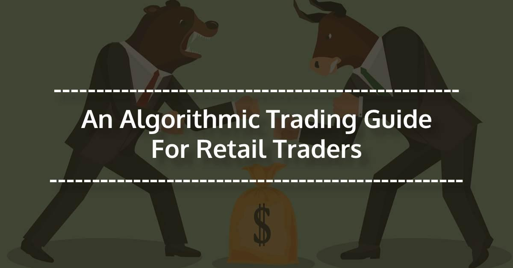

Algorithmic trading, often known as algo trading, refers to the execution of trades using predefined criteria via computer programs. These trading strategies leverage complex mathematical models and formulas to make high-speed decisions, often resulting in significant advantages over manual trading approaches. The integration of algorithms in financial trading has reshaped the industry by reducing transaction times, enhancing precision in order placement, and enabling the control of large and complex portfolios. The impact of this technological innovation has been profound, allowing for more efficient markets and significantly affecting the operations of financial institutions globally.

Algorithmic trading, historically the domain of large financial institutions, has trickled down to retail traders—individual investors who buy and sell securities for personal accounts, often through brokerage platforms. Recent technological advancements and the democratization of trading tools have made it feasible for these traders to employ algorithmic strategies. Retail algorithmic trading has gained traction due to its potential to level the playing field, enabling individual traders to compete with institutional investors by minimizing human error and emotions in trading decisions.



The advent of the internet and digital platforms has facilitated the dissemination of knowledge about algorithmic trading to a wider audience. Search engine optimization (SEO) and online content play a crucial role in expanding awareness. Traders and developers increasingly rely on online resources for education and to remain current with rapidly evolving technologies. Consequently, the accessibility and visibility afforded by the internet have driven the popularity of algorithmic trading among retail traders.

The primary objective of this article is to explore and elucidate the impact and operational mechanics of retail algorithmic trading. By understanding the underlying principles and current applications, we can appreciate how technological advancements are molding the future of financial markets. This discussion will offer insights into the challenges and opportunities within the field, serving as a primer for individuals interested in harnessing the power of algorithmic trading in their investment strategies.

## Table of Contents

## Understanding Algorithmic Trading

Algorithmic trading, often referred to as algo trading, involves the use of computer programs to execute trades in financial markets based on pre-defined criteria. These algorithms make decisions regarding the timing, price, and quantity of trade, leveraging mathematical models and statistical analysis to identify potential trading opportunities. The primary objective is to maximize profit margins and minimize risks by executing large orders with minimal market impact.

Historically, trading was a manual process, heavily reliant on human decision-making and physical stock exchanges. The transition from manual to algorithmic trading began in the late 1970s when electronic communication networks (ECNs) were introduced. By the 1980s and 1990s, technological advancements and the proliferation of internet access significantly transformed trading mechanisms. This evolution was further propelled by the adoption of direct market access (DMA), allowing traders to execute orders directly on exchanges via electronic platforms without intermediaries.

Different types of algorithms serve distinct purposes in trading:
1. **Market Making**: These algorithms provide liquidity to markets by continuously placing buy and sell orders. They profit from the bid-ask spread, effectively becoming intermediaries between buyers and sellers.

2. **Arbitrage**: Arbitrage algorithms exploit price inefficiencies across different markets or instruments. They simultaneously buy at a lower price in one market and sell at a higher price in another, ensuring a minimal risk, assuming all transactions proceed as planned.

3. **Trend Following**: These algorithms attempt to profit by trading in the direction of prevailing market trends. They often use indicators such as moving averages to identify and capitalize on potential price movements.

4. **Mean Reversion**: Mean reversion algorithms operate on the principle that asset prices will revert to their historical mean over time. They buy undervalued assets and sell overvalued ones, anticipating a price correction.

Technological advancements have made [algorithmic trading](/wiki/algorithmic-trading) accessible beyond institutional boundaries. The democratization of technology, with enhanced computing power, internet speed, and data analysis tools, has provided individual traders and smaller firms with the means to develop and execute sophisticated trading strategies. Languages such as Python, known for its simplicity and versatility, have been instrumental in this process, enabling traders to code and backtest algorithms efficiently.

Programming skills are vital in algorithmic trading as they allow traders to create and refine algorithms. Quantitative analysis underpins the development of algorithms, utilizing statistical methods and mathematical models to analyze historical data and predict future market behaviors. A typical process might involve data ingestion, signal generation, risk management, and order execution.

Python, for instance, offers numerous libraries such as NumPy, pandas, and scikit-learn, which provide tools for numerical calculations, data manipulation, and [machine learning](/wiki/machine-learning). A simple Python pseudo-code snippet for a moving average crossover strategy might look like this:

```python
import pandas as pd

def moving_average_crossover(data, short_window, long_window):
    signals = pd.DataFrame(index=data.index)
    signals['price'] = data['price']
    signals['short_mavg'] = data['price'].rolling(window=short_window, min_periods=1, center=False).mean()
    signals['long_mavg'] = data['price'].rolling(window=long_window, min_periods=1, center=False).mean()

    signals['signal'] = 0.0
    signals['signal'][short_window:] = np.where(signals['short_mavg'][short_window:] > signals['long_mavg'][short_window:], 1.0, 0.0)
    signals['positions'] = signals['signal'].diff()

    return signals
```

This code demonstrates a fundamental algorithmic concept, using a moving average strategy to identify trading opportunities based on crossover signals.

In conclusion, algorithmic trading has fundamentally altered market dynamics. By leveraging technological advancements and quantitative analysis, traders can achieve efficient market executions, analyze vast datasets in real-time, and refine strategies to adapt to market conditions.

## Retail Algorithmic Trading Explained

Retail algorithmic trading refers to the use of computer algorithms by individual traders to execute trades, as opposed to institutional trading, which involves large-scale financial entities. Unlike institutional traders, retail traders typically operate on a smaller scale and might not have access to the same degree of capital or market information. However, with advancements in technology, retail traders can participate in algorithmic trading systems that were once the preserve of professional investors and financial institutions.

The rise of technology has significantly democratized the trading landscape. Technological advancements, such as increased computing power, the proliferation of the internet, and enhanced software tools, have allowed retail traders to engage in algorithmic trading. Individuals can now write or employ pre-existing trading algorithms, leveraging the same principles of speed, efficiency, and data-driven decision-making that benefit institutional traders.

Trading platforms have become more accessible, catering to the needs of individual investors. Numerous brokerage firms and fintech companies have developed user-friendly interfaces and comprehensive trading tools. These platforms typically offer features such as [backtesting](/wiki/backtesting), real-time market data, and integration with external platforms via APIs. This ease of access lowers the barrier to entry, allowing more retail investors to experiment with and employ algorithmic trading strategies.

Brokerage firms play a crucial role in enabling retail algorithmic trading by providing essential infrastructure and support. Many firms offer platforms that allow individual traders to run their own algorithms, providing educational resources to help traders develop these algorithms. Fintech companies further contribute by innovating and offering customizable software solutions that simplify the implementation of complex strategies.

Despite its potential, retail algorithmic trading is not without challenges. Individual traders must overcome a steep learning curve, mastering both the technical aspects of algorithm development and a deep understanding of market dynamics. There's also the financial burden associated with acquiring and maintaining the necessary technology and data feeds.

Another issue is market [volatility](/wiki/volatility-trading-strategies), which can disrupt algorithmic strategies and lead to losses if not adequately accounted for. Furthermore, regulations vary significantly across jurisdictions, and retail traders must ensure that their algorithmic approaches comply with legal requirements, potentially adding an additional layer of complexity.

Benefits for those who manage to navigate these challenges include the ability to execute trades with greater speed and precision, reduced emotional biases in decision-making, and the possibility of managing diverse portfolios through automated strategies. Ultimately, successful retail algorithmic trading necessitates a combination of technological acumen, strategic foresight, and an understanding of the broader financial environment.

## Benefits of Retail Algorithmic Trading

Retail algorithmic trading offers numerous advantages that have significantly transformed the landscape for individual traders. The most notable benefit is the increased speed and efficiency of trade execution. Algorithms operate at speeds beyond human capability, executing trades in fractions of a second. This rapid execution allows retail traders to capitalize on fleeting market opportunities and respond promptly to price changes.

Another benefit is the reduction of emotional influences and human error in the decision-making process. By relying on algorithmic systems, traders can follow predefined strategies that eliminate impulsive decisions fueled by stress or greed. This systematic approach enhances consistency, as trades are executed based on quantitative criteria rather than subjective judgments.

Algorithmic trading also facilitates efficient management of complex portfolios. Algorithms can simultaneously monitor multiple securities and execute trades across different markets, optimizing portfolio performance. This ability is particularly beneficial for retail traders striving to maintain diversification and manage risks effectively. Algorithms can implement risk management strategies, such as position sizing and stop-loss orders, to protect portfolios from significant losses.

Sophisticated data analysis and real-time insights are readily accessible to retail traders through algorithmic systems. These algorithms can process vast amounts of market data and identify patterns or trends that may not be apparent to human traders. Equipped with such comprehensive analyses, traders can make informed decisions and refine their strategies based on evidence rather than intuition.

Overall, these advantages make retail algorithmic trading a powerful tool for enhancing trading strategies and achieving financial objectives. As technology continues to evolve, retail traders will increasingly benefit from these innovations, enabling them to compete in a domain once dominated by institutional investors.

## Challenges Faced by Retail Traders in Algo Trading

Retail traders venturing into algorithmic trading often encounter a myriad of challenges, encompassing technical, financial, and regulatory aspects.

### Technical Knowledge and Skills

One critical challenge is acquiring the necessary technical knowledge and skills required to construct and effectively manage trading algorithms. Algorithmic trading involves the application of mathematical models and the use of programming languages such as Python or R to design trading strategies. Retail traders must understand not only the syntax of programming but also concepts from quantitative analysis. Skills in statistical analysis, data structures, and financial modeling are vital. For example, implementing a simple moving average crossover strategy in Python might require understanding the following code snippet:

```python
import pandas as pd

# Sample data: Date and close prices
data = {'Date': ['2021-01-01', '2021-01-02', '2021-01-03'],
        'Close': [100, 102, 101]}
df = pd.DataFrame(data)
df['Date'] = pd.to_datetime(df['Date'])
df.set_index('Date', inplace=True)

# Calculate moving averages
df['SMA_10'] = df['Close'].rolling(window=10).mean()
df['SMA_20'] = df['Close'].rolling(window=20).mean()

# Define trading signals
df['Signal'] = 0
df['Signal'][df['SMA_10'] > df['SMA_20']] = 1
df['Position'] = df['Signal'].diff()
```

### Understanding Market Nuances and Programming Strategies

Comprehending the intricate nuances of the market and integrating that understanding into programming strategies is another hurdle. Markets are influenced by numerous factors like economic data releases, geopolitical events, and investor sentiment. Algorithms must be designed to adapt to these changing conditions, which requires a deep understanding of financial markets and the capability to translate these insights into effective code. This involves backtesting strategies against historical data to gauge their robustness and effectiveness.

### Costs of Algorithmic Trading Infrastructure

Handling the costs associated with setting up algorithmic trading infrastructure is a substantial challenge for retail traders. Necessary components include powerful computers, reliable internet connections, and potentially costly data subscriptions for real-time market data. Additionally, retail traders might have to invest in cloud computing services to run and optimize their trading algorithms efficiently. The financial commitment to maintain and upgrade this infrastructure can be significant.

### Market Volatility

Market volatility poses a significant challenge to algorithmic trading strategies. Algorithms might perform well under stable conditions but falter during times of high market volatility. Volatile markets can trigger rapid changes in prices, and unless algorithms are thoroughly tested to handle such conditions, they may generate significant losses. The sensitivity of algorithms to price swings necessitates constant monitoring and adjustment, further complicating management for retail traders.

### Regulatory Challenges and Compliance

Finally, regulatory challenges and compliance requirements are paramount concerns. Retail traders must ensure that their trading activities comply with regulations set forth by financial authorities. Different jurisdictions have varying rules governing algorithmic trading, including reporting requirements and risk management protocols. Traders must stay informed about these regulations to avoid legal implications, which requires an understanding of both local and international financial laws.

In summary, while retail algorithmic trading offers numerous opportunities for individual investors, it requires overcoming technical and financial obstacles, adapting to market conditions, and adhering to regulatory standards.

## Tools and Platforms for Retail Algo Traders

Retail algorithmic traders today have access to a variety of platforms and tools designed to assist in executing automated trading strategies effectively. These technological advancements play a crucial role in optimizing trades, reducing latency, and capitalizing on market conditions.

### Evaluation of Popular Trading Platforms

Several platforms cater specifically to retail algorithmic traders, providing them with the ability to automate and execute trades seamlessly. Popular platforms like MetaTrader 4/5, TradeStation, and [Interactive Brokers](/wiki/interactive-brokers-api) offer comprehensive features that accommodate the needs of algorithmic trading. MetaTrader, for instance, is widely favored for its user-friendly interface and support for both MQL4 and MQL5 programming languages, enabling the development of custom trading algorithms.

TradeStation stands out for its robust EasyLanguage scripting environment, which is particularly suitable for traders who wish to test and implement complex trading strategies. Interactive Brokers provides a powerful API, offering retail traders a gateway to global markets and a wide range of asset classes, which is often highly appreciated for its flexibility and comprehensive market data.

### Comparative Analysis of Software Tools and Their Features

When choosing a trading platform, retail traders consider several factors such as usability, cost, execution speed, and the quality of support. For instance, MetaTrader's broad support community and extensive resources make it accessible for beginners and advanced traders alike, whereas TradeStation’s advanced analytical tools are ideal for traders who prioritize data-driven decision-making.

The availability of backtesting features is another crucial consideration. Platforms like QuantConnect and TradingView provide robust backtesting capabilities, allowing traders to simulate strategies using historical data, thereby evaluating performance and stability before real-time deployment.

### Integration of APIs and Customizable Tools

APIs are integral to the functionality of algorithmic trading platforms, offering traders the ability to customize strategies and integrate third-party applications. Interactive Brokers’ API, for example, supports multiple languages, including Python and Java, enabling traders to connect custom algorithms with live market data and order execution systems.

Python, in particular, has become a popular choice for algorithmic traders due to its extensive library support and simplicity in syntax. The use of libraries like Pandas for data manipulation and Matplotlib for visualization enhances the efficiency of developing trading algorithms.

```python
import numpy as np
import pandas as pd
import matplotlib.pyplot as plt

# Example of a simple moving average crossover strategy
def calculate_sma(data, period):
    return data.rolling(window=period).mean()

# Sample trade data
data = pd.Series(np.random.randn(1000))

# Calculate moving averages
short_sma = calculate_sma(data, 20)
long_sma = calculate_sma(data, 50)

# Generate signals
signals = pd.DataFrame(index=data.index)
signals['signal'] = 0.0
signals['signal'][20:] = np.where(short_sma[20:] > long_sma[20:], 1.0, -1.0)

# Plotting the strategy
plt.plot(data, label='Price')
plt.plot(short_sma, label='20-day SMA')
plt.plot(long_sma, label='50-day SMA')
plt.legend()
plt.show()
```

### Role of Artificial Intelligence and Machine Learning

In recent years, [artificial intelligence](/wiki/ai-artificial-intelligence) (AI) and machine learning (ML) have increasingly enhanced the capabilities of trading algorithms. AI-driven strategies are capable of processing vast amounts of data and identifying complex patterns that transcend human cognitive abilities. Machine learning algorithms, such as neural networks and decision trees, enable the development of predictive models that adapt to ever-changing market conditions.

### Considerations for Selecting the Right Tool or Platform

When selecting a suitable platform for algorithmic trading, retail traders must consider several factors. The compatibility of the platform with preferred programming languages and its support for various asset classes are primary considerations. Additionally, the cost of API access, data feeds, and commission structures can significantly affect the profitability of trading activities.

Traders should also evaluate the platform's reliability, uptime, and customer support services. Adequate educational resources, including tutorials and active community forums, play a vital role in assisting traders to overcome the learning curve associated with algorithmic trading.

Overall, the selection of the appropriate tools and platforms is paramount to success in retail algorithmic trading, requiring careful consideration and alignment with individual trading strategies and objectives.

## Future Trends in Retail Algorithmic Trading

The landscape of retail algorithmic trading is continually evolving, driven by technological advancements that promise to reshape how individual traders engage with financial markets. One of the most anticipated developments is the application of quantum computing in trading. Quantum computing has the potential to process complex calculations at unprecedented speeds, enabling the creation of more sophisticated algorithms that could analyze vast datasets and identify trading opportunities with enhanced precision and speed. Although practical applications in retail trading are still in the nascent stages, the promise of quantum technology could lead to major breakthroughs in efficiency and strategy development.

Increased internet accessibility stands to further democratize trading, allowing a broader segment of the global population to engage in algorithmic trading. The proliferation of high-speed internet, especially in emerging markets, provides individual traders with the opportunity to participate in market activities that were previously dominated by institutional players. This greater participation could result in increased competition and [liquidity](/wiki/liquidity-risk-premium) in financial markets, creating a more dynamic trading environment.

One notable trend is the shift towards highly personalized algorithmic strategies. With advances in data analytics and machine learning, traders can develop customized algorithms that are tailored to their unique risk appetites and investment goals. This personalization is supported by platforms that offer modular algorithm development tools, enabling traders to build strategies that react to market conditions in real time.

Regulations and ethical considerations are crucial factors shaping the future of retail algorithmic trading. As automated trading becomes more prevalent, maintaining market integrity and protecting investors from algorithm-induced anomalies are paramount. Regulatory bodies are likely to impose stricter compliance requirements to ensure transparency and fairness in algorithmic trades, which could impact the design and deployment of trading algorithms by retail traders. 

In predicting the evolution of market ecosystems with retail algorithmic participation, a more inclusive and diverse trading environment is anticipated. As technology reduces barriers to entry and provides retail traders with tools as sophisticated as those available to institutional traders, the distinction between these market participants could blur. This integration may foster innovation in trading strategies and increase market resilience by distributing trading activity across a broader base of participants. Overall, these trends suggest a promising future for retail algorithmic trading, characterized by technological innovation and enhanced market accessibility.

## Conclusion

Retail algorithmic trading has become a pivotal component of modern financial markets, offering individual investors opportunities that were once exclusive to large institutions. As technology advances, retail traders are increasingly able to leverage algorithmic trading to enhance their market participation. This evolution underscores the transformative impact of technology on the financial landscape, demonstrating retail algo trading's significance and growing prominence in modern finance.

Retail algorithmic trading offers several key benefits for individual traders. Primarily, it provides greater speed and efficiency in executing trades, which can be crucial in fast-moving markets. Algorithms can reduce emotional biases and human error, thereby fostering a more disciplined trading approach. Additionally, these tools enable the efficient management of complex portfolios and facilitate sophisticated risk management strategies through diversification and systematic trading methods. With enhanced data analysis and real-time insights, traders are better equipped to make informed decisions.

However, retail traders also face notable challenges in algorithmic trading. Developing and managing trading algorithms require a robust understanding of both programming and market mechanics. The financial and technological costs associated with setting up a reliable trading infrastructure can be substantial. Furthermore, the dynamic nature of market conditions, characterized by volatility, poses a risk to algorithmic strategies. Retail traders must also navigate regulatory challenges and ensure compliance with financial laws.

Continuous learning and adaptation are essential for traders to succeed in algorithmic trading. The fast-paced nature of technological advancements means that staying informed is crucial for maintaining a competitive edge. Aspiring traders should be encouraged to explore algorithmic trading carefully, gaining the necessary technical skills and market insights.

In conclusion, retail algorithmic trading presents a unique opportunity for individual investors to enhance their participation in financial markets. By leveraging technology wisely, retail traders can optimize their trading strategies and potentially achieve more favorable outcomes. Staying informed and committed to lifelong learning are pivotal to thriving in this dynamic environment. Aspiring traders should embrace the possibilities offered by algorithmic trading while remaining mindful of the associated challenges, thus positioning themselves for greater success in the evolving world of finance.

## References & Further Reading

[1]: Bergstra, J., Bardenet, R., Bengio, Y., & Kégl, B. (2011). ["Algorithms for Hyper-Parameter Optimization."](https://papers.nips.cc/paper/4443-algorithms-for-hyper-parameter-optimization) Advances in Neural Information Processing Systems 24.

[2]: ["Advances in Financial Machine Learning"](https://www.amazon.com/Advances-Financial-Machine-Learning-Marcos/dp/1119482089) by Marcos Lopez de Prado

[3]: ["Evidence-Based Technical Analysis: Applying the Scientific Method and Statistical Inference to Trading Signals"](https://www.amazon.com/Evidence-Based-Technical-Analysis-Scientific-Statistical/dp/0470008741) by David Aronson

[4]: ["Machine Learning for Algorithmic Trading"](https://github.com/stefan-jansen/machine-learning-for-trading) by Stefan Jansen

[5]: ["Quantitative Trading: How to Build Your Own Algorithmic Trading Business"](https://www.amazon.com/Quantitative-Trading-Build-Algorithmic-Business/dp/1119800064) by Ernest P. Chan