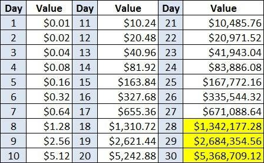

Algorithmic trading has emerged as a dominant force within financial markets, leveraging computational algorithms to execute trading strategies at speeds and efficiencies unmatched by human traders. As the landscape of trading evolves, investors constantly seek innovative methods to boost their returns. One such method involves integrating dividends into algorithmic trading strategies. Dividends, typically perceived as a traditional form of investment income, hold the potential to significantly enhance the profitability of algorithmic trading under the right conditions.

The periodic nature of dividends presents a unique opportunity for algorithmic traders to incorporate these payouts into their strategic calculations. Many investors are keen to understand whether dividends can contribute to substantial wealth accumulation when used in conjunction with sophisticated algorithmic trading models. By understanding the mechanics of dividends and their place in the vast array of financial instruments, traders can potentially develop more nuanced and effective trading algorithms.



This article aims to explore the multifaceted potential of dividends in augmenting algorithmic trading strategies. Through a careful examination of the role dividends play, we will address pertinent questions, such as: Can dividends serve as a reliable mechanism to improve trading returns? How can dividends be synchronized with automated trading systems to achieve optimal financial outcomes? This introductory section sets the stage for a comprehensive analysis of integrating dividends into algorithmic trading, seeking to provide readers with valuable insights into optimizing their trading strategies for enhanced returns.

## Table of Contents

## Understanding Dividends in the Context of Algo Trading

Dividends are periodic payments made by a corporation to its shareholders, typically derived from the company's profits. These distributions are usually made on a quarterly basis, although some companies may offer dividends annually or semi-annually. Known for their ability to generate a steady income stream, dividends are favored by investors seeking both income and growth.

In stock trading, dividends play a critical role in enhancing total returns, which comprise capital gains and dividend payouts. The equation for total returns can be represented as:

$$
\text{Total Return} = \frac{(\text{Capital Gain} + \text{Dividends})}{\text{Initial Investment}} \times 100\%
$$

Where capital gain is the increase in the value of the stock over a period. Dividends contribute to the overall profitability, thereby attracting investors who value immediate income alongside the potential for long-term capital appreciation.

For algorithmic traders, dividends can provide an additional dimension to trading strategies. In [algorithmic trading](/wiki/algorithmic-trading), predefined rules and models are used to execute trades automatically at high speeds, often across multiple markets. Incorporating dividends into these strategies can optimize financial outcomes by adding an additional layer of income to the profit equation, thus enhancing the overall return on investment.

Algorithmic traders can benefit from dividends in various ways:

1. **Dividend Capture Strategy**: This approach involves buying stocks just before the ex-dividend date—the cutoff day on which an investor must own shares to receive the dividend. The stock is then sold immediately after the ex-dividend date, allowing the trader to capture the dividend payout quickly. This strategy can be coded into algorithms to exploit the dividend payout while minimizing the risk of holding the stock long term.

2. **Portfolio Optimization**: By factoring dividends into the selection criteria for stocks, traders can develop algorithms that prioritize assets offering both high potential capital gains and attractive dividend yields. This dual focus can lead to a more balanced and potentially more robust portfolio that benefits from multiple revenue streams.

3. **Risk Management**: Dividends can act as a buffer against market volatility, providing regular returns even when market conditions are unfavorable. This consistent income stream can be programmed into algorithmic systems to maintain a steady cash flow and reduce the overall risk profile.

In summary, dividends, while often associated with traditional stock trading, hold significant value for algorithmic trading strategies. By harnessing dividends, traders can design sophisticated algorithms that help in achieving stable and enhanced financial performance.

## Incorporating Dividends into Algorithmic Trading Strategies

Algorithmic trading strategies can be enhanced by the integration of dividend-capturing methods, which focus on securing dividends from stocks while optimizing return on investment. One common approach includes timing the purchase and sale of stocks around key dates such as the ex-dividend and payment dates. By purchasing stocks just before the ex-dividend date and selling shortly thereafter, traders can capture the dividend while minimizing their exposure to the stock price [volatility](/wiki/volatility-trading-strategies). This approach is often referred to as the "dividend capture strategy."

**Historical Data and Backtesting**

A crucial element in developing dividend-focused algorithmic trading strategies is the use of historical data and [backtesting](/wiki/backtesting). Analyzing past performance allows traders or quants to identify patterns and validate their strategies before applying them in real markets. Historical data provides insights into the behavior of stocks around dividend dates, including price drop at ex-dividend points and typical recovery patterns post-dividend distribution.

For instance, a Python-based backtesting framework can be employed to simulate trades based on historical data. A sample Python script might look like this:

```python
import pandas as pd

def dividend_capture_strategy(dataframe, dividend_col='dividend', price_col='price', ex_div_date='ex_div_date'):
    trades = []
    for index, row in dataframe.iterrows():
        if row[dividend_col] > 0:
            buy_price = dataframe.loc[index, price_col]  # Buy before the ex-dividend date
            sell_price = dataframe.loc[min(index+1, len(dataframe)-1), price_col]  # Sell on or after the ex-dividend date
            dividend = row[dividend_col]
            trades.append(sell_price + dividend - buy_price)  # Net profit for the trade

    return sum(trades)

# Example usage with dummy data
data = {
    'date': pd.date_range(start='2023-01-01', periods=5, freq='D'),
    'price': [100, 98, 95, 99, 102],
    'dividend': [0, 0, 1, 0, 0]
}
df = pd.DataFrame(data)
profit = dividend_capture_strategy(df)
print(f"Total profit from dividend capture strategy: {profit}")
```

*Metrics and Indicators*

Several metrics and indicators can help optimize dividend-focused strategies within an algorithmic trading framework:

1. **Dividend Yield**: The ratio of a company's annual dividend compared to its stock price, a critical metric for identifying attractive dividend-paying stocks. $\text{Dividend Yield} = \frac{\text{Annual Dividend per Share}}{\text{Price per Share}}$.

2. **Price Volatility**: Understanding stock price volatility around dividend dates helps traders manage risk. Stocks with low volatility may be preferred for dividend capture strategies to protect against sharp price swings.

3. **Payout Ratio**: This measures the proportion of earnings paid out as dividends; a lower payout ratio can indicate a sustainable dividend policy.

4. **Price-to-Earnings (P/E) Ratio**: Combining fundamental analysis metrics such as the P/E ratio with dividend strategies ensures the selection of financially stable companies.

5. **Ex-Dividend Date Factor**: Analyze stock price movement trends around the ex-dividend date, facilitating decisions on the optimal time to buy and sell.

By employing sophisticated algorithms to assess these indicators, traders can develop robust strategies that enhance their ability to capture dividends effectively while optimizing returns. Moreover, continuous monitoring and adjustment based on prevailing market conditions ensure the long-term viability of such strategies.

## Potential Benefits and Considerations

Incorporating dividends into algorithmic trading strategies offers various financial benefits that can enhance the overall performance of a trading portfolio. Dividends, being regular cash payments made by companies to their shareholders, contribute to a stable cash flow, which can complement any capital gains obtained through trading activities.

One primary advantage of integrating dividends into algorithmic trading strategies is the potential for enhanced returns. Dividends can bolster the overall return profile of a strategy by providing an additional income stream. This can be particularly advantageous in slow or bear markets, where capital gains may be limited but dividend payments remain relatively stable. By capturing dividends, traders can effectively increase their yield on investments, leading to greater compounded growth over time.

Dividends also serve as an effective risk management tool. In volatile market conditions, dividend income can act as a buffer, offering a measure of financial stability and mitigating potential losses from adverse price movements. This can be quantified by looking at the dividend yield, which is calculated as:

$$
\text{Dividend Yield} = \frac{\text{Annual Dividends per Share}}{\text{Price per Share}}
$$

By selecting stocks with a history of reliable dividend payments, algorithmic strategies can be designed to balance potential capital losses with the steady income from dividends.

In terms of considerations, algorithmic traders need to be mindful of potential pitfalls. One such issue is overfitting, where a model is excessively complex and tailored to historical data, resulting in poor performance in real-world application. This is particularly relevant in dividend-focused strategies where historical dividend patterns may not guarantee future payments. Therefore, robust backtesting processes should be employed to ensure strategies are not overly reliant on past data patterns that may no longer be applicable.

Additionally, market changes and economic shifts can affect dividend policies of companies. Events such as mergers, acquisitions, or economic downturns may lead to dividend cuts or suspensions, impacting the reliability of dividend income as a buffer. Algorithmic strategies need to be adaptive, incorporating real-time data and flexible enough to adjust to changes in dividend policies.

In summary, while dividends can play a significant role in boosting the profitability and stability of algorithmic trading strategies, traders must remain vigilant against overfitting and responsive to market dynamics. A well-rounded approach that incorporates dividends alongside other trading signals and factors is likely to yield the best results.

## Case Studies and Real-World Applications

Algorithmic trading strategies that incorporate dividends have gained considerable attention for their potential to enhance returns. Through case studies and real-world examples, it is possible to understand how dividends have been effectively utilized to achieve significant gains in automated trading systems.

One notable case study involves a [quantitative trading](/wiki/quantitative-trading) firm that developed a strategy specifically designed to capture dividends while minimizing market risk. This firm implemented a "Dividend Capture" strategy, which focuses on purchasing stocks just before the ex-dividend date and selling them shortly after, thus capitalizing on the dividend payout while maintaining a neutral market position. The strategy employed advanced algorithms to identify suitable stocks based on several factors, including dividend yield, historical price stability, and [liquidity](/wiki/liquidity-risk-premium). 

To ensure efficacy, the firm utilized backtesting on historical data spanning over a decade, assessing both the dividend payout patterns and associated market reactions. The backtesting revealed a consistent alpha generation, outperforming traditional buy-and-hold strategies. This was mainly due to the algorithm's precision in timing the trades, minimizing the price drops that often occur after the ex-dividend date. 

Another successful instance is the integration of dividends in a sector rotation strategy. A [hedge fund](/wiki/hedge-fund-trading-strategies) incorporated dividends while transitioning investments amongst sectors based on economic cycles. This approach involved leveraging [machine learning](/wiki/machine-learning) algorithms to predict sector performance and the corresponding changes in dividend payments. The fund discovered that including dividends in their algorithm provided an additional layer of income, which was particularly beneficial during periods of low capital gains. 

The outcomes from these case studies highlight several lessons:

1. **Risk Mitigation**: Dividends can serve as a regular income stream, reducing dependency on capital gains and providing a buffer against market volatility.

2. **Data Requirements**: Successful integration of dividends in algorithmic strategies requires comprehensive historical dividend data and insights into ex-dividend trading patterns.

3. **Adaptability**: Market conditions and dividend policies can shift, necessitating dynamic algorithms that can adapt to these changes.

The experiences from these real-world applications convey that dividends can indeed play a pivotal role in enhancing the profitability and robustness of algorithmic trading strategies. However, it is important to remember that dividends should complement a well-rounded strategy rather than act as a standalone wealth generator in algorithmic trading.

## Conclusion: Can Dividends Make You Rich in Algo Trading?

Algorithmic trading has revolutionized the financial markets by enabling the automation of trading strategies, offering the potential for significant wealth accumulation. One aspect that often piques the interest of investors is whether dividends, typically viewed as a modest but steady income source, can amplify the profitability of algorithmic trading strategies and ultimately lead to financial success.

Dividends represent a portion of a company's earnings distributed to shareholders and have traditionally been appreciated for their role in providing consistent returns over time. In the context of algorithmic trading, dividends can be a crucial component, offering a reliable income stream that can be systematically captured and optimized within a trading strategy. This integration can enhance portfolio diversification and stability, particularly in volatile market environments.

The incorporation of dividends into algorithmic strategies demands a comprehensive approach that includes the utilization of historical data and rigorous backtesting. By analyzing past dividend data, algorithm developers can craft strategies that effectively time dividend captures or build portfolios that optimize for overall revenue, blending capital gains and dividend income. Utilizing metrics such as dividend yield and payout ratio within algorithms can guide the decision-making process, ensuring that trades align with both financial goals and market conditions.

However, it’s important to recognize that while dividends can enhance trading returns and provide a buffer against volatility, they are not a panacea for wealth accumulation on their own. The complexity of financial markets means that relying solely on dividends might not suffice for substantial wealth creation. Algorithms must account for various market dynamics, such as fluctuations in dividend policies or macroeconomic environments that impact equity prices and dividend sustainability.

To answer whether dividends alone can make one rich through algorithmic trading, it is evident that they should be viewed as a complementary component rather than a standalone strategy. As part of a diversified approach, dividends can significantly bolster an algorithm's robustness and offer incremental gains that contribute to long-term financial success. Investors and algorithm developers are encouraged to integrate dividends with other trading strategies, ensuring a holistic approach that maximizes potential returns while managing associated risks. Thus, while dividends can undoubtedly enhance the profitability of algo trading strategies, their true value lies within a broader, well-rounded trading framework.

## FAQs

### FAQs

#### What are dividends in algorithmic trading?

Dividends are distributions of a portion of a company's earnings to its shareholders, usually in the form of cash payments or additional shares. In the context of algorithmic trading, dividends can be used as a quantitative [factor](/wiki/factor-investing) to optimize trading strategies. An algorithm might take into account the dividend yield, dividend growth rate, or ex-dividend date to make buy or sell decisions.

#### What are some tips for beginners looking to incorporate dividends into their algorithmic strategies?

1. **Start Small:** Initially, focus on simple strategies such as dividend capture, where the aim is to buy stocks before the ex-dividend date and sell shortly after to cover transaction costs and potentially gain a small profit.

2. **Understand Key Dates:** Get familiar with dividend-related dates like the ex-dividend date, record date, and payment date, as these can significantly affect stock prices.

3. **Use Reliable Data Sources:** Ensure you are using accurate and updated data on dividends, as errors could lead to incorrect decision-making.

4. **Diversification:** Consider diversifying across different sectors and geographies to manage risk effectively.

#### What resources and tools are available for backtesting and analyzing dividend-based trading strategies?

1. **Programming Languages:**
   - **Python** is highly recommended due to its strong ecosystem of libraries like `pandas` for data manipulation, `numpy` for numerical calculations, and `matplotlib` or `seaborn` for visualizations.

2. **Backtesting Libraries:**
   - **Backtrader:** A Python framework for backtesting and trading that supports strategies involving dividends.
   - **Zipline:** Another Python library developed by Quantopian for backtesting trading algorithms.

3. **Financial APIs:**
   - **Alpha Vantage** and **IEX Cloud** provide APIs for fetching historical dividend data, which can be integrated into your backtesting framework.

4. **Platforms:**
   - **QuantConnect** and **AlgoTrader** offer cloud-based environments where you can develop, backtest, and deploy trading strategies, including those focused on dividends.

5. **Excel/Rockspring:** For those preferring non-coding methods, Excel combined with add-ins like Rocksring’s Market Data allows for relatively straightforward analysis and backtesting of dividend strategies without in-depth programming knowledge.

#### Can dividends alone create a profitable strategy in algorithmic trading?

While dividends can enhance profitability and reduce risk, relying solely on dividends for profitability may not yield significant returns. Dividends should be part of a multi-faceted strategy that also considers other factors like market trends, financial metrics, and technical indicators. 

Incorporating a balanced approach that includes dividends among various parameters can lead to more robust and resilient trading strategies.

## References & Further Reading

[1]: ["Advances in Financial Machine Learning"](https://www.amazon.com/Advances-Financial-Machine-Learning-Marcos/dp/1119482089) by Marcos Lopez de Prado

[2]: ["Machine Learning for Algorithmic Trading"](https://github.com/PacktPublishing/Machine-Learning-for-Algorithmic-Trading-Second-Edition) by Stefan Jansen

[3]: ["Quantitative Trading: How to Build Your Own Algorithmic Trading Business"](https://www.amazon.com/Quantitative-Trading-Build-Algorithmic-Business/dp/1119800064) by Ernest P. Chan

[4]: ["Evidence-Based Technical Analysis: Applying the Scientific Method and Statistical Inference to Trading Signals"](https://www.amazon.com/Evidence-Based-Technical-Analysis-Scientific-Statistical/dp/0470008741) by David Aronson

[5]: Docker, M. (2020). ["Algorithmic Trading and DMA: An Introduction to Direct Access Trading Strategies."](https://www.amazon.com/Algorithmic-Trading-DMA-introduction-strategies/dp/0956399207) Financial Intelligence Series.