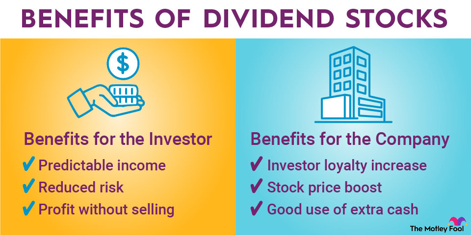

## Table of Contents

## What are dividend stocks?

Dividend stocks are shares of companies that regularly pay out a portion of their earnings to shareholders. These payments, called dividends, are usually given out every three months, but some companies might pay them yearly or at different times. People like dividend stocks because they can provide a steady income, kind of like getting paid just for owning the stock.

When you own dividend stocks, you get money even if the stock's price doesn't go up. This can be really helpful, especially for people who need regular income, like retirees. But, it's important to know that not all companies pay dividends. Some, especially newer or fast-growing companies, might choose to use their earnings to grow the business instead of paying dividends. So, when picking dividend stocks, it's good to look at how stable the company is and how long they've been paying dividends.

## How do dividends work?

Dividends are payments that companies give to their shareholders from their profits. When a company makes money, they can choose to share some of it with the people who own their stock. This payment usually happens every few months, like every three months, but sometimes it can be yearly or at other times. The amount you get depends on how many shares you own. If you own more shares, you get more money.

To get a dividend, you need to own the stock before a certain date, called the "ex-dividend date." If you buy the stock on or after this date, you won't get the next dividend payment. Once the company decides to pay a dividend, they announce it and set a date for when they'll actually send the money to shareholders. This money can be sent as a check, or it can be put directly into your bank account or added to your investment account. Dividends are a way for companies to reward their shareholders and can be a nice extra income for people who own the stock.

## Can dividend stocks make you rich?

Dividend stocks can help you get richer, but they won't make you rich overnight. If you keep your money in dividend stocks for a long time, the regular payments can add up. You can use these payments to buy more stocks, which means you'll get even more dividends later. This is called "reinvesting," and it can make your money grow faster over time.

But, getting rich from dividend stocks takes patience and smart choices. You need to pick companies that are stable and keep paying good dividends. Also, the stock's price can go up, which means your investment can grow in value too. So, while dividend stocks can help build your wealth slowly, they're just one part of a bigger plan to get rich.

## What is the average return from dividend stocks?

The average return from dividend stocks can change a lot depending on things like the company, the economy, and how long you keep the stock. On average, people might expect to get about 2% to 4% a year just from dividends. This means if you have $100 in a stock, you might get $2 to $4 every year just for owning it. But, this is just the dividend part. If the stock's price goes up too, you could make even more money.

When you add in the stock price going up, the total return from dividend stocks can be bigger. Over many years, investors might see total returns of around 7% to 10% a year from good dividend stocks. This includes both the dividends and the stock price going up. But, remember, these are just average numbers. Some years might be better, and some might be worse. So, it's good to think about dividend stocks as a way to grow your money over a long time, not to get rich quick.

## How often are dividends paid?

Dividends are usually paid every three months, which means four times a year. This is called a quarterly dividend. Some companies might choose to pay dividends once a year, which is called an annual dividend. There are also companies that pay dividends every month, but this is less common.

The timing of dividend payments can depend on the company's rules and how they choose to share their profits. Most companies have a set schedule for when they pay dividends, so shareholders know when to expect their money. It's good to check a company's dividend history and schedule if you're thinking about buying their stock for the dividends.

## What is a dividend yield and how is it calculated?

A dividend yield tells you how much money you get back each year from dividends for every dollar you put into a stock. It's like a way to see how much income you're getting from your investment. To find the dividend yield, you take the yearly dividend amount and divide it by the stock's current price. Then, you multiply that number by 100 to turn it into a percentage. So, if a stock pays $2 in dividends every year and its price is $50, the dividend yield would be (2 / 50) * 100 = 4%.

The dividend yield is helpful because it gives you a quick way to compare how much income different stocks might give you. But remember, a high dividend yield isn't always the best thing. Sometimes, a high yield can mean the stock's price has gone down a lot, which might be a sign that the company is having problems. So, it's good to look at other things too, like how stable the company is and if they've been paying dividends for a long time.

## What are the risks associated with investing in dividend stocks?

Investing in dividend stocks can be a good way to get regular income, but it also comes with some risks. One big risk is that the company might cut or stop paying dividends. This can happen if the company starts to do badly or if they need to use their money for other things, like growing the business. When a company cuts its dividend, the stock price often goes down too, which means you could lose money.

Another risk is that dividend stocks might not grow as fast as other stocks. Companies that pay big dividends often don't have as much money left to put back into the business, so they might not grow as quickly. This means that while you're getting regular income from dividends, the value of your investment might not go up as much over time. It's important to think about both the income you get from dividends and how much the stock price might grow when you're choosing where to invest your money.

## How can reinvesting dividends accelerate wealth growth?

Reinvesting dividends means taking the money you get from dividends and using it to buy more shares of the same stock or other investments. When you do this, your money can grow faster over time. It's like planting a seed and then using the fruit it grows to plant more seeds. Each new share you buy with your dividends can earn more dividends, which you can then use to buy even more shares. This cycle can help your investment grow much bigger than if you just took the dividend money and spent it.

Over many years, this reinvestment can make a big difference. Imagine you start with a small amount of money in a stock that pays dividends. If you keep reinvesting those dividends, the number of shares you own keeps going up. As the number of shares grows, so does the amount of dividends you get each time. This can lead to your wealth growing at a much faster rate than if you just kept the same number of shares and took the dividends as cash. It's all about letting your money work harder for you over time.

## What are some strategies for selecting high-performing dividend stocks?

When [picking](/wiki/asset-class-picking) high-performing dividend stocks, it's a good idea to look at a company's history of paying dividends. Some companies have been paying dividends for a long time and even raise them every year. These companies are often called "Dividend Aristocrats" or "Dividend Kings." By choosing stocks from these kinds of companies, you can feel more sure that they will keep paying you dividends in the future. Also, check the company's payout ratio, which is how much of their earnings they pay out as dividends. A payout ratio that's too high might mean the company can't keep paying those dividends if things get tough.

Another thing to think about is the company's overall health and growth. Look at their financial reports to see if they are making money and growing. A company that's doing well and growing is more likely to keep paying good dividends. Also, think about the industry the company is in. Some industries, like utilities or consumer goods, are more stable and more likely to pay steady dividends. Finally, consider the stock's dividend yield, but don't just go for the highest one. A very high yield can sometimes be a warning sign that the stock's price has dropped a lot, which might mean the company is having problems.

## How do tax implications affect the returns from dividend stocks?

When you get dividends from stocks, you have to pay taxes on that money. In the United States, there are two kinds of dividends: qualified and non-qualified. Qualified dividends are taxed at a lower rate, kind of like the tax you pay on long-term capital gains. This can be 0%, 15%, or 20%, depending on your income. Non-qualified dividends are taxed at your regular income tax rate, which can be higher. So, knowing which kind of dividends you're getting can help you figure out how much you'll keep after taxes.

The taxes you pay can make a big difference in how much money you actually get to keep from your dividends. If you're in a high tax bracket, the taxes might take a big chunk out of your dividend income. This means you might want to think about tax-advantaged accounts, like an IRA or a 401(k), to hold your dividend stocks. In these accounts, you might pay less in taxes or not have to pay taxes on the dividends until you take the money out. So, understanding the tax rules can help you plan better and keep more of your dividend money.

## What is the role of dividend stocks in a diversified investment portfolio?

Dividend stocks can play a big part in making your investment portfolio more balanced. They can give you regular income, which is money you can use right away or put back into more investments. This can help you not depend too much on the stock's price going up to make money. When the market goes up and down, dividend stocks can be a bit more stable because you still get money from dividends even if the stock's price drops a little. This can make your overall investments less risky and help you sleep better at night knowing you have some money coming in no matter what.

Having dividend stocks in your portfolio also means you're spreading your money across different kinds of investments. This is important because it can protect you if one part of the market does badly. For example, if tech stocks go down, your dividend stocks from other industries might still be doing okay. Over time, the regular dividends can add up and grow your money, especially if you use them to buy more stocks. So, dividend stocks can help you have a mix of growth and income in your investments, making your portfolio stronger and more likely to do well in the long run.

## How have dividend stocks performed historically compared to other investment options?

Historically, dividend stocks have done pretty well compared to other investments. Over many years, they have often given investors a good mix of income and growth. Studies show that from 1973 to 2022, dividend stocks in the S&P 500 did better than stocks that didn't pay dividends. Not only did they give regular money to shareholders, but the stocks also grew in value over time. This means that people who invested in dividend stocks got to enjoy both the dividends and an increase in the stock's price.

When you compare dividend stocks to other options like bonds or [growth stocks](/wiki/growth-stocks), they have their own advantages. Bonds can give you steady income too, but usually, the income from dividend stocks is higher. Growth stocks might grow faster in value, but they don't pay dividends, so you have to wait for the stock price to go up to make money. During tough times in the market, dividend stocks can be more stable because they keep paying dividends, which helps cushion the fall if stock prices drop. So, while dividend stocks might not make you rich overnight, they can be a solid choice for building wealth over time.

## What is the understanding of dividends in the context of algo trading?

Dividends are periodic payments made by a corporation to its shareholders, typically derived from the company's profits. These distributions are usually made on a quarterly basis, although some companies may offer dividends annually or semi-annually. Known for their ability to generate a steady income stream, dividends are favored by investors seeking both income and growth.

In stock trading, dividends play a critical role in enhancing total returns, which comprise capital gains and dividend payouts. The equation for total returns can be represented as:

$$
\text{Total Return} = \frac{(\text{Capital Gain} + \text{Dividends})}{\text{Initial Investment}} \times 100\%
$$

Where capital gain is the increase in the value of the stock over a period. Dividends contribute to the overall profitability, thereby attracting investors who value immediate income alongside the potential for long-term capital appreciation.

For algorithmic traders, dividends can provide an additional dimension to trading strategies. In [algorithmic trading](/wiki/algorithmic-trading), predefined rules and models are used to execute trades automatically at high speeds, often across multiple markets. Incorporating dividends into these strategies can optimize financial outcomes by adding an additional layer of income to the profit equation, thus enhancing the overall return on investment.

Algorithmic traders can benefit from dividends in various ways:

1. **Dividend Capture Strategy**: This approach involves buying stocks just before the ex-dividend date—the cutoff day on which an investor must own shares to receive the dividend. The stock is then sold immediately after the ex-dividend date, allowing the trader to capture the dividend payout quickly. This strategy can be coded into algorithms to exploit the dividend payout while minimizing the risk of holding the stock long term.

2. **Portfolio Optimization**: By factoring dividends into the selection criteria for stocks, traders can develop algorithms that prioritize assets offering both high potential capital gains and attractive dividend yields. This dual focus can lead to a more balanced and potentially more robust portfolio that benefits from multiple revenue streams.

3. **Risk Management**: Dividends can act as a buffer against market volatility, providing regular returns even when market conditions are unfavorable. This consistent income stream can be programmed into algorithmic systems to maintain a steady cash flow and reduce the overall risk profile.

In summary, dividends, while often associated with traditional stock trading, hold significant value for algorithmic trading strategies. By harnessing dividends, traders can design sophisticated algorithms that help in achieving stable and enhanced financial performance.

## What are the potential benefits and considerations?

Incorporating dividends into algorithmic trading strategies offers various financial benefits that can enhance the overall performance of a trading portfolio. Dividends, being regular cash payments made by companies to their shareholders, contribute to a stable cash flow, which can complement any capital gains obtained through trading activities.

One primary advantage of integrating dividends into algorithmic trading strategies is the potential for enhanced returns. Dividends can bolster the overall return profile of a strategy by providing an additional income stream. This can be particularly advantageous in slow or bear markets, where capital gains may be limited but dividend payments remain relatively stable. By capturing dividends, traders can effectively increase their yield on investments, leading to greater compounded growth over time.

Dividends also serve as an effective risk management tool. In volatile market conditions, dividend income can act as a buffer, offering a measure of financial stability and mitigating potential losses from adverse price movements. This can be quantified by looking at the dividend yield, which is calculated as:

$$
\text{Dividend Yield} = \frac{\text{Annual Dividends per Share}}{\text{Price per Share}}
$$

By selecting stocks with a history of reliable dividend payments, algorithmic strategies can be designed to balance potential capital losses with the steady income from dividends.

In terms of considerations, algorithmic traders need to be mindful of potential pitfalls. One such issue is overfitting, where a model is excessively complex and tailored to historical data, resulting in poor performance in real-world application. This is particularly relevant in dividend-focused strategies where historical dividend patterns may not guarantee future payments. Therefore, robust [backtesting](/wiki/backtesting) processes should be employed to ensure strategies are not overly reliant on past data patterns that may no longer be applicable.

Additionally, market changes and economic shifts can affect dividend policies of companies. Events such as mergers, acquisitions, or economic downturns may lead to dividend cuts or suspensions, impacting the reliability of dividend income as a buffer. Algorithmic strategies need to be adaptive, incorporating real-time data and flexible enough to adjust to changes in dividend policies.

In summary, while dividends can play a significant role in boosting the profitability and stability of algorithmic trading strategies, traders must remain vigilant against overfitting and responsive to market dynamics. A well-rounded approach that incorporates dividends alongside other trading signals and factors is likely to yield the best results.

## References & Further Reading

[1]: ["Advances in Financial Machine Learning"](https://www.amazon.com/Advances-Financial-Machine-Learning-Marcos/dp/1119482089) by Marcos Lopez de Prado

[2]: ["Machine Learning for Algorithmic Trading"](https://github.com/PacktPublishing/Machine-Learning-for-Algorithmic-Trading-Second-Edition) by Stefan Jansen

[3]: ["Quantitative Trading: How to Build Your Own Algorithmic Trading Business"](https://www.amazon.com/Quantitative-Trading-Build-Algorithmic-Business/dp/1119800064) by Ernest P. Chan

[4]: ["Evidence-Based Technical Analysis: Applying the Scientific Method and Statistical Inference to Trading Signals"](https://www.amazon.com/Evidence-Based-Technical-Analysis-Scientific-Statistical/dp/0470008741) by David Aronson

[5]: Docker, M. (2020). ["Algorithmic Trading and DMA: An Introduction to Direct Access Trading Strategies."](https://www.amazon.com/Algorithmic-Trading-DMA-introduction-strategies/dp/0956399207) Financial Intelligence Series.