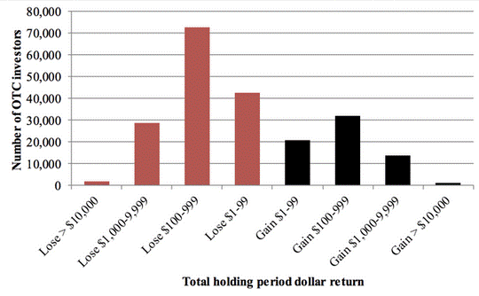

Penny stocks, defined as stocks trading for less than $5 per share, have long captivated the attention of retail investors due to their potential for high returns. These equities are known for their volatility and are often viewed as a double-edged sword. The allure of penny stocks lies in their ability to dramatically fluctuate in price, offering substantial profit opportunities. However, this potential for immense reward is shadowed by considerable risk, including liquidity issues and heightened susceptibility to market manipulation.

Algorithmic trading, or algo trading, represents a fusion of financial acumen and technological innovation, involving the use of computer algorithms to execute trades based on predefined criteria. This technique provides significant advantages, such as enhancing trade speed and accuracy, while mitigating the emotional component often associated with trading decisions. Applying algorithmic trading to penny stocks presents a unique opportunity to navigate the volatile nature of these investments with greater efficiency.



This article explores the intricate dynamics involving the integration of algorithmic trading in penny stock markets. It begins by defining penny stocks and elaborating on their distinctive features and market environment, including exchanges and over-the-counter (OTC) trades. Following this, the mechanics and advantages of algorithmic trading will be dissected, with a focus on how these systems can potentially augment the trading of penny stocks. Furthermore, the article will highlight the potential benefits derived from the union of algorithms and penny stocks, and scrutinize the inherent challenges and risks. Finally, historical performances of successful penny stocks will be analyzed to assess their potential in wealth generation, emphasizing strategy and risk management. Practical tips for implementing algorithms in penny stock trading, alongside a summary of the essential takeaways, will conclude the discussion, encouraging further inquiry by interested traders.

## Table of Contents

## Understanding Penny Stocks

Penny stocks are often defined as shares of small public companies trading at a low price per share, usually under $5, as designated by the U.S. Securities and Exchange Commission (SEC). These stocks are characterized by their high volatility, low liquidity, and limited trading [volume](/wiki/volume-trading-strategy), which contributes to their potential for dramatic price fluctuation. While the term "penny stock" often relates to low-price stocks on major exchanges, it is most associated with stocks traded over-the-counter (OTC), such as on the OTC Bulletin Board or OTC Markets Group platforms where these securities are not listed on major exchanges like the NYSE or NASDAQ.

The allure of penny stocks lies in their potential for significant returns. Due to their low price, even small movements in their market value can equate to substantial percentage gains. For example, if a penny stock priced at $0.50 per share increases to $1.00, this represents a 100% return on investment. This transformative potential attracts investors seeking to capitalize on rapid price movements.

However, the potential for high returns comes with significant risks. Penny stocks are notoriously volatile and can experience dramatic fluctuations in price, leading to significant financial losses. The low liquidity associated with these stocks often means that there may be a shortage of buyers when an investor decides to sell, which can result in delayed sales at undesirable prices. Moreover, due to their listing on less regulated OTC markets, penny stocks are more susceptible to manipulation and fraudulent schemes, creating an environment where transparency is often lacking.

While some penny stocks are listed on established exchanges, the majority trade OTC. These markets are less regulated and often lack the rigorous reporting standards required by major exchanges. As a result, investors may face challenges in obtaining accurate and comprehensive information about companies issuing penny stocks, compounding the uncertainty and risks involved.

In summary, penny stocks present a paradox of high-risk, high-reward potential. They can offer impressive returns, but their [volatility](/wiki/volatility-trading-strategies), low [liquidity](/wiki/liquidity-risk-premium), and susceptibility to market manipulation present formidable challenges for investors, necessitating thorough research and cautious trading strategies.

## What is Algorithmic Trading?

Algorithmic trading refers to the use of computer algorithms to automate and enhance the process of trading financial assets. This technology-driven approach employs mathematical models, statistical analysis, and pre-defined rules to execute trades at optimal speeds and prices, minimizing human intervention. The primary benefits of [algorithmic trading](/wiki/algorithmic-trading) include increased precision, the ability to process numerous data points rapidly, reduced emotional bias, and the capability to backtest strategies against historical data.

When applied to the trading of penny stocks—stocks that typically trade at low prices and have small market capitalizations—algorithms offer several advantages. Penny stocks are known for their high volatility and liquidity challenges, making them difficult to trade manually. Algorithms can analyze large volumes of data swiftly to identify potential opportunities in these volatile environments. For instance, an algorithm can constantly monitor price changes, adjust trading strategies, and execute buy or sell orders based on real-time data analysis, capturing opportunities that manual traders might miss. Moreover, algorithms can implement sophisticated strategies such as statistical [arbitrage](/wiki/arbitrage) or mean reversion, which are particularly useful in navigating volatile penny stock markets.

Popular strategies used in algorithmic trading include:

1. **Trend Following:** This strategy involves identifying and exploiting market trends. For example, a trend-following algorithm might initiate a buy order when a stock's price rises above its moving average, and sell when it falls below.

    ```python
    def trend_following_strategy(prices, short_window, long_window):
        short_mavg = prices.rolling(window=short_window, min_periods=1).mean()
        long_mavg = prices.rolling(window=long_window, min_periods=1).mean()
        signal = (short_mavg > long_mavg).astype(int)
        return signal.diff()
    ```

2. **Mean Reversion:** This strategy leverages the concept that asset prices tend to return to their mean over time. An algorithm may detect anomalies or deviations from a long-term average and trade accordingly, betting that prices will revert to their historical averages.

3. **Arbitrage:** Algorithms designed for arbitrage exploit price discrepancies of the same stock in different markets or exchanges. This requires high-speed trading to capitalize on the small window when prices diverge before they converge.

4. **Market Making:** This involves placing both buy and sell orders for a stock to capture the spread between the buying and selling price. Algorithms can adjust these orders dynamically based on market conditions.

By deploying these strategies, algorithms can systematically trade penny stocks, potentially improving outcomes through rapid execution and data-driven decision-making. However, it is crucial to account for the unique characteristics and risks associated with penny stocks when designing and implementing algorithmic strategies.

## The Potential Benefits of Using Algorithms with Penny Stocks

Algorithmic trading offers remarkable advantages when applied to penny stocks, primarily due to its efficiency and speed. In financial markets, where milliseconds can significantly impact the outcome of a trade, the ability of algorithms to execute trades swiftly provides a distinct advantage over manual trading methods. Algorithms can process vast amounts of data in real time, analyze that data, and execute orders in a fraction of a second, which is crucial for capitalizing on the rapid price movements typical in penny stocks.

Penny stocks are known for their volatility, characterized by abrupt and significant price changes. Algorithms excel in scanning for trends and patterns within such volatile environments. They employ sophisticated mathematical and statistical models to detect patterns that human traders might overlook. For example, an algorithm could be designed to identify specific moving averages crossovers or breakouts from established patterns, which might indicate a trading opportunity. By continuously monitoring the market and analyzing data, algorithms can provide timely alerts or execute trades automatically when defined conditions are met.

Risk management is a critical component of trading, especially in the unpredictable world of penny stocks. Algorithms can assist with this by implementing predefined risk management rules, such as stop-loss orders and position sizing algorithms. These automated strategies help mitigate potential losses and protect profits by adhering to disciplined trading practices. For instance, algorithms can be programmed to limit the amount of capital allocated to any single trade or to adjust stop-loss levels dynamically based on market volatility.

Moreover, algorithms can diversify trading strategies across multiple penny stocks simultaneously. By spreading risk across a variety of positions, traders can reduce the impact of adverse price movements in any single stock. Algorithms can also adjust these positions automatically based on performance metrics, thus optimizing the risk-to-reward ratio.

Overall, the integration of algorithmic trading strategies in penny stock markets enhances the ability to react swiftly to market changes, analyze complex data efficiently, and manage risks effectively. As technology continues to advance, these algorithms become increasingly sophisticated, offering traders an edge in navigating the challenging landscape of penny stocks.

## Risks and Challenges

Trading penny stocks presents significant risks, compounded by the complexities of algorithmic trading. Although algorithms are designed to scan and execute trades swiftly, the volatile nature of penny stocks features unique challenges. Unlike stocks of established companies, penny stocks often exhibit low liquidity, meaning they are not easily bought and sold without impacting their price. This lack of liquidity can lead to significant price fluctuations, making it challenging for algorithms to accurately assess and respond to market dynamics. Algorithms may struggle to execute trades at expected prices, or they may result in partial fills, where only a portion of an order is executed at the desired price.

Volatility is another critical issue. Penny stocks are notorious for their sharp and unpredictable price movements. While algorithms can be programmed to react to such movements, the rapid swings might not always be predictable or justifiable through historical data, leading to potential losses. Furthermore, algorithms rely heavily on historical data and patterns to predict future movements, which may not be as reliable with penny stocks owing to their erratic behavior.

Market manipulation poses additional challenges. Penny stocks are susceptible to schemes such as "pump and dump," where the hype is artificially created around a stock to inflate its price, only for insiders to sell off their shares at the peak, leaving others with losses. Algorithms, despite being sophisticated, might not discern manipulated data from genuine trends, potentially leading to misguided trading decisions.

Transparency issues further complicate the landscape of penny stock trading. These stocks are often traded on smaller exchanges or over-the-counter (OTC) markets where disclosure requirements are less stringent. Consequently, obtaining reliable information is a significant hurdle, and algorithms depend precisely on the quality and quantity of input data. The lack of comprehensive and timely information can undermine algorithmic effectiveness by introducing uncertainties that are hard to quantify or react to dynamically.

In summary, while algorithmic trading offers potential advantages in terms of speed and efficiency, its application in penny stock trading requires a careful understanding of the intrinsic risks and limitations pertaining to liquidity, volatility, market manipulation, and transparency. To mitigate these challenges, traders must consider integrating more robust risk management protocols and continuously updating their algorithmic models to adapt to the ever-changing penny stock environment.

## Can Penny Stocks Truly Make You Rich?

Penny stocks, typically defined as stocks trading for less than $5 per share, offer both allure and risk to investors. Attractive for their low entry cost and the potential for high returns, some penny stocks have indeed captured significant financial success. A notable historical example is the tech company Apple Inc., which traded as a penny stock in the early 1980s before achieving its current market dominance. Another example includes Ford Motor Company, which fell to the penny stock category during the 2008 financial crisis only to recover and grow.

The potential for wealth creation with penny stocks is, however, countered by significant risks. The chances of finding a successful penny stock are relatively slim due to their inherent volatility and low liquidity. Many penny stocks are tied to small or fledgling companies with unproven business models, making the probability of loss more pronounced. Statistically, most penny stocks do not succeed, and the market is often prone to manipulation and scams.

Risk management and strategic planning are critical in penny stock trading. An effective strategy involves thorough due diligence to understand the business model, financial health, and market conditions of the company. Diversification can also mitigate risk by spreading investment across different securities to reduce exposure to any one stock's failure. Additionally, setting stop-loss orders and adhering to pre-determined [exit](/wiki/exit-strategy) strategies can prevent significant financial loss.

In conclusion, while penny stocks can potentially lead to wealth, the reality is that they require an astute approach to risk management and a disciplined investment strategy. Investors should be prepared to perform substantial research and adopt a cautious stance to improve their chances of success in the penny stock market.

## Tips for Trading Penny Stocks with Algorithms

To effectively trade penny stocks using algorithms, traders need to adopt a strategic approach that leverages technology and continuous improvement. Here are several actionable tips for integrating algorithms into penny stock trading:

### Tools and Platforms for Algorithmic Trading

1. **Algorithmic Trading Software**: Use established platforms such as MetaTrader 5, QuantConnect, or AlgoTrader. These platforms offer the necessary infrastructure to backtest, deploy, and optimize trading algorithms. They provide access to different markets and data feeds, crucial for trading penny stocks.

2. **Programming Languages**: Proficiency in programming languages like Python and R is essential. Python, due to its simplicity and extensive libraries such as pandas for data manipulation, NumPy for numerical operations, and TA-Lib for technical analysis, is particularly useful. An example of scanning for exponential moving averages (EMA) could be:

   ```python
   import pandas as pd
   import talib as ta

   # Assuming `data` is a pandas DataFrame with 'Close' prices
   close_prices = data['Close']
   ema_short = ta.EMA(close_prices, timeperiod=12)
   ema_long = ta.EMA(close_prices, timeperiod=26)
   ```

3. **Brokerage APIs**: Select a brokerage that offers robust API access for algorithmic trading. Brokerages like Interactive Brokers and Alpaca allow for seamless integration with trading algorithms and direct market access (DMA), reducing latency which is critical in trading volatile penny stocks.

### Continuous Learning and Adaptation

1. **Regular Backtesting and Optimization**: Continuously backtest and optimize your trading algorithms on historical data to evaluate performance. Employ methods such as walk-forward optimization to refine strategies based on changing market conditions.

2. **Stay Updated on Market Trends**: Penny stock markets are prone to rapid changes. Regularly review financial news, regulatory updates, and company announcements which may impact the stocks. Incorporating news sentiment analysis can provide additional insights.

3. **Machine Learning and Advanced Analytics**: Incorporate machine learning models to enhance pattern recognition and prediction capabilities. Tools like Scikit-learn in Python can be used to explore supervised learning strategies.

   ```python
   from sklearn.ensemble import RandomForestClassifier

   # Dummy variables and model for illustration
   features = data[['feature1', 'feature2']]
   target = data['target']
   model = RandomForestClassifier()
   model.fit(features, target)
   ```

4. **Risk Management Frameworks**: Adopt robust risk management techniques. Algorithms should include stop-loss mechanisms, position sizing, and volatility filters. This ensures that the exposure to highly volatile penny stocks is controlled and within acceptable limits.

5. **Continuous Education**: Engage in webinars, online courses, and forums that focus on algorithmic trading to stay abreast of latest strategies and technological advances. Platforms like Coursera offer courses tailored to algorithmic trading essentials.

By utilizing these tools and strategies, traders can significantly enhance their effectiveness in trading penny stocks algorithmically. Adapting to new technologies and continuously refining methodologies ensures ongoing success in this dynamic sector.

## Conclusion

Trading penny stocks using algorithmic strategies presents both attractive opportunities and significant challenges. The synergy of algorithmic trading with penny stocks lies in the ability to process vast amounts of market data rapidly, potentially identifying patterns and trends that might elude manual traders. This computational advantage can be leveraged to enhance decision-making and optimize entry and exit points, taking advantage of the high volatility often found in penny stocks.

However, while the use of algorithms can bring efficiency and speed, traders must exercise caution. Penny stocks are inherently risky due to factors such as low liquidity, high volatility, and the potential for market manipulation. These characteristics can limit the effectiveness of algorithms, particularly those that are not sufficiently adaptable or sophisticated to handle abrupt market shifts.

Furthermore, the lack of transparency in penny stock markets necessitates that traders implement robust risk management strategies. Traders should be mindful of the limitations posed by algorithmic systems, like their inability to predict unforeseen market events or account for qualitative factors that might influence stock movements.

A strategic approach is essential in trading penny stocks with algorithms. This includes thorough [backtesting](/wiki/backtesting), monitoring for irregular market activities, and the continuous optimization of trading algorithms. Engaging with platforms that facilitate algorithmic trading can also provide valuable tools and resources for traders seeking to refine their strategies.

In summary, the integration of algorithms in penny stock trading holds promise but requires a careful balance of ambition and prudence. Aspiring traders are encouraged to deepen their understanding of both penny stocks and algorithmic trading methodologies. Continuous learning and adaptation are crucial in this dynamic field, and ongoing research can contribute to a deeper understanding that could enhance trading success.

## References & Further Reading

[1]: Harris, L. (2003). ["Trading and Exchanges: Market Microstructure for Practitioners."](https://www.amazon.com/Trading-Exchanges-Market-Microstructure-Practitioners/dp/0195144708) Oxford University Press.

[2]: Lopez de Prado, M. (2018). ["Advances in Financial Machine Learning."](https://www.amazon.com/Advances-Financial-Machine-Learning-Marcos/dp/1119482089) Wiley.

[3]: Chan, E. P. (2009). ["Quantitative Trading: How to Build Your Own Algorithmic Trading Business."](https://github.com/ftvision/quant_trading_echan_book) Wiley.

[4]: Jansen, S. (2020). ["Machine Learning for Algorithmic Trading."](https://github.com/stefan-jansen/machine-learning-for-trading) Packt Publishing.

[5]: Aronson, D. R. (2006). ["Evidence-Based Technical Analysis: Applying the Scientific Method and Statistical Inference to Trading Signals."](https://www.amazon.com/Evidence-Based-Technical-Analysis-Scientific-Statistical/dp/0470008741) Wiley.

[6]: U.S. Securities and Exchange Commission. ["Microcap Stock: A Guide for Investors."](https://www.sec.gov/about/reports-publications/investorpubsmicrocapstock)

[7]: Hull, J. C. (2017). ["Options, Futures, and Other Derivatives."](https://books.google.com/books/about/Options_Futures_and_Other_Derivatives.html?id=yfr0DQAAQBAJ) Pearson.