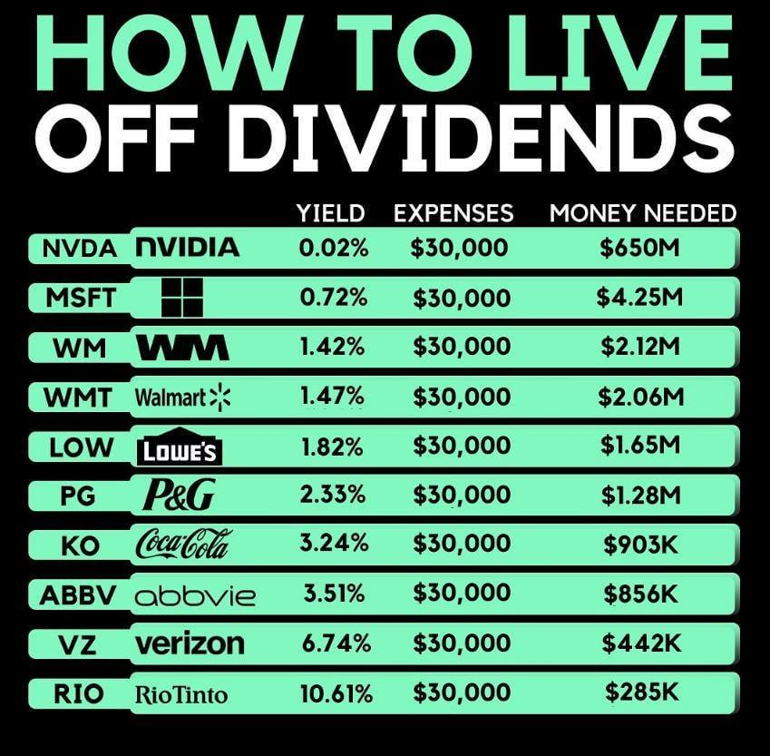

Living off of dividends through algorithmic trading combines financial independence with technological innovation. This approach leverages dividend income, traditionally a strong pillar for passive income, and enhances it with algorithmic trading's precision and efficiency. The rise of technology in finance provides investors with powerful tools to optimize their portfolios and automate trading strategies, earmarking a new era in investment practices.

The feasibility of this dynamic approach rests on understanding both dividend investing and algorithmic trading. Dividends are regular payments from a company's profits to its shareholders. These payments offer a steady income stream, appealing to many investors seeking passive income. On the other hand, algorithmic trading uses computer algorithms to execute trades at high speed and volume, utilizing predefined rules based on quantitative data such as timing, price, or market patterns.



By integrating dividend investing with algorithmic trading, investors can reap substantial benefits. Algorithms can efficiently identify lucrative dividend stocks, optimize buy-and-sell decisions, and automate the reinvestment of dividends to capitalize on compound growth. This synergy opens up opportunities for enhanced returns beyond traditional dividend investing.

However, integrating these two strategies presents unique challenges. It requires a sound understanding of both domains, proficient use of trading platforms, and the ability to develop and adapt algorithmic strategies in response to market changes. This approach demands a blend of financial acumen and technical skills, albeit with significant potential rewards.

Modern tools and strategies, such as backtesting platforms and data analytics software, aid this integration, providing investors with resources to fine-tune their approach. As algorithmic trading becomes more accessible, it also democratizes the potential benefits of living off dividends, inviting a wider cohort of investors to explore this innovative strategy.

In this article, we will delve deeper into the processes and strategies essential for success in this endeavor, providing a comprehensive understanding of how investors can effectively use algorithmic trading to enhance their dividend income.

## Table of Contents

## Understanding Dividends and Algo Trading

Dividends are a form of profit distribution given by corporations to their shareholders, typically paid out on a regular basis. This distribution is often in the form of cash payments but may also come in the form of additional stock. Companies that offer dividends are generally well-established businesses with stable earnings, making them attractive to investors seeking consistent income streams. Particularly for those looking for passive income, dividends can provide a reliable source of funds without the need to sell stocks or other assets.

Algorithmic trading, on the other hand, signifies the use of automated systems to execute trades based on predefined rules and strategies. Algorithms can be programmed to analyze multiple market variables—such as price, timing, or [volume](/wiki/volume-trading-strategy)—and execute orders based on these conditions. This approach enhances the speed and efficiency of trading far beyond the capabilities of manual executions.

The synthesis of dividend investing and [algorithmic trading](/wiki/algorithmic-trading) offers a compelling strategy for enhancing returns and automating income generation. By utilizing algorithms, investors can efficiently identify and trade dividend-paying stocks, optimizing buy and sell decisions based on comprehensive market data and historical performance metrics. For example, an algorithm could be designed to purchase stocks shortly before the ex-dividend date to capture the dividend and sell them afterward.

Moreover, algorithmic systems can facilitate the reinvestment of dividends, enabling investors to benefit from compounding returns without manual involvement. The formula for compound interest, which is pivotal in reinvesting dividends, is given by:

$$
A = P \left(1 + \frac{r}{n}\right)^{nt}
$$

where $A$ is the amount of money accumulated after n years, including interest, $P$ is the principal amount, $r$ is the annual interest rate, $n$ is the number of times that interest is compounded per year, and $t$ is the time in years.

In the context of algorithmic trading, this formula helps illustrate how reinvested dividends can accelerate the growth of an investment over time. Trading algorithms can automatically reinvest dividends into additional shares of the dividend-paying stocks or into other assets that meet the investor's criteria, ensuring consistent growth and optimization of the investment portfolio without direct human intervention.

Additionally, the potential synergistic benefits of marrying dividends with algorithmic trading lie in the enhanced analytical capability. Algorithms can evaluate dividend sustainability by analyzing a company’s financial stability, payout ratios, and historical dividend growth trends. This allows investors to construct a portfolio that is not only diversified but also resilient to fluctuations in the market. For instance, Python libraries such as `Pandas` and `NumPy` can be used to model and analyze financial data, facilitating informed decision-making processes in real-time.

Python Example:
```python
import pandas as pd
import numpy as np

# Simulated data
data = {
    'Company': ['A', 'B', 'C', 'D'],
    'Dividend Yield': [0.04, 0.05, 0.06, 0.03],
    'Payout Ratio': [0.50, 0.60, 0.45, 0.70],
    'Dividend Growth Rate': [0.02, 0.03, 0.04, 0.01]
}

df = pd.DataFrame(data)

# Calculate expected return with dividend yield and growth rate
df['Expected Return'] = df['Dividend Yield'] + df['Dividend Growth Rate']

# Print the dataframe
print(df)
```

This script helps to model and analyze the potential return of dividend-paying companies by calculating the expected return based on their dividend yield and growth rates, assisting investors in making data-driven decisions.

In summary, algorithmic trading can automate and enhance the process of dividend investing, from the selection of stocks based on their financial metrics to the reinvestment of earned dividends. The integration of dividends with algorithmic strategies holds the potential for superior financial outcomes, delivering an efficient and scalable approach to income generation.

## Benefits of Living Off Dividends via Algo Trading

Algorithmic trading has revolutionized how investors approach the stock market, particularly in the context of dividend investing. By employing algorithms, traders can optimize the selection, purchase, and sale of dividend stocks through rigorous [backtesting](/wiki/backtesting). This approach effectively utilizes historical data to formulate strategies that maximize returns while minimizing risk. Backtesting ensures that the strategies are statistically sound before being deployed, providing a robust framework for expected performance.

One of the significant advantages of algorithmic trading is the automation of dividend reinvestment, which facilitates the compounding of returns without manual intervention. When dividends are automatically reinvested, investors leverage the power of compound growth, where returns are generated not just on the initial principal but also on accumulated dividends. This process is exemplified by the formula for compound interest:

$$
A = P \left(1 + \frac{r}{n}\right)^{nt}
$$

where $A$ is the amount of money accumulated after $n$ years, including interest, $P$ is the principal amount (initial investment), $r$ is the annual interest rate, and $n$ is the number of times that interest is compounded per year. Similar principles apply to dividend reinvestment, where dividends serve as the "interest" being reinvested.

Moreover, the scalability of algorithmic trading allows for the management of large and diverse portfolios of dividend-paying stocks. Algorithms can analyze vast datasets across multiple sectors and geographies to identify opportunities that manual analysis might miss. This capacity for large-scale data processing enables investors to build diversified portfolios that can better withstand market [volatility](/wiki/volatility-trading-strategies).

Several case studies highlight the success of living off dividends through algorithmic trading. For instance, investors have utilized [machine learning](/wiki/machine-learning) algorithms to predict dividend stability and optimize their portfolios for maximum yield. By incorporating factors such as earnings consistency, payout ratios, and historical performance, these algorithms can make informed decisions that enhance dividend income.

One notable example is the use of Python-based trading platforms, such as QuantConnect or Zipline, which provide investors with the tools to develop, backtest, and execute trading strategies. These platforms have democratized access to algorithmic trading, allowing investors to automate their dividend strategies and continuously refine them based on real-time market data.

In summary, algorithmic trading offers significant benefits for those looking to live off dividends. It optimizes the stock selection process through backtested strategies, automates reinvestment to harness the power of compounding, and scales efficiently to manage extensive diversified portfolios. With the increasing sophistication of trading algorithms, this method of generating passive income is becoming increasingly viable for investors.

## Creating a Robust Dividend Portfolio for Algo Trading

Selecting high-yield and stable dividend stocks is an essential component for generating reliable income through algorithmic trading. Investors should prioritize companies with a consistent history of dividend payments and a sustainable payout ratio. A payout ratio, defined as the proportion of earnings paid out as dividends to shareholders, is crucial in assessing a company's ability to maintain its dividend over time. Mathematically, this can be expressed as:

$$
\text{Payout Ratio} = \frac{\text{Dividends per Share}}{\text{Earnings per Share}}
$$

Algorithmic models harness historical and real-time data to predict dividend sustainability and growth, thus influencing portfolio choices. These models utilize machine learning algorithms and statistical methods to analyze factors such as profit margins, earnings growth, and industry dynamics that impact a company’s ability to pay dividends. By leveraging these insights, algorithms can optimize the selection of stocks poised for long-term dividend growth.

Risk management plays a vital role in ensuring that algorithmic trading strategies do not over-leverage or concentrate risk in volatile stocks. Diversification is a key strategy, where the portfolio is spread across various sectors and geographies to mitigate unsystematic risk. Additionally, algorithms can implement stop-loss orders and position-sizing techniques to protect against adverse price movements.

Several tools and platforms aid in backtesting and simulation to refine dividend-focused algorithmic strategies. For effective backtesting, platforms like QuantConnect or MetaTrader allow users to simulate trading strategies using historical data, enabling the evaluation of strategy performance under different market conditions. Python libraries such as pandas and NumPy can be utilized for data analysis, while machine learning libraries like TensorFlow and scikit-learn facilitate the development of predictive models.

Here is a simple Python example illustrating how backtesting might be implemented:

```python
import pandas as pd
import numpy as np

# Load historical dividend and stock price data
data = pd.read_csv('dividend_stock_data.csv')

# Example of a simple moving average crossover strategy
data['SMA_50'] = data['Close'].rolling(window=50).mean()
data['SMA_200'] = data['Close'].rolling(window=200).mean()

def backtest_strategy(data):
    cash = 10000  # Starting cash
    holdings = 0

    for index, row in data.iterrows():
        if row['SMA_50'] > row['SMA_200'] and cash > row['Close']:
            holdings += cash // row['Close']  # Buy stocks
            cash %= row['Close']
        elif row['SMA_50'] < row['SMA_200'] and holdings > 0:
            cash += holdings * row['Close']  # Sell stocks
            holdings = 0

    total_value = cash + holdings * data.iloc[-1]['Close']
    return total_value

# Execute the backtest
final_portfolio_value = backtest_strategy(data)
print(f"Final portfolio value: ${final_portfolio_value:.2f}")
```

This code assesses a simple moving average crossover strategy, offering a glimpse into how algorithmic trading can automate decisions based on predefined rules. The consistent refinement of such models, grounded in robust data analysis, is crucial for constructing a resilient dividend portfolio suited to algorithmic trading.

## Challenges in Living Off Dividends Using Algo Trading

Living off dividends using algorithmic trading presents several challenges that investors must navigate to maintain financial stability and growth. Market volatility and [interest rate](/wiki/interest-rate-trading-strategies) fluctuations are primary concerns, as they can significantly affect both dividend payouts and stock prices. For instance, during times of economic uncertainty, companies might reduce or suspend dividends, impacting the expected income from a dividend portfolio. Interest rates also play a crucial role; rising rates can lure investors away from dividend stocks to safer fixed-income securities, leading to potential declines in dividend stock prices.

On the technical side, the development and deployment of algorithms involve distinct challenges. Algorithms require precise coding and regular updates to align with current market dynamics, and any errors or system failures can result in substantial financial losses. For example, a poorly optimized algorithm might execute trades at unfavorable prices, eroding potential profits. Implementing robust error-handling mechanisms and fail-safes within the trading system can mitigate some of these risks.

Regulatory considerations and tax implications are also significant hurdles. Frequent trading of dividend stocks can trigger substantial tax liabilities, reducing overall net returns. Additionally, regulatory compliance varies across regions and markets, necessitating a thorough understanding of legal frameworks governing algorithmic trading and dividend distribution. Investors might need to consult financial and legal experts to ensure adherence to regulations and optimize tax strategies.

To address these challenges, diversification is an essential strategy. By investing in a wide range of dividend-paying stocks across different sectors and geographies, investors can reduce the impact of adverse events affecting any single company or industry. Diversification mitigates risk and contributes to a more stable dividend income stream.

Furthermore, the design and implementation of robust algorithms are crucial. This involves extensive backtesting using historical data to evaluate the algorithm's performance under various market conditions. By refining algorithms based on backtest results, investors can enhance their ability to predict market movements and make informed decisions. Regularly reviewing and adjusting these algorithms ensures they remain effective as market conditions evolve.

Strategic planning is paramount for managing these challenges. This includes setting clear financial goals, continuously monitoring market trends, and adapting investment strategies to align with changing circumstances. By incorporating these practices, investors can better navigate the complexities of living off dividends through algorithmic trading while maximizing returns and mitigating risks.

## Steps to Start Living Off Dividends with Algo Trading

To begin living off dividends with algorithmic trading, several strategic steps are crucial. First, it is essential to identify and understand your income needs. This understanding will guide the development of an algorithmic strategy that can generate consistent dividend income. Consider both your short-term financial goals and long-term wealth-building objectives. This means calculating your desired income from dividends and determining the necessary portfolio size and yield to achieve this.

Next, research and select an appropriate trading platform that supports algorithmic strategies specifically for dividend stocks. Many platforms provide the tools necessary to script, test, and execute algorithms efficiently. Key features to look for include user-friendly interfaces, a robust backtesting environment, and comprehensive data feeds for dividend stock analysis. Popular platforms such as MetaTrader, QuantConnect, and [Interactive Brokers](/wiki/interactive-brokers-api) offer extensive resources for algorithmic traders.

With a platform in place, the next step is to develop and backtest your algorithm. This involves writing a script that defines your trading strategy, focusing on selecting dividend stocks, timing the market, and optimizing entry and [exit](/wiki/exit-strategy) points. The algorithm should be based on historical data to ensure its reliability. Python is a preferred language for developing these algorithms due to its extensive libraries such as Pandas for data manipulation and backtesting frameworks like zipline.

```python
import pandas as pd
import zipline as zp

# Example of a simple backtest setup using zipline
def initialize(context):
    context.stock = zp.symbol('AAPL')

def handle_data(context, data):
    # Basic decision rule to buy on low and sell on high
    if data.current(context.stock, 'price') < data.history(context.stock, 'price', 5, '1d').mean():
        zp.order_target_percent(context.stock, 0.1)
    elif data.current(context.stock, 'price') > data.history(context.stock, 'price', 5, '1d').mean():
        zp.order_target_percent(context.stock, -0.1)

# Running a sample backtest
zp.run_algorithm(
    start=pd.Timestamp('2022-01-01', tz='utc'),
    end=pd.Timestamp('2022-12-31', tz='utc'),
    initialize=initialize,
    handle_data=handle_data,
    capital_base=10000,
)
```

After implementing the algorithm, it's crucial to regularly review and adjust both your portfolio and the algorithm itself. Financial markets are dynamic, and changes in market conditions or personal circumstances may require strategy modifications. This could involve rebalancing your portfolio to maintain desired dividend yields or tweaking algorithm parameters to better capture market trends.

In summary, starting to live off dividends using algorithmic trading requires a careful and informed approach. By aligning your income needs with a well-researched and tested algorithm, and by choosing the right platform, you can optimize your strategy. Continuous monitoring and adjustments will help ensure that your algorithm remains effective, adapting smoothly to shifts in market environments and personal goals.

## Conclusion

Living off dividends through algorithmic trading represents a forward-thinking method to attain financial independence. This innovative approach combines the steady income streams from dividend payments with the advanced capabilities of algorithmic trading systems. By automating decision-making processes, investors can harness sophisticated algorithms to optimize their portfolios, ensuring that yield opportunities are maximized without the need for constant manual oversight.

However, reaping the full benefits of this strategy necessitates careful planning and strategic implementation. Investors must ensure their algorithmic models are robust and adaptable, capable of responding to fluctuating market conditions and technological advancements. Continuous learning remains vital as market dynamics and regulatory frameworks evolve, requiring investors to remain informed and agile.

Employing these strategies can pave the way for a sustainable passive income stream, making financial independence through dividends more attainable. The synergy between dividends and algorithmic trading allows for leveraging computational power to predict dividend sustainability, automate reinvestment processes, and manage risk efficiently.

The future trajectory of dividend investing is likely to be closely linked with the advancements in algorithmic trading. As technology continues to evolve, the precision and efficiency offered by algorithms will become integral to dividend investment strategies, offering new heights of opportunity for those willing to embrace this combination of traditional financial wisdom and modern technological innovation.

## References & Further Reading

[1]: Bergstra, J., Bardenet, R., Bengio, Y., & Kégl, B. (2011). ["Algorithms for Hyper-Parameter Optimization."](https://papers.nips.cc/paper/4443-algorithms-for-hyper-parameter-optimization) Advances in Neural Information Processing Systems 24.

[2]: ["Advances in Financial Machine Learning"](https://www.amazon.com/Advances-Financial-Machine-Learning-Marcos/dp/1119482089) by Marcos Lopez de Prado

[3]: ["Evidence-Based Technical Analysis: Applying the Scientific Method and Statistical Inference to Trading Signals"](https://www.amazon.com/Evidence-Based-Technical-Analysis-Scientific-Statistical/dp/0470008741) by David Aronson

[4]: ["Machine Learning for Algorithmic Trading"](https://github.com/stefan-jansen/machine-learning-for-trading) by Stefan Jansen

[5]: ["Quantitative Trading: How to Build Your Own Algorithmic Trading Business"](https://books.google.com/books/about/Quantitative_Trading.html?id=j70yEAAAQBAJ) by Ernest P. Chan