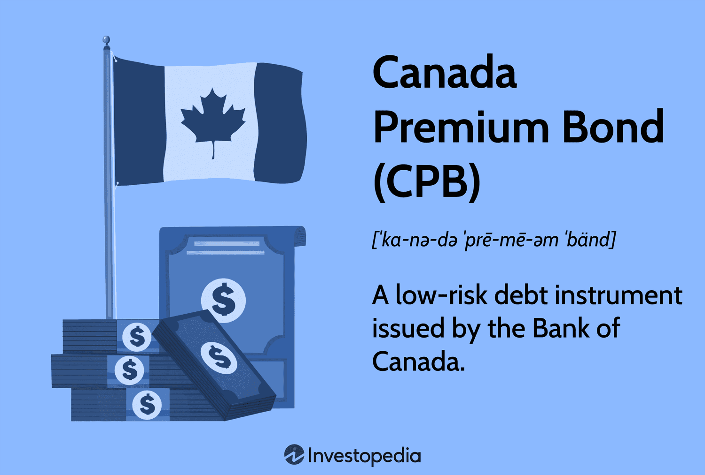

This article offers a comprehensive examination of Canada Premium Bonds (CPB), a financial instrument once pivotal in the Canadian government's portfolio. Issued as part of post-World War II economic strategies, CPBs served as a secure investment option, attracting citizens with their competitive interest rates and government-backed assurance. While CPBs were ultimately discontinued in 2017 due to evolving market conditions and strategic financial considerations, their legacy in shaping investment behaviors endures.

The landscape of bond trading has undergone significant transformation with the advent of algorithmic trading, a prominent force that has revolutionized modern financial markets. Using sophisticated algorithms and complex mathematical models, algorithmic trading enhances market efficiency and liquidity, allowing for rapid and precise execution of trades. This technological evolution influences not only private bond markets but also government securities like the CPB.

Through this article, we will explore the intersection of historical government bond instruments and the modern technological-driven bond markets, offering insights into the evolution of investments and trading mechanisms. We'll examine how algorithmic trading affects bond dynamics, proposing hypothetical scenarios where CPBs might interact with these advanced trading strategies, enriching our understanding of both traditional and cutting-edge financial practices.

## Table of Contents

## Understanding Canada Premium Bonds (CPB)

Canada Premium Bonds (CPBs) were introduced as a higher interest alternative to Canada Savings Bonds following World War II, making them an attractive option for investors seeking government-backed investment opportunities. The Canadian government initiated the CPB program to cater to a market segment desiring higher returns that offered an annual redemption condition, distinguishing them from the conventional savings bonds available at the time.

The primary feature of CPBs was their competitive interest rates, designed to offer better yields compared to standard Canada Savings Bonds. This feature aimed to attract investors who were willing to commit for at least the duration of the guaranteed interest rate period. The annual redemption policy allowed holders of CPBs to redeem the bonds once a year without penalty, providing a level of liquidity that was appealing to investors wary of long-term commitments.

Despite their appeal, Canada discontinued the issuance of CPBs in 2017. Several factors influenced this decision. One key [factor](/wiki/factor-investing) was the evolving market competition. As global financial markets became more sophisticated, a plethora of new investment instruments became available, often offering higher returns and flexibility than CPBs. The increased competition made CPBs less attractive to contemporary investors. Furthermore, the Canadian government assessed its financial strategies and determined that the costs associated with managing and marketing these bonds exceeded the perceived benefits, particularly in light of more efficient and technologically advanced options for investors. Consequently, the decision to cease CPB issuance was part of a broader move towards streamlining government financial operations. 

This termination of CPBs reflects a shift in government policy towards managing public funds and investment opportunities in a way that aligns with market trends and technological advancements. The focus has increasingly shifted towards more modern financial products that can cater to the needs of today's dynamic investment community.

## The Investment Appeal of Bonds

Bonds are a fundamental component of the fixed-income securities market, offering a stable and predictable return, which makes them particularly attractive to risk-averse investors. As debt instruments, bonds are essentially loans made by an investor to a borrower, which in the case of government-issued bonds like Canada Premium Bonds (CPB), is typically a government entity. The investor is entitled to receive periodic interest payments, known as coupon payments, as well as the return of the principal amount when the bond reaches its maturity date.

The appeal of bonds lies in their reputation for safety and reliability. Government bonds such as CPBs are backed by the financial stability of the issuing government, which significantly lowers the risk of default. Consequently, these bonds serve as a haven for investors seeking to preserve capital while [earning](/wiki/earning-announcement) a modest return. The fixed interest rates associated with bonds ensure a consistent cash flow, providing financial predictability that is particularly valued during economic uncertainty or market [volatility](/wiki/volatility-trading-strategies).

Key financial concepts underpinning bonds include interest rates, maturity, and the mitigation of risks. Interest rates, set at the issuance of the bond, dictate the amount of money the bondholder will receive in coupon payments. A higher [interest rate](/wiki/interest-rate-trading-strategies) typically suggests a greater return on investment, aligning with the incentive that was present when Canada Premium Bonds were introduced as a higher interest alternative to the then-existing Canada Savings Bonds.

Maturity is another essential concept, referring to the time period over which the bond is held before the principal is refunded. Bonds can range from short-term (less than one year) to long-term (up to 30 years or more), offering varying degrees of risk and reward. Generally, longer maturities can [carry](/wiki/carry-trading) higher interest rates to compensate investors for the increased risk over time, including the potential impacts of inflation and interest rate changes.

Risk mitigation is a critical advantage of bonds, particularly for government-issued securities. By diversifying portfolios with bonds, investors can reduce overall investment risk, as bonds tend to have an inverse relationship with equities—when stocks perform poorly, bonds often perform well. This dynamic is beneficial for balancing portfolios and stabilizing returns.

In summary, bonds represent a cornerstone of investment strategy for those seeking stability and lower risk. The intrinsic characteristics of bonds, exemplified by instruments like CPBs, offer predictable income streams and principal protection. Such attributes firmly position bonds as essential elements within a diversified financial portfolio, aligning with the financial goals of preserving capital and ensuring steady, reliable returns.

## Algorithmic Trading in the Bond Market

Algorithmic trading refers to the use of complex algorithms to automate the execution of trading orders in financial markets. These algorithms are designed to make decisions on aspects such as timing, price, and quantity of trade orders without human intervention. In modern financial markets, [algorithmic trading](/wiki/algorithmic-trading) has gained prominence due to its ability to process massive volumes of data and execute orders in milliseconds, leading to significant improvements in trading efficiency and cost reduction.

In the bond market, algorithmic trading plays a crucial role in enhancing both efficiency and [liquidity](/wiki/liquidity-risk-premium). By automating trades, algorithms can quickly adjust to real-time information and execute multiple trades simultaneously, which helps to narrow bid-ask spreads and reduce transaction costs. This increased efficiency enables markets to function more smoothly, even during periods of high volatility. Additionally, algorithmic trading contributes to liquidity by increasing the [volume](/wiki/volume-trading-strategy) of buy and sell orders, making it easier for market participants to execute trades at desired prices.

Despite these benefits, algorithmic trading is not without its drawbacks and associated risks. One significant concern is the potential for "flash crashes," where rapid, automated selling can lead to dramatic price declines in a very short time. Flash crashes can destabilize financial markets and erode investor confidence, as seen in the U.S. stock market's "Flash Crash" of May 6, 2010. Moreover, algorithmic trading can be susceptible to market manipulation tactics such as spoofing, where traders place fake orders to deceive other market participants and profit from the resulting price movements.

Regulatory bodies have increasingly focused on monitoring and mitigating these risks to ensure market stability. As technologies evolve, understanding the balance between harnessing the advantages of algorithmic trading and safeguarding against its dangers remains a key concern for both market participants and regulators.

## CPB and Algorithmic Trading: A Retrospective Analysis

Canada Premium Bonds (CPBs) occupied a specific niche in the bond market by offering government-backed securities with higher interest rates compared to Canada Savings Bonds. Their introduction was aimed at encouraging personal savings post-World War II. Although simple in structure, examining CPBs within the context of today's algorithm-dominated trading environment offers useful insights into how technological advancements could have shaped their market performance.

### Impact of Algorithmic Trading on CPBs

If CPBs had been active in a market dominated by algorithmic trading, their pricing and market dynamics would likely have been more volatile yet efficient. Algorithmic trading, which involves the use of complex algorithms to make high-speed trading decisions, could have influenced CPBs through rapid adjustment to market information, thus impacting their liquidity and yield spreads.

#### Hypothetical Pricing and Market Dynamics

1. **Price Discovery and Efficiency**: Algorithms excel in processing large volumes of data swiftly. They would facilitate more accurate price discovery for CPBs by integrating economic indicators, interest rate forecasts, and macroeconomic announcements into pricing models. This would potentially compress yield spreads, as algorithms react to diminishing arbitrage opportunities.
$$
   \Delta P = f(I_t, R_t, M_t)

$$

   Where $\Delta P$ represents price adjustments, $I_t$ refers to economic indicators, $R_t$ to interest rates, and $M_t$ to macroeconomic factors.

2. **Liquidity Enhancement**: Algorithmic systems would likely improve liquidity by continuously updating bids and offers. CPBs, being a government-backed instrument, would benefit from the resultant tighter bid-ask spreads, lowering transaction costs and making the bonds more attractive to investors.

3. **Market Volatility**: However, increased algorithmic activity could introduce volatility. Algorithms responding to large trades or erroneous signals may contribute to price swings. Historical data from other government bonds support this as flash crashes have occasionally occurred in algorithm-heavy environments.

### Lessons for Current Bond Markets

1. **Transparency and Information Flow**: CPBs' fixed-income nature, combined with algorithmic trading, underscores the necessity for transparency and efficient information flow. Modern bond markets must ensure data availability to maintain stability and prevent information asymmetry.

2. **Regulatory Oversight**: The hypothetical impact of algorithms on CPBs highlights the importance of regulatory frameworks to mitigate risks such as market manipulation or algorithm-driven volatility. Equipping regulatory bodies with real-time monitoring tools is crucial.

3. **Algorithmic Strategy Adaptation**: Investors and traders could learn from CPBs by adapting algorithmic strategies to factor in safety and yield stability offered by government securities, optimizing portfolios, and balancing risk-reward profiles.

In summary, while CPBs did not operate in today's algorithm-driven market, understanding their potential interactions with such technology provides useful reflections. This analysis informs current trends, suggesting strategies to harmonize traditional bond appeal with contemporary trading innovations.

## Current Trends and Future Outlook in Bond Trading

The landscape of bond trading is undergoing significant transformation due to the advancements in algorithmic and high-frequency trading ([HFT](/wiki/high-frequency-trading-strategies)). These trading models have become increasingly prominent due to their ability to process vast datasets and execute trades at unparalleled speeds. Algorithmic trading employs complex mathematical models to make automated transactions based on pre-set conditions, resulting in enhanced market efficiency and liquidity. High-frequency trading, a subset of algorithmic trading, focuses on the rapid execution of a large number of orders at extremely high speeds. This has introduced profound changes, such as tighter bid-ask spreads and increased trading volumes in the bond market.

Emerging technologies like [artificial intelligence](/wiki/ai-artificial-intelligence) (AI) and [machine learning](/wiki/machine-learning) (ML) are poised to further revolutionize bond trading. AI and ML can analyze intricate market patterns and predict price movements more accurately than traditional models. They offer the potential to improve risk management through predictive analytics that can identify potential market disruptions before they occur. The integration of these technologies could lead to more dynamic pricing models and enhanced decision-making capabilities in bond trading.

Investors aiming to navigate the future of bond markets should consider several strategies. Firstly, staying informed about technological advancements and understanding their applications within financial markets is essential. Investing in or collaborating with tech-savvy asset management firms may provide a competitive edge. Secondly, diversifying investment portfolios to include tech-driven funds or bonds that leverage AI and ML can mitigate risks associated with market volatility. Lastly, adopting a flexible investment strategy that can quickly adjust to rapid market changes will be crucial as these technologies continue to evolve. 

By embracing these technological advancements and adapting to the evolving bond trading environment, investors can position themselves to capitalize on future opportunities while effectively managing risks.

## Conclusion

Canada Premium Bonds (CPBs) were once an integral part of Canada's financial landscape, representing a secure form of investment with government backing. Their historical significance is underscored by their role as a higher interest alternative to Canada Savings Bonds, offering risk-averse investors a stable, fixed-income security. However, the discontinuation of CPBs in 2017 marked a shift in government financial strategies, influenced by intensifying market competition and changing economic conditions.

The evolution of bond markets has been significantly shaped by the advent of algorithmic trading, which has revolutionized financial markets by enhancing efficiency and liquidity. This technological advancement underscores the intersection of historical investment instruments like CPBs with modern trading strategies. Algorithmic trading can influence pricing and market dynamics, presenting both opportunities and challenges for investors and regulators alike.

Understanding the past and present dynamics of bond investment is crucial for making informed financial decisions. On the one hand, historical instruments like CPBs provide insights into traditional investment strategies and risk mitigation through government-backed debt instruments. On the other hand, modern trading technologies require investors to adapt to rapid technological advances that continuously reshape financial markets.

Investors are encouraged to expand their investment knowledge, particularly in the context of rapid technological evolution. This includes staying informed about emerging technologies such as artificial intelligence and machine learning, which are poised to further transform bond trading. By acquiring a comprehensive understanding of both historical and contemporary investment aspects, investors can position themselves to navigate future bond markets more effectively.

## References

1. Bank of Canada. "Historical Financial Statistics." Accessed October 2023. [https://www.bankofcanada.ca/rates/historical-lookup/](https://www.bankofcanada.ca/rates/historical-lookup/). This source provides detailed historical financial data, including information on Canada Premium Bonds and their conditions over time.

2. Department of Finance Canada. "The Evolution of Canada Savings Bonds." Government of Canada. Accessed October 2023. [https://www.canada.ca/en/department-finance/services/savings-bonds/history.html](https://www.canada.ca/en/department-finance/services/savings-bonds/history.html). This government publication gives an overview of the history and features of Canada Premium Bonds.

3. Fabozzi, Frank J. "Bond Markets, Analysis, and Strategies." 9th ed., Pearson, 2020. A comprehensive textbook on bond markets, providing foundational concepts and detailed analysis relevant to understanding fixed-income securities and investment strategies.

4. Hendershott, Terrence, et al. "Algorithmic Trading and Information." Journal of Finance 66.1 (2011): 1-33. This academic paper investigates into the dynamics of algorithmic trading and its impact on market efficiency and liquidity.

5. International Organization of Securities Commissions. "The Impact of Technological Changes on Market Integrity and Efficiency." IOSCO, 2011. This report explores the influence of technological advancements, including algorithmic trading, on financial markets.

6. Nielsen, Lars T., and Christina Skov. "Liquidity Risk in Algorithmic Trading." Journal of Trading 12.3 (2017): 1-14. This study analyzes the potential risks, such as liquidity issues, associated with algorithmic trading in various markets.

7. Pietersz, Geert. "Algorithmic Trading Explained." Moneyterms.co.uk. Accessed October 2023. [http://moneyterms.co.uk/algorithmic-trading/](http://moneyterms.co.uk/algorithmic-trading/). This resource provides an accessible explanation of algorithmic trading mechanisms and their effects on financial markets.

8. United Nations Conference on Trade and Development (UNCTAD). "The Role of Technology in Bond Markets." UNCTAD, 2022. This publication examines current trends and the future outlook for bond markets, emphasizing the role of emerging technologies like AI and machine learning.

## References & Further Reading

[1]: Bank of Canada. "Historical Financial Statistics." Accessed October 2023. [https://www.bankofcanada.ca/rates/historical-lookup/](https://www.bankofcanada.ca/publications/historical-banking-financial-statistics-and-weekly-financial-statistics/).

[2]: Department of Finance Canada. "The Evolution of Canada Savings Bonds." Government of Canada. Accessed October 2023. [https://www.canada.ca/en/department-finance/services/savings-bonds/history.html](https://en.wikipedia.org/wiki/Gross_Domestic_Product).

[3]: Fabozzi, Frank J. "Bond Markets, Analysis, and Strategies." 9th ed., Pearson, 2020. 

[4]: Hendershott, Terrence, et al. "Algorithmic Trading and Information." Journal of Finance 66.1 (2011): 1-33.

[5]: International Organization of Securities Commissions. "The Impact of Technological Changes on Market Integrity and Efficiency." IOSCO, 2011.

[6]: Nielsen, Lars T., and Christina Skov. "Liquidity Risk in Algorithmic Trading." Journal of Trading 12.3 (2017): 1-14.

[7]: Pietersz, Geert. "Algorithmic Trading Explained." Moneyterms.co.uk. Accessed October 2023. [http://moneyterms.co.uk/algorithmic-trading/](https://onlinelibrary.wiley.com/doi/epdf/10.1002/9781119206033.fmatter).