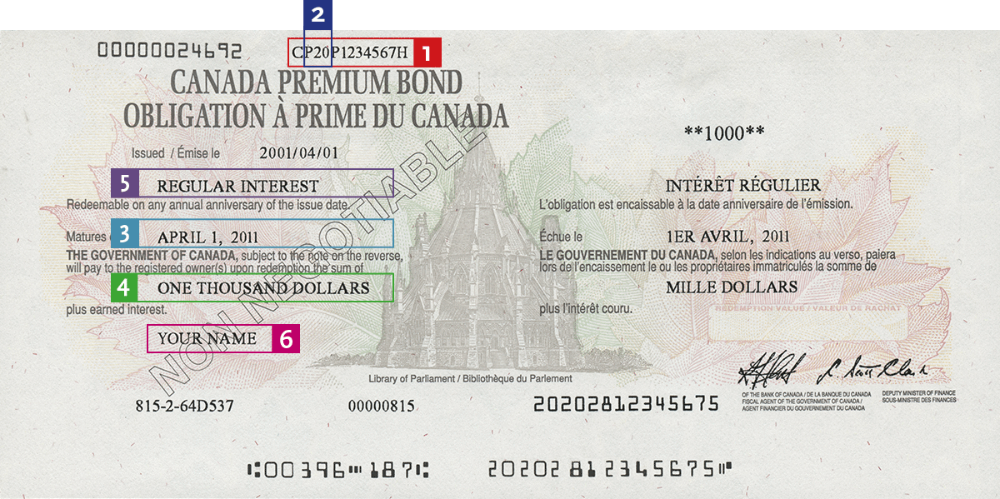

## Table of Contents

## What are Canada Savings Bonds?

Canada Savings Bonds (CSBs) are a type of investment that the Canadian government used to offer. They were a safe way for people to save money because they were backed by the government, which meant there was very little risk of losing money. People could buy these bonds and earn interest over time. The interest rates on CSBs were usually lower than other investments like stocks, but they were popular because they were secure and easy to understand.

The government stopped selling new Canada Savings Bonds in 2017. If you already owned CSBs before that year, you could keep them until they matured, which means until the end of their term. After 2017, people looking for similar safe investments might consider other options like Guaranteed Investment Certificates (GICs) or government bonds like the Canada Premium Bonds. These options also offer security and a steady return, but it's important to compare the interest rates and terms before investing.

## How do Canada Savings Bonds work?

Canada Savings Bonds were a way for people to save money safely. The Canadian government sold these bonds, which meant they were very secure because the government promised to pay back the money. When someone bought a Canada Savings Bond, they were lending money to the government. In return, the government paid them interest over time. The interest could be paid regularly, like every year, or it could be added to the bond and paid when the bond matured, which means when it reached the end of its term.

These bonds were easy to buy and understand. You could buy them at banks or through payroll savings plans at work. They came in different lengths, like 3, 5, or 10 years. If you needed your money back before the bond matured, you could get it, but you might lose some of the interest you earned. The government stopped selling new Canada Savings Bonds in 2017, but if you had one before then, you could keep it until it matured. Now, if you want a similar safe investment, you might look at things like Guaranteed Investment Certificates or Canada Premium Bonds.

## Who can purchase Canada Savings Bonds?

Before 2017, anyone who lived in Canada could buy Canada Savings Bonds. You didn't need to be a Canadian citizen, just living in Canada was enough. You could buy them if you were an adult, or if you were a kid, your parents or guardians could buy them for you.

You could get Canada Savings Bonds at banks or through your job if they had a payroll savings plan. They were easy to buy and a safe way to save money because the government promised to pay you back. But, the government stopped selling new Canada Savings Bonds in 2017. If you already had one, you could keep it until it was time to get your money back.

## What are the benefits of investing in Canada Savings Bonds?

Canada Savings Bonds were a safe way to save money. They were backed by the Canadian government, so there was very little risk of losing your money. This made them a good choice for people who wanted to keep their savings secure. The interest rates on these bonds were usually lower than other investments like stocks, but because they were so safe, many people liked them. They were easy to understand and buy, which made them popular with all kinds of people.

Another benefit was that you could get your money back before the bond matured if you needed it. You might lose some of the interest you earned, but you could still get your original money back. This flexibility was helpful for people who might need their savings for unexpected things. Also, the interest you earned on Canada Savings Bonds was not taxed until you got it, which could be good for planning your taxes. Even though the government stopped selling new Canada Savings Bonds in 2017, the ones bought before then could still be kept until they matured.

## How can one buy Canada Savings Bonds?

Before 2017, anyone living in Canada could buy Canada Savings Bonds. You didn't need to be a Canadian citizen, just living in Canada was enough. You could buy them if you were an adult, or if you were a kid, your parents or guardians could buy them for you. You could get these bonds at banks or through your job if they had a payroll savings plan. It was easy to buy them because they were sold at many places and you could choose how much you wanted to invest.

Canada Savings Bonds were a safe way to save money. They were backed by the Canadian government, so there was very little risk of losing your money. This made them a good choice for people who wanted to keep their savings secure. The interest rates on these bonds were usually lower than other investments like stocks, but because they were so safe, many people liked them. They were easy to understand and buy, which made them popular with all kinds of people.

## What are the interest rates for Canada Savings Bonds?

The interest rates for Canada Savings Bonds changed over time. When you bought a bond, the government told you what the [interest rate](/wiki/interest-rate-trading-strategies) would be. This rate could stay the same for the whole time you had the bond, or it could change every year. The rates were usually lower than what you might get from riskier investments like stocks, but they were safe because the government promised to pay you back.

If you needed to know the exact interest rate for a Canada Savings Bond, you would look at the bond's details when you bought it. The rates were different for different bonds, and they could go up or down based on what was happening with the economy. Even though the government stopped selling new Canada Savings Bonds in 2017, the ones bought before then kept [earning](/wiki/earning-announcement) interest until they matured.

## Can Canada Savings Bonds be cashed in before maturity?

Yes, Canada Savings Bonds can be cashed in before they reach their maturity date. If you need your money back before the bond is supposed to end, you can get it. But, if you cash it in early, you might not get all the interest you earned. You will still get your original money back, but the interest you lose depends on how early you cash it in.

This early cashing option made Canada Savings Bonds a flexible choice for people. It was helpful for those who might need their savings for unexpected things. Even though the government stopped selling new Canada Savings Bonds in 2017, if you had one before then, you could still cash it in early if you needed to.

## What are the tax implications of Canada Savings Bonds?

When you earn interest from Canada Savings Bonds, you have to pay tax on it. But, you don't have to pay the tax right away. You only pay tax on the interest when you get it. This means if you choose to get your interest every year, you pay tax on it every year. If you let the interest build up and get it all at once when the bond matures, you pay tax on all of it at that time.

This way of paying tax can be good for planning. If you think you'll be in a lower tax bracket when you get the interest, it might be better to let it build up. But if you need the money and get the interest every year, you'll pay tax on it yearly. It's important to think about your tax situation when deciding how to get your interest from Canada Savings Bonds.

## How do Canada Savings Bonds compare to other investment options?

Canada Savings Bonds were a safe way to save money because they were backed by the Canadian government. This meant there was very little risk of losing your money, which made them a good choice for people who wanted to keep their savings secure. The interest rates on these bonds were usually lower than other investments like stocks, but because they were so safe, many people liked them. They were easy to understand and buy, which made them popular with all kinds of people. You could also get your money back before the bond matured if you needed it, but you might lose some of the interest you earned.

Compared to other investments, Canada Savings Bonds had lower returns than stocks or mutual funds, which can grow a lot more over time but also come with more risk. If you wanted something safer but still similar, you could look at Guaranteed Investment Certificates (GICs) or Canada Premium Bonds. These options also offer security and a steady return, but it's important to compare the interest rates and terms before investing. After the government stopped selling new Canada Savings Bonds in 2017, these other options became more popular for people looking for safe investments.

## What is the history of Canada Savings Bonds?

Canada Savings Bonds started a long time ago, in 1946. The Canadian government made them to help people save money in a safe way. They were popular because the government promised to pay back the money, so they were very secure. People could buy them at banks or through their jobs if they had a payroll savings plan. Over the years, a lot of people used Canada Savings Bonds to save money for things like buying a house or for their retirement.

The interest rates on these bonds changed over time. Sometimes they were higher, and sometimes they were lower, but they were always safe. People liked them because they could get their money back before the bond was supposed to end if they needed it, but they might lose some of the interest they earned. The government stopped selling new Canada Savings Bonds in 2017, but if you had one before then, you could keep it until it was time to get your money back. Now, people looking for similar safe investments might choose things like Guaranteed Investment Certificates or Canada Premium Bonds.

## Are there any risks associated with Canada Savings Bonds?

Canada Savings Bonds are very safe because they are backed by the Canadian government. This means there is almost no chance of losing your money. The biggest risk is that the interest rates might be lower than other investments like stocks or mutual funds. If you want to make more money, you might need to take more risk with other types of investments.

Another small risk is that if you need to cash in your bond before it matures, you might lose some of the interest you earned. But you will still get your original money back. This makes Canada Savings Bonds a good choice for people who want to keep their savings secure and don't mind earning a bit less interest.

## What changes have been made to Canada Savings Bonds in recent years?

The biggest change to Canada Savings Bonds happened in 2017 when the Canadian government stopped selling new ones. Before that, people could buy these bonds at banks or through their jobs. They were a safe way to save money because the government promised to pay it back. But after 2017, if you wanted to invest in something similar, you had to look at other options like Guaranteed Investment Certificates or Canada Premium Bonds.

If you already had Canada Savings Bonds before 2017, you could keep them until they matured. This means you could still earn interest on them until the end of their term. The interest rates on these bonds could change every year, and they were usually lower than other investments like stocks. But they were still popular because they were so safe and easy to understand.

## References & Further Reading

[1]: ["The Evolution of Canada Savings Bonds" - Bank of Canada](https://moneygenius.ca/blog/canada-savings-bonds)

[2]: Andrew W. Lo. ["The Evolution of Technical Analysis: Financial Prediction from Babylonian Tablets to Bloomberg Terminals"](https://archive.org/details/evolutionoftechn0000loan). John Wiley & Sons, 2016.

[3]: ["Understanding Bond ETFs" - Investment Industry Regulatory Organization of Canada](https://www.globalrelay.com/resources/the-compliance-hub/glossary/the-investment-industry-regulatory-organization-of-canada-what-it-is-and-how-to-stay-compliant/)

[4]: ["Algorithmic and High-Frequency Trading"](https://www.amazon.com/Algorithmic-High-Frequency-Trading-Mathematics-Finance/dp/1107091144) by Álvaro Cartea, Sebastian Jaimungal, and José Penalva

[5]: ["Introduction to Algorithmic Trading Strategies" - CFA Institute](https://www.cfainstitute.org/insights/professional-learning/refresher-readings/2024/trade-strategy-execution)