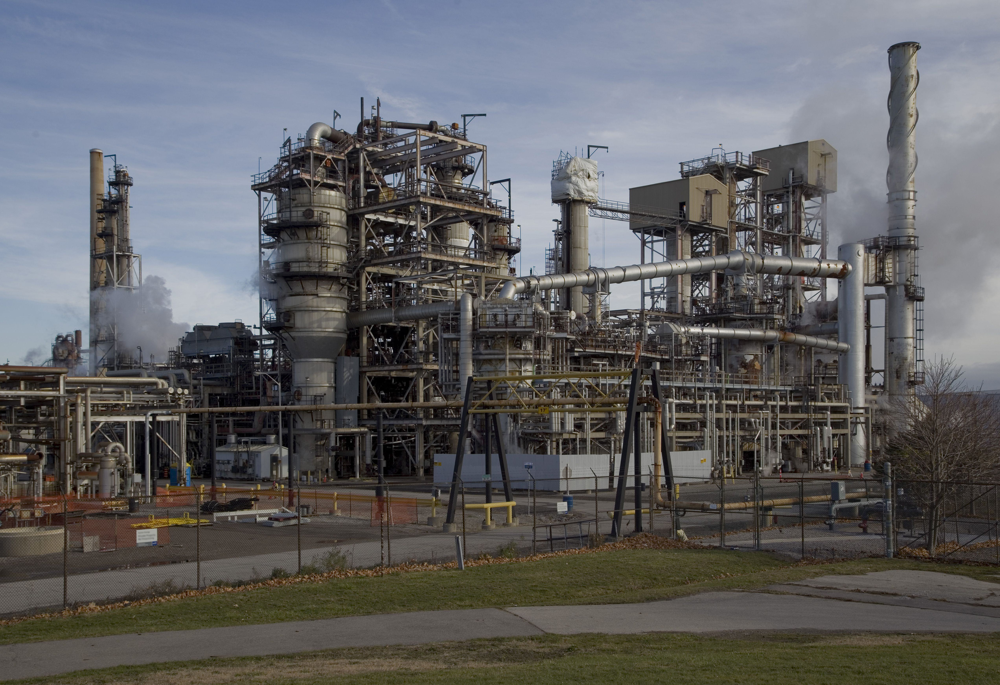

The energy sector in Canada is a fundamental pillar of the nation's economy, underpinning a substantial portion of its GDP and playing a crucial role in its trade balance. Canada is not only rich in fossil fuel resources but also has a well-established reputation as a leading player in the global energy market. The petroleum industry, in particular, stands out as a critical component of this sector. Canada ranks as the world's fourth-largest oil producer, showcasing its influence and capability in the global oil landscape. 

The Canadian petroleum industry is a complex ecosystem that encompasses the upstream, midstream, and downstream stages. It involves the extraction, transportation, and refinement of oil and gas products, contributing significantly to the country's exports. Much of this petroleum production is concentrated in the oil sands of Alberta, where innovative extraction technologies have been developed to exploit these reserves efficiently.



As this article unfolds, it will explore the integration of algorithmic trading within the Canadian petroleum industry. Algorithmic trading, which utilizes advanced mathematical models and computational systems to execute trades, offers new dimensions of efficiency and risk management to energy companies. The intersection of these high-tech trading methods and traditional energy production forms a burgeoning area of interest. Current trends reveal a shift towards adopting algorithmic solutions to handle the volatile and unpredictable market conditions that characterize the energy sector.

Challenges facing this industry are multifaceted, including environmental concerns, regulatory hurdles, and market volatility. The article will further analyze how these challenges affect the competitiveness of Canadian oil in the global market and what role algorithmic trading can play in mitigating these issues.

Ultimately, this exploration will provide insights into the future prospects of the Canadian petroleum industry, emphasizing how technological advancements and innovative strategies such as algorithmic trading will shape its evolution.

## Table of Contents

## Overview of the Canadian Petroleum Industry

Canada's petroleum industry plays a significant role in both the national and global energy landscapes, structured into three primary segments: upstream, midstream, and downstream. Each segment encompasses distinct activities essential for the production, transportation, and refining of petroleum products.

The upstream segment focuses on exploration and production, primarily in the oil sands of Alberta, which account for a substantial portion of Canada's oil reserves. These reserves are the third-largest in the world, following Venezuela and Saudi Arabia. Alberta's oil sands are a mixture of sand, water, clay, and bitumen, requiring sophisticated extraction and processing technologies. The primary extraction methods include surface mining and in-situ techniques such as Steam-Assisted Gravity Drainage (SAGD), which involve injecting steam to reduce bitumen viscosity, enabling it to flow to production wells. The complexity and cost-intensive nature of extracting and processing bitumen highlight the technological challenges involved in the upstream segment.

The midstream segment involves the transportation and storage of [crude oil](/wiki/crude-oil) and natural gas. Canada's vast geography necessitates an extensive network of pipelines, railways, and storage facilities to efficiently move petroleum products across the country and to international markets. Major pipeline projects, such as the Trans Mountain and Keystone XL pipelines, are critical in connecting production sites with refineries and export terminals, albeit often facing regulatory and environmental scrutiny.

The downstream segment comprises refining and marketing operations. Canada's refineries transform crude oil into various petroleum products, including gasoline, diesel, and jet fuel, for domestic consumption and export. The country's refining capacity is predominantly located near major urban centers and along coastal areas to facilitate efficient distribution and export logistics.

Prominent companies dominating the Canadian petroleum industry include Cenovus Energy, Suncor Energy, and Imperial Oil. Cenovus Energy is a leading integrated oil company with significant operations in the oil sands and refining sectors. Suncor Energy, recognized for its pioneering efforts in oil sands development, operates extensive upstream, midstream, and downstream assets. Imperial Oil, partly owned by ExxonMobil, is another key player with a century-long presence, involved in all segments of the industry.

The Canadian petroleum industry's reliance on cutting-edge technologies for exploration, extraction, transportation, and refining underscores its critical role in ensuring energy security and economic stability. As global demand for energy evolves, the industry continues to adapt, striving for innovation and efficiency to maintain its competitive edge.

## Challenges Facing the Industry

The Canadian petroleum industry faces a complex array of challenges that significantly impact its operational and financial landscape. Among the foremost concerns is environmental sustainability, with greenhouse gas emissions and land disturbances resulting from oil sands extraction posing significant regulatory hurdles. The oil sands, notable for being energy-intensive, require substantial water usage and produce large volumes of greenhouse gases, leading to increased scrutiny from both government and environmental organizations. Canada has implemented stringent regulations aimed at reducing emissions, such as the Pan-Canadian Framework on Clean Growth and Climate Change, which necessitates costly technological upgrades and compliance measures for petroleum companies (Government of Canada, 2016).

Financially, the industry is particularly vulnerable to market [volatility](/wiki/volatility-trading-strategies). Oil prices have often experienced sharp fluctuations due to geopolitical tensions, changes in global supply and demand, and OPEC's dynamic production strategies. For instance, the price drop in 2020 linked to the COVID-19 pandemic demonstrated the vulnerability of oil-dependent economies (IEA, 2020). Such volatility not only influences revenue predictability but also affects investment decisions and operational scalability. Companies must navigate these uncertainties while managing extraction costs, which are notably high for Canadian oil sands compared to conventional crude oil sources.

The distinct nature of oil sands extraction further compounds the financial challenges faced. The extraction process is notoriously expensive, involving mining and in-situ methods such as steam-assisted gravity drainage (SAGD). According to the Canadian Association of Petroleum Producers (CAPP), these cost-intensive processes elevate the breakeven price for Canadian crude, often exceeding that of other global producers, thus affecting its competitiveness in international markets (CAPP, 2019). 

In light of these challenges, the industry must pursue innovative solutions to reduce costs and enhance efficiency. This necessity underscores the importance of leveraging technological advancements and optimizing operations to maintain a competitive edge while addressing environmental responsibilities.

## Role of Algorithmic Trading in the Petroleum Sector

Algorithmic trading has become an integral part of the petroleum sector, offering significant advantages to companies by enhancing trading efficiency and reducing associated risks. These automated trading systems use complex algorithms to execute trades at speeds and frequencies that are impossible for human traders. This capability is particularly beneficial in the volatile and fast-paced energy markets where rapid decision-making is crucial.

The deployment of [artificial intelligence](/wiki/ai-artificial-intelligence) (AI) and [machine learning](/wiki/machine-learning) algorithms in [algorithmic trading](/wiki/algorithmic-trading) is pivotal in analyzing vast datasets and predicting market trends. Machine learning models, for example, can be trained on historical data to identify patterns and make forecasts about future price movements. One common technique is supervised learning, where models are trained on labeled input and output data, and then used to make predictions on new, unseen data.

Python, a popular language for algorithmic trading, offers libraries such as Pandas and NumPy for data analysis, and scikit-learn for implementing machine learning models. A simple predictive model in Python might involve the following steps:

```python
import pandas as pd
from sklearn.model_selection import train_test_split
from sklearn.ensemble import RandomForestRegressor

# Load historical market data
data = pd.read_csv('market_data.csv')

# Preprocess data and feature engineering
features = data[['price', 'volume', 'other_feature']]

# Target variable
target = data['future_price']

# Split data into training and testing sets
X_train, X_test, y_train, y_test = train_test_split(features, target, test_size=0.2, random_state=42)

# Train a model
model = RandomForestRegressor()
model.fit(X_train, y_train)

# Predict future prices
predictions = model.predict(X_test)
```

Algorithmic trading strategies aid in enhancing decision-making capabilities and boosting financial returns in markets characterized by volatility. These strategies include statistical [arbitrage](/wiki/arbitrage), trend-following, and mean reversion, each leveraging mathematical models to make trading decisions. For instance, [statistical arbitrage](/wiki/statistical-arbitrage) exploits price inefficiencies between correlated assets, while trend-following strategies use past price data to identify ongoing trends.

By minimizing human errors and bias, algorithmic trading allows petroleum companies to execute orders at optimal prices and in larger volumes, thus increasing profits. Furthermore, it provides the flexibility to quickly adjust strategies in response to market changes, which is essential in the dynamic petroleum sector. This adaptability and precision are critical, especially given the fluctuating prices of crude oil influenced by geopolitical events, supply-demand imbalances, and economic policies.

In summary, algorithmic trading enables petroleum companies to manage market uncertainties effectively, offering a competitive edge through advanced data analysis, rapid execution, and strategic agility. As the industry continues to evolve, embracing these technologies will be crucial for optimizing operations and maximizing profitability.

## Technological Advancements and Innovations

Emerging technologies are playing pivotal roles in reducing costs and enhancing efficiency within Canada's petroleum industry, particularly in oil extraction and processing. These advancements are not only vital for maintaining competitiveness in a market characterized by high volatility but also for addressing environmental concerns and optimizing resource utilization. 

Enhanced Oil Recovery (EOR) methods represent a significant technological advancement. EOR techniques, such as thermal recovery, gas injection, and chemical flooding, help increase the amount of crude oil that can be extracted from an oil field. Thermal recovery involves injecting steam into reservoirs to lower the viscosity of heavy oils, thereby improving flow rates and extraction efficiency. Gas injection, which includes the use of gases like CO₂, enhances oil recovery by either maintaining reservoir pressure or interacting with the oil to reduce viscosity. Chemical flooding, on the other hand, uses polymers or surfactants to improve the flow of the oil through the reservoir.

Digital oilfields are transforming industry operations by integrating advanced software and sensor technologies to monitor and optimize oil extraction processes in real time. The use of Internet of Things (IoT) devices allows for better equipment management, predictive maintenance, and improved decision-making processes. These smart systems collect and analyze vast amounts of data, leading to increased operational efficiency and reduced downtime. As a result, companies can predict failures before they happen, effectively reducing operational costs and prolonging the lifespan of equipment.

The increasing shift towards renewable energy sources also compels petroleum companies to adapt their strategies and processes. Many companies are investing in hybrid technologies that integrate traditional fossil fuel operations with renewable resources like wind, solar, and bioenergy. This transition is part of a broader effort to reduce carbon footprints and meet stringent environmental regulations while still fulfilling global energy demands. By integrating renewable energy solutions, petroleum firms are not only diversifying their energy portfolios but also demonstrating adaptability to an evolving energy landscape.

Together, these technological innovations are crucial to ensuring the sustainability and efficiency of the Canadian petroleum industry. By adopting advanced methods and embracing renewable energies, the industry is well-positioned to meet contemporary challenges and tap future opportunities effectively.

## Future Prospects and Opportunities

Future growth in the Canadian petroleum industry is heavily dependent on the ability to effectively balance the utilization of traditional fossil fuel resources with the integration of renewable energy sources. This delicate equilibrium is pivotal not just for meeting energy demands but also for addressing environmental concerns and sustainability targets. As the global energy market shifts towards a decarbonized future, the petroleum sector must innovate and adapt.

Collaboration with technology firms is essential in this evolution. By partnering with companies at the forefront of technological innovation, the Canadian petroleum industry can leverage advanced tools and methodologies to enhance operational efficiency and sustainability. These collaborations can facilitate the adoption of cutting-edge technologies such as digital twins, which allow for the simulation of oilfield operations, leading to optimized performance and reduced downtime. Moreover, big data analytics and the Internet of Things (IoT) can offer predictive insights that streamline processes, reduce waste, and minimize environmental impact.

Another critical component for the future of the industry is investment in research and development (R&D). Increasing R&D efforts can drive the discovery of new technologies and methods aimed at reducing the carbon footprint of oil extraction and refining processes. Investment in Enhanced Oil Recovery (EOR) techniques, for example, can significantly increase the yield from existing oil fields while lowering the environmental impact per barrel of oil produced. Furthermore, developing new catalysts and separation technologies can improve the efficiency and ecological footprint of downstream refining operations.

The transition towards renewable energy also presents opportunities for diversification within the petroleum industry. Companies can invest in wind, solar, and bioenergy projects, thereby creating hybrid energy systems that reduce reliance on fossil fuels and mitigate volatility in oil prices. This strategic shift can enhance energy security and offer new revenue streams.

In conclusion, the future of the Canadian petroleum industry lies in its capacity to innovate and integrate sustainable practices. By proactively investing in technology partnerships and R&D, the industry can maintain its competitiveness and lead the transition to a sustainable energy future.

## Conclusion

The Canadian petroleum industry maintains a crucial role in the global energy landscape due to its extensive reserves and significant production capabilities. This position is increasingly supported by technological advances that drive operational efficiency and innovation within the sector. Among these developments, algorithmic trading stands out as a vital tool, offering petroleum companies enhanced proficiency in navigating the inherent uncertainties of the market. By integrating sophisticated algorithms and machine learning techniques, companies can improve their market analysis, optimize their trading strategies, and minimize financial risks.

As the industry faces evolving energy paradigms, the concepts of sustainability and adaptability emerge as central to maintaining the sector's relevance and profitability. The transition towards more sustainable practices is propelled by the urgent need to address environmental concerns associated with petroleum extraction and consumption. Companies are thus compelled to adopt innovative strategies that reduce their ecological footprint while simultaneously exploring the integration of renewable energy sources into their operations.

In conclusion, the interplay of advanced technological strategies such as algorithmic trading, alongside a focus on sustainable and adaptable practices, positions the Canadian petroleum industry for enduring success. Companies that effectively leverage these elements will be better equipped to thrive in an increasingly complex and environmentally-conscious global energy market.

## References & Further Reading

[1]: Government of Canada. (2016). ["Pan-Canadian Framework on Clean Growth and Climate Change."](https://www.canada.ca/en/services/environment/weather/climatechange/pan-canadian-framework.html) 

[2]: Canadian Association of Petroleum Producers. (2019). ["Statistical Handbook for Canada’s Upstream Petroleum Industry."](https://www.capp.ca/en/research-and-publications/)

[3]: International Energy Agency. (2020). ["Oil Market Report."](https://www.iea.org/reports/oil-market-report-december-2020)

[4]: Lopez de Prado, M. (2020). ["Advances in Financial Machine Learning."](https://www.amazon.com/Advances-Financial-Machine-Learning-Marcos/dp/1119482089) Wiley.

[5]: Chan, E. P. (2009). ["Quantitative Trading: How to Build Your Own Algorithmic Trading Business."](https://github.com/ftvision/quant_trading_echan_book) John Wiley & Sons.

[6]: Jansen, S. (2018). ["Machine Learning for Algorithmic Trading."](https://github.com/stefan-jansen/machine-learning-for-trading) Packt Publishing.

[7]: Aronson, D. R. (2006). ["Evidence-Based Technical Analysis: Applying the Scientific Method and Statistical Inference to Trading Signals."](https://www.amazon.com/Evidence-Based-Technical-Analysis-Scientific-Statistical/dp/0470008741) Wiley.