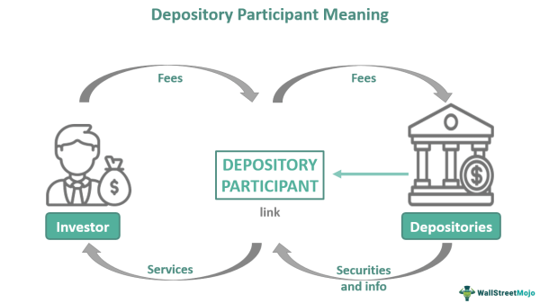

The Canadian Depository for Securities (CDS) is integral to the financial infrastructure of Canada, overseeing the safekeeping and administration of securities for the majority of Canadian transactions. Founded in 1970, CDS has developed into a significant component of the trade lifecycle, primarily due to its affiliation with the TMX Group, which occurred when CDS became a wholly owned subsidiary. This affiliation has fortified its role within the broader ecosystem of financial markets by aligning its operations with the largest Canadian exchanges, such as the Toronto Stock Exchange.

The CDS performs its function by providing centralized depository services, essential for the efficient clearing and settlement of securities. These processes play a crucial role not only in the reduction of trading costs but also in increasing the security and reliability of securities transactions. By managing assets exceeding $4 trillion, CDS positions itself as a pivotal institution supporting the infrastructure for both domestic and international trade activities. Furthermore, its evolution reflects broader trends in capital markets, such as the implementation of the T+2 settlement cycle which synchronizes with global standards to enhance market liquidity and diminish settlement risks.

As technology advances, the role of CDS has increasingly converged with algorithmic trading, where rapid transaction processing and high-frequency trades necessitate robust infrastructure and minimal settlement times. The blend of CDS services with such modern trading techniques illustrates its adaptability and its burgeoning importance in the contemporary financial landscape. An exploration of CDS reveals its significant impact on Canada's financial systems and highlights its future trajectory within the global financial arena.

## Table of Contents

## What is the Canadian Depository for Securities (CDS)?

The Canadian Depository for Securities (CDS) serves as a centralized depository service for securities within Canada, providing essential clearing and settlement services. As a principal component of the Canadian financial infrastructure, CDS facilitates the efficient and secure transfer of securities, significantly streamlining back-office processes and thereby reducing trading costs for participants. This efficiency is achieved through the use of sophisticated technology and operational practices that ensure transactions are executed accurately and promptly.

CDS plays a pivotal role in managing a substantial volume of financial assets, with holdings surpassing $4 trillion. This extensive asset retention underscores its critical nature not only in supporting Canadian domestic trades but also in facilitating cross-border financial transactions. By acting as a central hub for security depository services, CDS enhances the fluidity of the financial market, ensuring that securities transactions are settled in a timely fashion. This operation minimizes counterparty risk and bolsters the overall stability and reliability of Canada's financial systems. 

The depository's operations align with global best practices, reinforcing its credibility and operational integrity. This alignment is particularly crucial in an era of increasing globalization and financial integration, where efficient settlement processes are indispensable for market participants seeking to optimize their trading activities both within and beyond Canadian borders.

## CDS Functions and Responsibilities

The Canadian Depository for Securities (CDS) is entrusted with key responsibilities critical for the functionality of the securities market in Canada. At the core of its operations, CDS manages the custody and movement of securities, ensuring that these assets are securely held and efficiently transferred between parties post-trade. This involves a meticulous process of clearing and settling transactions, ensuring that buyers receive their securities and sellers their payments without unnecessary delay.

A vital component of its service is processing post-trade transactions. CDS ensures that every trade is accurately recorded and reconciled in its systems. This function is facilitated by advanced technological systems that track these transactions, reducing manual errors and optimizing the speed of operations. By maintaining accurate records, CDS provides transparency and reassurance to market participants, fostering trust in the financial system.

Additionally, CDS plays a crucial role in the management of corporate actions, specifically the distribution of dividends and interest payments for securities held on deposit. This function is critical for investors seeking income from their investments, as it ensures that they receive the correct payments promptly and efficiently. CDS's reliable handling of these financial distributions bolsters investor confidence and supports market stability.

CDS's operations are regulated under a tight framework to ensure compliance and integrity within financial markets. The organization is under the jurisdiction of the securities commissions of Ontario and Quebec, which set forth regulations and guidelines to safeguard market interests. Furthermore, the Bank of Canada provides oversight, ensuring that CDS partakes in promoting a secure and efficient financial marketplace. This regulatory oversight ensures that CDS functions smoothly and transparently, aligning with both national policies and international best practices.

## Integration with TMX Group

In 2012, the Canadian Depository for Securities (CDS) became a wholly owned subsidiary of the TMX Group, an important milestone in the evolution of Canada's financial infrastructure. This integration was strategic in nature, as it aligned the CDS more closely with prominent exchanges such as the Toronto Stock Exchange (TSX), thereby enhancing the efficiency and scope of the Canadian capital markets.

By becoming part of the TMX Group, CDS benefited from an expanded suite of technological and operational capabilities. This integration enabled a more seamless trading infrastructure, which is essential for optimizing trade execution and settlement processes. The alignment with TMX Group also facilitated the harmonization of settlement and clearing operations, which are vital to maintaining market confidence and operational risk management.

A significant outcome of this integration was the support for broader market initiatives like the T+2 settlement cycle. This system, which abbreviates the settlement period to two business days post-trade, enhances market efficiency by reducing counterparty risk and improving [liquidity](/wiki/liquidity-risk-premium). Aligning with this global standard allowed Canadian markets to synchronize with other major financial centers, such as those in the United States and Europe, which had already adopted the T+2 cycle. This move was crucial for maintaining competitive parity in international financial markets and ensured that the Canadian trading environment remains attractive for domestic and foreign investors alike.

Through these enhancements, the integration of CDS into the TMX Group has not only streamlined operations but also fortified the infrastructure mechanisms necessary for evolving market demands, ensuring the continued robustness and resilience of Canada's financial systems.

## CDS and Capital Market Improvements

The Canadian Depository for Securities (CDS) has significantly enhanced the Canadian capital markets by implementing the T+2 settlement system. This transition, aligning Canada with U.S. and European markets, involves completing security transactions within two business days after the trade date. The shift from the previous T+3 system to T+2 has brought numerous benefits that substantially influence market dynamics.

Firstly, the reduction in settlement period decreases the settlement risk, which is the risk that one party fails to deliver the security or payment for a transaction. By shortening the time frame, the exposure to market [volatility](/wiki/volatility-trading-strategies) and the likelihood of financial discrepancies occurring is minimized. This enhancement is crucial in maintaining the stability and efficiency of the financial landscape, especially in a rapidly evolving economic environment.

Furthermore, the T+2 settlement cycle promotes faster transaction processing. In today's fast-paced trading environment, the ability to complete transactions swiftly is crucial. Faster processing times enable investors and financial institutions to better manage liquidity and make timely reinvestment decisions. The resulting increase in transactional efficiency supports the smooth functioning of the markets, facilitating a more dynamic and responsive trading ecosystem.

Additionally, adopting the T+2 settlement cycle has positively impacted market liquidity. Liquidity refers to the ease with which assets can be bought or sold in the market without affecting the asset's price. With quicker settlement times, securities are available sooner for subsequent trades, enhancing the fluidity with which market participants can trade. This improvement not only benefits investors looking for efficient markets but also underpins the overall health and competitiveness of the financial system.

Finally, the reduced settlement cycle aids in lowering the potential for counterparty defaults. Counterparty risk is the possibility that one of the parties involved in a transaction might not fulfill their contractual obligations. By condensing the time frame within which parties are exposed to each other, the T+2 system lessens the risk of defaults, contributing to a more secure and reliable trading environment. These enhancements collectively strengthen the market infrastructure, making it more robust and aligned with international best practices.

## Role of CDS in Algorithmic Trading

The Canadian Depository for Securities (CDS) plays a fundamental role in enabling [algorithmic trading](/wiki/algorithmic-trading) within the Canadian financial markets by providing the necessary infrastructure for secure and swift securities settlement. As algorithmic trading relies on the ability to execute trades at high speeds and volumes, the efficiency and reliability of CDS's transaction processing are paramount.

Algorithmic trading automates the execution of orders based on pre-defined strategies, analyzing market data at lightning speeds and making split-second decisions. This requires not only robust computational power but also an infrastructure capable of handling the resulting trade volumes without delays. CDS's ability to reduce settlement times ensures that once a trade is executed, the transfer of securities is completed swiftly, minimizing the risk of settlement failures and optimizing the allocation of capital.

The infrastructure provided by CDS supports high-frequency trading ([HFT](/wiki/high-frequency-trading-strategies)) and other algorithmic trading strategies by enabling trades to be settled in time frames conducive to these rapid trading environments. With CDS's efficient processing systems, algorithmic traders can capitalize on market opportunities and [arbitrage](/wiki/arbitrage) margins that could disappear in milliseconds. 

Moreover, CDS's ability to manage increased volumes of trades is critical, as algorithmic trading strategies can generate a significant number of transactions. The scalability of CDS systems allows for such high throughput, ensuring that even at peak trading times, system performance remains stable and efficient.

Additionally, the reduction in settlement times facilitated by CDS aids in decreasing the potential risk of counterparty defaults—a concern particularly pertinent in high-speed trading where positions might be rapidly opened and closed. This risk reduction is beneficial for market participants employing algorithmic strategies, as it provides a secure backbone against which traders can perform operations.

In summary, CDS's role in supporting algorithmic trading is anchored in its provision of a reliable and efficient settlement infrastructure, fostering an environment where high-frequency and algorithmic trade execution are feasible and secure. This infrastructure not only supports existing trading strategies but also encourages innovation and the development of new trading algorithms, contributing to the dynamism and growth of the Canadian financial marketplace.

## Conclusion

The Canadian Depository for Securities (CDS) serves as a foundational component of Canada's financial infrastructure, facilitating efficient and secure trading processes across the country's capital markets. By acting as a centralized depository, CDS ensures the integrity and seamless execution of security transactions, which is crucial for maintaining investor confidence and market stability. Its role in holding and managing over $4 trillion in assets underscores its significance within the financial ecosystem.

The organization has continually adapted to the evolving landscape of global finance, integrating advanced technologies and aligning its operations with international standards. Through these efforts, CDS not only enhances its operational capabilities but also ensures compatibility with global trading systems, thereby supporting its stakeholders in a more interconnected world economy.

Looking forward, CDS is poised to remain a critical player in enhancing Canada's competitive edge within the global financial arena. Its commitment to innovation and efficiency will likely drive further improvements in market liquidity and transaction security, fostering a more resilient and dynamic financial market. In doing so, CDS will continue to support Canada's economic growth and its prominent role in the global financial markets.

## References & Further Reading

[1]: Canadian Depository for Securities (CDS). ["Corporate Overview: History and Operations"](https://www.cds.ca/) 

[2]: TMX Group Limited. ["Integration and Operations of the CDS with TMX Group"](https://www.tmx.com/en/resource/962) 

[3]: Financial Stability Board. ["Reforming Major Interest Rate Benchmarks"](https://www.fsb.org/2014/07/r_140722/)

[4]: Bank for International Settlements. ["Enhancements in Payment Systems: T+2 Settlement and Global Standards"](https://www.bis.org/)

[5]: Securities Industry and Financial Markets Association (SIFMA). ["Implementation of T+2 Settlement"](https://www.sifma.org/) 

[6]: International Securities Services Association (ISSA). ["The Role of Depositories in Financial Markets"](https://issanet.org/) 

[7]: Lopez de Prado, M. ["Advances in Financial Machine Learning"](https://www.amazon.com/Advances-Financial-Machine-Learning-Marcos/dp/1119482089) 

[8]: Chan, E. P. ["Algorithmic Trading: Winning Strategies and Their Rationale"](https://github.com/ftvision/quant_trading_echan_book) 

[9]: Jansen, S. ["Machine Learning for Algorithmic Trading"](https://github.com/stefan-jansen/machine-learning-for-trading)