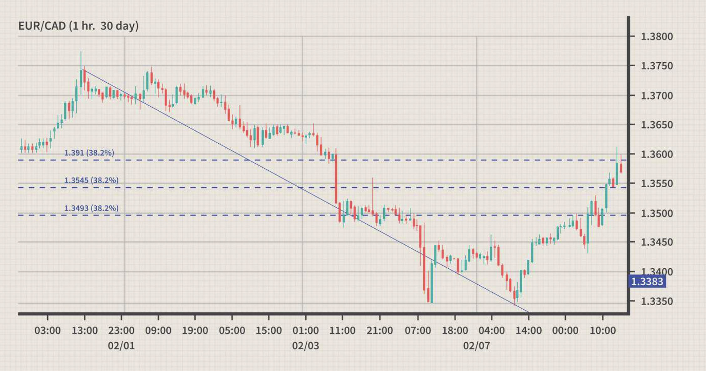

## Table of Contents

## What is the Canadian Dollar and its role in forex trading?

The Canadian Dollar, often represented as CAD, is the official currency of Canada. It's used every day by people in Canada to buy things like food, clothes, and services. In the world of money, the Canadian Dollar is important because Canada has a big economy with lots of natural resources like oil and gas. The value of the Canadian Dollar can go up or down based on how well Canada's economy is doing and how much oil and gas they are selling.

In forex trading, the Canadian Dollar plays a big role. Forex, or foreign exchange, is where people and businesses trade one country's money for another's. Traders watch the Canadian Dollar closely because it can affect other currencies, especially the US Dollar. Since Canada and the United States do a lot of business together, changes in the Canadian Dollar can impact the US Dollar and vice versa. Traders use this information to make decisions about buying and selling currencies, hoping to make a profit from the changes in value.

## How is the Canadian Dollar symbolized and coded in forex markets?

The Canadian Dollar is symbolized by the letters "CAD" in the forex markets. This code helps traders and people around the world quickly identify and talk about the Canadian currency. In everyday use in Canada, you might see the symbol "$" or "C$" to represent the Canadian Dollar, but in forex trading, "CAD" is the standard.

When people trade currencies, they often see the Canadian Dollar paired with other currencies, like the US Dollar (USD/CAD) or the Euro (EUR/CAD). These pairs show how much of one currency you need to buy one Canadian Dollar, or vice versa. The use of "CAD" in these pairs makes it easy for traders to understand and trade the Canadian Dollar in the global market.

## What are the major currency pairs involving the Canadian Dollar?

The most common currency pair involving the Canadian Dollar is the USD/CAD, which is the US Dollar against the Canadian Dollar. This pair is very popular because the US and Canada have a big trade relationship. Traders watch this pair a lot because changes in the US economy can affect the Canadian Dollar, and changes in Canada's economy, especially in oil prices, can affect the US Dollar.

Another important pair is the EUR/CAD, which is the Euro against the Canadian Dollar. This pair is watched by traders who are interested in how Europe's economy affects Canada. The value of the Euro can change based on what's happening in Europe, and that can make the Canadian Dollar go up or down.

The GBP/CAD pair, which is the British Pound against the Canadian Dollar, is also a major pair. Traders look at this pair to see how the UK's economy impacts Canada. Since the UK and Canada do business together, changes in the Pound can influence the Canadian Dollar's value.

## How does the Canadian economy influence the value of the Canadian Dollar?

The Canadian economy plays a big role in deciding how much the Canadian Dollar is worth. When Canada's economy is doing well, with more people working and businesses making more money, the Canadian Dollar usually gets stronger. This is because more people want to buy Canadian things, like cars or food, and they need Canadian Dollars to do that. Also, if Canada is selling a lot of its natural resources, like oil and gas, to other countries, that can make the Canadian Dollar go up. People around the world need Canadian Dollars to buy these resources, so the demand for the currency grows.

On the other hand, if the Canadian economy is not doing so well, the Canadian Dollar might get weaker. If fewer people are working or if businesses are not making as much money, it can make the Canadian Dollar less valuable. When Canada is not selling as much oil and gas, or if the prices for these resources go down, that can also make the Canadian Dollar drop. People and businesses might not want to hold onto Canadian Dollars if they think the economy is going to struggle, so they might sell them, which makes the value go down.

## What are the key economic indicators to watch for CAD trading?

When you're trading the Canadian Dollar, it's important to keep an eye on Canada's economy. One big thing to watch is the Gross Domestic Product (GDP), which tells you how much money Canada is making from all the things it produces. If the GDP is growing, it usually means the Canadian Dollar might get stronger because people want to buy more Canadian stuff. Another thing to look at is the employment rate. If more people in Canada have jobs, they're spending more money, and that can make the Canadian Dollar go up. Also, the Bank of Canada's interest rates matter a lot. If they raise the rates, it can make the Canadian Dollar more attractive because people can earn more from saving in Canadian Dollars.

Another key indicator is the price of oil. Canada has a lot of oil, so when oil prices go up, it's good for the Canadian Dollar because other countries need Canadian Dollars to buy that oil. On the flip side, if oil prices drop, the Canadian Dollar might weaken. You should also pay attention to the trade balance, which shows if Canada is selling more things to other countries than it's buying from them. If Canada is exporting more, it's good for the Canadian Dollar. Lastly, inflation rates are important. If prices in Canada are going up too fast, it might make the Canadian Dollar weaker, but if the Bank of Canada can keep inflation in check, it can help the currency stay strong.

## How do interest rate decisions by the Bank of Canada affect the CAD?

When the Bank of Canada changes interest rates, it can really affect the value of the Canadian Dollar. If the Bank of Canada decides to raise interest rates, it means that people can earn more money by saving in Canadian Dollars. This makes the Canadian Dollar more attractive to investors from around the world, who might want to buy Canadian Dollars to take advantage of the higher interest rates. As a result, the demand for the Canadian Dollar goes up, and its value usually increases.

On the other hand, if the Bank of Canada lowers interest rates, it makes saving in Canadian Dollars less appealing. People might look for other currencies where they can earn more from their savings. This can lead to a decrease in demand for the Canadian Dollar, causing its value to drop. So, watching what the Bank of Canada does with interest rates is really important for understanding where the Canadian Dollar might be headed.

## What are common trading strategies for the Canadian Dollar?

One common trading strategy for the Canadian Dollar is to watch the price of oil. Since Canada has a lot of oil, when oil prices go up, the Canadian Dollar usually gets stronger. Traders might buy the Canadian Dollar when they see oil prices rising, hoping to make money as the currency goes up in value. On the other hand, if oil prices drop, traders might sell the Canadian Dollar, expecting it to get weaker. This strategy is called a commodity-based approach, where traders use the price of a country's main resources to guess what will happen to its currency.

Another strategy is to pay attention to [interest rate](/wiki/interest-rate-trading-strategies) decisions by the Bank of Canada. When the Bank raises interest rates, it can make the Canadian Dollar more attractive to investors because they can earn more from saving in Canadian Dollars. Traders might buy the Canadian Dollar before an expected rate hike, hoping to profit from the currency's rise in value. If the Bank lowers rates, the Canadian Dollar might get weaker, so traders might sell it before the change happens. This strategy is known as interest rate [carry](/wiki/carry-trading) trade, where traders try to benefit from the differences in interest rates between countries.

A third strategy involves looking at economic indicators like GDP, employment rates, and inflation. If these indicators show that Canada's economy is doing well, traders might buy the Canadian Dollar, expecting it to strengthen. For example, if the GDP is growing or more people are getting jobs, it can signal a strong economy, which is good for the currency. On the other hand, if these indicators suggest the economy is struggling, traders might sell the Canadian Dollar, anticipating it will weaken. This approach is called [fundamental analysis](/wiki/fundamental-analysis), where traders use economic data to make their trading decisions.

## How does the Canadian Dollar react to changes in oil prices?

The Canadian Dollar is closely tied to oil prices because Canada has a lot of oil. When oil prices go up, it's good for the Canadian Dollar. More countries want to buy Canadian oil, so they need Canadian Dollars to pay for it. This makes the demand for the Canadian Dollar go up, and its value usually increases. Traders watch oil prices closely and might buy the Canadian Dollar when they see oil prices rising, hoping to make money as the currency gets stronger.

On the other hand, when oil prices drop, it can hurt the Canadian Dollar. If oil isn't as valuable, fewer countries want to buy it from Canada, so they don't need as many Canadian Dollars. This can make the demand for the Canadian Dollar go down, and its value might decrease. Traders might sell the Canadian Dollar when they see oil prices falling, expecting the currency to weaken. So, keeping an eye on oil prices is a big part of trading the Canadian Dollar.

## What are the historical trends of the Canadian Dollar against major currencies?

Over the years, the Canadian Dollar has had ups and downs against major currencies like the US Dollar, the Euro, and the British Pound. Against the US Dollar, the Canadian Dollar has often been influenced by oil prices and the overall health of the Canadian economy. For example, during times when oil prices were high, like in the early 2000s, the Canadian Dollar got stronger against the US Dollar. But when oil prices fell, like in the mid-2010s, the Canadian Dollar weakened. The US and Canada do a lot of business together, so what happens in the US economy can also affect the Canadian Dollar. If the US economy is doing well, it can pull the Canadian Dollar up with it, but if the US economy struggles, it can drag the Canadian Dollar down.

Against the Euro, the Canadian Dollar's value has been shaped by economic conditions in both Canada and Europe. When Europe's economy is doing better than Canada's, the Euro tends to get stronger against the Canadian Dollar. But if Canada's economy is doing well and Europe's is struggling, the Canadian Dollar can gain value against the Euro. Interest rate differences between the Bank of Canada and the European Central Bank also play a role. If the Bank of Canada raises interest rates while the European Central Bank keeps theirs low, the Canadian Dollar might get stronger against the Euro. The same kind of thing happens with the British Pound, where the Canadian Dollar's value can go up or down based on how Canada's economy is doing compared to the UK's, and what the Bank of Canada and the Bank of England do with their interest rates.

## How can technical analysis be applied to trading the Canadian Dollar?

Technical analysis is a way traders try to guess where the Canadian Dollar might go next by looking at past price movements on a chart. They use different tools like trend lines, which are lines drawn on the chart to show where the price has been going up or down, and moving averages, which smooth out the price data to show the overall direction. If the Canadian Dollar's price is going up and it's above its moving average, traders might think it will keep going up and decide to buy it. But if the price is going down and it's below the moving average, they might think it will keep falling and decide to sell.

Another tool traders use is called support and resistance levels. These are points on the chart where the Canadian Dollar's price has stopped going down or up in the past. If the price is getting close to a support level, traders might think it's a good time to buy because the price might bounce back up. If it's near a resistance level, they might think it's a good time to sell because the price might start going down again. By using these tools, traders can make better guesses about what the Canadian Dollar might do next and try to make money from their trades.

## What are the geopolitical factors that impact the Canadian Dollar?

Geopolitical factors can have a big impact on the Canadian Dollar. One important [factor](/wiki/factor-investing) is the relationship between Canada and the United States. Since they are neighbors and do a lot of business together, any changes in their relationship can affect the Canadian Dollar. For example, if there are trade disagreements or new trade deals, it can make the Canadian Dollar go up or down. Also, if there's tension between the two countries, like over border issues or policies, it can make people less sure about the Canadian economy, which can weaken the Canadian Dollar.

Another factor is how Canada gets along with other big countries like China. Canada exports a lot of natural resources, like oil and minerals, to China. If there's a problem between Canada and China, like a trade war or political disagreements, it can hurt the demand for Canadian exports. When fewer countries want to buy Canadian things, it can make the Canadian Dollar weaker. On the other hand, if Canada and China have a good relationship and trade is going well, it can help the Canadian Dollar stay strong or even get stronger.

## How do seasonal patterns affect the Canadian Dollar in forex trading?

Seasonal patterns can affect the Canadian Dollar because of things like weather and holidays. In winter, when it gets really cold in Canada, people use more heating oil and gas. This can make the prices of these resources go up, which is good for the Canadian Dollar because Canada has a lot of oil and gas. Also, during the holiday season, like Christmas, people in Canada and the US spend more money on gifts and travel. Since the US and Canada do a lot of business together, this can help the Canadian Dollar get stronger.

In the summer, things are a bit different. People in Canada might travel more and spend money outside the country, which can make the Canadian Dollar weaker. Also, the summer is a big time for tourism in Canada, so if more people from other countries come to visit, it can help the Canadian Dollar. But if fewer tourists come, it might not be as good for the currency. So, traders who watch the Canadian Dollar often look at the time of year to guess what might happen next.

## References & Further Reading

[1]: Bergstra, J., Bardenet, R., Bengio, Y., & Kégl, B. (2011). ["Algorithms for Hyper-Parameter Optimization."](https://dl.acm.org/doi/10.5555/2986459.2986743) Advances in Neural Information Processing Systems 24.

[2]: ["Advances in Financial Machine Learning"](https://www.amazon.com/Advances-Financial-Machine-Learning-Marcos/dp/1119482089) by Marcos Lopez de Prado

[3]: ["Evidence-Based Technical Analysis: Applying the Scientific Method and Statistical Inference to Trading Signals"](https://www.amazon.com/Evidence-Based-Technical-Analysis-Scientific-Statistical/dp/0470008741) by David Aronson

[4]: ["Machine Learning for Algorithmic Trading"](https://github.com/stefan-jansen/machine-learning-for-trading) by Stefan Jansen

[5]: ["Quantitative Trading: How to Build Your Own Algorithmic Trading Business"](https://www.amazon.com/Quantitative-Trading-Build-Algorithmic-Business/dp/1119800064) by Ernest P. Chan