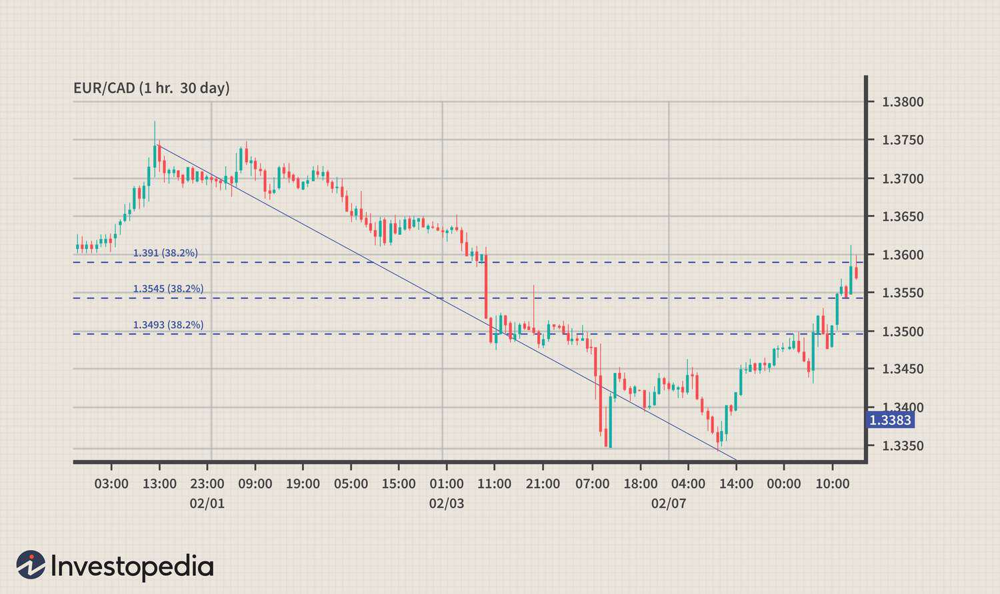

Forex trading is a global activity where various currencies vie for prominence. Among these currencies, the Canadian dollar (CAD) stands out because of its distinct economic and geopolitical attributes. Known colloquially as the 'Loonie', the CAD holds a significant position in the global forex market, influenced heavily by Canada's economic performance. Factors such as gross domestic product (GDP), trade balances, and inflation rates play a crucial role in determining the value of the CAD. Additionally, the close economic ties between Canada and the United States mean that the economic policies and performance of the U.S. can have considerable effects on the CAD.

Simultaneously, the advent of algorithmic trading has introduced a transformative approach to the forex market. This method employs computer algorithms to execute trades at rapid speeds and high volumes, thereby reshaping the trading landscape. Algorithmic trading provides opportunities to capitalize on instant market movements and manage vast data sets more efficiently than traditional methods. However, it also presents challenges, such as the need for constant technological upgrades and managing the risks associated with rapid decision-making.



This article explores trading the Canadian dollar in the forex market using algorithmic strategies. It discusses how the unique economic factors affecting the CAD are aligned with various algorithmic trading methods to navigate the flux of the forex market effectively.

## Table of Contents

## Understanding the Canadian Dollar in Forex

The Canadian dollar (CAD), colloquially known as the "Loonie," holds a significant position in the global forex market, recognized as one of the most traded currencies worldwide. This prominence is a direct consequence of Canada's robust economic framework and its intricate connections with neighboring economies, particularly the United States.

Canada's economy heavily influences the value of the CAD. Key economic indicators such as Gross Domestic Product (GDP), trade balance figures, and inflation rates serve as essential metrics for assessing the currency's strength. A strong GDP, indicating a growing economy, typically boosts investor confidence and, consequently, the value of the Loonie. Conversely, trade deficits or high inflation can diminish the CAD's appeal, leading to depreciation.

Moreover, the Canadian economy's interconnectedness with the United States significantly affects the CAD. Given that the U.S. is Canada's largest trading partner, any substantial shifts in U.S. economic policies or performance have notable repercussions on Canadian currency. For instance, changes in U.S. interest rates or fiscal policies can prompt adjustments in capital flows and investment patterns, thereby influencing the CAD's exchange rate. This reality necessitates that forex traders remain vigilant about developments in U.S. economic policy and their potential ripple effects on the Canadian dollar.

In summary, the Canadian dollar's behavior in the [forex](/wiki/forex-system) market is a reflection of both domestic economic health and the intricate economic relationship with the United States. Understanding these dynamics is vital for anticipating movements in the CAD's value and making informed trading decisions.

## Economic Drivers of the Canadian Dollar

Canada's economy is heavily influenced by its natural resources, making commodities a central component of its export landscape. Petroleum, minerals, and agricultural products are particularly important, as they form a substantial portion of Canada's export earnings. This reliance on natural resources significantly affects the value of the Canadian dollar (CAD) in the forex market.

The CAD is widely regarded as a "commodity currency" because its value often correlates closely with commodity prices, especially oil. Canada is one of the world's largest oil producers, and fluctuations in oil prices can lead to corresponding movements in the CAD's value. For example, an increase in global oil prices typically results in a strengthening of the CAD, as higher oil revenues bolster Canada's trade balance and overall economic health.

In addition to commodity prices, several other economic indicators influence the CAD's value. Employment rates are a critical [factor](/wiki/factor-investing), as strong job numbers indicate economic robustness and potentially lead to higher interest rates, attracting foreign investment and strengthening the currency. Similarly, industrial production figures provide insight into the manufacturing sector's health, which is vital for economic growth and currency stability.

Retail sales data is another important economic indicator, reflecting consumer spending patterns and contributing to GDP growth. Strong retail sales suggest a healthy economy, which can strengthen the CAD. Conversely, weak sales might signal economic troubles, potentially depreciating the currency.

In summary, the Canadian dollar's value is driven by a combination of commodity prices and key economic indicators, such as employment rates, industrial production, and retail sales. These factors collectively shape the economic landscape and play a vital role in determining the CAD's performance in the forex market.

## Algorithmic Trading in the Forex Market

Algorithmic trading utilizes sophisticated computer algorithms to efficiently analyze extensive datasets, executing trades at optimal times and prices. This technology has revolutionized the forex market by providing traders the ability to process vast amounts of information beyond human capacity. Algorithms can recognize patterns and trends that may signify profitable trading opportunities, allowing decisions to be made rapidly and with precision.

In the forex market, [algorithmic trading](/wiki/algorithmic-trading) holds significant advantages. It can adapt swiftly to market changes, exploiting short-term opportunities that human traders may overlook. For instance, algorithms can detect and act upon price fluctuations, news events, or economic announcements with incredible speed, often in fractions of a second. This agility is crucial in a market characterized by high [volatility](/wiki/volatility-trading-strategies) and frequent oscillations.

Furthermore, the integration of [machine learning](/wiki/machine-learning) and predictive analytics has significantly enhanced the capabilities of forex algorithms. Machine learning algorithms, in particular, can learn from historical data to make informed predictions about future price movements. They discern patterns and relationships within the data that may not be immediately apparent to human analysts. Predictive analytics further augment these capabilities by providing forecasts based on historical and real-time data, enabling anticipatory actions in the forex market.

The implementation of such algorithms often involves complex computational tasks and requires programming expertise. Here's a simple example of how Python can be used to implement a basic moving average strategy:

```python
import pandas as pd

# Sample data: 'data' is a pandas DataFrame with 'Date' and 'Price' columns
data['SMA_10'] = data['Price'].rolling(window=10).mean()  # 10-day simple moving average
data['SMA_50'] = data['Price'].rolling(window=50).mean()  # 50-day simple moving average

# Generating trade signals
data['Signal'] = 0
data['Signal'][10:] = np.where(data['SMA_10'][10:] > data['SMA_50'][10:], 1, -1)

# Entry and exit points based on signal changes
data['Position'] = data['Signal'].shift(1)
data['Buy'] = np.where(data['Signal'] > data['Position'], data['Price'], np.nan)
data['Sell'] = np.where(data['Signal'] < data['Position'], data['Price'], np.nan)
```

This code calculates two simple moving averages (SMA), a common technique used to identify trends in the market. When the short-term SMA crosses above the long-term SMA, a buy signal is generated; conversely, when it crosses below, a sell signal is triggered.

Algorithmic trading systems must also be robust and capable of handling technical challenges such as latency and connectivity issues. Traders must ensure that their systems are optimized and reliable, with redundancies in place to minimize risks.

In summary, algorithmic trading in the forex market offers a competitive edge through the automation of trades based on sophisticated data analysis and rapid execution capabilities. As the technology continues to evolve, its potential to transform trading strategies and market dynamics remains substantial.

## Algorithmic Trading Strategies for CAD

Algorithmic trading strategies for the Canadian dollar (CAD) harness technological advancements to optimize trade execution and leverage market dynamics. Three primary strategies include trend-following algorithms, mean reversion strategies, and [arbitrage](/wiki/arbitrage) opportunities.

Trend-following algorithms aim to capitalize on the [momentum](/wiki/momentum) of CAD price movements. By analyzing historical price data, these algorithms identify upward or downward trends and execute trades accordingly. They rely on technical indicators such as moving averages or the MACD (Moving Average Convergence Divergence) to signal the initiation or cessation of a trade. A simple moving average crossover strategy, for instance, might involve buying the CAD when a short-term moving average crosses above a long-term moving average, signaling an upward trend, and selling when the opposite occurs.

Mean reversion strategies are predicated on the notion that prices will revert to their historical mean over time. This makes them particularly suitable for currencies like CAD, which often exhibit stable long-term trends. These strategies involve identifying when the CAD is trading below or above its long-term average and placing trades anticipating a return to the mean. Such strategies can be implemented using statistical models like Bollinger Bands, which signal overbought or oversold conditions based on standard deviations from a moving average. For example:

```python
import numpy as np
import pandas as pd

# Assume df is a DataFrame containing CAD price data with a 'Close' column
df['20-day MA'] = df['Close'].rolling(window=20).mean()
df['Std Dev'] = df['Close'].rolling(window=20).std()
df['Upper Band'] = df['20-day MA'] + (df['Std Dev'] * 2)
df['Lower Band'] = df['20-day MA'] - (df['Std Dev'] * 2)

# Signal to buy when price crosses above the lower band and sell when it crosses below the upper band
df['Buy Signal'] = np.where(df['Close'] < df['Lower Band'], 1, 0)
df['Sell Signal'] = np.where(df['Close'] > df['Upper Band'], -1, 0)
```

Arbitrage strategies exploit price discrepancies between different markets or exchanges. In the context of CAD trading, this could involve finding differences in exchange rates across forex platforms or exploiting time zone differences to capitalize on mispricings. The principle is to buy CAD where it is undervalued and sell where it is overvalued, profiting from the spread. High-frequency trading systems and faster execution technologies are often used to execute these trades quickly before the opportunity disappears.

Each of these strategies requires continuous adaptation and validation due to the ever-evolving nature of the forex market and the economic factors influencing the CAD. The suitability of each approach depends on the trader's objectives, risk tolerance, and the computational resources available.

## Risks and Challenges in CAD Algo Trading

Volatility in commodity prices is a significant challenge in algorithmic trading of the Canadian dollar (CAD) due to Canada's heavy reliance on export commodities like oil. Fluctuations in global commodity markets can induce sharp, unpredictable changes in the CAD's value, complicating algorithmic models reliant on stable data patterns. For instance, if oil prices experience a sudden drop, the CAD might depreciate rapidly, invalidating trading algorithms’ predictive capabilities that do not account for such volatility. 

Regulatory changes in Canada or major trade partners, particularly the United States, present another risk. Shifts in trade policies, taxation, or financial regulations can instantly change market dynamics, forcing rapid adjustments in trading strategies. For example, a sudden alteration in tariff policies with the U.S. could impact Canada's export-driven economy, thus affecting the CAD's value. Algorithms not designed to swiftly incorporate regulatory changes may execute poorly in these circumstances.

Technical challenges, such as latency and connectivity issues, pose risks to algorithmic trading systems utilizing high-frequency operations. Latency, the time delay in data processing or trade execution, can result in transactions being completed at suboptimal prices if the market moves quickly. Connectivity issues can exacerbate these problems, potentially leading to missed opportunities or unintended trades. Ensuring robust and low-latency infrastructure is essential for maintaining the efficacy of algorithmic trading systems in the fast-paced forex market. 

Each of these factors emphasizes the need for adaptive algorithms and robust risk management strategies to mitigate the inherent risks in CAD algo trading successfully.

## Conclusion

The forex market is inherently dynamic, with currency values constantly influenced by a myriad of economic and geopolitical factors. In this volatile landscape, the Canadian dollar (CAD) stands out due to its strong ties to Canada's robust commodity sector and close economic relationship with the United States. These unique economic factors can create significant opportunities for traders looking to capitalize on price movements in the CAD. However, they also pose challenges, as shifts in commodity prices, economic indicators, or trade policies can rapidly alter the value of the currency.

Algorithmic trading provides a powerful tool to navigate this complexity. By leveraging detailed data analysis, algorithms can process vast amounts of information and execute trades with unparalleled speed and accuracy. This allows traders to capitalize on fleeting opportunities that might otherwise be missed and to implement strategies like trend-following and mean reversion effectively. For instance, a Python script could be written to continuously monitor CAD price patterns and execute trades based on predefined criteria, enabling traders to stay ahead of market shifts.

Moreover, as technology in trading platforms and data analytics continues to advance, the potential of algorithmic trading is set to grow. Keeping abreast of these technological developments is crucial for traders who wish to maintain a competitive edge. This involves continuously refining algorithms, incorporating advanced techniques like machine learning, and adjusting strategies in response to market changes.

In conclusion, the interaction between the nuanced economic drivers of the Canadian dollar and the capabilities of algorithmic trading offers a fertile ground for profitable trading. To succeed, traders must remain adaptive, continuously updating their strategies in light of technological advancements and shifting economic indicators.

## References & Further Reading

[1]: Bergstra, J., Bardenet, R., Bengio, Y., & Kégl, B. (2011). ["Algorithms for Hyper-Parameter Optimization."](https://dl.acm.org/doi/10.5555/2986459.2986743) Advances in Neural Information Processing Systems 24.

[2]: ["Advances in Financial Machine Learning"](https://www.amazon.com/Advances-Financial-Machine-Learning-Marcos/dp/1119482089) by Marcos Lopez de Prado

[3]: ["Evidence-Based Technical Analysis: Applying the Scientific Method and Statistical Inference to Trading Signals"](https://www.amazon.com/Evidence-Based-Technical-Analysis-Scientific-Statistical/dp/0470008741) by David Aronson

[4]: ["Machine Learning for Algorithmic Trading"](https://github.com/stefan-jansen/machine-learning-for-trading) by Stefan Jansen

[5]: ["Quantitative Trading: How to Build Your Own Algorithmic Trading Business"](https://www.amazon.com/Quantitative-Trading-Build-Algorithmic-Business/dp/1119800064) by Ernest P. Chan