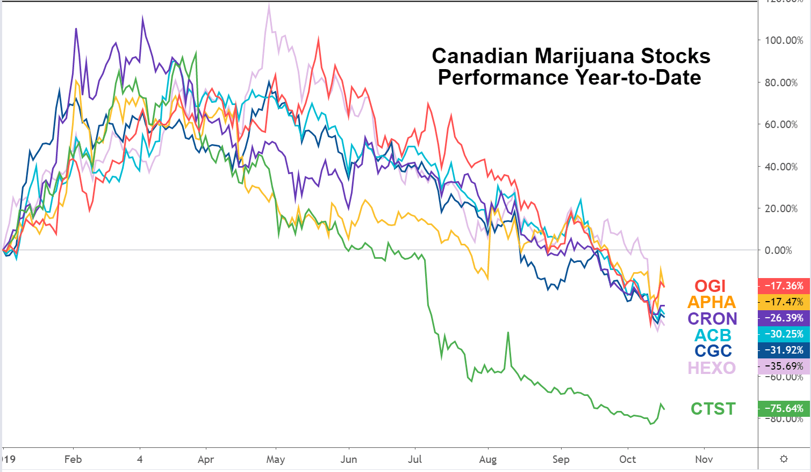

The marijuana industry in Canada has experienced significant growth following the country's federal legalization in 2018. This landmark move positioned Canada as a pioneer, leading to the rapid expansion of cannabis-related businesses and the stock market appeal of these companies. Canadian marijuana stocks, therefore, offer an intriguing investment opportunity marked by dynamic market conditions and potential for substantial returns.

In this context, investors are increasingly considering the integration of algorithmic trading into their investment strategies. Algorithmic trading, which utilizes computer algorithms to execute trades based on predefined criteria, offers the potential to enhance decision-making and optimize portfolio performance. This technological approach provides a systematic method to manage the complexities and volatility inherent in the marijuana stock market.



Algorithmic trading can be particularly advantageous in the cannabis sector due to its ability to process vast amounts of data quickly, identify trading patterns, and execute orders at high speed and accuracy. This capability is crucial in the marijuana industry, where stock prices can be influenced by numerous factors such as regulatory changes, public perception, and market supply and demand dynamics.

Throughout this article, we will explore how investors can leverage algorithmic trading to capitalize on opportunities in Canadian marijuana stocks. We will examine potential benefits, the importance of conducting comprehensive research, and the necessity of staying informed regarding ongoing market developments. This exploration aims to provide investors with a strategic perspective to navigate the evolving landscape of cannabis stock investment in Canada.

## Table of Contents

## Understanding Canadian Marijuana Stocks

The Canadian marijuana market, since the federal legalization of cannabis in 2018, has grown rapidly, positioning itself as a leading global player. This growth has been driven by several major companies that have become synonymous with the industry. Among these are Tilray, Canopy Growth, and Aurora Cannabis, each contributing significantly to the market dynamics and the evolving competitive landscape.

Tilray, established in Nanaimo, British Columbia, gained prominence as one of the first marijuana companies to have a successful initial public offering (IPO) on the Nasdaq. It has extended its operations globally, focusing on medical and recreational cannabis products. Tilray's strategic mergers and acquisitions, including its merger with Aphria, have positioned it as a powerhouse in the market, enabling it to expand its market share and product offerings.

Canopy Growth, based in Smiths Falls, Ontario, is another key player known for its robust brand portfolio and strategic partnerships. The company's alliance with alcohol giant Constellation Brands has allowed it to secure significant capital for investment in growth initiatives and product diversification, including beverages and other consumables infused with cannabis.

Aurora Cannabis, headquartered in Edmonton, Alberta, has also been a dominant force, known for its extensive production capacity and international market reach. The company has focused heavily on increasing its production efficiency and expanding its product lines to include a variety of medical and recreational cannabis products.

Current trends in the Canadian marijuana market indicate potential for further growth, largely driven by increasing consumer acceptance, product innovation, and expansion into international markets. The industry's trajectory is influenced by evolving regulatory landscapes, which can either spur growth or present challenges. As consumer demand increases, companies are investing in research and development to innovate new products, thereby broadening their appeal across different consumer segments.

Investors interested in the Canadian marijuana market must emphasize due diligence when selecting stocks to ensure informed investment decisions. The sector's [volatility](/wiki/volatility-trading-strategies) and evolving regulatory environment necessitate thorough research and understanding of each company's business model, competitive strategies, financial health, and market position. Key factors to assess include a company's adaptability to regulatory changes, its production capabilities, supply chain resilience, management expertise, and its potential for achieving sustainable profitability.

In essence, as Canada's marijuana industry continues to grow and mature, both new and seasoned investors need to remain vigilant and informed. Conducting comprehensive due diligence is paramount to capitalizing on the opportunities within this dynamic sector while mitigating the inherent risks.

## Algorithmic Trading in Stock Investments

Algorithmic trading, also known as algo trading, involves the use of complex algorithms to automatically execute trades in the stock market. This method relies on pre-defined instructions based on variables such as timing, price, and [volume](/wiki/volume-trading-strategy) to conduct trading activities at speeds and frequencies impossible for a human trader. 

In the context of Canadian marijuana stocks, [algorithmic trading](/wiki/algorithmic-trading) presents several advantages. Firstly, algorithms can process vast amounts of data rapidly and identify patterns or anomalies that may indicate profitable trading opportunities. This is particularly beneficial in volatile markets, such as the cannabis sector, where quick decision-making can capitalize on short-lived price fluctuations.

The main benefits of using algorithms for trading Canadian marijuana stocks include enhanced speed and accuracy in trade execution, reduced transaction costs, and the elimination of human emotion, which can lead to irrational trading decisions. Furthermore, algorithmic trading systems operate on heuristic analysis, employing historical data and predictive models to forecast future market movements.

Technology plays a crucial role in developing effective trading strategies. Data analytics and [machine learning](/wiki/machine-learning) models enhance the predictive capabilities of trading algorithms by identifying trends and correlations in complex datasets. For example, machine learning models can be trained on historical stock data to predict future price movements. Here is a basic Python example illustrating how a simple trading algorithm might be constructed using historical cannabis stock data:

```python
import pandas as pd
from sklearn.model_selection import train_test_split
from sklearn.linear_model import LinearRegression

# Load cannabis stock data
data = pd.read_csv('cannabis_stock_data.csv')

# Feature selection
features = data[['open_price', 'high_price', 'low_price', 'volume']]
target = data['close_price']

# Split data
X_train, X_test, y_train, y_test = train_test_split(features, target, test_size=0.2, random_state=42)

# Initialize and train model
model = LinearRegression()
model.fit(X_train, y_train)

# Predict closing prices
predictions = model.predict(X_test)
```
In this example, a linear regression model is used to predict the closing prices of cannabis stocks based on historical data. Such models can be expanded with more sophisticated techniques like [deep learning](/wiki/deep-learning) for improved accuracy.

Effective algorithmic trading also requires robust infrastructure to process and act on data in real-time. High-frequency trading systems use state-of-the-art hardware and software to execute transactions within microseconds, amplifying the potential for small yet profitable trades.

In conclusion, algorithmic trading leverages advanced technologies and data analysis to enhance investment strategies in Canadian marijuana stocks. This approach not only provides a competitive edge in terms of efficiency and cost-effectiveness but also facilitates informed decision-making pivotal in the dynamic cannabis market.

## Building a Marijuana Stocks Portfolio with Algo Trading

Creating a marijuana stocks portfolio with algorithmic trading involves a strategic approach that integrates data-driven decision-making processes. Algorithmic trading employs complex algorithms to execute trades at optimal times, potentially increasing returns and reducing human error. Here is a step-by-step guide to building a portfolio in this rapidly evolving sector.

### Steps to Create a Well-balanced Marijuana Stocks Portfolio Using Algorithmic Strategies

1. **Define Investment Goals and Risk Appetite:**
   Establish clear investment objectives tailored to financial goals and risk tolerance. Algorithmic strategies can be fine-tuned to target specific returns or minimize risk, influencing the selection of stocks.

2. **Data Collection and Analysis:**
   Gather historical and real-time data on marijuana stocks. This includes price history, volume, volatility, and macroeconomic factors. Clean and preprocess data to ensure accuracy.

   ```python
   import pandas as pd
   # Example of importing stock data
   data = pd.read_csv('marijuana_stocks_data.csv')
   clean_data = data.dropna()  # Removing missing values
   ```

3. **Develop Trading Algorithms:**
   Create algorithms based on market trends and financial indicators. Machine learning models, such as decision trees or neural networks, can enhance predictive accuracy. Implement strategies like mean reversion or [momentum](/wiki/momentum) trading that match the sector's characteristics.

   ```python
   from sklearn.model_selection import train_test_split
   from sklearn.ensemble import RandomForestClassifier

   X = clean_data[['feature1', 'feature2']]  # Example features
   y = clean_data['price_direction']
   X_train, X_test, y_train, y_test = train_test_split(X, y, test_size=0.2)

   model = RandomForestClassifier()
   model.fit(X_train, y_train)
   ```

4. **Simulation and Backtesting:**
   Simulate algorithms on historical data to test their validity. Backtesting allows for an assessment of algorithmic performance, identifying potential pitfalls and optimizing parameters.

5. **Portfolio Diversification:**
   Select a diverse range of stocks to mitigate risk. Incorporate stocks from established companies like Tilray, Canopy Growth, and Aurora Cannabis along with emerging cannabis firms. Diversification spreads exposure and reduces portfolio volatility.

6. **Implement Risk Management Techniques:**
   Utilize stop-loss orders and position sizing to manage potential losses. Ensure algorithms align with overall portfolio risk management strategies. Incorporate adaptive algorithms that adjust to market conditions.

### Factors to Consider When Choosing Marijuana Stocks for Algorithmic Trading

- **Market Liquidity:** Target stocks with high liquidity to ensure efficient execution of trades.
- **Volatility:** Volatile stocks may offer higher returns but come with increased risk.
- **Industry Trends and News:** Stay informed about legal and regulatory changes that could impact stock performance.

### Examples of Successful Trading Algorithms in the Cannabis Sector

Certain algorithms have demonstrated success in the cannabis sector. Mean reversion strategies capitalize on short-term deviations from the average price, while momentum-based models exploit stocks trending strongly in one direction. Another effective approach is pairs trading, where algorithms identify related stocks and bet on the convergence of their prices.

In summary, building a robust marijuana stocks portfolio using algorithmic trading requires a careful balance of data analysis, strategic diversification, and risk management. By leveraging technology and quantitative techniques, investors can enhance decision-making and potentially improve portfolio performance in this burgeoning industry.

## Risks and Challenges

Investing in Canadian marijuana stocks entails navigating several risks and challenges. These impede not just traditional investors, but also those leveraging algorithmic trading strategies. It is essential to consider both the inherent volatility of marijuana stocks and the regulatory risks that arise from the sector's dynamic legal landscape.

**Volatility and Regulatory Risks**

Marijuana stocks are marked by high volatility, driven largely by rapid shifts in regulatory policies, public sentiment, and company performance. For instance, the legalization of cannabis in Canada in 2018 triggered significant stock price fluctuations as investors reacted to the news. Volatility is further exacerbated by speculative trading and the evolving competitive landscape within the marijuana industry. 

Regulatory risks remain a major concern. The Canadian government's regulatory stance significantly impacts marijuana business operations, affecting supply chains, taxation, and market access. Furthermore, changes in international regulations could either present new opportunities or introduce additional hurdles for Canadian marijuana companies looking to expand globally.

**Challenges for Algorithmic Traders**

Algorithmic traders face distinct challenges when dealing with the marijuana stock market. Market fluctuations require algorithms that can swiftly adapt to new data without being thrown off by false signals typical in volatile markets. This necessitates complex data analysis techniques and continuous algorithm modification.

Technical issues also pose considerable risks. These include latency, where the time between a market event and an algorithm's response could affect trade execution; and overfitting, where an algorithm may perform well on historical data but poorly in real-time trading due to excessive tailoring. Trading systems must be robust against these technical challenges to be effective.

**Mitigation Strategies**

To manage these risks, several strategies can be employed:

1. **Diversification**: By spreading investments across multiple marijuana stocks and related sectors, investors can reduce portfolio volatility. Diversification should be complemented by hedging strategies to shield against downturns in the marijuana market.

2. **Adaptive Algorithms**: Utilize adaptive algorithms that learn from new data and adjust strategies accordingly. Implementation of machine learning techniques can aid in developing these adaptive models, which can optimize trading decisions under varying market conditions.

3. **Risk Management Protocols**: Establish risk management protocols that set clear stop-loss points and define position sizes. These protocols are vital for minimizing potential losses and ensuring that trading activities remain within pre-defined risk parameters.

4. **Regular Backtesting and Simulation**: Continuously backtesting algorithms against historical data and simulating various market conditions can help refine trading strategies, ensuring they remain robust against market volatility and technical anomalies.

In conclusion, while the challenges are significant, informed and strategically planned investments in Canadian marijuana stocks, supported by algorithmic trading, can yield profitable outcomes. Robust risk management and adaptive strategies are crucial in managing the volatility and regulatory uncertainties inherent in this burgeoning market.

## Future Outlook for Canadian Marijuana Stocks

The future outlook for Canadian marijuana stocks is influenced by a combination of regulatory, economic, and market dynamics. Since Canada's legalization of recreational cannabis in 2018, the market has undergone significant transformations, with both opportunities and challenges shaping its trajectory.

**Long-term Prospects of the Canadian Marijuana Market**

The Canadian marijuana market is projected to continue its growth, primarily driven by increasing domestic demand and the potential for international expansion. According to some reports, the global legal cannabis market is expected to reach USD 90.4 billion by 2026, and Canada is well-positioned to capture a significant share of this market due to its established regulatory framework and early-mover advantage.

**Impact of Potential Regulatory Changes**

Regulatory factors play a crucial role in shaping the future of the marijuana industry. In Canada, regulations surrounding production, distribution, and retail can have substantial impacts on market dynamics. Any amendments to the Cannabis Act, which governs marijuana use and distribution, could directly influence the market landscape. For instance, changes that streamline the production process or expand permissible marketing activities could enhance market efficiency and competitiveness.

In international markets, potential regulatory changes could either present opportunities for Canadian companies or pose challenges. For example, the legalization of marijuana at the federal level in the United States could open a vast market for Canadian producers, while differing regulatory standards in Europe and other parts of the world might necessitate strategic adjustments.

**Opportunities for Growth and Expansion**

There are several growth opportunities within the Canadian marijuana sector and related industries. The increasing acceptance of cannabis for medicinal and recreational purposes continues to drive demand. Furthermore, Canadian companies are exploring diversification strategies by venturing into related sectors such as cannabis-infused beverages, edibles, and pharmaceutical applications. These areas offer promising avenues for revenue growth and market differentiation.

Technological innovation also plays a pivotal role in propelling the industry forward. Enhanced cultivation methods, improved supply chain solutions, and advancements in product development can lead to higher quality products and more efficient operations. Additionally, the integration of cannabis with wellness and lifestyle brands offers new channels for market expansion and consumer engagement.

In summary, the Canadian marijuana market holds substantial promise for future growth, supported by regulatory developments and diversification into related industries. Investors considering this sector should stay informed about potential regulatory changes and emerging trends that could influence market conditions. As the industry continues to evolve, Canadian marijuana stocks could offer lucrative opportunities for strategically positioned investments.

## Conclusion

Integrating algorithmic trading with investments in Canadian marijuana stocks presents a compelling opportunity for investors seeking to capitalize on this dynamic sector. By leveraging advanced algorithms, traders can navigate the complexities of the cannabis market with enhanced precision and efficiency. Algorithmic trading allows for rapid analysis of market data, enabling the identification of trends and price patterns that may not be immediately apparent through traditional methods. This analytical capability is particularly beneficial in a sector characterized by its volatility and regulatory uncertainty, as it provides investors with a tool to make more informed decisions.

However, potential investors are advised to conduct thorough research and remain attentive to market developments. The legalization landscape, both within Canada and globally, is subject to change, and staying informed about legislative shifts is crucial. Furthermore, understanding the financial health and market positioning of individual cannabis companies is vital to crafting a successful investment strategy. Engaging with reliable sources and continually updating one's knowledge can mitigate some of the risks associated with investing in this burgeoning industry.

A strategic and well-informed approach to cannabis stock investments must balance risk with potential reward. Algorithmic trading, by design, can assist in identifying profitable opportunities and executing trades with minimal delay. Nonetheless, investors should be cautious of over-reliance on algorithms, as market conditions can fluctuate based on non-quantifiable factors such as political shifts or sudden regulatory announcements. Diversification within a marijuana stocks portfolio, complemented by a robust understanding of each asset's fundamentals, can further protect against the inherent risks.

Ultimately, the synergy of algorithmic trading with Canadian marijuana stock investments offers a promising avenue for those who are prepared to engage with the market conscientiously. By embracing both technology and comprehensive market analysis, investors can position themselves advantageously in this evolving sector.

## References & Further Reading

[1]: ["Advances in Financial Machine Learning"](https://www.amazon.com/Advances-Financial-Machine-Learning-Marcos/dp/1119482089) by Marcos Lopez de Prado

[2]: ["Quantitative Trading: How to Build Your Own Algorithmic Trading Business"](https://www.amazon.com/Quantitative-Trading-Build-Algorithmic-Business/dp/1119800064) by Ernest P. Chan

[3]: ["Evidence-Based Technical Analysis: Applying the Scientific Method and Statistical Inference to Trading Signals"](https://www.amazon.com/Evidence-Based-Technical-Analysis-Scientific-Statistical/dp/0470008741) by David Aronson

[4]: ["Machine Learning for Algorithmic Trading"](https://github.com/stefan-jansen/machine-learning-for-trading) by Stefan Jansen

[5]: Canadian Securities Administrators: ["Guidance for Crypto-Asset Trading Platforms"](https://www.securities-administrators.ca/uploadedFiles/Industry_Resources/JointCSAIIROCNotice21-329(March29_2021).pdf) - Provides regulatory insights that may parallel those in cannabis and algorithmic trading contexts.

[6]: Schuster, S. (2021). ["The Global Cannabis Report: Growth & Trends Through 2025."](https://www.globenewswire.com/news-release/2021/09/15/2297705/0/en/New-Frontier-Data-Projects-Doubling-of-Global-Legal-Cannabis-Sales-to-USD-51B-by-2025.html) New Frontier Data. 

[7]: CSE - Canadian Securities Exchange: ["The Growth and Future of Cannabis Investing"](https://thecse.com/) - An overview for potential investors in the Canadian cannabis industry.