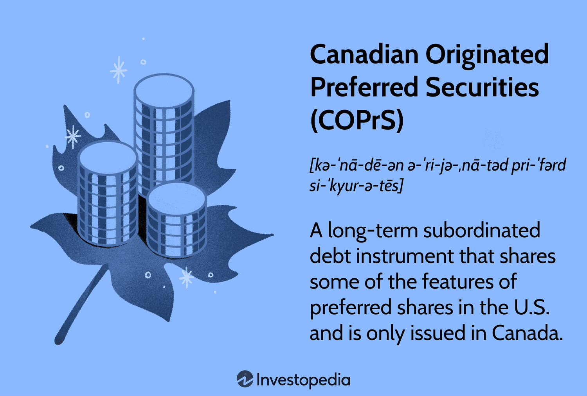

## Table of Contents

## What are Canadian-Originated Preferred Securities (COPs)?

Canadian-Originated Preferred Securities, often called COPs, are a type of financial product that companies in Canada use to raise money. They are a mix between stocks and bonds. When a company issues COPs, it gets money from investors. In return, the company promises to pay the investors regular payments, similar to the interest on a bond. If the company runs into financial trouble and can't make these payments, the COPs can be converted into the company's common shares. This gives investors a bit of protection because they might still get something back if the company struggles.

COPs are popular in Canada because they help companies get funding without adding too much debt to their balance sheets. They are also attractive to investors because they usually offer higher payments than regular bonds. However, they are a bit riskier than bonds because if the company does poorly, the value of the COPs can drop a lot. Despite this risk, many investors like COPs because they offer a good balance between the steady income of bonds and the potential for growth that comes with stocks.

## How do COPs differ from traditional preferred shares?

COPs and traditional preferred shares are both ways for companies to raise money, but they have some important differences. COPs are a mix of stocks and bonds. When you buy a COP, you get regular payments like you would with a bond. But if the company can't make these payments, the COP can turn into common shares of the company. This gives you a chance to still get something back if the company struggles. Traditional preferred shares, on the other hand, are more like regular stocks. They usually don't turn into common shares, and they pay dividends instead of interest.

Another key difference is how they affect the company's finances. COPs are often seen as a better option for companies because they don't add as much debt to the company's balance sheet. This can be good for the company's credit rating. Traditional preferred shares, however, are treated more like equity, which means they don't increase the company's debt load either, but they might dilute the ownership of existing shareholders. So, while both COPs and traditional preferred shares help companies raise money, COPs offer a bit more protection for investors and a different impact on the company's financial health.

## What are the typical features of COPs?

Canadian-Originated Preferred Securities, or COPs, are a type of investment that blends features of stocks and bonds. When you invest in COPs, you get regular payments, similar to the interest you'd get from a bond. These payments are usually higher than what you'd get from regular bonds, which makes COPs attractive to investors looking for steady income. But, COPs are riskier than bonds because if the company struggles financially, the value of the COPs can drop a lot.

Another important feature of COPs is that they can be converted into the company's common shares if the company can't make its payments. This gives investors a bit of protection because even if the company is doing poorly, they might still get something back by owning part of the company. COPs are popular with companies in Canada because they help raise money without adding too much debt to the company's balance sheet. This can be good for the company's credit rating and overall financial health.

## Who are the primary issuers of COPs?

The main companies that issue COPs are big banks and insurance companies in Canada. These companies use COPs to raise money without adding too much debt to their balance sheets. This can be good for their credit ratings and overall financial health. Banks like Royal Bank of Canada, Toronto-Dominion Bank, and Bank of Nova Scotia are among the primary issuers. Insurance companies, such as Manulife Financial and Sun Life Financial, also use COPs to raise funds.

COPs are attractive to these companies because they offer a way to get money from investors without the same risks that come with taking on more debt. For example, if a bank or insurance company issues more bonds, it increases their debt, which can hurt their credit rating. By issuing COPs, these companies can keep their debt levels lower while still getting the funds they need. This makes COPs a popular choice for big financial institutions in Canada.

## What are the benefits of investing in COPs?

Investing in COPs can be a good choice for people who want to earn a steady income. COPs usually pay out more than regular bonds, which means you get more money regularly. This can be really helpful if you need a reliable source of income. Also, because COPs can turn into common shares if the company has trouble paying, you have a bit of protection. If the company does poorly, you might still get something back by owning part of the company.

Another benefit of COPs is that they offer a mix of safety and potential growth. They are safer than regular stocks because they pay out regularly, but they can also grow in value like stocks. This makes them a good choice for people who want to balance the steady income of bonds with the chance to make more money if the company does well. Plus, because big banks and insurance companies in Canada often issue COPs, you can feel more secure knowing that these are usually stable and well-known companies.

## What are the risks associated with COPs?

Investing in COPs comes with some risks that you should know about. One big risk is that COPs can lose a lot of value if the company that issued them runs into financial trouble. If the company can't make its payments, the COPs might turn into common shares, but those shares could be worth much less than what you paid for the COPs. This means you could lose money, especially if the company's stock price drops a lot.

Another risk is that COPs are more complicated than regular bonds or stocks. Because they mix features of both, it can be hard to understand exactly what you're getting into. This complexity can make it difficult to predict how your investment will do, especially if the economy changes or if the company's financial situation shifts. So, while COPs can offer higher payments, the added risk and complexity mean they might not be the best choice for everyone.

## How are COPs taxed in Canada?

In Canada, the tax treatment of COPs can be a bit tricky. When you get payments from COPs, they are usually taxed as interest income. This means you have to pay tax on these payments at your regular income tax rate, which can be higher than the tax rate for dividends or capital gains. So, if you're in a high tax bracket, you might end up paying more tax on the money you get from COPs than you would on other types of investments.

If your COPs turn into common shares because the company can't make its payments, things can get even more complicated. Any gain you make when the COPs convert into shares is usually treated as a capital gain. You only have to pay tax on half of your capital gain, which is good. But if you sell the shares later, you'll have to pay tax on any profit you make from that sale too. So, it's important to think about how taxes might affect your investment in COPs and maybe talk to a tax advisor to understand it better.

## What role do COPs play in a diversified investment portfolio?

COPs can be a good addition to a diversified investment portfolio because they offer a mix of steady income and potential growth. They pay out more than regular bonds, which can help you earn a reliable income. This can be really helpful if you need money coming in regularly. Also, because COPs can turn into common shares if the company has trouble paying, you have a bit of protection. If the company does poorly, you might still get something back by owning part of the company.

Adding COPs to your portfolio can help balance out the risks and rewards of other investments. They are safer than regular stocks because they pay out regularly, but they can also grow in value like stocks. This makes them a good choice for people who want to balance the steady income of bonds with the chance to make more money if the company does well. Plus, because big banks and insurance companies in Canada often issue COPs, you can feel more secure knowing that these are usually stable and well-known companies.

## How has the market for COPs evolved over time?

The market for COPs has grown a lot over the years. When COPs first came out, not many people knew about them. But over time, more and more investors started to see the benefits of COPs. They liked that COPs paid out more than regular bonds and offered some protection if the company did poorly. Big banks and insurance companies in Canada started using COPs more because they helped raise money without adding too much debt. This made COPs a popular choice for these companies and attracted more investors.

As the market for COPs got bigger, they became a common part of many investment portfolios. People started to see COPs as a good way to balance the steady income of bonds with the potential for growth that comes with stocks. The demand for COPs went up, and more companies began to issue them. Even though COPs can be a bit riskier than bonds, many investors felt comfortable with the risks because they trusted the big banks and insurance companies that issued them. This trust helped the market for COPs keep growing and become an important part of the Canadian financial scene.

## What are the key regulatory considerations for COPs?

The key regulatory considerations for COPs in Canada are mainly about making sure they are treated fairly and openly. The Office of the Superintendent of Financial Institutions (OSFI) and the Canadian Securities Administrators (CSA) are the main groups that watch over COPs. They make rules to protect investors and keep the market honest. For example, companies that issue COPs have to give a lot of information to investors, like how the COPs work and the risks involved. This helps investors make smart choices about whether to buy COPs.

Another important part of regulating COPs is how they are treated when it comes to taxes and accounting. The Canada Revenue Agency (CRA) decides how the payments from COPs are taxed, which can affect how much money investors get to keep. Also, the rules from the International Financial Reporting Standards (IFRS) say how companies should show COPs on their financial statements. This helps keep things clear and makes sure everyone understands how COPs affect a company's money situation.

## How do COPs compare to other fixed income securities in terms of yield and risk?

COPs usually offer higher yields than regular bonds. This means you can get more money regularly from COPs than from other fixed income securities like government or corporate bonds. The higher yield is attractive to people who want a steady income, but it comes with more risk. COPs are riskier than regular bonds because if the company that issued them has financial trouble, the value of the COPs can drop a lot. If the company can't make its payments, the COPs might turn into common shares, but those shares could be worth less than what you paid for the COPs.

Compared to other fixed income securities, COPs offer a mix of safety and potential growth. They are safer than regular stocks because they pay out regularly, but they can also grow in value like stocks. This makes them a good choice for people who want to balance the steady income of bonds with the chance to make more money if the company does well. However, the added risk and complexity mean they might not be the best choice for everyone. Regular bonds are simpler and less risky, but they usually offer lower yields. So, while COPs can give you higher returns, you have to be okay with taking on more risk.

## What advanced strategies can be used when investing in COPs?

When you're thinking about investing in COPs, you might want to use some smart strategies to make the most of your money. One good strategy is to look at the credit ratings of the companies that issue COPs. Companies with higher credit ratings are less likely to have trouble paying you back, which makes their COPs safer. You can also use a strategy called laddering, where you buy COPs that mature at different times. This can help you get a steady income and lower the risk of losing money if interest rates change a lot.

Another strategy is to mix COPs with other kinds of investments in your portfolio. This can help you balance the risk and reward of your investments. For example, you might put some money in COPs, some in regular bonds, and some in stocks. This way, if the value of your COPs goes down, the other investments might help make up for it. Also, you can use a strategy called dollar-cost averaging, where you invest a fixed amount of money in COPs at regular times. This can help you buy more COPs when prices are low and fewer when prices are high, which can be a good way to manage risk over time.

## References & Further Reading

[1]: Tiwari, A. (2009). ["Understanding Capital Sources and Financing Strategies: Debt versus Equity Financing."](https://www.cliffsnotes.com/study-notes/21300572) SAGE Journals.

[2]: Patterson, S. (2013). ["Dark Pools: The Rise of the Machine Traders and the Rigging of the U.S. Stock Market."](https://www.amazon.com/Dark-Pools-Machine-Traders-Rigging/dp/0307887189) Crown Business.

[3]: Beaver, W.H., Kettler, P., & Scholes, M. (1970). ["The Association Between Market Determined and Accounting Determined Risk Measures."](https://www.jstor.org/stable/244204) The Accounting Review.

[4]: Schwartz, R.A., & Senior, I. (2013). ["Regulating the Equity Markets: Looking Back to See Ahead."](https://www.semanticscholar.org/paper/Institutionalization-of-the-equity-markets-Schwartz/385dc00b58ebd125715d7f4a1dc81dc24c7a78e7) Edward Elgar Publishing.

[5]: Treleaven, P., Galas, M., & Lalchand, V. (2013). ["Algorithmic Trading Review."](https://dl.acm.org/doi/10.1145/2500117) Communications of the ACM.

[6]: Chan, E.P. (2008). ["Quantitative Trading: How to Build Your Own Algorithmic Trading Business."](https://github.com/ftvision/quant_trading_echan_book) John Wiley & Sons.

[7]: Aldridge, I. (2013). ["High-Frequency Trading: A Practical Guide to Algorithmic Strategies and Trading Systems."](https://www.amazon.com/High-Frequency-Trading-Practical-Algorithmic-Strategies/dp/1118343506) John Wiley & Sons.

[8]: Fabozzi, F.J., & Mann, S.V. (2012). ["Handbook of Fixed Income Securities."](https://www.amazon.com/Handbook-Fixed-Income-Securities-Eighth/dp/0071768467) McGraw-Hill Education.