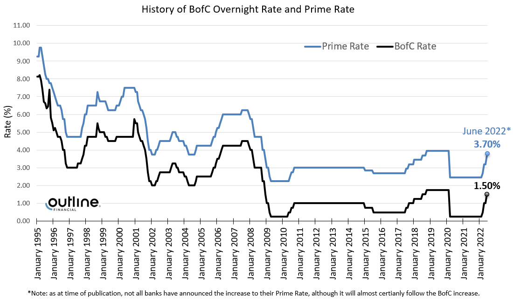

The financial markets are perpetually undergoing transformations driven by the integration of new technologies and strategies. Notably, the Canadian money market and its associated overnight rate have established themselves as crucial components within this evolving landscape. At the forefront of modern finance, algorithmic trading has emerged as an influential tool, especially within money markets, where it contributes significantly to trading efficiency and liquidity enhancement.

The Canadian money market serves as a fundamental mechanism for short-term borrowing and lending, typically involving financial instruments with maturities of one year or less. Within this context, the overnight rate—a key interest rate representing the cost at which major financial institutions can borrow or lend excess reserves in the overnight market—plays a pivotal role. The Canadian overnight rate is a central element in the country's monetary policy framework, with the Bank of Canada actively influencing it to guide economic conditions.



Algorithmic trading, a method of executing orders using automated pre-programmed trading instructions, has revolutionized engagement with financial markets. It offers rapid execution speeds and the ability to manage complex data sets, making it a vital tool in the high-frequency nature of modern money markets. This integration of technology facilitates the handling of vast marketplaces with precision and speed unachievable through traditional means.

By exploring the dynamic interplay between financial technologies and traditional market components, one can gain insight into the broader landscape of the Canadian financial ecosystem. This article investigates into the roles and interactions of the Canadian overnight market rate, the encompassing money market, and the transformative powers of algorithmic trading, highlighting their interconnectedness and impact on the financial framework in Canada and beyond.

## Table of Contents

## Understanding the Canadian Overnight Money Market Rate

The Canadian Overnight Money Market Rate, commonly known as the overnight rate, is a critical financial instrument influencing the Canadian economy. It represents the interest rate at which financial institutions lend or borrow funds among themselves overnight. This rate is significant because it directly impacts other interest rates within the economy, such as those for consumer loans and mortgages, thus influencing economic activity.

The Bank of Canada, the nation's central bank, plays a pivotal role in regulating the overnight rate. It does so by setting a target for the overnight rate as part of its monetary policy strategy. The Bank conducts operations in the financial markets to ensure that the overnight rate remains close to the target. One primary tool used is open market operations, where the Bank buys or sells government securities to adjust the availability of reserves in the banking system, thus influencing the actual overnight rate. Additionally, the Bank provides standing facilities, offering overnight loans or deposits at predetermined interest rates to stabilize short-term rates. The Bank’s influence on the overnight rate is crucial in maintaining economic stability and promoting the overall health of the Canadian economy.

Compared internationally, the Canadian Overnight Money Market Rate shares similarities with other short-term interest benchmarks. The United States utilizes the Federal Funds Rate, which serves as a benchmark for the [interest rate](/wiki/interest-rate-trading-strategies) at which depository institutions trade federal funds with one another overnight. Similarly, the European Central Bank (ECB) uses the refinancing operations and the marginal lending facility rates as key rates influencing overnight lending conditions in the eurozone.

While all these rates serve as instruments for their respective central banks to guide economic activity, there are distinctions in their operational frameworks. For example, the Federal Funds Rate is primarily a target rate emphasized in the U.S. Federal Reserve's policy announcements. In contrast, the ECB's repo rate is part of a set of interest rates that influence [liquidity](/wiki/liquidity-risk-premium) conditions and signaling the stance of monetary policy.

The Canadian Overnight Money Market Rate, compared to its international counterparts, reflects Canada’s unique economic conditions and the Bank of Canada's policy objectives. The rate's regulation plays a crucial role in achieving price stability and supporting sustainable economic growth, making it an essential component of Canada's monetary policy framework.

## Impact of Overnight Rate on Canadian Financial Markets

The Canadian overnight rate is a crucial component of the country's financial system, serving as a benchmark for various interest rates, including those on consumer loans and mortgages. This rate, influenced by the Bank of Canada's monetary policy, directly affects lending rates, which in turn impact consumer behavior and overall economic activity. When the overnight rate rises, banks typically increase the interest rates on loans and mortgages. This scenario makes borrowing more expensive for consumers and businesses, potentially slowing down spending and investment. Conversely, a reduction in the overnight rate generally leads to lower lending rates, encouraging borrowing and stimulating economic growth.

The overnight rate also plays a significant role in determining the exchange rate of the Canadian dollar. Interest rate differentials between Canada and other countries can influence capital flows and investor decisions, thereby affecting the value of the Canadian dollar. For instance, a higher overnight rate relative to other major economies might attract foreign investment, increasing demand for the Canadian dollar and leading to its appreciation. On the other hand, a lower rate could deter investors, prompting depreciation.

Changes in the overnight rate are closely watched as indicators of economic direction. The Bank of Canada adjusts this rate in response to economic conditions to achieve its monetary policy objectives, including controlling inflation and supporting economic growth. An increase in the rate might signal the central bank's intent to curb inflation, whereas a decrease could indicate a stimulus to counteract economic slowdown. Thus, the overnight rate serves as a signal of the central bank's economic outlook and policy stance, providing valuable insights to investors, policymakers, and businesses regarding the future trajectory of the Canadian economy.

## Algorithmic Trading in the Canadian Money Market

Algorithmic trading, a method utilizing computer algorithms to execute trades at high speeds and volumes, has revolutionized the Canadian money market by enhancing efficiency and liquidity. By automatically evaluating market conditions and placing trades, algorithms minimize human error, operate continuously without fatigue, and react to market changes instantly. This technology-driven approach optimizes execution strategies, reducing transaction costs and latency.

In the Canadian financial ecosystem, [algorithmic trading](/wiki/algorithmic-trading) plays a crucial role by capitalizing on short-term price inefficiencies and ensuring tighter bid-ask spreads, which significantly contribute to market liquidity. High-frequency trading ([HFT](/wiki/high-frequency-trading-strategies)), a subset of algorithmic trading, is particularly prevalent. HFT strategies focus on extremely short-term opportunities and rely on advanced quantitative models and high-speed access to markets.

A typical algorithmic trading strategy involves the use of statistical [arbitrage](/wiki/arbitrage), where algorithms exploit small price discrepancies between related financial instruments, correcting these inefficiencies for profit. For instance, [statistical arbitrage](/wiki/statistical-arbitrage) may involve pairs trading, which requires real-time analysis of the historical correlation between two securities, assessing deviations, and subsequently executing trades to benefit from mean reversion.

Consider a simplified Python example of a [pair trading](/wiki/pair-trading) algorithm: 

```python
import numpy as np
import pandas as pd

# Generate synthetic price data
np.random.seed(0)
prices_A = np.random.normal(100, 1, 100)
prices_B = prices_A + np.random.normal(0, 0.5, 100)  # prices_B closely tracks prices_A with some noise

# Calculate the rolling spread between A and B
spread = prices_A - prices_B
mean_spread = pd.Series(spread).rolling(window=20).mean()
std_spread = pd.Series(spread).rolling(window=20).std()

# Generate buy and sell signals based on z-scores
z_score = (spread - mean_spread) / std_spread
buy_signal = z_score < -1
sell_signal = z_score > 1
```

In this example, a trading signal is generated when the z-score of the spread deviates significantly from zero, indicating a potential reversion to the mean.

Various algorithms, such as VWAP (Volume Weighted Average Price) and TWAP (Time Weighted Average Price), are implemented to reduce market impact and slippage. These are particularly prevalent in the Canadian financial sector. VWAP algorithms split a large order into smaller parts, executing proportionately over the day to match the daily [volume](/wiki/volume-trading-strategy) profile, minimizing disruption to the market.

Algorithmic trading's integration into the Canadian money market has not only fostered liquidity and reduced costs but also prompted the need for robust regulatory frameworks. As trading strategies advance, so do the risks associated with rapid market fluctuations, necessitating stringent oversight to ensure market stability and integrity.

## Integration of CORRA in Algorithmic Trading Strategies

The Canadian Overnight Repo Rate Average (CORRA) serves as a foundational benchmark within the Canadian financial markets and has garnered particular importance in the context of algorithmic trading strategies. CORRA is calculated as a weighted average rate of overnight repo transactions conducted in the general collateral repo market. It is designed to reflect the cost of borrowing Canadian dollars overnight and is widely considered a reliable and nearly risk-free rate. Its reputation for stability and precision makes CORRA an attractive element for integration into algorithmic trading models.

### Usage of CORRA as a Benchmark in Trading Strategies

Algorithmic trading strategies frequently employ CORRA as a benchmark to optimize various financial operations and enhance decision-making processes. Because of its role in representing short-term funding costs, traders and quantitative analysts utilize CORRA to calibrate bond pricing models, assess interest rate derivatives, and determine yield curves. In these contexts, CORRA's use allows for more accurate modeling of short-term interest rate dynamics and assists in the development of high-frequency trading algorithms. For instance, a typical algorithmic trading system may integrate CORRA to compute the theoretical price of a financial instrument by applying interest rate parity or to optimize arbitrage strategies that depend on short-term interest movements.

Data analytics and [machine learning](/wiki/machine-learning) models can leverage historical CORRA data sets to predict future movements in overnight rates, accounting for macroeconomic indicators and market conditions. By enriching trading algorithms with this risk-free rate, traders gain the potential to enhance prediction accuracy and increase the profitability of trading strategies, especially in the highly competitive money markets.

### Impact of CORRA in the LIBOR Transition Phase and Its Importance as a Risk-Free Rate

The international financial sector has experienced significant shifts due to the transition from the London Interbank Offered Rate (LIBOR) to alternative nearly risk-free rates. In this transition, CORRA has emerged as a vital element for Canadian markets, providing continuity amidst the shift. LIBOR’s discontinuation required the adoption of new reference rates, and CORRA’s comprehensive market acceptance positioned it as a preferred substitute for short-term borrowing and lending benchmarks.

CORRA’s role in the LIBOR transition is underscored by its methodological strengths and alignment with international regulatory standards. As a nearly risk-free rate, CORRA helps align Canadian financial instruments with global markets' requirements, thereby fostering greater transparency and reducing systemic risks associated with rate manipulation. For algorithmic trading, the transition to CORRA-based standards has required updates in existing strategies, necessitating the recalibration of trading algorithms and models to accommodate the new rate environments effectively.

Overall, the adoption of CORRA in algorithmic trading strategies promises enhanced precision, robust calibration of financial models, and alignment with wider global financial regulations, all while offering a more secure and transparent financial framework for market participants.

## Challenges and Opportunities in Algo Trading with Overnight Rates

Algorithmic trading in connection with overnight rates presents both challenges and opportunities for participants in the Canadian financial markets. Navigating regulatory requirements and embracing technological innovations are critical to successfully leveraging overnight rates in trading strategies. This section examines these aspects and explores future prospects in this area.

**Regulatory Challenges and Compliance Issues**

Algorithmic trading, while offering numerous advantages, operates within a complex regulatory framework designed to ensure market stability and integrity. In Canada, financial entities engaging in algorithmic trading must comply with guidelines set forth by regulatory bodies such as the Investment Industry Regulatory Organization of Canada (IIROC) and the Bank of Canada. These regulations encompass a range of requirements, including algorithm testing and risk management protocols, which are essential to prevent market manipulation and ensure fair trading practices.

A significant challenge lies in the continuous evolution of these regulations, as regulators strive to keep pace with technological advancements in algorithmic systems. Traders must remain vigilant and adaptable, ensuring that their trading algorithms comply with both current and anticipated regulatory developments.

**Technological Advancements Driving Algorithmic Trading**

Technological advancements have significantly enhanced the efficiency and sophistication of algorithmic trading in money markets. High-frequency trading (HFT) technologies enable traders to execute large volumes of trades at speeds unimaginable in manual trading, reducing transaction costs and increasing market liquidity.

Machine learning and [artificial intelligence](/wiki/ai-artificial-intelligence) are increasingly utilized to refine trading algorithms. These technologies facilitate the analysis of vast datasets to identify patterns and optimize trading decisions, thereby improving returns on investment. Additionally, cloud computing provides scalable resources that allow trading firms to deploy complex algorithmic strategies without the need for substantial on-premises infrastructure.

Python has become a popular programming language for developing algorithmic trading strategies due to its simplicity and extensive libraries like NumPy and pandas. Here's a basic illustration of how Python can be used in an algorithmic trading context:

```python
import pandas as pd
import numpy as np

# Function for a simple moving average strategy
def moving_average_strategy(data, short_window, long_window):
    signals = pd.DataFrame(index=data.index)
    signals['signal'] = 0.0

    # Short simple moving average
    signals['short_mavg'] = data['Close'].rolling(window=short_window, min_periods=1).mean()

    # Long simple moving average
    signals['long_mavg'] = data['Close'].rolling(window=long_window, min_periods=1).mean()

    # Create signals
    signals['signal'][short_window:] = np.where(signals['short_mavg'][short_window:] > signals['long_mavg'][short_window:], 1.0, 0.0)   
    signals['positions'] = signals['signal'].diff()

    return signals

# Sample call
# data = pd.read_csv('market_data.csv')  # Assuming appropriate data is loaded
# signals = moving_average_strategy(data, short_window=40, long_window=100)
```

**Future Opportunities and Potential Strategies**

The increasing integration of the Canadian Overnight Repo Rate Average (CORRA) as a benchmark offers new strategies for exploiting overnight rates. As the financial industry shifts from LIBOR, CORRA provides a reliable risk-free rate, facilitating the development of derivatives and other financial instruments.

Future opportunities in algorithmic trading with overnight rates include the further application of predictive analytics and AI-driven models. These technologies can anticipate rate movements and capitalize on arbitrage opportunities, enhancing profit margins. Moreover, as blockchain technology continues to develop, it might offer solutions for transparent and secure transaction recording, mitigating some compliance challenges.

In conclusion, while regulatory compliance presents ongoing challenges, technological advancements and strategic shifts towards robust benchmarks like CORRA open new vistas for profit and risk management in algorithmic trading. Participants in this sphere must stay abreast of regulatory changes and technological innovations to capitalize on these opportunities effectively.

## Conclusion

The Canadian overnight rate serves as a fundamental cornerstone in the financial markets, influencing various economic components such as consumer loans, mortgages, and the exchange rate of the Canadian dollar. This benchmark rate, regulated by the Bank of Canada, acts as a pivotal indicator of the economic trajectory, aligning closely with international rates like the Federal funds rate and the European Central Bank's repo rate. Its adjustments reflect broader economic policies and conditions, guiding expectations and actions within the market.

Algorithmic trading plays a crucial role in augmenting market efficiency. By employing sophisticated algorithms, traders can execute orders at speeds and frequencies that surpass human capabilities. This technological advancement aids in enhancing liquidity and reducing transaction costs in the money market, ensuring a more fluid financial system. The integration of these algorithms within the Canadian financial market ecosystem has demonstrated significant improvements in the precision and timeliness of market operations.

Looking ahead, the Canadian money markets stand on the cusp of transformative growth, driven by technological innovation. The continued evolution of algorithmic trading, powered by advancements in machine learning and data analytics, promises to reshape the landscape of financial markets. As these technologies mature, they offer new opportunities for optimizing trading strategies, rigorously managing risk, and adapting to regulatory changes. The integration of technology will remain a decisive [factor](/wiki/factor-investing) in the advancement of Canadian money markets, ensuring they remain robust, efficient, and responsive to global economic shifts.

## References & Further Reading

[1]: ["Monetary Policy Framework"](https://www.elibrary.imf.org/view/journals/001/2022/022/article-A001-en.xml) from the Bank of Canada website, which provides in-depth information about the Canadian monetary policy framework and the overnight rate.

[2]: Ramos, F., & Moscato, P. (2016). ["Artificial Market Simulation: Algorithmic Trading and Central Bank Interventions"](https://www.researchgate.net/publication/378548435_Algorithmic_Trading_and_AI_A_Review_of_Strategies_and_Market_Impact), Smart Applications and Data Analysis for Smart Grids and Smart Cities, 363-374.

[3]: Billio, M., & Pelizzon, L. (2020). ["The Importance of Trading Algorithms in the Financial Markets"](https://papers.ssrn.com/sol3/papers.cfm?abstract_id=3659271), Journal of Operational Research Society.

[4]: ["Algorithmic and High-frequency Trading"](https://www.amazon.com/Algorithmic-High-Frequency-Trading-Mathematics-Finance/dp/1107091144) by Arsenijević, A., & Gomber, P.

[5]: Dungey, M., & Luciani, M. (2012). ["Financial Market Liquidity and Algorithmic Trading"](https://papers.ssrn.com/sol3/papers.cfm?abstract_id=2166504), Quantitative Finance, 12(12), 1837-1850.

[6]: Canadian Securities Administrators (CSA). ["Joint CSA/IIROC Notice 23-313: Regulatory Guidance Pertaining to Short Selling and Failed Trades"](https://www.securities-administrators.ca/investor-alerts/cgwise-7/) from the Investment Industry Regulatory Organization of Canada (IIROC) website.

[7]: Duffie, D. (2019). ["Prone to Fail: The Pre-Crisis Financial System"](https://www.aeaweb.org/articles?id=10.1257/jep.33.1.81), Journal of Economic Perspectives, 33(1), 81-106.