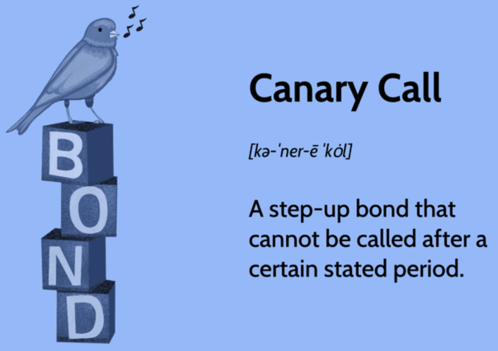

## Table of Contents

## What is a Canary Call?

A Canary Call is a special kind of phone call that companies use to check if their phone systems are working properly. It's like a test call that helps them make sure everything is okay before they start using the system for real calls. The name comes from the old practice of miners using canaries to check for dangerous gases in mines. If the canary was okay, it was safe for the miners.

Companies use Canary Calls to make sure their phone lines are clear and working well. They might make these calls at different times of the day or week to see if there are any problems. If something goes wrong during a Canary Call, the company can fix it before it affects their customers. This way, they can keep their phone services running smoothly and avoid any big issues.

## Why are Canary Calls used in software development?

In software development, Canary Calls are used to test new features or updates before they are released to everyone. Developers want to make sure that the new code works well and doesn't cause any problems. They do this by releasing the new code to a small group of users first. These users are like the "canaries" in the mine, helping to find any issues before the update goes out to all users.

If the small group of users doesn't run into any problems, the developers know it's safe to release the update to everyone. This way, they can fix any issues that come up without affecting all their users at once. Using Canary Calls helps developers make their software better and more reliable, because they can catch and fix problems early on.

## How does a Canary Call work?

A Canary Call in software development is like a test run for new code. Developers want to make sure that new features or updates work well before everyone gets them. So, they release the new code to just a few users first. These users try out the new stuff and see if it works okay. If they don't have any problems, the developers know it's safe to give the update to everyone.

If the small group of users finds any issues, the developers can fix them before the update goes out to all users. This way, they can make sure the software stays reliable and works smoothly for everyone. Using Canary Calls helps developers catch and fix problems early, so the big group of users doesn't have to deal with them.

## What are the benefits of using Canary Calls?

Using Canary Calls helps developers find and fix problems early. When they release new code to a small group of users first, they can see if anything goes wrong before everyone gets the update. This way, they can make sure the software works well and doesn't cause issues for all users. It's like checking the water before jumping into a pool – you want to make sure it's safe.

Canary Calls also help keep the software reliable. If something goes wrong with the new code, only a few people will be affected, not everyone. This means the developers can fix the problem without causing a big headache for all their users. It's a smart way to make sure the software stays smooth and works well for everyone who uses it.

## Can you explain the difference between Canary Calls and other deployment strategies?

Canary Calls are different from other deployment strategies because they focus on testing new code with a small group of users first. This is like dipping your toe in the water before jumping in. Other strategies, like Blue-Green Deployments, involve setting up two identical environments, one for the old code (blue) and one for the new code (green). If the new code works well, you switch all users over to the green environment. This is more like changing lanes on a highway – you make sure the new lane is clear before everyone moves over.

Another common strategy is Rolling Updates, where you gradually roll out the new code to all users over time. It's like slowly turning up the heat on a stove, making sure nothing burns. With Canary Calls, you're more cautious, only giving the new code to a few users at first. If it's safe, you then give it to everyone. This way, you can catch and fix problems early without affecting all your users at once. Each strategy has its own way of making sure new code works well, but Canary Calls are all about being extra careful with a small group before going big.

## What are the typical components of a Canary Call system?

A Canary Call system in software development includes a few key parts. First, there's the new code that developers want to test. They release this new code to a small group of users, called the canary group. This group uses the new code and helps find any problems before everyone gets it. The system also needs a way to track how the new code is working. Developers use tools to watch what's happening with the canary group, so they can see if there are any issues.

Another important part of a Canary Call system is the ability to quickly switch back if something goes wrong. If the canary group finds problems, developers need to be able to stop using the new code and go back to the old version fast. This keeps the software working well for everyone. Finally, the system needs good communication. Developers must tell the canary group what's happening and listen to their feedback. This helps make sure the new code is safe and ready for everyone to use.

## How do you set up a Canary Call in a typical development environment?

To set up a Canary Call in a typical development environment, you first need to identify the new code or feature you want to test. Once you have that, you select a small group of users who will be the "canaries." These users will try out the new code first. You need to make sure you have the right tools to track how the new code is working with this group. These tools will help you see if there are any problems or if everything is running smoothly.

Next, you release the new code to the canary group. You watch closely to see how they interact with the new feature and check for any issues. If everything looks good, you can start rolling out the new code to more users. But if you find problems, you need a way to quickly switch back to the old version of the code. This keeps the software working well for everyone. Good communication with the canary group is also important. You need to tell them what's happening and listen to their feedback to make sure the new code is ready for everyone.

## What metrics should be monitored during a Canary Call?

During a Canary Call, you should keep an eye on a few important things to make sure the new code is working well. First, you need to watch how well the system is performing. This means checking things like how fast the software runs and how much it's using the computer's resources. If the new code makes the software slow or use too much memory, you'll know there's a problem. You also need to look at how users are interacting with the new feature. Are they using it a lot? Are they having trouble with it? This helps you see if the new code is doing what it's supposed to do.

Another important thing to monitor is any errors or crashes. If the canary group is seeing a lot of errors or if the software is crashing, that's a big sign that something needs to be fixed. You should also keep track of how happy the users are with the new feature. Are they giving good feedback? Are they reporting any issues? This feedback is really helpful because it tells you if the new code is ready for everyone or if it needs more work. By watching these things closely, you can make sure the new code is safe and ready to be used by all your users.

## What are common challenges when implementing Canary Calls?

One common challenge when using Canary Calls is [picking](/wiki/asset-class-picking) the right group of users to test the new code. You need to make sure this group is a good mix of different kinds of users, so the test results are helpful. If the group is too small or not varied enough, you might miss important problems that would show up with a bigger, more diverse group of users. Also, it can be hard to make sure the canary group knows what they're doing and gives good feedback. If they don't understand the new feature or don't use it much, you won't get the information you need to make the software better.

Another challenge is keeping the system stable while you're testing. If you release the new code and it causes problems, you need to be able to switch back to the old version quickly. This can be tricky to set up and make sure it works right. Plus, you have to watch a lot of different things at the same time, like how fast the software runs, if it's using too much memory, and if users are having any issues. It can be hard to keep track of all these things and make sure nothing slips through the cracks. But if you do it right, Canary Calls can help you find and fix problems before they affect everyone.

## How can Canary Calls be integrated with continuous integration/continuous deployment (CI/CD) pipelines?

Canary Calls can be smoothly added to CI/CD pipelines by making them part of the way new code gets tested and rolled out. In a CI/CD setup, new code goes through lots of checks and tests before it's used by everyone. When you add Canary Calls, you set it up so that after the new code passes all the usual tests, it gets sent to a small group of users first. This group tries out the new code, and you watch closely to see if everything works okay. If the new code does well with this group, you can then roll it out to everyone through the rest of the CI/CD pipeline.

The tricky part is making sure the CI/CD pipeline can handle switching back to the old code quickly if the Canary Call finds problems. You need to set up the system so it can stop using the new code and go back to the old version without any hiccups. This means having good tools to keep an eye on how the new code is doing and being ready to act fast if something goes wrong. By doing this, you can use Canary Calls to make your software better and safer, all while keeping your CI/CD process smooth and efficient.

## What are advanced techniques for optimizing Canary Call processes?

One advanced technique for optimizing Canary Call processes is to use automated monitoring and alerting systems. These systems can watch how the new code is working with the canary group and quickly tell you if there are any problems. They can check things like how fast the software is running, how much memory it's using, and if users are having any trouble. By setting up these systems, you can catch issues early and fix them before they affect everyone. This makes the whole process smoother and more reliable.

Another technique is to use A/B testing within the Canary Call. Instead of just giving the new code to a small group, you can split that group into two smaller groups. One group gets the new code, and the other group keeps using the old code. By comparing how these two groups do, you can see if the new code is really better. This helps you make sure the changes you're making are actually improving the software. It's a smart way to make your Canary Calls more effective and get better results from your testing.

## Can you discuss case studies where Canary Calls significantly improved deployment outcomes?

One example where Canary Calls made a big difference is with a company called Netflix. They use Canary Calls to test new features before everyone gets them. They once rolled out a new recommendation system to a small group of users first. They watched to see if the new system was working well and if it was making users happy. They found a few small problems that they fixed right away. Because they used Canary Calls, they were able to make the new system better before everyone started using it. This helped them avoid big problems and made their users happier with the new feature.

Another case is with Google. They used Canary Calls when they were updating their search engine. They gave the new version of the search engine to a small group of users and watched how it worked. They noticed that the new version was a bit slower than the old one. Thanks to Canary Calls, they were able to fix the speed issue before rolling it out to everyone. This made sure that their search engine stayed fast and reliable for all users. Using Canary Calls helped Google keep their software working well and avoid any big issues for their users.

## References & Further Reading

[1]: Shamloo, M. E., & Masoumi, B. (2021). ["Optimal Call Policy of Step-Up Callable Bonds: The Canary Call Example."](https://pubmed.ncbi.nlm.nih.gov/34491006/) Springer, Cham.

[2]: De Prado, M. L. (2018). ["Advances in Financial Machine Learning."](https://www.amazon.com/Advances-Financial-Machine-Learning-Marcos/dp/1119482089) Wiley.

[3]: Chan, E. P. (2009). ["Quantitative Trading: How to Build Your Own Algorithmic Trading Business."](https://github.com/ftvision/quant_trading_echan_book) Wiley.

[4]: Jansen, S. (2020). ["Machine Learning for Algorithmic Trading: Predictive models to extract signals from market and alternative data for systematic trading strategies in Python."](https://www.amazon.com/Machine-Learning-Algorithmic-Trading-alternative/dp/1839217715) Packt Publishing.

[5]: Aronson, D. R. (2006). ["Evidence-Based Technical Analysis: Applying the Scientific Method and Statistical Inference to Trading Signals."](https://www.amazon.com/Evidence-Based-Technical-Analysis-Scientific-Statistical/dp/0470008741) Wiley.