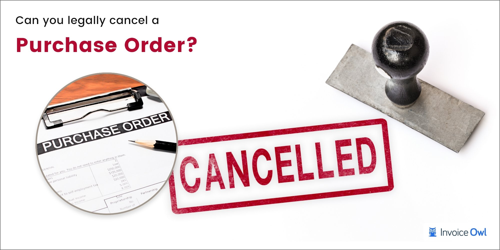

## Table of Contents

## What is a canceled order?

A canceled order is when someone decides not to go through with a purchase they had planned. This can happen for many reasons, like finding a better deal somewhere else, changing their mind about the item, or not having enough money.

When an order is canceled, the seller needs to stop the process of getting the item ready and sending it out. If the order was already paid for, the seller usually gives the money back to the buyer. It's important for both the buyer and seller to know about the cancellation rules to avoid any problems.

## Why might someone cancel an order?

Someone might cancel an order because they found the same item cheaper somewhere else. They might also change their mind about wanting the item after they placed the order. Sometimes, people realize they don't need the item or they find something they like better. Another reason could be that they don't have enough money to pay for it anymore.

Other times, issues with the website or the seller might make someone cancel their order. For example, if the delivery is going to take too long or if there are problems with the payment process, a person might decide not to go through with the purchase. Also, if the customer service is bad or if they hear bad things about the product after ordering, they might want to cancel their order.

## How does the process of canceling an order work?

When someone wants to cancel an order, they usually need to contact the seller as soon as possible. This can be done through the website where the order was placed, by email, or by phone. The buyer needs to give the order number and explain why they want to cancel. The seller will then check if the order can still be canceled. If the item hasn't been shipped yet, it's usually easy to cancel the order.

If the order has already been shipped, canceling can be more complicated. The buyer might need to refuse the delivery when it arrives, or they might have to send the item back after receiving it. In these cases, the seller usually gives the buyer's money back, but they might have to pay for the shipping costs to return the item. It's important for the buyer to know the seller's cancellation policy to understand what they can do and what it might cost.

## What are the common types of canceled orders?

There are a few common types of canceled orders. One type is when a customer cancels before the order is shipped. This happens a lot because the customer might find a better price somewhere else or they might change their mind about the item. It's pretty easy to cancel this type of order because the item hasn't left the seller's place yet.

Another type is when the order has already been shipped but the customer still wants to cancel it. This can be trickier. The customer might need to refuse the delivery when it arrives or they might have to send the item back after getting it. In these cases, the seller usually gives the money back, but the customer might have to pay to send the item back.

Sometimes, orders get canceled by the seller. This can happen if there's a problem with the payment or if the item is out of stock. When this happens, the seller needs to let the customer know and give their money back if they already paid.

## What are the consequences of canceling an order for the buyer?

When a buyer cancels an order, they might have to pay some fees. If the order hasn't been shipped yet, canceling is usually easy and there might not be any fees. But if the order has already been shipped, the buyer might need to pay to send the item back. Sometimes, the seller might also charge a restocking fee, which is money they take to put the item back in their store.

Another consequence is that the buyer might lose the item they wanted. If they cancel because they found a better deal somewhere else, they might miss out on getting the item from the first seller. Also, if the item is popular and sells out quickly, canceling the order could mean they won't be able to get it later. It's important for buyers to think carefully before canceling an order because it can affect their money and what they can buy.

## What are the consequences of canceling an order for the seller?

When a buyer cancels an order, it can affect the seller in a few ways. First, the seller might lose money because they have to give the buyer's money back. If the order was already shipped, the seller might also have to pay for the cost of sending the item back. Sometimes, the seller has to pay to put the item back in their store, which is called a restocking fee. All these costs can add up and make it harder for the seller to make money.

Another problem for the seller is that they might have to do more work because of the canceled order. They need to stop the order from being sent out, which can take time. If the item was already shipped, the seller has to deal with getting it back and checking if it's okay to sell again. This extra work can make things more complicated for the seller. It's important for sellers to have good rules about canceling orders to help them handle these problems better.

## How can a business manage canceled orders effectively?

A business can manage canceled orders effectively by having clear rules about how to cancel orders. They should put these rules on their website so customers know what to do if they want to cancel. The business should also make it easy for customers to contact them if they need to cancel an order. They can use email, phone, or a special form on their website. This way, customers can quickly tell the business they want to cancel, and the business can stop the order from being sent out.

It's also important for the business to keep track of their orders and know which ones have been canceled. They can use a computer system to help with this. If an order has already been sent out, the business needs to tell the customer how to send it back and if there are any fees for doing so. By being clear and quick about handling canceled orders, the business can save time and money, and keep their customers happy.

## What are the legal implications of canceling an order?

When a customer cancels an order, there can be legal rules that both the buyer and seller need to follow. These rules can be different depending on where you live and what the business's cancellation policy says. For example, some places have laws that say a customer can cancel an order within a certain number of days and get their money back. But, the business might also have rules about how to cancel and what fees there might be, like a restocking fee or return shipping costs.

If a business doesn't follow these rules, they might get in trouble. For example, if they don't give the customer's money back when they should, or if they charge too much for canceling, the customer might be able to take legal action. It's important for businesses to know the laws about canceling orders in their area and to make sure their policies are fair and clear. This helps them avoid legal problems and keeps customers happy.

## How do different industries handle canceled orders?

In the retail industry, businesses usually have clear rules about canceling orders. If a customer wants to cancel before the item is shipped, it's pretty easy. The store will stop the order and give the customer's money back. But if the item has already been sent out, the customer might need to send it back and pay for the return shipping. Stores often have a time limit, like 30 days, for customers to cancel and return items. This helps keep things fair for both the store and the customer.

In the travel industry, canceling orders can be more complicated. If someone cancels a flight or hotel booking, they might have to pay a fee, and how much they get back depends on the company's rules and how soon they cancel. For example, canceling a flight close to the departure date might mean getting less money back. Travel companies need to be clear about their cancellation policies so customers know what to expect. This helps avoid confusion and keeps customers happy even if they need to cancel their plans.

In the food delivery industry, canceling an order is usually quick because food is made fresh and can't be saved for later. If a customer cancels before the food is made, the restaurant can stop the order easily and give the money back. But if the food is already being made or on its way, canceling can be harder. The restaurant might keep some of the money to cover the cost of the food. It's important for food delivery services to have simple rules about canceling so customers know what to do if they change their mind.

## What technologies are used to facilitate order cancellation?

Businesses use different technologies to make canceling orders easier. One common technology is a website or app that lets customers cancel their orders quickly. For example, a customer can log into their account, find their order, and click a button to cancel it. The website or app then sends a message to the business's computer system to stop the order. This helps the business know right away that the order should not be sent out, and they can give the customer's money back faster.

Another technology that helps is a special computer system called an order management system (OMS). This system keeps track of all the orders a business gets. When a customer cancels an order, the OMS updates the order's status and tells the people who pack and ship items not to send it. If the order has already been shipped, the OMS can help the business know where the item is and how to get it back. Using an OMS makes handling canceled orders smoother and helps the business work better.

## How can data analytics help in understanding canceled orders?

Data analytics can help businesses understand why customers cancel their orders by looking at a lot of information about past orders. By studying this data, businesses can find patterns, like if customers often cancel orders at certain times of the year or if they cancel more often when prices are high. This information can show the business what might be causing customers to change their minds, like slow shipping times or problems with the website. Knowing these reasons can help the business fix these issues and make customers happier, which might lead to fewer canceled orders.

Using data analytics also helps businesses see how different groups of customers behave. For example, the business might find that people in one area cancel more often than people in another area. They can then look closer to see if there are special reasons for this, like local events or different customer needs. By understanding these differences, the business can make better plans to keep customers happy and reduce the number of canceled orders. This way, data analytics helps the business make smart choices based on real information.

## What strategies can be employed to minimize order cancellations?

Businesses can lower the number of order cancellations by making sure their customers are happy. One way to do this is by having clear and fair rules about canceling orders. If customers know exactly what to do if they need to cancel, they are less likely to get upset and cancel their order. Another way is by making the website easy to use. If the website works well and is easy to understand, customers won't get frustrated and cancel because they can't figure out how to buy something. Also, businesses should send out orders quickly and keep customers updated on where their order is. If customers know their order is on its way and when it will arrive, they are less likely to cancel it.

Another strategy is to offer good customer service. If customers can easily talk to someone when they have a problem, they might decide to keep their order instead of canceling it. Businesses can also use data to find out why customers are canceling and fix those problems. For example, if a lot of customers cancel because the shipping takes too long, the business can try to send things out faster. By understanding what makes customers cancel and fixing those issues, businesses can keep more orders and make their customers happier.

## References & Further Reading

[1]: Kissell, R. (2013). ["The Science of Algorithmic Trading and Portfolio Management."](https://www.sciencedirect.com/book/9780124016897/the-science-of-algorithmic-trading-and-portfolio-management) Academic Press.

[2]: Narang, R. (2013). ["Inside the Black Box: A Simple Guide to Quantitative and High-Frequency Trading."](https://onlinelibrary.wiley.com/doi/book/10.1002/9781118662717) Wiley Finance.

[3]: Aldridge, I. (2013). ["High-Frequency Trading: A Practical Guide to Algorithmic Strategies and Trading Systems."](https://www.amazon.com/High-Frequency-Trading-Practical-Algorithmic-Strategies/dp/1118343506) Wiley.

[4]: Hasbrouck, J. (2007). ["Empirical Market Microstructure: The Institutions, Economics, and Econometrics of Securities Trading."](https://academic.oup.com/book/52241) Oxford University Press.

[5]: Chan, E. (2009). ["Quantitative Trading: How to Build Your Own Algorithmic Trading Business."](https://github.com/ftvision/quant_trading_echan_book) Wiley Trading.