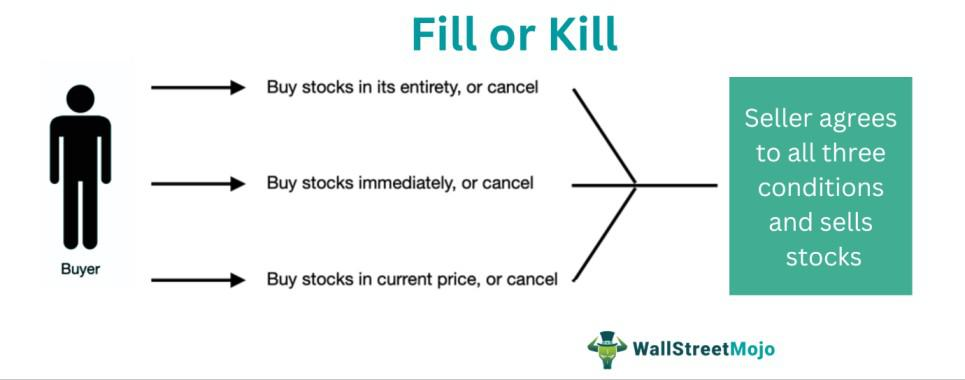

Algorithmic trading, also known as algo trading, is a sophisticated method of executing orders through automated systems that follow pre-programmed trading instructions. This method leverages technology to make trading more efficient by minimizing human intervention and executing trades at optimal times based on set algorithms. The process can involve various strategies, including high-frequency trading, arbitrage, and trend following, all designed to capitalize on market movements.

Traders utilize a variety of order types in the stock market, each serving specific strategic purposes and helping to achieve distinct financial goals. Among the common order types are market orders, limit orders, and stop orders. Market orders provide immediate execution at the current best available price, whereas limit orders allow traders to specify the exact price at which they are willing to buy or sell an asset. Stop orders, on the other hand, are contingent upon a stock's price moving to a specific level, triggering trades when certain conditions are met. Understanding these different order types is essential for crafting effective trading strategies.



Order cancellation is a fundamental aspect of the trading process. It provides investors with the flexibility to modify or retract their investment decisions prior to execution. This capability is vital for adapting to rapidly changing market conditions and updating investment strategies in real time. Traders often cancel orders due to various factors such as unfavorable market shifts or reassessments of the security being traded.

This article examines the variety of orders employed in trading, delving into the mechanisms of their cancellation and highlighting their significance in algorithmic trading. It is essential for both novice and seasoned traders to have a robust understanding of these concepts to enhance trading efficiency and effectiveness. Algorithmic trading, with its reliance on complex order management systems, exemplifies the importance of precise execution and timely cancellation, making it a crucial area of knowledge for any participant in the financial markets.

## Table of Contents

## Understanding Different Types of Orders

In financial markets, understanding the various order types is essential for effective trading. Market orders, limit orders, and stop orders are among the primary types utilized, each offering unique advantages and suited to specific trading strategies and market conditions.

Market orders are straightforward and executed at the current market price. They are designed to buy or sell a security immediately, providing the quickest way to enter or exit a position. Due to their nature, market orders are less likely to be canceled, as they prioritize execution speed over price. For example, if a trader wishes to purchase shares of a company quickly, a market order ensures that the transaction occurs at the best available price, although this might result in paying more if the market price rises suddenly.

Limit orders, on the other hand, offer greater control over the execution price. With a limit order, traders specify the maximum or minimum price at which they are willing to buy or sell a security. This type of order ensures that the trade occurs only at a desired price level, protecting the trader from unfavorable market fluctuations. However, the downside of limit orders is the possibility of non-execution if the specified price is not reached. For instance, a trader may place a limit order to buy shares at $50, meaning the order will only execute if the share price reaches that level or lower.

Stop orders operate conditionally and are designed to manage risk. These orders become active once a specified price, known as the stop price, is attained. A common form of stop order is the stop-loss order, which is used to sell a security when its price falls to a certain point, thereby limiting potential losses. For example, a trader owning a stock priced at $100 might set a stop-loss order at $90, ensuring the stock is sold if it reaches or falls below that price. This process safeguards the investor from larger losses if the stock continues to decline.

Each of these order types serves a specific function and aids traders in executing strategies aligned with their objectives and the market's behavior. Choosing the appropriate order type depends significantly on the trader’s goals, whether it be prioritizing speed, price control, or risk management, and the current market conditions. As such, a comprehensive understanding of market, limit, and stop orders is fundamental for effective trading and investment planning.

## Order Cancellation: Definition and Process

An order cancellation occurs when a previously submitted trading order is nullified before its execution. This process is an integral aspect of trading, providing investors the flexibility to adjust their orders in response to evolving market dynamics or shifts in their investment strategies. Regular cancellations may occur due to a variety of reasons, including significant changes in stock prices, unforeseen economic news, or simply revised strategic objectives.

Online trading platforms, which have become increasingly sophisticated with technological advancements, offer convenient interfaces for order cancellation. Traders can access these platforms to make real-time adjustments to their investment orders, providing agility in managing portfolios. This ease of access allows investors to react promptly to market developments, aligning their trades with current investment goals.

Good 'til canceled (GTC) orders are a specific type of trading order that remains active until it is either executed or canceled by the trader. These orders provide the benefit of not having to be renewed daily, offering long-term traders an opportunity to maintain their strategic positions without constant oversight. However, they also demand vigilance since traders must decide when market conditions have shifted enough to necessitate a cancellation or modification.

A thorough understanding of the order cancellation process is paramount for traders who aim to minimize risks and avoid executing trades that no longer align with their objectives. By effectively managing order cancellations, traders can prevent undesired executions that may result from abrupt market shifts or unexpected events, thereby enhancing their overall trading efficiency.

In summary, the capability to cancel orders is a powerful tool in a trader's arsenal, enabling swift adjustments and fine-tuning of strategies in fast-moving markets. The flexibility and control afforded by this process underscore its essential role in contemporary trading practices.

## Types of Automatically Canceled Orders

Fill or Kill (FOK) orders, Immediate or Cancel (IOC) orders, and One-Cancels-the-Other (OCO) orders are types of automatically canceled orders that serve specific purposes in trading. These order types are fundamental in executing precise trading strategies and managing exposure to market risks.

Fill or Kill (FOK) orders are designed to be executed in their entirety immediately. If a FOK order cannot be completely filled at the time it is placed, it is canceled. The immediacy and all-or-nothing nature of FOK orders make them suitable for traders who require certainty and have no interest in partial execution. This order type is particularly useful in situations where large order volumes are involved, as traders can avoid the risk of partial fills that might impact the effectiveness of their trading strategy.

Immediate or Cancel (IOC) orders, on the other hand, allow for partial execution. These orders are executed immediately, but unlike FOK orders, they do not require full execution. Any portion of the order that cannot be immediately filled is canceled. This flexibility enables traders to capture available [liquidity](/wiki/liquidity-risk-premium) while avoiding market exposure beyond their intended position. IOC orders are commonly used in volatile markets where price movements are rapid, and liquidity may be sporadic.

One-Cancels-the-Other (OCO) orders consist of two separate orders that are linked together. The execution of one order triggers the automatic cancellation of the other. This type of order is particularly valuable for trading strategies that are contingent on specific market conditions. For example, a trader might set an OCO order with one order to buy if the price reaches a certain level and another to sell if the price falls to a different threshold. The execution of one action automatically negates the need for the other, thus enforcing constraints on market exposure and maintaining a balanced position.

The strategic implementation of automatically canceled orders is integral to capitalizing on market movements while effectively managing risks. By using these order types, traders can enforce specific conditions and constraints, ensuring that their trading actions align with their financial objectives. Employing FOK, IOC, and OCO orders allows traders to optimize the execution of their strategies in dynamic markets, maintaining control over their positions and reducing the uncertainty inherent in trading activities.

## Order Cancellation in Algorithmic Trading

Algorithmic trading refers to the practice of using computer algorithms to automate trading activities, including order placements, modifications, and cancellations. This technology-driven approach relies on sophisticated software to execute trading strategies at high speeds and volumes, often with minimal human intervention.

One of the core functionalities of [algorithmic trading](/wiki/algorithmic-trading) systems is their ability to ensure rapid execution of trading strategies. These systems are programmed to meet predefined criteria, adjusting orders in real-time based on current market conditions. For instance, an algorithm might be configured to automatically sell a stock if its price drops below a certain threshold, minimizing potential losses. Similarly, algorithms can quickly adjust buy orders when price targets are met, ensuring that trading strategies are executed efficiently.

Algorithmic trading often involves the use of various complex order types that are optimized for dynamic market conditions. These order types might include strategies such as iceberg orders, which hide the true size of a large order, or VWAP (Volume Weighted Average Price) orders aimed at achieving the best possible average price throughout the trading period. The flexibility and adaptability of these sophisticated order types allow traders to implement and adjust strategies seamlessly as market conditions fluctuate.

Cancellations play a pivotal role in algorithmic trading, offering the ability to rebalance portfolios, avoid unfavorable trades, and maximize potential gains. For example, if an algorithm detects market [volatility](/wiki/volatility-trading-strategies) or a sudden shift in a stock’s price that deviates from the trading strategy, it can swiftly cancel pending orders to prevent unwanted executions. This capability not only helps in maintaining the desired portfolio balance but also in capturing optimal trading opportunities.

The efficiency of algorithmic trading platforms is heavily reliant on their order management capabilities. A robust system will provide real-time order execution and cancellation processes that allow traders to adapt promptly to market movements. By integrating advanced technology to handle these tasks, trading platforms can offer speed, accuracy, and flexibility, which are vital for successful algorithmic trading.

```python
class AlgoTradingSystem:
    def __init__(self, strategy_criteria):
        self.strategy_criteria = strategy_criteria
        self.pending_orders = []

    def place_order(self, order):
        if self._meets_criteria(order):
            self.pending_orders.append(order)
            self._execute_order(order)
        else:
            self._cancel_order(order)

    def _meets_criteria(self, order):
        # Check if the order meets predefined strategy criteria
        return order.price > self.strategy_criteria['min_price']

    def _execute_order(self, order):
        print(f"Executing order: {order}")

    def _cancel_order(self, order):
        print(f"Cancelling order: {order}")

# Example of creating an algorithmic trading system and placing an order
strategy = {'min_price': 100}
system = AlgoTradingSystem(strategy)
system.place_order(Order(price=105))
```

In conclusion, the proficiency with which algorithmic trading systems manage orders is essential for executing successful trading strategies. An efficient order management process not only optimizes gain potential but also mitigates risks in an ever-changing market environment.

## Conclusion

Trade orders and their cancellations are essential components in executing effective trading strategies. These components allow traders to enter, modify, and [exit](/wiki/exit-strategy) positions efficiently, adapting to the ever-changing conditions of financial markets. Understanding the various types of orders—such as market, limit, and stop orders—and their respective cancellation processes is crucial for enhancing trading efficiency. This knowledge empowers traders to make informed decisions, aligning their actions with their strategic objectives.

Algorithmic trading has revolutionized how trades are executed by leveraging advanced order types and real-time data analysis. With minimal human intervention, these algorithms can optimize trading strategies by rapidly adjusting to market conditions. For example, the implementation of strategies like pairs trading or statistical [arbitrage](/wiki/arbitrage) relies heavily on the precise and timely execution and cancellation of orders. This precision is achieved through robust order management systems which are capable of executing complex strategies.

Advanced trading strategies hinge on the proficient execution and timely cancellation of orders, which can involve sophisticated risk management techniques and real-time decision making. The ability to cancel orders promptly is a protective mechanism, crucial for reducing exposure to adverse price movements and volatile conditions. Moreover, algorithmic trading systems rely on the efficient cancellation of orders to rebalance portfolios, minimizing losses, and maximizing returns.

Traders and investors must equip themselves with comprehensive knowledge on order management and cancellation processes to thrive in dynamic markets. This expertise is not only vital for executing trades effectively but also for maximizing profits while managing risks. As financial markets continue to evolve, those with a firm grasp of these concepts will be better positioned to capitalize on market opportunities and sustain long-term success.

## References & Further Reading

[1]: Kissell, R. (2013). ["The Science of Algorithmic Trading and Portfolio Management."](https://www.sciencedirect.com/book/9780124016897/the-science-of-algorithmic-trading-and-portfolio-management) Academic Press.

[2]: Narang, R. (2013). ["Inside the Black Box: A Simple Guide to Quantitative and High-Frequency Trading."](https://onlinelibrary.wiley.com/doi/book/10.1002/9781118662717) Wiley Finance.

[3]: Aldridge, I. (2013). ["High-Frequency Trading: A Practical Guide to Algorithmic Strategies and Trading Systems."](https://www.amazon.com/High-Frequency-Trading-Practical-Algorithmic-Strategies/dp/1118343506) Wiley.

[4]: Hasbrouck, J. (2007). ["Empirical Market Microstructure: The Institutions, Economics, and Econometrics of Securities Trading."](https://academic.oup.com/book/52241) Oxford University Press.

[5]: Chan, E. (2009). ["Quantitative Trading: How to Build Your Own Algorithmic Trading Business."](https://github.com/ftvision/quant_trading_echan_book) Wiley Trading.