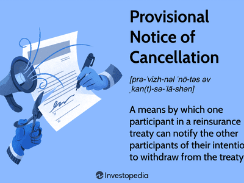

In recent years, 'cancel culture' has emerged as a controversial social phenomenon, raising intense debates about accountability and censorship. It involves the collective practice of withdrawing support from public figures or entities deemed to have committed objectionable actions. This social mechanism often plays out on digital platforms, where rapid communication facilitates widespread movements that can lead to significant social consequences. Proponents argue that cancel culture is a necessary means of addressing systemic inequities and wrongdoing, while critics contend that it fosters divisiveness and curtails open discourse.

Parallelly, algorithmic trading (also known as algo trading) has fundamentally transformed financial markets. Utilizing computer algorithms to execute trading strategies more efficiently and swiftly than human traders, algo trading systems can process vast amounts of data and react to market changes in milliseconds. However, like cancel culture, algorithmic trading has not escaped criticism and scrutiny. Potential risks such as market manipulation, flash crashes, and the erosion of human oversight have sparked significant discussions about the ethical implications of these technologies.

Both cancel culture and algorithmic trading, despite their origins in different domains, share critical socio-cultural implications. They reflect broader trends in how digital technologies influence contemporary life, including challenges of accountability, fairness, and transparency. The social consequences of cancellations—whether by collective public actions or automated trading systems—are profound and warrant thorough exploration. Understanding the dynamics of cancellation in both contexts can illuminate the broader societal impacts, revealing how technological and social mechanisms intersect to shape modern cultural norms and practices.

The purpose of this article is to bridge the conceptual and practical divide between cancel culture and algorithmic trading, offering an analysis of their social causations and consequences. By examining these phenomena, this discussion aims to shed light on the underlying dynamics of how cancel culture manifests in a technocratic society. Recognizing these patterns can lead to a more nuanced understanding of the social fabric in an age increasingly defined by digital technologies and the pressures they exert on traditional societal structures.

## Table of Contents

## Understanding Cancel Culture

Cancel culture is a contemporary phenomenon involving the public withdrawal of support from individuals, brands, or other entities after they have made statements or taken actions considered unacceptable or offensive by certain communities. This practice often results in reputational damage, economic loss, or diminished influence for the targeted party.

The origin of cancel culture can be significantly attributed to the proliferation of social media platforms. These platforms enable rapid and widespread dissemination of information, allowing users to collectively address grievances and mobilize around social and ethical issues. The instantaneous nature of communication on social media, coupled with its vast reach, facilitates the organization of collective actions aimed at holding perceived offenders accountable.

Critics of cancel culture argue that it fosters a toxic environment by discouraging open dialogue and engagement. They claim that cancel culture can lead to a polarized society, where individuals and entities may become reluctant to express opinions for fear of backlash. This form of public shaming has been described as encouraging divisiveness, as it often leaves little room for forgiveness, redemption, or constructive debate.

Conversely, supporters of cancel culture view it as a powerful tool for promoting accountability and addressing systemic injustices. They argue that traditional mechanisms of justice and redress often fail marginalized communities, and cancel culture serves as an informal means of balancing power dynamics. By bringing public scrutiny to issues of injustice, proponents suggest that cancel culture can stimulate broader societal change.

The socio-cultural impact of cancel culture is significant, affecting various domains such as public discourse, media coverage, and organizational policies. In public discourse, cancel culture has heightened awareness of social justice issues but has also led to contentious debates about freedom of expression and the limits of accountability. Media outlets, in response to cancel culture dynamics, often play a dual role as both critics and reinforcers of cancel culture, affecting how stories are covered and framed. Additionally, organizations may modify their policies, advertising strategies, and internal culture in response to cancel culture pressures, reflecting a growing recognition of corporate social responsibility.

Overall, cancel culture represents a complex social mechanism with both challenges and contributions to contemporary socio-cultural landscapes. Its dual nature as a potentially divisive force and a tool for accountability requires ongoing dialogue and a careful balancing of competing values.

## Algorithmic Trading and Its Cancellation Parallels

Algorithmic trading, often known simply as algo trading, has revolutionized the way financial markets operate by utilizing computer algorithms to automate trading strategies. This method relies on mathematical models and computational algorithms to make high-frequency trades, optimizing the timing and execution of transactions in response to market conditions. The influence of [algorithmic trading](/wiki/algorithmic-trading) is substantial, accounting for a significant portion of transactions in major financial markets.

Despite its widespread adoption, algorithmic trading has been subject to criticism and controversy. One significant issue is the potential for market manipulation. Traders can use sophisticated algorithms to detect market trends and exploit minor price discrepancies, creating artificial price movements that can mislead other market participants. This practice raises ethical concerns, as it might distort the true market value of assets.

Another major concern is the phenomenon of flash crashes, which are extremely rapid and deep declines in the price of securities. These are often attributed to high-frequency trading algorithms acting on automated signals without human intervention, leading to volatile and occasionally catastrophic market events. The infamous May 6, 2010, flash crash is a prominent example, where the U.S. stock market plummeted nearly 1,000 points in minutes before rebounding just as quickly.

Furthermore, the reliance on algorithms has led to the dehumanization of trading decisions. Traditional market practices that rely on human intuition and experience are being replaced by automated processes that may lack the capacity to incorporate qualitative factors, raising concerns about over-reliance on technology.

The debate over regulating or 'cancelling' certain practices within algorithmic trading mirrors discussions in cancel culture, centered on balancing innovation with ethical considerations. Advocates of tighter regulations argue for robust oversight to prevent potential abuses and safeguard financial stability. However, others warn that over-regulation could stifle innovation and diminish [liquidity](/wiki/liquidity-risk-premium) in financial markets.

Algorithmic trading operates largely outside traditional oversight frameworks, similar to how social media platforms have facilitated the rise of cancel culture without conventional regulation. This parallel has sparked ongoing discussions about the need for a regulatory paradigm that adapts to the rapid technological advances reshaping financial and social landscapes.

By examining the parallels between algo trading and cancel culture, one can gain insights into how technology influences societal norms and ethical standards. Both contexts highlight the challenges posed by innovations that outpace existing regulatory measures, underscoring the importance of adaptive governance to responsibly harness technological advancements.

## Social Consequences of Cancellations

Cancel culture and its counterpart in algorithmic trading have profound social consequences that extend far beyond the individuals or entities directly involved. In the sphere of culture, cancel actions can substantially reshape entire sectors such as entertainment, media, and academia. A public figure or organization facing cancellation can experience immediate ostracism, affecting their reputation and financial prospects. This phenomenon can trigger a cascade of changes, influencing how organizations develop their policies, how media platforms adjust their content standards, and how academic institutions deal with controversies related to faculty or student actions.

Similarly, the concept of cancellation within algorithmic trading yields significant implications for financial systems. Algorithmic trading cancellations refer to moments where algorithms either malfunction or are deliberately halted due to perceived risks, leading to substantial financial setbacks. These incidents can propagate systemic economic risks, demonstrating how cancellations in this context can impact a wide range of stakeholders, from individual investors to global financial markets. Moreover, regulatory scrutiny following such events often leads to shifts in trading regulations and practices to mitigate future risks.

The backlash and regulatory responses to cancellations in both cancel culture and algorithmic trading result in policy amendments, law enactments, and transformation in market operations. In cultural contexts, these responses can shift the discourse around free speech, accountability, and societal values. In financial markets, the emphasis often lies on increased oversight and the implementation of safeguards to prevent market instability.

The divide between progressive and conservative voices is further widened by the contentious nature of cancellations. In cultural arenas, these practices can polarize societal groups, influencing cultural identity and community cohesion. Cancellations can prompt debates over moral and ethical boundaries, often revealing underlying cultural and ideological rifts.

To address these challenges, there is a pressing need for nuanced understanding and constructive dialogue. Both realms demand a sophisticated approach that considers the diverse ramifications of cancellation practices. Effective dialogue could bridge the cultural and financial divides, fostering a balanced consideration of accountability and freedom, innovation, and ethical conduct. By facilitating discussions across disciplines and sectors, society can better navigate the complexities associated with cancellation phenomena and work towards more inclusive and fair practices.

## Bridging the Socio-Cultural Divide

Tech-driven practices such as algorithmic trading and socially-driven phenomena like cancel culture might initially appear unrelated. However, both present unique challenges that often intersect at socio-cultural junctures. This overlap points to the need for interdisciplinary conversations and solutions that respect the nuances of each domain while addressing their broader implications.

Firstly, it is imperative to establish cross-domain discussions that focus on delineating ethical boundaries and fostering mutual understanding among stakeholders. In the case of algorithmic trading, ethical concerns include issues like market fairness and transparency, whereas cancel culture raises questions about freedom of speech and the limits of social accountability. Both require a nuanced approach that factors in intent, impact, and societal norms. For example, the implementation of algorithmic trading systems could benefit from ethical guidelines analogous to those considered in digital public spaces where cancel culture is most prominent.

Collaboration is essential among policymakers, technologists, and cultural leaders to create frameworks that address these ethical issues while allowing for innovation. These collaborations can facilitate the exchange of ideas and strategies, ensuring that advances in technology, such as algorithmic systems, do not proceed without the necessary ethical oversight. Similarly, cultural leaders involved in debates about cancel culture can gain insights from technological regulatory frameworks, which might help develop less divisive means of enforcing accountability.

Public education initiatives play a vital role in bridging the socio-cultural divide. By demystifying complex concepts like algorithmic trading and cancel culture, these initiatives help foster an informed society capable of engaging with these phenomena more critically and constructively. An informed public is better equipped to understand the implications of automated trading decisions or the intricacies of social accountability in digital environments, leading to more robust public discourse.

Ultimately, creating bridges between these domains involves more than just mutual acknowledgment—it necessitates a proactive stance to mitigate the extremes of cancellations. For algorithmic trading, this could mean instituting checks against overly aggressive trading practices that could destabilize markets. For cancel culture, it could involve promoting balanced discourse that considers multiple perspectives. By doing so, a more inclusive and understanding social fabric can develop, accommodating the benefits of technological innovation while maintaining ethical integrity and cultural sensitivity.

## Conclusion

The interaction between cancel culture and algorithmic trading illustrates the extensive consequences that cancellations can exert on society. These phenomena, though distinct, can provide valuable insights into navigating the complex socio-cultural and financial landscapes of our time. Cancel culture, often characterized by collective actions against perceived wrongdoing, parallels the scrutiny faced by algorithmic trading, where criticisms highlight ethical dilemmas and systemic risks. Both demand a nuanced understanding to effectively address their challenges.

As society continues to confront these complex issues, the necessity for balanced discourse and strategic interventions becomes crucial. In cancel culture, open dialogue allows for the reconciliation of divergent perspectives, promoting a climate where accountability can coexist with fair opportunities for redemption. Similarly, in the sphere of algorithmic trading, strategic frameworks can ensure that technological innovations align with ethical standards and economic stability. By fostering spaces for transparent and inclusive conversations, we can mitigate extreme outcomes that lead to societal rifts.

The lessons learned from investigating cancellations across various domains can inform the development of robust societal frameworks. Enhanced awareness of the socio-cultural impact of cancel culture, alongside a thorough understanding of the technical and ethical implications of algorithmic trading, can guide effective policies and practices. These insights are vital for crafting a society resilient to the negative ramifications of cancellations, be they digital or financial.

Ultimately, fostering a climate where accountability is balanced with fair discourse is essential to managing the future of both cultural and technological domains. By emphasizing thoughtful engagement over reactionary measures, we can cultivate an environment conducive to growth, innovation, and ethical integrity. This approach ensures that as technology and social norms evolve, they do so in a manner that benefits the broader fabric of society.

## References & Further Reading

[1]: Lopez de Prado, M. (2018). ["Advances in Financial Machine Learning."](https://books.google.com/books/about/Advances_in_Financial_Machine_Learning.html?id=oU9KDwAAQBAJ) Wiley.

[2]: Aronson, D. R. (2006). ["Evidence-Based Technical Analysis: Applying the Scientific Method and Statistical Inference to Trading Signals."](https://www.amazon.com/Evidence-Based-Technical-Analysis-Scientific-Statistical/dp/0470008741) Wiley.

[3]: Jansen, S. (2020). ["Machine Learning for Algorithmic Trading."](https://github.com/stefan-jansen/machine-learning-for-trading) Packt Publishing.

[4]: Chan, E. P. (2008). ["Quantitative Trading: How to Build Your Own Algorithmic Trading Business."](https://github.com/ftvision/quant_trading_echan_book) Wiley.

[5]: Bergstra, J., Bardenet, R., Bengio, Y., & Kégl, B. (2011). ["Algorithms for Hyper-Parameter Optimization."](https://dl.acm.org/doi/10.5555/2986459.2986743) Advances in Neural Information Processing Systems 24.