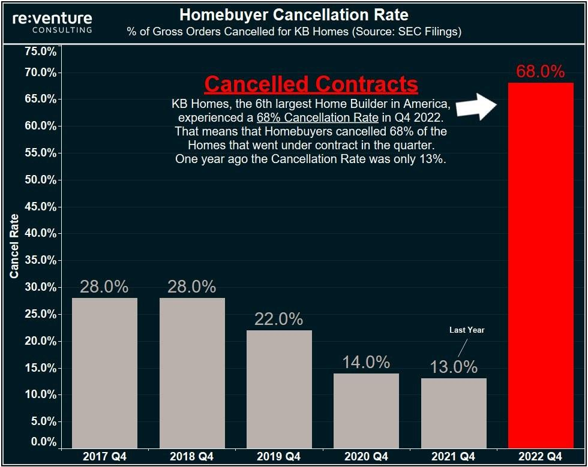

## Table of Contents

## What is a cancellation rate?

A cancellation rate is the percentage of orders or bookings that are canceled out of the total number of orders or bookings made. It is an important measure for businesses, especially those in the service industry like hotels, airlines, and restaurants, because it helps them understand how many customers are backing out of their commitments.

Knowing the cancellation rate can help businesses plan better. For example, if a hotel knows that 10% of their bookings are usually canceled, they can overbook by that percentage to make sure they fill all their rooms. This helps them avoid losing money from empty rooms. Also, a high cancellation rate might show that customers are not happy, so the business might need to improve their services or change their cancellation policy.

## Why is it important to track cancellation rates?

Tracking cancellation rates is important because it helps businesses understand how many people are canceling their orders or bookings. This information is useful for planning. For example, if a business knows that a certain percentage of customers usually cancel, they can adjust their planning to make sure they don't lose money. If they expect cancellations, they might take more bookings than they have spots for, knowing some will cancel.

Also, keeping an eye on cancellation rates can show if customers are happy or not. If a lot of people are canceling, it might mean they are not satisfied with the service or product. This can help the business figure out if they need to make changes to improve customer satisfaction. By understanding why people are canceling, the business can make better decisions to keep more customers happy and coming back.

## How is the cancellation rate calculated?

The cancellation rate is calculated by dividing the number of cancellations by the total number of orders or bookings, and then multiplying the result by 100 to get a percentage. For example, if a hotel had 100 bookings and 10 of those were canceled, the cancellation rate would be (10 divided by 100) times 100, which equals 10%.

This calculation helps businesses understand how many customers are not following through with their plans. By knowing this rate, a business can plan better. For instance, if a restaurant knows that 5% of their reservations are canceled, they can take more reservations than they have seats for, expecting some cancellations. This way, they can make sure they don't have empty tables and lose money.

## What industries typically monitor cancellation rates?

Many industries keep an eye on cancellation rates because it helps them know how many people are not going through with their plans. Hotels and airlines are big on this. They need to know how many rooms or seats might be empty so they can plan better. For example, if a hotel sees that 10 out of 100 bookings get canceled, they know they can take a few more bookings than they have rooms for.

Restaurants also watch cancellation rates closely. If a lot of people cancel their reservations, the restaurant might end up with empty tables and lose money. By knowing their cancellation rate, they can take more reservations than they have seats for, expecting some cancellations. This way, they can keep their tables full and make more money.

Other businesses like event planners and car rental companies also track cancellation rates. For event planners, knowing how many people might not show up helps them plan for the right number of seats, food, and other resources. Car rental companies use this information to know how many cars they need to have available. Understanding cancellation rates helps all these businesses run more smoothly and make better plans.

## What are common reasons for cancellations?

People cancel their plans for many reasons. Sometimes, they get sick or have a family emergency and can't go to their planned event or trip. Other times, they might find a better deal somewhere else or change their mind about what they want to do. Weather can also play a big role; if it's raining or snowing, people might not want to travel.

Businesses also see cancellations when customers are not happy with the service or product. If a hotel room is not clean or a restaurant has bad food, people might cancel their bookings. Sometimes, it's just because the rules for canceling are too strict or confusing, so people cancel to avoid any hassle. Understanding why people cancel can help businesses make things better and keep more customers happy.

## How can businesses reduce their cancellation rates?

Businesses can reduce their cancellation rates by making their customers happier. If people are happy with the service or product, they are less likely to cancel. For example, hotels can make sure their rooms are clean and comfortable, and restaurants can serve good food. If a customer has a good experience, they are more likely to keep their booking. Also, businesses can ask customers for feedback and use it to make things better. This shows customers that the business cares about what they think, which can make them want to stay loyal.

Another way to lower cancellation rates is to have clear and fair rules about canceling. If the rules are too strict or hard to understand, people might cancel just to avoid any trouble. Businesses can make it easier for people to change their plans without losing money. For example, offering a free change of date or a small fee for canceling can make people feel better about keeping their booking. Also, sending reminders about upcoming bookings can help people remember and not cancel at the last minute. By making the process easier and more customer-friendly, businesses can keep more people from canceling.

## What is a good benchmark for cancellation rates in different industries?

In the hotel industry, a good cancellation rate is usually around 10% to 15%. This means that out of every 100 bookings, about 10 to 15 people might cancel. Hotels use this information to overbook a bit, knowing that some people will cancel, so they can keep their rooms full and make more money. If the cancellation rate goes above 20%, hotels might need to look at why so many people are canceling and try to fix any problems.

In the restaurant industry, a good cancellation rate is often between 5% and 10%. This means that out of every 100 reservations, about 5 to 10 people might not show up. Restaurants use this information to take more reservations than they have seats, expecting some cancellations. If the cancellation rate is higher than 10%, restaurants might need to check if their food or service is not good enough and work on making customers happier.

## How do seasonal trends affect cancellation rates?

Seasonal trends can change how many people cancel their plans. In the summer, more people might want to go on vacation, so hotels and airlines might see fewer cancellations. But, if it's really hot or there are big storms, more people might cancel their trips because they don't want to deal with the weather. During the winter, people might not want to travel as much because of the cold or snow, so cancellation rates could go up. Businesses need to pay attention to these trends so they can plan better and make sure they don't lose money.

Holidays also play a big role in cancellation rates. Around big holidays like Christmas or Thanksgiving, people are more likely to keep their plans because they want to be with family or friends. So, businesses might see lower cancellation rates during these times. But, if there's a last-minute change in plans or someone gets sick, cancellations can still happen. By understanding how seasonal trends affect cancellations, businesses can adjust their plans to make sure they stay busy and keep their customers happy.

## What role does customer service play in managing cancellation rates?

Good customer service can help businesses keep their cancellation rates low. When people feel taken care of, they are less likely to cancel their plans. For example, if a hotel has friendly staff who help guests with any problems, guests will be happier and more likely to keep their booking. If someone needs to change their plans, good customer service can make it easy for them to do so without losing money. This makes people feel better about sticking with the business.

Customer service also helps by listening to what people say. If a lot of people are canceling because they don't like something, good customer service can find out what the problem is and fix it. Maybe the food at a restaurant isn't good, or the rooms at a hotel are not clean. By making things better, businesses can make their customers happier and lower their cancellation rates. Good customer service makes people want to come back and not cancel their plans.

## How can data analytics be used to predict and manage cancellation rates?

Data analytics can help businesses predict and manage cancellation rates by looking at past information. By studying data from past bookings and cancellations, businesses can find patterns and reasons why people cancel. For example, they might see that more people cancel during certain times of the year or because of bad weather. With this information, businesses can plan better. They can adjust their booking policies or offer special deals during times when cancellations are high to keep more people from canceling.

Using data analytics also helps businesses make quick decisions. If they see a sudden increase in cancellations, they can look at the data to find out why it's happening. Maybe a new policy is not working well, or customers are unhappy with a recent change. By understanding these reasons, businesses can fix the problems fast. This way, they can keep their cancellation rates low and make sure they don't lose money. Data analytics is a powerful tool that helps businesses stay on top of their game and keep their customers happy.

## What are the long-term impacts of high cancellation rates on a business?

High cancellation rates can hurt a business over time. When a lot of people cancel their bookings, the business loses money. For example, if a hotel has many empty rooms because of cancellations, they can't make money from those rooms. This can lead to less money coming in, and the business might have to raise prices or cut costs to stay afloat. If cancellations keep happening, it can also make it hard for the business to plan for the future. They might not know how many customers to expect, which makes it tough to manage staff and resources.

Also, high cancellation rates can make customers unhappy. If people see that a lot of others are canceling, they might think the business is not good. This can hurt the business's reputation. When people hear bad things about a place, they might not want to go there. Over time, this can mean fewer new customers and less repeat business. If the business doesn't fix the reasons for cancellations, like bad service or strict policies, it could lose more and more customers, making it hard to stay open in the long run.

## How can advanced technologies like AI help in reducing cancellation rates?

Advanced technologies like AI can help businesses lower their cancellation rates by understanding why people cancel. AI can look at a lot of data from past bookings and cancellations to find patterns. For example, it might see that more people cancel when it's raining or if they have to pay a lot to change their plans. With this information, businesses can make changes to keep more customers happy. They might offer special deals during bad weather or make it easier and cheaper to change bookings. This way, people are less likely to cancel, and the business can keep more money coming in.

AI can also help by talking to customers directly. Chatbots powered by AI can answer questions and help people with their bookings. If someone needs to change their plans, the chatbot can make it easy for them to do so without losing money. This makes customers feel taken care of and more likely to keep their booking. Plus, AI can send reminders about upcoming bookings, so people don't forget and cancel at the last minute. By using AI to improve customer service and make things easier, businesses can lower their cancellation rates and keep their customers happy.

## What are cancellation rates in algo trading?

Cancellation rates refer to the proportion of trade orders that are withdrawn or nullified by traders before they are executed on financial markets. In [algorithmic trading](/wiki/algorithmic-trading), these rates can be quite high, often due to the nature of trading algorithms that are designed to operate at high velocities, executing and retracting trades with remarkable speed and precision. Algorithms are typically programmed to assess market conditions continuously and make swift decisions to optimize trades, which can lead to frequent cancellations.

A primary reason for the elevated cancellation rates in algorithmic trading is the adaptive strategies embedded within these algorithms, enabling them to respond instantaneously to fluctuating market conditions. For instance, if an algorithm perceives a shift in price trends or [volatility](/wiki/volatility-trading-strategies) that may impact the expected profitability of a pending order, it may retract the order and replace it with a more advantageous one. This can result in rates that reach as high as 97% in certain high-frequency trading environments.

To better understand this, consider a simple simulation where an algorithm evaluates the market every second and decides whether to maintain or cancel an order based on new information. This dynamic adjustment process is governed by specific criteria set in the algorithm's design, aiming to capitalize on transient market opportunities. The cancellation rate can thus be expressed as:

$$
\text{Cancellation Rate} = \frac{\text{Number of Cancelled Orders}}{\text{Total Number of Orders Submitted}} \times 100\%
$$

For example, if an algorithm submits 1000 orders during a trading session and withdraws 970 of these prior to execution, the cancellation rate is 97%. This high rate underscores the non-linear and speculative nature of algorithmic trading, where algorithms continuously seek to leverage the smallest of market inefficiencies.

This high-frequency cancellations can also be understood through Monte Carlo simulations or agent-based models in Python, where each agent (i.e., trading entity) is programmed with rule-based decision-making capabilities to simulate market behaviors and order flows.

## References & Further Reading

[1]: Hasbrouck, J., & Saar, G. (2013). ["Low-latency trading"](https://www.sciencedirect.com/science/article/abs/pii/S1386418113000165) in The Review of Financial Studies, 26(9), 2345–2383.

[2]: Aldridge, I. (2013). ["High-Frequency Trading: A Practical Guide to Algorithmic Strategies and Trading Systems"](https://www.wiley.com/en-us/High+Frequency+Trading%3A+A+Practical+Guide+to+Algorithmic+Strategies+and+Trading+Systems%2C+2nd+Edition-p-9781118343500). John Wiley & Sons.

[3]: Zhang, S. J., & Riordan, R. (2011). ["Technology and market quality: the case of high frequency trading"](https://aisel.aisnet.org/cgi/viewcontent.cgi?article=1094&context=ecis2011) in Journal of Financial Markets, 16(4), 138-167.

[4]: Menkveld, A. J. (2013). ["High frequency trading and the new market makers"](https://www.sciencedirect.com/science/article/pii/S1386418113000281) in Journal of Financial Markets, 16(4), 712-740.

[5]: Cartea, Á., Jaimungal, S., & Penalva, J. (2015). ["Algorithmic and High-Frequency Trading"](https://assets.cambridge.org/97811070/91146/frontmatter/9781107091146_frontmatter.pdf). Cambridge University Press.