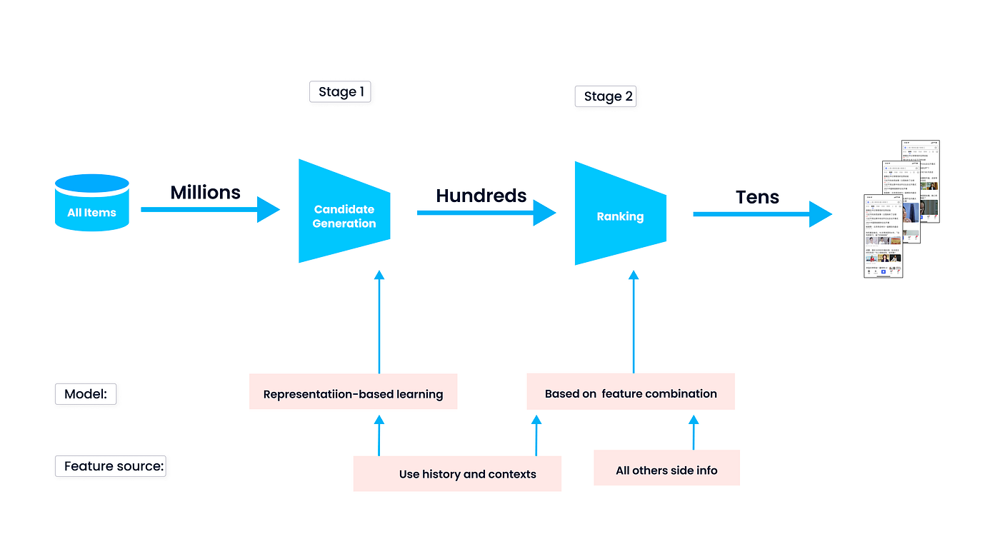

## Table of Contents

## What is candidate generation in machine learning?

Candidate generation in machine learning is a process used in recommendation systems and search engines. It involves creating a list of possible items or results that might be relevant to a user's query or preferences. This step is crucial because it helps narrow down the vast amount of data to a smaller, more manageable set of options that can be further refined or ranked.

For example, when you search for a movie on a streaming platform, the platform first generates a list of movies that might match your interests. This list is created based on your past viewing history, ratings, and other user data. The goal is to quickly filter out irrelevant options so that the system can then focus on ranking the remaining candidates to show you the best possible recommendations.

In technical terms, candidate generation often involves using algorithms like collaborative filtering or content-based filtering. These methods help in quickly sifting through large datasets to find items that are likely to be of interest. After generating the candidates, more detailed algorithms can be applied to rank them, ensuring that the final list presented to the user is both relevant and well-ordered.

## Why is candidate generation important in machine learning applications?

Candidate generation is important in machine learning applications because it helps manage large amounts of data efficiently. When you have millions of items, like movies on a streaming service or products in an online store, it's not practical to look at all of them every time a user makes a request. Candidate generation quickly narrows down the options to a smaller list that is likely to be relevant. This saves time and computing power, making the system faster and more responsive.

Moreover, candidate generation improves the quality of recommendations or search results. By focusing on a smaller set of items that are more likely to match a user's interests or query, the system can use more detailed and sophisticated algorithms to rank these items. This leads to better and more personalized results for the user. For example, if you're looking for a new movie to watch, candidate generation ensures that the movies suggested to you are ones you're more likely to enjoy, based on your past behavior and preferences.

## How does candidate generation differ from other stages in a machine learning pipeline?

Candidate generation is an early stage in a machine learning pipeline, where the main job is to quickly sort through a large amount of data and pick out items that might be relevant to a user's query or preferences. It's like sifting through a big pile of sand to find the gold nuggets. This stage is important because it helps make the whole process faster and more efficient. Instead of looking at everything, the system only focuses on a smaller group of items, which saves time and computer power.

After candidate generation comes the ranking stage. Here, the system takes the smaller list of items and uses more detailed methods to decide which ones are the best match for the user. While candidate generation is about quickly finding possible options, ranking is about carefully sorting them to show the most relevant ones first. For example, if you're searching for a movie, candidate generation might find a hundred movies you might like, but ranking will put the five best ones at the top of your list.

Sometimes, there's also a post-processing stage after ranking. This is where the system might add some final touches, like making sure the results are diverse or meet certain business rules. For instance, a streaming service might want to show a mix of new releases and old favorites. So, while candidate generation is about quickly finding potential items, post-processing is about refining the final list to meet additional criteria.

## What are some common techniques used for candidate generation?

One common technique for candidate generation is collaborative filtering. This method looks at what other users with similar tastes have liked or bought. If you and another user both liked the same movies, the system might suggest other movies that the other user enjoyed. It's like getting recommendations from a friend who has similar interests. Collaborative filtering can be done in different ways, but it's all about using the behavior of similar users to find new items for you.

Another technique is content-based filtering. This one focuses on the characteristics of the items themselves. For example, if you enjoy action movies, the system might look for other movies that are also in the action genre. It might also consider other details like the director or actors. Content-based filtering tries to match the items you've liked in the past with new items that have similar features.

Sometimes, a hybrid approach is used, combining both collaborative and content-based filtering. This can give even better results by using the strengths of both methods. For example, the system might start with content-based filtering to find action movies, and then use collaborative filtering to pick the ones that similar users enjoyed the most. This way, you get recommendations that are both relevant to your tastes and popular among people like you.

## Can you explain how candidate generation works in recommendation systems?

In recommendation systems, candidate generation is like sorting through a big pile of items to find the ones you might like. Imagine you're at a huge library and you want to find books you'd enjoy reading. Instead of looking through every single book, you start by picking out a smaller group of books that seem interesting based on what you've read before. That's what candidate generation does. It uses information about what you've liked in the past, like the movies you've watched or the products you've bought, to quickly pick out a smaller list of items that might be a good match for you.

Once the system has this smaller list, it can then use more detailed methods to figure out which of these items are the best fit. For example, if you enjoy action movies, the system might start by finding all the action movies in its database. Then, it looks at things like which action movies similar users have enjoyed or which ones have the actors or directors you like. This way, the system narrows down the options to a manageable size before spending more time and effort to rank them in the best order for you.

## What are the key challenges faced during candidate generation?

One of the main challenges in candidate generation is dealing with a huge amount of data. Imagine you're trying to find a few good movies to watch from a list of millions. It's like looking for a needle in a haystack. The system needs to quickly sort through all this data to find items that might be interesting to you. If it takes too long, users will get impatient and leave. So, the challenge is to make the process fast enough to keep users happy.

Another challenge is making sure the system picks the right items. It's not just about speed; it's also about accuracy. If the system keeps showing you movies you don't like, you'll stop trusting its recommendations. The system needs to use the right methods, like looking at what similar users have enjoyed or matching items based on their features, to make sure it's choosing the best possible options for you. Balancing speed and accuracy is tough but crucial for a good user experience.

## How do you evaluate the effectiveness of a candidate generation model?

To evaluate the effectiveness of a candidate generation model, you look at how well it picks out items that users might like. One way to do this is by using a metric called recall. Recall measures how many of the items that a user actually liked were included in the list of candidates. If the model is good at its job, it should have a high recall, meaning it's finding most of the items that the user would have enjoyed. You can calculate recall with this formula: $$ \text{Recall} = \frac{\text{Number of relevant items found}}{\text{Total number of relevant items}} $$. If a user liked 10 movies and the model found 8 of them, the recall would be 0.8 or 80%.

Another important thing to consider is how fast the model works. Candidate generation needs to be quick because users don't want to wait around for their recommendations. You can measure this by looking at the time it takes for the model to generate the list of candidates. If it's too slow, users might get impatient and leave. So, a good candidate generation model should not only find the right items but also do it quickly. Balancing speed and accuracy is key to making sure users have a good experience with the recommendation system.

## What role does data play in the success of candidate generation?

Data is really important for making candidate generation work well. The more information the system has about what users like, the better it can pick out items that might interest them. For example, if the system knows you enjoy action movies, it can look through its data to find other action movies you might like. The quality of the data matters too. If the data is messy or wrong, the system might suggest things you don't actually like. So, having good, clean data helps the system do a better job at finding the right items for you.

The amount of data also makes a big difference. With more data, the system can learn more about what different people like and use that to make better guesses about what you might enjoy. For instance, if the system has data from millions of users, it can see patterns and find movies that similar users have enjoyed. This helps in making the list of candidates more accurate. So, the success of candidate generation depends a lot on having enough good data to work with.

## How can candidate generation be optimized for large-scale applications?

Optimizing candidate generation for large-scale applications involves making the process faster and more accurate. One way to do this is by using efficient algorithms that can quickly sift through huge amounts of data. For example, using techniques like approximate nearest neighbor search can help find similar items much faster than looking at every single item. Another approach is to use distributed computing, where the work is split across many computers. This can speed up the process by letting different parts of the system work on the task at the same time. By making these changes, the system can handle millions of items without slowing down, which is important for keeping users happy.

Another important aspect of optimization is ensuring that the data used for candidate generation is well-organized and easily accessible. This can be done by using efficient data structures and indexing methods. For instance, using hash tables or inverted indices can make it quicker to find relevant items. Additionally, pre-processing the data to create features or embeddings can help the system understand the items better and make more accurate recommendations. By focusing on both speed and accuracy, large-scale applications can provide better and more personalized suggestions to users, even when dealing with vast amounts of data.

## What are some advanced algorithms used in candidate generation?

One advanced algorithm used in candidate generation is the Approximate Nearest Neighbor (ANN) search. This method helps find items that are similar to what a user has liked before, but it does it much faster than looking at every single item. Instead of checking everything, ANN uses clever shortcuts to quickly find close matches. This is really helpful when you're dealing with a huge number of items, like all the movies on a streaming service. By using ANN, the system can quickly pick out a list of movies that are similar to the ones you've enjoyed, making the candidate generation process much faster.

Another advanced technique is deep learning, specifically using neural networks to create embeddings. Embeddings are like special codes that represent items in a way that makes it easy to see how similar they are. For example, if you like action movies, the system can use a neural network to turn all the movies into embeddings and then find other movies with similar embeddings. This helps in finding movies that you're likely to enjoy. Deep learning can be really powerful because it can learn complex patterns from the data, making the recommendations more accurate.

## How does candidate generation integrate with ranking and filtering in a complete system?

Candidate generation is the first step in a recommendation system, where it quickly sorts through a huge amount of data to find items that a user might like. It's like looking through a big library to pick out a few books that seem interesting based on what you've read before. The goal is to narrow down the options to a smaller list that can be handled more easily. For example, if you enjoy action movies, the system might use methods like collaborative filtering or content-based filtering to find other action movies you might like. This stage is important because it makes the whole process faster and more efficient, allowing the system to focus on a smaller set of items.

After candidate generation, the next step is ranking. Here, the system takes the smaller list of items and uses more detailed methods to decide which ones are the best match for the user. While candidate generation is about quickly finding possible options, ranking is about carefully sorting them to show the most relevant ones first. For instance, if you're searching for a movie, candidate generation might find a hundred movies you might like, but ranking will put the five best ones at the top of your list. Sometimes, there's also a filtering stage after ranking, where the system might apply additional criteria to refine the list further, like ensuring a mix of new releases and old favorites. Together, these stages work to provide users with personalized and relevant recommendations.

## What future trends can we expect in the field of candidate generation?

In the future, we can expect candidate generation to become even faster and more accurate thanks to advances in technology. One big trend will be the use of more advanced machine learning models, like deep learning and neural networks, to better understand what users like. These models can learn complex patterns from the data, making the recommendations more personalized. For example, instead of just looking at what movies you've watched, the system might also consider things like the time of day you watch movies or your mood. This could help the system pick out movies that you're more likely to enjoy at that moment.

Another trend we might see is the use of more real-time data. Right now, candidate generation often uses data that's been collected over time, but in the future, it could use data that's coming in right now. For instance, if you're at a music festival, the system might use data from other festival-goers to suggest songs or artists you might like. This real-time approach could make the recommendations even more relevant and timely. Overall, the goal is to keep improving how candidate generation works so that users get the best possible suggestions, no matter how much data there is to sort through.