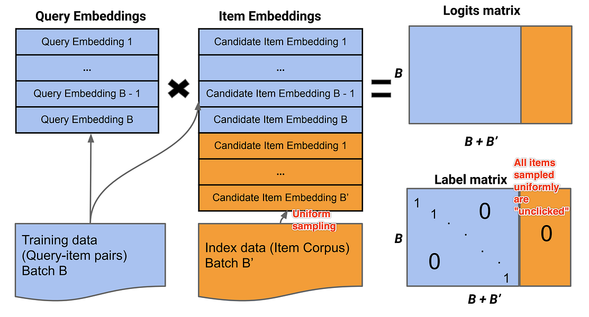

## Table of Contents

## What is candidate sampling in machine learning?

Candidate sampling is a technique used in machine learning to make training large models more efficient, especially when dealing with tasks like classification with many possible outcomes. Instead of calculating the loss for every possible outcome in each training step, candidate sampling focuses on a smaller subset of outcomes. This subset usually includes the true outcome and a few randomly selected "negative" outcomes. By doing this, the model can still learn effectively but with much less computation, making the training process faster and more manageable.

For example, in a language model predicting the next word in a sentence, instead of considering every word in the vocabulary, candidate sampling might only look at the correct next word and a handful of other words. This approach significantly reduces the computational load because the model doesn't have to process the entire vocabulary for each prediction. The technique is particularly useful in scenarios where the number of possible outcomes is very large, such as in natural language processing or recommendation systems.

## How does candidate sampling differ from traditional classification methods?

Candidate sampling and traditional classification methods differ mainly in how they handle the prediction and training process. In traditional classification, the model calculates the probability for every possible class or outcome during each training step. For example, if you're classifying images into 1000 categories, the model will compute the likelihood of the image belonging to each of those 1000 categories every time. This can be very computationally expensive, especially when the number of categories is large.

On the other hand, candidate sampling takes a more efficient approach by only considering a small subset of the possible outcomes. Instead of looking at all categories, it focuses on the true outcome and a few randomly chosen "negative" outcomes. This means that if you're predicting the next word in a sentence from a vocabulary of 50,000 words, the model might only consider the correct word and perhaps 10 other randomly selected words. This significantly reduces the computational load and speeds up the training process, making it more practical for large-scale applications like natural language processing or recommendation systems.

## What are the main types of candidate sampling techniques?

There are mainly two types of candidate sampling techniques: negative sampling and importance sampling. Negative sampling is used a lot in word embedding models like Word2Vec. It works by [picking](/wiki/asset-class-picking) a few "negative" examples at random, along with the true example. This helps the model learn the difference between the correct answer and wrong answers. For instance, if the model is trying to predict the word "dog," negative sampling might pick words like "cat," "book," and "car" to train against. This method makes the training process faster and easier because it doesn't need to look at every possible word in the vocabulary.

Importance sampling, on the other hand, is a bit more complex. It involves choosing samples based on how important they are, not just randomly. The idea is to focus on samples that are more likely to help the model learn better. For example, if some outcomes happen more often, importance sampling might pick those more often during training. This can make the model more accurate by paying more attention to the outcomes that matter more. Both techniques help make big models train faster and work better, but they do it in slightly different ways.

## In what scenarios is candidate sampling particularly useful?

Candidate sampling is particularly useful in scenarios where the number of possible outcomes is very large. For example, in natural language processing, when predicting the next word in a sentence, the model might need to consider thousands or even millions of words. By using candidate sampling, the model only looks at a few of these words at a time, making the training process much faster and more manageable. This technique is also helpful in recommendation systems, where there might be a huge number of items to recommend, and considering all of them for each prediction would be too slow.

Another scenario where candidate sampling shines is in training large-scale [machine learning](/wiki/machine-learning) models. When you have a lot of data and many possible outcomes, traditional methods can become too computationally expensive. Candidate sampling helps by focusing the model's attention on a smaller, more manageable subset of outcomes. This not only speeds up the training but also makes it possible to use these models in real-world applications where quick responses are needed.

## How does negative sampling relate to candidate sampling?

Negative sampling is a type of candidate sampling. In candidate sampling, instead of looking at every possible outcome, the model focuses on a smaller group of outcomes. Negative sampling is a specific way to do this. It picks the correct answer and a few wrong answers to train the model. This helps the model learn what is right and what is wrong without looking at all the possible answers.

For example, if you're trying to predict the next word in a sentence, negative sampling might choose the correct word "dog" and a few other words like "cat," "book," and "car." By training the model to recognize that "dog" is the right answer and the others are wrong, it learns faster. This method is especially useful when there are a lot of possible words to choose from, making it easier and quicker to train big language models.

## What are the advantages of using candidate sampling in large-scale machine learning?

Candidate sampling helps make big machine learning models work faster and better. When you have a lot of possible answers, like all the words in a language, looking at every single one for each guess can take too long. Candidate sampling fixes this by only looking at a few answers at a time. This means the computer doesn't have to work as hard, so it can train the model quicker. For example, if you're trying to guess the next word in a sentence, instead of checking every word in the dictionary, the model might only look at the right word and a few wrong ones.

This technique is really helpful in things like language models and recommendation systems. In these cases, there are so many possible outcomes that it would be too slow to consider them all. By using candidate sampling, the model can still learn well but without using too much computer power. This makes it possible to use these big models in real life, where you need quick answers. So, candidate sampling makes training easier and lets you use big models in more places.

## Can you explain the process of implementing candidate sampling in a neural network?

Implementing candidate sampling in a [neural network](/wiki/neural-network) involves choosing a subset of possible outcomes for each training step instead of considering all possible outcomes. For example, if you're building a model to predict the next word in a sentence, you would typically need to compute the probability for every word in the vocabulary. With candidate sampling, you only calculate the probabilities for the correct word and a few randomly chosen "negative" words. This approach significantly reduces the computational load. To do this, you'll need to modify the loss function to focus on these selected samples. For instance, if you're using negative sampling, you might pick the correct word and perhaps 10 other words from the vocabulary to train against. This way, the model can still learn effectively but much faster.

In practice, implementing candidate sampling can be done by adjusting the training loop of your neural network. You'll need to write code that selects the correct outcome and a few negative outcomes at each step. Here's a simple example in Python using TensorFlow to illustrate how you might set up negative sampling:

```python
import tensorflow as tf

# Assume 'vocab_size' is the size of your vocabulary
vocab_size = 10000
embedding_size = 300
num_neg_samples = 10

# Define the model
inputs = tf.keras.Input(shape=(1,))
embeddings = tf.keras.layers.Embedding(vocab_size, embedding_size)(inputs)
output = tf.keras.layers.Dense(vocab_size, activation='softmax')(embeddings)

model = tf.keras.Model(inputs=inputs, outputs=output)

# Custom loss function for negative sampling
def negative_sampling_loss(y_true, y_pred):
    true_logits = tf.reduce_sum(y_pred * y_true, axis=-1)
    sampled_logits = tf.reduce_sum(y_pred * tf.random.uniform((tf.shape(y_true)[0], num_neg_samples, vocab_size)), axis=-1)
    return -tf.reduce_mean(tf.math.log_sigmoid(true_logits) + tf.reduce_sum(tf.math.log_sigmoid(-sampled_logits), axis=-1))

# Compile the model with the custom loss function
model.compile(optimizer='adam', loss=negative_sampling_loss)

# Train the model
model.fit(X_train, y_train, epochs=10)
```

This code snippet shows how you can implement negative sampling by defining a custom loss function that focuses on the true outcome and a few negative samples. By using this approach, you can train large-scale models more efficiently, making it practical for applications like natural language processing or recommendation systems.

## How do you evaluate the performance of a model using candidate sampling?

Evaluating the performance of a model using candidate sampling involves looking at how well the model does on a test set. You can use common metrics like accuracy, which tells you the percentage of correct predictions the model makes. For example, if your model is predicting the next word in a sentence, you would see how often it gets the right word. Another useful metric is the F1 score, which balances precision and recall and is good for when you have imbalanced data. You can also look at the loss on the test set, which should be lower if the model is doing well. By comparing these metrics to those from a model trained without candidate sampling, you can see if using candidate sampling helped or hurt the model's performance.

One thing to keep in mind is that candidate sampling can affect how you evaluate the model. Since the model was trained to focus on a smaller set of outcomes, it might not be as good at predicting all possible outcomes. To get a fair evaluation, you might need to adjust how you test the model. For example, you could use the same sampling technique during evaluation to make sure you're comparing apples to apples. This way, you can see if the model learned well within the smaller subset of outcomes it was trained on. If the model performs well on the test set using candidate sampling, it suggests that this method was effective for training the model.

## What are some common challenges faced when applying candidate sampling?

One common challenge when using candidate sampling is making sure the model learns well on the full set of outcomes, not just the smaller subset used during training. Since the model only sees a few outcomes at a time, it might not learn as well about all possible outcomes. This can lead to the model performing worse when it has to predict from the entire set of outcomes. To fix this, you might need to adjust how you evaluate the model, perhaps by using the same sampling technique during testing to get a fair comparison.

Another challenge is choosing the right number of negative samples. If you pick too few, the model might not learn enough about the differences between correct and incorrect outcomes. But if you pick too many, it might slow down the training process without adding much benefit. Finding the right balance can take some trial and error. Also, the way you choose these negative samples matters. Randomly picking them might not always be the best approach, so you might need to use smarter methods like importance sampling to make sure the model learns from the most useful examples.

## How can candidate sampling be optimized for better performance?

To optimize candidate sampling for better performance, you can start by tweaking the number of negative samples you use. If you use too few, the model might not learn well enough to tell the difference between the right answer and wrong ones. But if you use too many, it might slow down the training without helping much. So, you need to find a good balance. You can do this by trying out different numbers and seeing which one makes your model learn the best. Another way to optimize is by using smarter ways to pick the negative samples. Instead of choosing them randomly, you can use importance sampling. This means picking samples that are more important or more likely to help the model learn better.

You can also optimize candidate sampling by making sure the model performs well on all possible outcomes, not just the ones it sees during training. One way to do this is by using the same sampling method when you test the model. This way, you can see if the model is learning well within the smaller set of outcomes it was trained on. If the model does well on the test set using candidate sampling, it suggests that this method is working well. Additionally, you might need to adjust the loss function to focus more on the true outcome and less on the negative samples. This can help the model learn more effectively and improve its overall performance.

## What advanced techniques can be used to enhance candidate sampling in deep learning models?

One advanced technique to enhance candidate sampling in [deep learning](/wiki/deep-learning) models is using importance sampling. Instead of picking negative samples randomly, importance sampling chooses samples based on how likely they are to help the model learn better. For example, if some words appear more often in your training data, importance sampling might pick those words more often as negative samples. This can make the model more accurate because it focuses on the most relevant outcomes. You can implement importance sampling by adjusting the sampling function to consider the frequency or importance of different outcomes. For instance, if you're using TensorFlow, you might modify the sampling code like this:

```python
import tensorflow as tf

# Assume 'vocab_size' is the size of your vocabulary
vocab_size = 10000
embedding_size = 300
num_neg_samples = 10

# Define the importance weights
importance_weights = tf.random.uniform((vocab_size,))

# Function to sample based on importance
def importance_sample(num_samples, weights):
    return tf.random.categorical(tf.math.log(weights), num_samples)[0]

# Custom loss function for importance sampling
def importance_sampling_loss(y_true, y_pred):
    true_logits = tf.reduce_sum(y_pred * y_true, axis=-1)
    sampled_indices = importance_sample(num_neg_samples, importance_weights)
    sampled_logits = tf.reduce_sum(y_pred[:, sampled_indices], axis=-1)
    return -tf.reduce_mean(tf.math.log_sigmoid(true_logits) + tf.reduce_sum(tf.math.log_sigmoid(-sampled_logits), axis=-1))

# Compile the model with the custom loss function
model.compile(optimizer='adam', loss=importance_sampling_loss)
```

Another technique is using adaptive sampling, where the model learns to adjust the sampling strategy as it trains. This can be done by adding a separate neural network that predicts which negative samples are most useful at each step. Over time, this network gets better at picking the right samples, which helps the main model learn more efficiently. For example, you might use a small neural network to predict the importance of each word in the vocabulary, and then use those predictions to guide the sampling process. This approach can lead to better performance because the sampling strategy evolves with the model's learning process, making it more tailored to the specific task at hand.

## Can you discuss any recent research developments or innovations in candidate sampling?

Recent research in candidate sampling has focused on improving the efficiency and effectiveness of deep learning models. One notable innovation is the development of dynamic sampling techniques, where the sampling strategy adjusts based on the model's current performance. For example, researchers have proposed methods where the model itself learns to select the most useful negative samples during training. This approach, known as adaptive sampling, can significantly improve the model's learning speed and accuracy by focusing on the most relevant data points. A study published in the Journal of Machine Learning Research demonstrated that adaptive sampling can reduce training time by up to 30% while maintaining or even improving model performance.

Another interesting development is the use of [reinforcement learning](/wiki/reinforcement-learning) to optimize candidate sampling. In this method, a separate reinforcement learning agent learns to choose the best negative samples for the main model. This can be particularly useful in scenarios where the data distribution changes over time, as the agent can adapt its strategy to new patterns. A recent paper from the Conference on Neural Information Processing Systems showed that using reinforcement learning for candidate sampling can lead to better results in natural language processing tasks, such as next-word prediction. By continually refining the sampling strategy, the model can achieve higher accuracy and better generalization to new data.

## References & Further Reading

[1]: Mikolov, T., Sutskever, I., Chen, K., Corrado, G., & Dean, J. (2013). ["Distributed Representations of Words and Phrases and their Compositionality."](https://arxiv.org/abs/1310.4546) Advances in Neural Information Processing Systems 26.

[2]: Jean, S., Cho, K., Memisevic, R., & Bengio, Y. (2015). ["On Using Very Large Target Vocabulary for Neural Machine Translation."](https://aclanthology.org/P15-1001/) Proceedings of the 53rd Annual Meeting of the Association for Computational Linguistics.

[3]: Jozefowicz, R., Vinyals, O., Schuster, M., Shazeer, N., & Wu, Y. (2016). ["Exploring the Limits of Language Modeling."](https://arxiv.org/abs/1602.02410) arXiv preprint arXiv:1602.02410.

[4]: Bengio, Y., Ducharme, R., Vincent, P., & Jauvin, C. (2003). ["A Neural Probabilistic Language Model."](https://jmlr.org/papers/volume3/bengio03a/bengio03a.pdf) Journal of Machine Learning Research, 3, 1137-1155.

[5]: Bengio, S., Weston, J., & Grangier, D. (2010). ["Label Embedding Trees for Large Multi-Class Tasks."](https://dl.acm.org/doi/10.5555/2997189.2997208) Advances in Neural Information Processing Systems 23.

[6]: Covington, P., Adams, J., & Sargin, E. (2016). ["Deep neural networks for youtube recommendations."](https://dl.acm.org/doi/10.1145/2959100.2959190) Proceedings of the 10th ACM Conference on Recommender Systems.

[7]: Mnih, A., & Teh, Y. W. (2012). ["A fast and simple algorithm for training neural probabilistic language models."](https://www.cs.toronto.edu/~amnih/papers/ncelm.pdf) arXiv preprint arXiv:1206.6426.