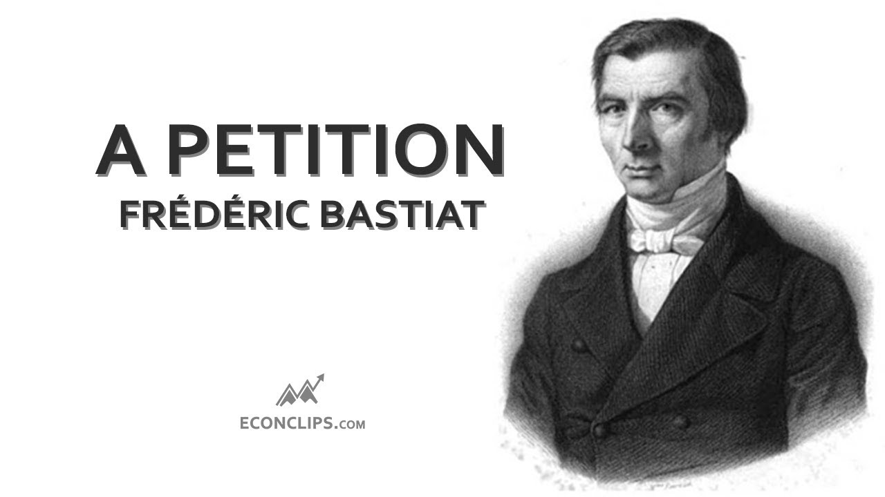

## Table of Contents

## What is the Candle Makers' Petition?

The Candle Makers' Petition is a famous piece of writing by Frédéric Bastiat, a French economist. It was written in 1845 as a way to make fun of people who wanted to protect their businesses by stopping foreign competition. In the petition, Bastiat pretends to be candle makers who are asking the government to block out the sun. They say that if the sun is blocked, people will have to buy more candles, which will help the candle makers' business.

Bastiat uses this funny idea to show how silly it is to try to protect one group of people by hurting everyone else. He argues that blocking out the sun would make life worse for everyone, just like protecting one industry can harm the whole economy. By using humor, Bastiat helps people see the problems with protectionism, which is when governments help certain businesses by limiting competition.

## Who wrote the Candle Makers' Petition?

Frédéric Bastiat wrote the Candle Makers' Petition. He was a French economist who lived in the 1800s. He wrote it in 1845 to make fun of people who wanted the government to help their businesses by stopping competition from other countries.

In the petition, Bastiat pretends to be candle makers asking the government to block out the sun. They say this would make people buy more candles, which would be good for their business. Bastiat uses this funny idea to show how silly it is to protect one group by making life harder for everyone else.

## When was the Candle Makers' Petition published?

The Candle Makers' Petition was published in 1845. It was written by a French economist named Frédéric Bastiat. He wrote it to make fun of people who wanted the government to help their businesses by stopping competition from other countries.

In the petition, Bastiat pretends to be candle makers asking the government to block out the sun. They say this would make people buy more candles, which would be good for their business. Bastiat uses this funny idea to show how silly it is to protect one group by making life harder for everyone else.

## What was the main argument presented in the Candle Makers' Petition?

The main argument in the Candle Makers' Petition is that the government should block out the sun to help candle makers. The candle makers say that if the sun is blocked, people will have to use more candles. This would be good for their business because they would sell more candles.

Frédéric Bastiat, the writer, uses this funny idea to show how silly protectionism is. Protectionism is when the government helps one group by hurting everyone else. Bastiat thinks that trying to protect one industry, like candle making, by blocking out the sun is a bad idea. It would make life worse for everyone, just like protecting one business can harm the whole economy.

## How did the Candle Makers' Petition use satire to make its point?

The Candle Makers' Petition used satire by pretending that candle makers wanted the government to block out the sun. They said this would make people buy more candles, which would help their business. This idea is funny because it's so silly to think the government could block the sun. But it helps show how ridiculous protectionism is. Protectionism is when the government helps one group by hurting everyone else. By using this funny idea, Bastiat makes it clear that protecting one industry can harm the whole economy.

Bastiat used satire to make people laugh and think at the same time. By making the candle makers' request sound so crazy, he shows that trying to protect one business by limiting competition is just as crazy. The petition makes people see that helping one group by hurting others doesn't make sense. It's like saying the sun is bad because it gives free light. Bastiat's funny story helps people understand the problems with protectionism in a way that's easy to remember.

## What was the economic context in which the Candle Makers' Petition was written?

When Frédéric Bastiat wrote the Candle Makers' Petition in 1845, France was dealing with a lot of economic issues. At that time, many people in France wanted the government to protect their businesses from foreign competition. They thought that if the government made it hard for other countries to sell their products in France, their own businesses would do better. This idea is called protectionism. People believed that by limiting what could be imported, they would sell more of their own goods and make more money.

Bastiat saw these protectionist ideas as harmful to the economy. He believed that letting businesses compete freely was better for everyone. By writing the Candle Makers' Petition, he wanted to show how silly it was to try to help one group by hurting everyone else. In the petition, he used the funny idea of blocking out the sun to make his point. He wanted people to see that protectionism was just as ridiculous as trying to stop the sun from shining. Bastiat hoped that his satire would make people think about the real problems with protectionism and support free trade instead.

## How did the Candle Makers' Petition relate to the broader economic theories of its time?

The Candle Makers' Petition was written by Frédéric Bastiat in 1845, during a time when many people in France supported protectionism. Protectionism is when the government helps local businesses by making it hard for other countries to sell their goods in France. People thought this would make their own businesses do better. But Bastiat, who believed in free trade, thought protectionism was bad for the economy. He used the funny idea of blocking out the sun to show how silly protectionism was. He wanted to make people see that helping one group by hurting everyone else doesn't make sense.

Bastiat's petition was a way to argue against the popular economic theories of his time. Many economists and business people thought that protecting local industries was the best way to grow the economy. But Bastiat believed that letting businesses compete freely, without government help, would be better for everyone. His satire in the petition was meant to show that protectionism was like trying to stop the sun from shining. By using humor, Bastiat hoped to change people's minds about protectionism and make them support free trade instead.

## What impact did the Candle Makers' Petition have on economic thought?

The Candle Makers' Petition by Frédéric Bastiat had a big impact on how people thought about economics. It made people question the idea of protectionism, which is when the government helps local businesses by making it hard for other countries to sell their goods. Bastiat used a funny story about blocking out the sun to show how silly this idea was. By making people laugh, he helped them see that trying to help one group by hurting everyone else doesn't make sense. His petition got people thinking about the problems with protectionism and made them more open to the idea of free trade, where businesses can compete without government help.

Bastiat's use of satire in the petition also showed how powerful humor can be in making economic ideas easier to understand. Before the petition, many people saw protectionism as a good way to help their businesses. But after reading Bastiat's funny story, they started to see the downsides of this approach. The petition became a famous example of how to explain complex economic ideas in a simple and memorable way. It helped change the way people thought about economic policy and encouraged them to support free trade, which lets businesses compete fairly and can lead to a healthier economy for everyone.

## Can you explain the concept of protectionism as it relates to the Candle Makers' Petition?

Protectionism is when the government helps local businesses by making it hard for other countries to sell their goods. In the time when Frédéric Bastiat wrote the Candle Makers' Petition, many people in France wanted the government to protect their businesses this way. They thought that if the government made it hard for other countries to sell in France, their own businesses would do better. But Bastiat thought this was a bad idea. He believed that letting businesses compete freely, without government help, would be better for everyone.

In the Candle Makers' Petition, Bastiat uses a funny story to show how silly protectionism is. He pretends that candle makers want the government to block out the sun. They say this would make people buy more candles, which would be good for their business. Bastiat's point is that trying to help one group by hurting everyone else doesn't make sense. Blocking out the sun would make life worse for everyone, just like protecting one business can harm the whole economy. By using humor, Bastiat helps people see the problems with protectionism and understand why free trade, where businesses can compete fairly, is a better idea.

## How has the Candle Makers' Petition been used in modern economic debates?

The Candle Makers' Petition is still used today to talk about economic ideas. People use it to argue against protectionism, which is when the government helps local businesses by making it hard for other countries to sell their goods. The funny story about blocking out the sun helps people see how silly it is to try to help one group by hurting everyone else. By using this old story, modern economists can explain complex ideas in a way that's easy to understand. They use it to show why free trade, where businesses can compete without government help, is better for everyone.

In debates about trade and economic policy, the Candle Makers' Petition is often brought up to make a point. For example, if a country wants to put high taxes on imports to protect its own businesses, someone might bring up Bastiat's petition to argue against it. They might say that just like blocking out the sun would be bad for everyone, protecting one industry can hurt the whole economy. By using humor and a simple story, the petition helps people see the downsides of protectionism and think about the benefits of free trade.

## What are some critiques of the arguments made in the Candle Makers' Petition?

Some people think the Candle Makers' Petition is too simple. They say that Bastiat makes fun of protectionism, but real life is more complicated. They believe that sometimes, protecting local businesses can help a country grow stronger. For example, if a new industry needs time to get started, a little help from the government might be good. These people think that Bastiat's funny story about blocking out the sun doesn't show all the ways protectionism can be useful.

Others say that the petition doesn't talk about all the good things that can come from protecting local businesses. They argue that helping local industries can create jobs and keep money in the country. They think that Bastiat's focus on free trade might not be the best for everyone, especially if a country is trying to build up its own businesses. While the petition is good at making people laugh and think, these critics believe it doesn't give a full picture of the pros and cons of protectionism.

## How does the Candle Makers' Petition illustrate the concept of opportunity cost in economics?

The Candle Makers' Petition shows the idea of opportunity cost by making fun of what happens when you block out the sun. Opportunity cost is what you give up when you choose to do one thing instead of another. In the petition, the candle makers want the government to block out the sun so people will buy more candles. But if the sun is blocked, people lose the free light and warmth it gives. This means the cost of blocking the sun is losing all the good things the sun does for free.

Bastiat uses this funny story to show that protecting one group, like candle makers, can make everyone else worse off. By choosing to help the candle makers, the country would lose the benefits of the sun. This is a big opportunity cost because the sun's light and warmth are very valuable. Bastiat's petition helps people see that when the government tries to protect one industry, it can hurt the whole economy by making everyone give up something important.

## References & Further Reading

[1]: Bastiat, F. (1845). ["The Candle Maker’s Petition."](http://bastiat.org/en/petition.html) 

[2]: Smith, A. (1776). ["An Inquiry into the Nature and Causes of the Wealth of Nations."](https://archive.org/details/inquiryintonatur01smit_0/)

[3]: Cobden, R. (1846). ["The Corn Laws in England."](https://www.barricades.ac.uk/items/show/103)

[4]: Jovanovic, B., & Menkveld, A. J. (2012). ["Middlemen in Limit Order Markets."](https://papers.ssrn.com/sol3/papers.cfm?abstract_id=1624329) Econometrica, 80(5), 2285-2333.

[5]: Narang, R. K. (2013). ["Inside the Black Box: A Simple Guide to Quantitative and High-Frequency Trading."](https://onlinelibrary.wiley.com/doi/book/10.1002/9781118662717)

[6]: Crockett, A., Harris, T., Mishkin, F. S., & White, E. N. (2011). ["Conflicts of Interest in the Financial Services Industry: What Should We Do About Them?"](https://www.amazon.com/Conflicts-Interest-Financial-Services-Industry/dp/1898128790) Center for Economic Policy Research.