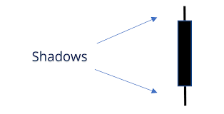

## Table of Contents

## What is a candle wick in stock prices?

A candle wick in stock prices refers to the thin lines you see above and below the main body of a candlestick chart. These wicks, also called shadows, show the highest and lowest prices that a stock reached during a specific time period, like a day or an hour. The top of the wick shows the highest price, and the bottom shows the lowest price. 

Candlestick charts are popular among traders because they give a quick snapshot of price movements. The main body of the candlestick shows the opening and closing prices, while the wicks tell you how much the price fluctuated during that time. If a stock's price moved a lot, the wicks will be longer. If it didn't move much, the wicks will be shorter. Understanding the wicks can help traders make better decisions about buying or selling stocks.

## What is a candle shadow in stock prices?

A candle shadow in stock prices is the same thing as a candle wick. It's the thin line you see above and below the main body of a candlestick on a chart. This shadow shows the highest and lowest prices that a stock reached during a specific time period, like a day or an hour. The top of the shadow is the highest price, and the bottom is the lowest price.

Candlestick charts are popular because they help traders see price movements quickly. The main body of the candlestick shows the opening and closing prices, while the shadows tell you how much the price went up and down during that time. If the price moved a lot, the shadows will be longer. If it didn't move much, the shadows will be shorter. By looking at the shadows, traders can make better choices about buying or selling stocks.

## How do candle wicks and shadows form on a stock chart?

Candle wicks and shadows form on a stock chart as the price of a stock changes during a specific time period, like a day or an hour. When the stock price moves up and down, the highest and lowest prices it reaches during that time are shown by the wicks or shadows. The top of the wick is the highest price the stock reached, and the bottom of the wick is the lowest price. These wicks are drawn as thin lines above and below the main body of the candlestick, which shows the opening and closing prices.

The length of the wicks can tell you a lot about how the stock price moved. If the wicks are long, it means the price went up and down a lot during that time. If the wicks are short, it means the price didn't change much. Traders look at these wicks to understand how the stock behaved and to make decisions about buying or selling. By seeing the highest and lowest points of the price movement, traders can get a better idea of the stock's [volatility](/wiki/volatility-trading-strategies) and potential future movements.

## What does a long upper wick indicate about market sentiment?

A long upper wick on a candlestick chart means that the stock's price went up a lot during the day but then came back down before the day ended. This shows that at first, buyers were in control and pushed the price higher. But then, sellers stepped in and pushed the price back down. It's like the buyers tried to take the price to a new high, but the sellers were strong enough to stop them and bring the price back down.

This kind of pattern can tell us about the market sentiment. A long upper wick might mean that there is some doubt or worry among investors. It shows that even though the price went up at first, not everyone was sure about keeping it there. So, it could be a sign that the market might be getting ready to change direction, with more people starting to think about selling instead of buying.

## What does a long lower wick suggest about buying pressure?

A long lower wick on a candlestick chart shows that the stock's price dropped a lot during the day, but then it went back up before the day ended. This means that at first, sellers were in control and pushed the price down. But then, buyers came in and pushed the price back up. It's like the sellers tried to take the price to a new low, but the buyers were strong enough to stop them and bring the price back up.

This kind of pattern can tell us about the buying pressure in the market. A long lower wick suggests that there is strong buying interest. Even though the price went down at first, buyers were ready to step in and push it back up. This can be a sign that people are feeling good about the stock and are willing to buy it even after it drops, which might mean the price could keep going up.

## How can the length of wicks and shadows help in predicting future price movements?

The length of wicks and shadows on a candlestick chart can give us clues about what might happen to a stock's price next. If you see a long upper wick, it means the price went up a lot but then came back down. This can show that even though buyers tried to push the price higher, sellers were strong enough to bring it back down. It might mean that the market is getting ready to change direction, and more people could start selling instead of buying. So, a long upper wick could be a warning sign that the price might go down soon.

On the other hand, a long lower wick means the price dropped a lot but then went back up. This shows that even though sellers tried to push the price down, buyers were ready to step in and bring it back up. It can be a sign that people are feeling good about the stock and are willing to buy it even after it drops. This might mean the price could keep going up. By looking at the length of the wicks and shadows, traders can get a better idea of how strong the buying or selling pressure is and make guesses about where the price might go next.

## What is the difference between a wick and a shadow in candlestick charting?

In candlestick charting, the terms "wick" and "shadow" are used to describe the same thing. They refer to the thin lines you see above and below the main body of a candlestick. These lines show the highest and lowest prices a stock reached during a specific time, like a day or an hour. The top of the wick or shadow is the highest price, and the bottom is the lowest price. So, whether you call them wicks or shadows, they both give you the same information about price movements.

The reason some people use "wick" and others use "shadow" is just a matter of preference. There's no difference in what they mean. Both terms help traders understand how much the price went up and down during the time period shown on the chart. By looking at the length of the wicks or shadows, traders can see how strong the buying or selling pressure was. This can help them make better guesses about where the price might go next.

## How do traders use wicks and shadows to set stop-loss and take-profit levels?

Traders use the wicks and shadows on candlestick charts to help them decide where to put their stop-loss and take-profit levels. A stop-loss is like a safety net that tells the computer to sell the stock if it drops to a certain price, so the trader doesn't lose too much money. A take-profit is like a goal that tells the computer to sell the stock if it goes up to a certain price, so the trader can make some money. By looking at the wicks and shadows, traders can see how much the price has moved up and down in the past. If a stock has long upper wicks, it means the price went up a lot but then came back down. So, traders might set their take-profit just below the top of those wicks, thinking the price might not go much higher than that.

On the other hand, if a stock has long lower wicks, it means the price dropped a lot but then went back up. Traders might set their stop-loss just below the bottom of those wicks, thinking that if the price drops that low again, it might keep going down. By using the wicks and shadows to guide their decisions, traders can try to make smarter choices about when to get out of a trade, either to protect their money or to make some profit. It's like using the past price movements to plan for the future, hoping to catch the right moments to buy and sell.

## Can the color of the candlestick body influence the interpretation of wicks and shadows?

The color of the candlestick body can indeed affect how traders look at the wicks and shadows. Usually, a candlestick is green or white if the closing price is higher than the opening price, showing that the stock went up during that time. If the candlestick is red or black, it means the closing price was lower than the opening price, showing that the stock went down. The color tells you right away if the stock ended the day up or down, which can change how you think about the wicks. For example, a long upper wick on a green candlestick might mean that buyers tried to push the price up but couldn't keep it there, which could be a warning sign.

On the other hand, a long lower wick on a red candlestick might show that the stock dropped a lot but then buyers stepped in and pushed it back up a bit. This can be a sign of strong buying interest even when the stock is going down, which might make traders think the price could go back up soon. So, the color of the candlestick body helps traders understand the overall mood of the market and can make the wicks and shadows more meaningful when deciding what to do next.

## How do wicks and shadows interact with key support and resistance levels?

Wicks and shadows on a candlestick chart can tell traders a lot about how the stock price is behaving around key support and resistance levels. Support levels are like floors where the price tends to stop dropping and might start going up again. Resistance levels are like ceilings where the price tends to stop going up and might start dropping again. When a wick or shadow touches or goes beyond a support or resistance level, it can show that the price tried to break through that level but didn't quite make it. For example, if a long upper wick touches a resistance level, it means the price tried to go higher but got pushed back down, showing that the resistance is still strong.

On the other hand, if a long lower wick touches a support level, it means the price tried to go lower but got pushed back up, showing that the support is still holding. Traders watch these wicks and shadows closely because they can give clues about whether the support or resistance levels might break soon. If a wick or shadow goes past a support or resistance level but the price comes back inside, it might mean the level is still strong. But if the price keeps going past the level after the wick or shadow, it could mean the level is about to break, and the price might keep moving in that direction.

## What advanced patterns involving wicks and shadows can signal a potential reversal?

One advanced pattern that can signal a potential reversal is the "hammer" candlestick. A hammer has a small body at the top and a long lower wick, with little to no upper wick. It shows up when a stock's price drops a lot during the day but then gets pushed back up near the opening price by the end of the day. This pattern can mean that even though sellers were strong at first, buyers stepped in and took control. If you see a hammer at the bottom of a downtrend, it might be a sign that the price could start going up soon.

Another pattern to watch is the "shooting star." This candlestick has a small body at the bottom and a long upper wick, with little to no lower wick. It appears when the stock's price goes up a lot during the day but then falls back down near the opening price by the end. This can mean that buyers tried to push the price higher but couldn't keep it there, and sellers took over. If you see a shooting star at the top of an uptrend, it might be a sign that the price could start going down soon.

Both the hammer and the shooting star patterns show that the market might be getting ready to change direction. Traders look for these patterns to help them decide when to buy or sell, hoping to catch the right moment when the price starts to move the other way.

## How can algorithmic trading systems be designed to exploit patterns in wicks and shadows?

Algorithmic trading systems can be designed to exploit patterns in wicks and shadows by using rules based on candlestick patterns like hammers and shooting stars. These systems can be programmed to scan through lots of candlestick charts very quickly, looking for these specific patterns. When the system spots a hammer at the bottom of a downtrend, it can be set up to buy the stock, thinking the price might start going up soon. On the other hand, if it sees a shooting star at the top of an uptrend, the system can be set up to sell the stock, thinking the price might start going down soon. The system uses these patterns to make quick decisions about buying and selling, trying to catch the right moments when the price might change direction.

To make these systems even better, they can also be set up to look at other things like how long the wicks and shadows are, and how the stock price behaves around support and resistance levels. For example, if a long upper wick touches a resistance level, the system might decide to sell because it thinks the price won't go much higher. If a long lower wick touches a support level, the system might decide to buy because it thinks the price won't go much lower. By combining these different pieces of information, the [algorithmic trading](/wiki/algorithmic-trading) system can make smarter choices about when to trade, trying to make money from the patterns it sees in the wicks and shadows.

## References & Further Reading

[1]: Bergstra, J., Bardenet, R., Bengio, Y., & Kégl, B. (2011). ["Algorithms for Hyper-Parameter Optimization."](https://dl.acm.org/doi/10.5555/2986459.2986743) Advances in Neural Information Processing Systems 24.

[2]: ["Advances in Financial Machine Learning"](https://www.amazon.com/Advances-Financial-Machine-Learning-Marcos/dp/1119482089) by Marcos Lopez de Prado

[3]: ["Evidence-Based Technical Analysis: Applying the Scientific Method and Statistical Inference to Trading Signals"](https://www.amazon.com/Evidence-Based-Technical-Analysis-Scientific-Statistical/dp/0470008741) by David Aronson

[4]: ["Machine Learning for Algorithmic Trading"](https://github.com/stefan-jansen/machine-learning-for-trading) by Stefan Jansen

[5]: ["Quantitative Trading: How to Build Your Own Algorithmic Trading Business"](https://www.amazon.com/Quantitative-Trading-Build-Algorithmic-Business/dp/1119800064) by Ernest P. Chan