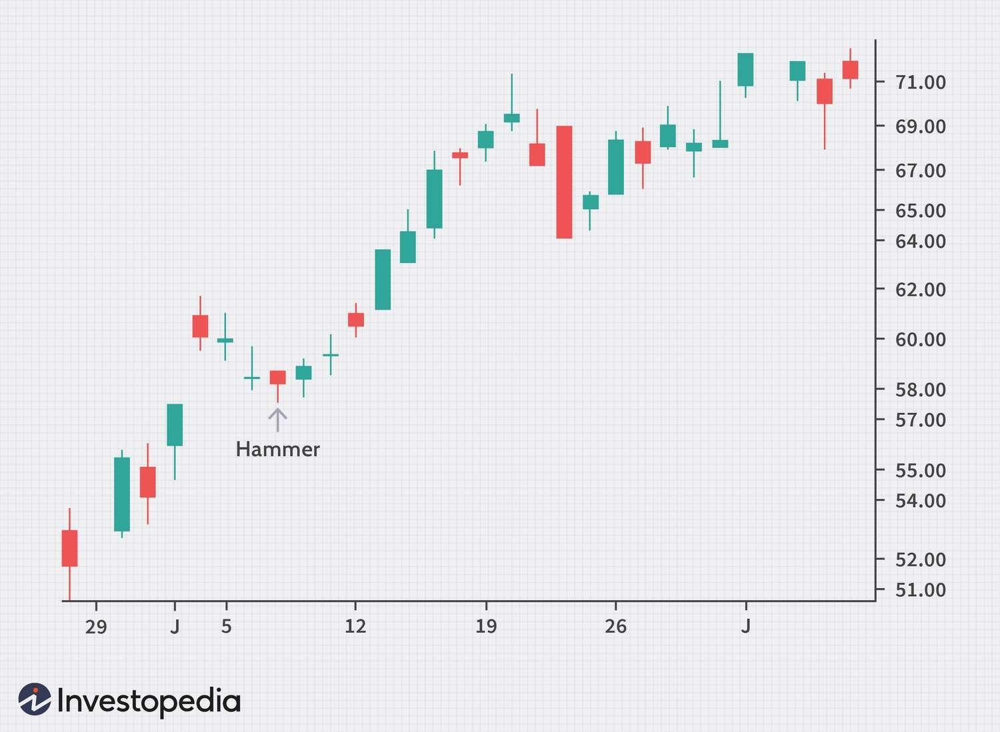

In the dynamic world of trading, various tools and strategies are employed to make informed decisions. Among these, candlestick analysis stands out as a fundamental component of technical analysis, crucial for predicting market trends. Originating from Japan in the 18th century, this method uses patterns formed by the open, high, low, and close prices of an asset to give traders insights into market sentiment and potential price movements. Common patterns, such as the Doji and Hammer, serve as signals for possible market reversals or continuations, aiding traders in making timely decisions.

Parallel to these traditional methods, technology has transformed trading practices significantly, giving rise to algorithmic trading (algo trading). Algo trading involves the use of computer algorithms to execute trades at high speed and frequency, minimizing human intervention and emotional bias. The integration of technology in trading strategies has enabled traders to harness data and computational power for efficient decision-making, allowing them to react to market changes swiftly.



This article explores how candlestick analysis, technical analysis, and logical trading methodologies converge with advanced algorithmic trading strategies. By understanding this intersection, traders can enhance their decision-making processes, improve trading efficiency, and gain a competitive edge in the ever-evolving financial markets. These elements, when combined effectively, lay the foundation for robust, strategic trading practices that can adapt to future technological advancements.

## Table of Contents

## Understanding Candlestick Analysis

Candlestick charts, originally developed in Japan, have been utilized for over a century to track rice prices and are now fundamental in financial markets for a visual representation of price movements. These charts provide traders with profound insights into market sentiment by illustrating the open, high, low, and close prices over a specified period. The design of candlestick charts inherently allows traders to intuitively perceive market dynamics, aiding in the identification of potential price reversals or continuations.

Key candlestick patterns such as Doji, Hammer, and Engulfing play a vital role in comprehending market behavior. A Doji pattern, for instance, indicates indecision within the market, as the opening and closing prices are virtually identical, suggesting a potential reversal or continuation depending on the preceding trend. A Hammer pattern can suggest a bullish reversal following a downtrend, characterized by a small body at the upper end of the trading range and a long lower shadow. Conversely, the Engulfing pattern, which comprises two candles where the second one fully engulfs the first, can indicate a significant reversal; a Bullish Engulfing pattern occurs at the end of a downtrend, while a Bearish Engulfing pattern appears at the end of an uptrend.

Understanding and interpreting these formations enables traders to make well-timed and informed trading decisions. By analyzing how these patterns form within the context of past prices, traders can derive insights into potential future movements. For example, a Bullish Engulfing pattern following a downtrend may serve as an indicator to initiate buy positions, leveraging the anticipated upward momentum. This practice of interpreting candlestick patterns supplements broader technical analysis strategies, allowing traders to execute trades with precision based on quantitative data insights.

## The Role of Technical Analysis

Technical analysis is a crucial aspect of trading that involves the study of past market data to predict future price movements. It operates under the assumption that historical price movements tend to repeat themselves, and patterns can be identified to forecast future market behavior. One of the primary tools in technical analysis is the candlestick pattern, alongside other indicators like moving averages and the Relative Strength Index (RSI).

Candlestick patterns form the backbone of technical analysis. These patterns visualize market sentiment by displaying the open, close, high, and low prices within a specified time period. Recognizable formations such as Doji, Hammer, and Engulfing inform traders about potential price reversals or continuations. Moving averages, another vital tool, help smooth out price data to identify trends over time. A simple moving average (SMA) calculates the average of closing prices over a set period, aiding traders in identifying support and resistance levels.

$$
\text{SMA} = \frac{P_1 + P_2 + \dots + P_n}{n}
$$

where $P$ is the closing price and $n$ is the number of days.

The Relative Strength Index (RSI) is an oscillator that measures the speed and change of price movements. RSI values range from 0 to 100, with readings above 70 indicating overbought conditions and below 30 suggesting oversold conditions. This helps traders assess potential buying or selling opportunities.

Technical analysis provides a quantitative framework for traders to evaluate market trends. It complements [fundamental analysis](/wiki/fundamental-analysis) by offering insights into market flow and investor behavior that are not apparent from financial statements alone. Using both approaches allows traders to have a comprehensive overview of market dynamics.

By integrating multiple technical indicators, traders can devise robust trading strategies. Combining moving averages with RSI, for example, can enhance the detection of potential entry and [exit](/wiki/exit-strategy) points. Traders can set algorithms to trigger trades based on specific conditions derived from these indicators, optimizing strategies for better results.

In conclusion, technical analysis plays a pivotal role in developing informed trading strategies. By examining historical data and utilizing various indicators, traders can make calculated decisions that improve their chances of success in the financial markets. Integration with [algorithmic trading](/wiki/algorithmic-trading) further amplifies its effectiveness by allowing real-time analysis and execution.

## The Emergence of Algorithmic Trading

Algorithmic trading, commonly known as algo trading, employs sophisticated computer algorithms to automate and execute trades at high speeds and volumes. This method minimizes the need for human intervention, thereby significantly reducing the potential for emotional biases, which can often lead to irrational trading decisions. The advent of algo trading has been propelled by substantial advancements in technology and computing power, which have enabled traders to efficiently handle large volumes of data and execute trades with remarkable precision.

One of the primary attractions of algo trading is its capability to efficiently execute complex trading strategies that would be impractical for a human trader to perform manually. Algorithms can be programmed to follow a set of pre-defined rules or criteria, often derived from technical analysis, to initiate and manage trades. This allows for the rapid execution of orders that can capitalize on even minute price discrepancies in the market, often within milliseconds.

Algo trading is structured to conduct a myriad of strategies including [trend following](/wiki/trend-following) strategies, [arbitrage](/wiki/arbitrage), and [market making](/wiki/market-making). For instance:

```python
# Example of a simple moving average crossover strategy in Python
def trade_signal(prices, short_window, long_window):
    signals = pd.DataFrame(index=prices.index)
    signals['price'] = prices
    signals['short_mavg'] = prices['Close'].rolling(window=short_window, min_periods=1).mean()
    signals['long_mavg'] = prices['Close'].rolling(window=long_window, min_periods=1).mean()
    signals['signal'] = 0.0
    signals['signal'][short_window:] = np.where(signals['short_mavg'][short_window:] > signals['long_mavg'][short_window:], 1.0, 0.0)
    signals['positions'] = signals['signal'].diff()
    return signals

# Example usage
import pandas as pd
import numpy as np

# Assume a DataFrame 'data' with a 'Close' column exists
signals = trade_signal(data, 40, 100)
```

In this example, a simple moving average crossover strategy signals a buy when the short-term moving average exceeds the long-term moving average, capitalizing on upward [momentum](/wiki/momentum) in price.

The efficiency and speed of algorithmic trading have transformed the financial markets, enabling transactions worth billions of dollars to take place daily across global exchanges. High-frequency trading, a subset of algo trading, takes this to an even more advanced level by executing thousands of orders in fractions of a second, exploiting short-lived market fluctuations. These capabilities provide substantial [liquidity](/wiki/liquidity-risk-premium) in the markets and have reshaped trading dynamics over the last few decades.

The rapid growth of algorithmic trading underscores the symbiotic relationship between technology and finance. As computational techniques continue to develop, the potential for even more sophisticated algorithms is likely to increase, further solidifying algo trading as a cornerstone of modern financial markets.

## Integrating Candlestick and Technical Analysis in Algo Trading

In algorithmic trading, integrating candlestick and technical analysis allows for the development of sophisticated strategies that can process market information and execute trades with precision. Algorithms are programmed to recognize candlestick patterns such as Doji, Hammer, and Engulfing, and utilize technical indicators like moving averages and the Relative Strength Index (RSI) to assess market conditions in real-time.

The ability of algorithms to interpret these patterns and indicators rapidly enables them to make well-informed trading decisions. For instance, when an algorithm identifies a bullish engulfing pattern in conjunction with an RSI that indicates an oversold condition, it might trigger a buy order. Conversely, a bearish engulfing pattern with an overbought RSI could initiate a sell order.

A significant advantage of integrating candlestick and technical analysis in algorithmic trading is the capacity for [backtesting](/wiki/backtesting). Traders can evaluate strategies by running simulations on historical market data to determine their effectiveness. This process helps in optimizing algorithms for better performance. It allows traders to refine their strategies based on past successes and failures, ultimately improving future trading outcomes.

The integration of these analyses offers a competitive edge by facilitating earlier detection of market shifts compared to traditional methods. Algorithms can process signals and execute trades in milliseconds, capturing opportunities that human traders might miss. This capability is crucial in volatile markets where rapid changes can lead to significant profit or loss.

Moreover, these strategies leverage the logical interpretation of data to enhance market timing and risk management. By systematically combining various technical indicators with candlestick patterns, algorithms can establish more precise entry and exit points. This precision aids in minimizing risks associated with market [volatility](/wiki/volatility-trading-strategies), thereby improving the overall stability and reliability of trading operations.

In summary, the fusion of candlestick and technical analysis into algorithmic trading systems facilitates informed decision-making and agile execution, positioning traders to capitalize on market opportunities efficiently and effectively.

## Challenges and Considerations

Despite the numerous advantages that algorithmic trading (algo trading) offers, it is not without its challenges. An essential requirement for engaging in algo trading is access to sophisticated technology and infrastructure. This includes high-speed internet connections, powerful computing resources, and advanced software platforms capable of processing large volumes of data efficiently. Without these, traders may find it difficult to compete in the fast-paced world of algo trading.

One significant challenge in algo trading is the susceptibility to market anomalies or unexpected events that can disrupt algorithmic strategies. These anomalies, often driven by unforeseen political, economic, or natural events, can lead to substantial market volatility. Algorithms, particularly those not designed to handle extreme market conditions, may execute trades that exacerbate losses instead of preventing them. Therefore, it is vital for developers to incorporate robust risk management strategies and contingency plans within their algorithms.

Regulatory frameworks and market guidelines play a crucial role in ensuring fair trading practices within the algo trading ecosystem. Different jurisdictions have varying regulations, and staying compliant requires a deep understanding of these legal requirements. Algorithms must be programmed to adhere to these guidelines to avoid illegal trading activities, which can result in significant penalties or legal action. Continuous developments in regulatory standards necessitate ongoing revisions and updates to trading algorithms to maintain compliance.

The dynamic nature of financial markets demands continuous monitoring and adjustment of trading algorithms to maintain their efficacy. This involves regularly backtesting strategies with historical data, optimizing parameters, and making necessary adjustments to align with current market conditions. The process is ongoing and requires a combination of technical expertise and market knowledge to ensure algorithms operate optimally.

Ethical considerations also come into play when discussing the speed advantage that algorithmic traders possess over human traders. Algorithms can execute trades in milliseconds, capitalizing on fleeting market opportunities before human traders can react. This speed advantage raises questions about fairness and the level playing field among market participants. Debates continue regarding the ethical implications of such advantages and whether additional regulations are needed to ensure equitable trading environments for all participants. 

Overall, navigating the challenges of algo trading requires a comprehensive understanding of both technological and market intricacies, as well as a commitment to ethical and regulatory standards.

## Future of Trading with Technology

The advancement in [artificial intelligence](/wiki/ai-artificial-intelligence) (AI) and [machine learning](/wiki/machine-learning) (ML) is poised to significantly transform candlestick and technical analysis. These cutting-edge technologies are designed to process vast quantities of data, providing predictive market insights that far exceed human capabilities. By analyzing historical and real-time data, AI and ML can identify subtle patterns and correlations, enabling traders to forecast market movements with increased accuracy. For instance, machine learning algorithms can autonomously adapt to new data, refining their predictive models over time without explicit human programming.

Enhanced algorithms are set to revolutionize how trades are executed globally. Algorithmic trading platforms powered by AI can execute trades at lightning speeds, reacting to market changes in fractions of a second. This capability not only optimizes trading efficiency but also ensures that traders can capitalize on fleeting market opportunities that would otherwise be missed. Algorithms leveraging AI can be designed to execute complex trading strategies, factoring in a multitude of variables and recognizing patterns across different markets and asset classes. 

Adapting to these technological innovations is crucial for traders aiming for long-term success. As markets become increasingly data-driven, the ability to utilize AI and ML will be a defining [factor](/wiki/factor-investing) in maintaining a competitive edge. Traders and institutions that embrace these technologies will likely outperform those using traditional methods alone. Successful adaptation involves not only the adoption of new tools but also continuous education and training to effectively incorporate AI and ML into trading strategies.

The future landscape of trading will be characterized by a fusion of traditional and technological methods. While AI and ML offer unprecedented capabilities, the foundational principles of technical analysis remain relevant. Traders will benefit from an integrated approach that combines human intuition and experience with the computational power of AI. This synthesis will enable more nuanced and strategic trading decisions, promising greater accuracy and efficiency in navigating financial markets. As technology continues to evolve, the ongoing collaboration between traditional techniques and emerging innovations will be pivotal in shaping the future of trading.

## Conclusion

In the rapidly evolving landscape of trading, leveraging the trio of candlestick analysis, technical analysis, and logical trading forms the backbone of effective algorithmic trading strategies. These elements serve as essential tools that, when integrated into algorithmic models, can substantially enhance trading performance by providing deeper insights into market behaviors and potential price movements.

Algorithmic strategies that effectively harness these elements can lead to improved outcomes through more accurate market predictions and timely trades. By encoding trading algorithms with nuanced patterns from candlestick analysis along with robust technical indicators, traders develop systems capable of operating with a level of precision and speed that surpasses traditional trading methods.

To remain competitive in today’s financial markets, it is crucial for traders and firms to adapt to technological advancements. Algorithmic trading not only necessitates understanding computational methods but also requires a continual evolution to incorporate emerging technologies such as artificial intelligence and machine learning. These evolving technologies enable traders to process and analyze volumes of market data that were previously unmanageable, generating predictive insights that refine trading strategies further.

As trading practices progress, the integration of traditional analysis methods with new-age technological approaches becomes indispensable. Historical insights from candlestick patterns and technical indicators, when combined with cutting-edge algorithmic models, lay the groundwork for pioneering strategies that anticipate market shifts with greater efficiency and accuracy. Embracing this synergy between classic techniques and modern innovations paves the way for more informed decision-making and strategically sound trading practices, ensuring robust performance in an ever-competitive trading environment.

## References & Further Reading

[1]: Bergstra, J., Bardenet, R., Bengio, Y., & Kégl, B. (2011). ["Algorithms for Hyper-Parameter Optimization."](https://papers.nips.cc/paper/4443-algorithms-for-hyper-parameter-optimization) Advances in Neural Information Processing Systems 24.

[2]: ["Advances in Financial Machine Learning"](https://www.amazon.com/Advances-Financial-Machine-Learning-Marcos/dp/1119482089) by Marcos Lopez de Prado

[3]: ["Evidence-Based Technical Analysis: Applying the Scientific Method and Statistical Inference to Trading Signals"](https://www.amazon.com/Evidence-Based-Technical-Analysis-Scientific-Statistical/dp/0470008741) by David Aronson

[4]: ["Machine Learning for Algorithmic Trading"](https://github.com/PacktPublishing/Machine-Learning-for-Algorithmic-Trading-Second-Edition) by Stefan Jansen

[5]: ["Quantitative Trading: How to Build Your Own Algorithmic Trading Business"](https://books.google.com/books/about/Quantitative_Trading.html?id=j70yEAAAQBAJ) by Ernest P. Chan