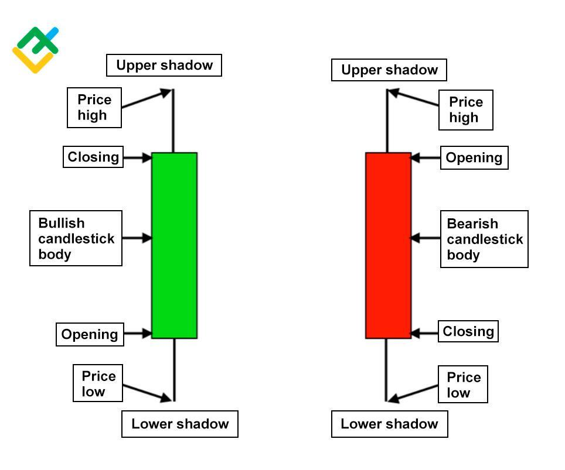

## Table of Contents

## What is a candlestick chart?

A candlestick chart is a type of graph used to show how the price of something, like a stock or a currency, changes over time. Each "candlestick" on the chart represents the price movement of the item during a specific time period, such as a day or an hour. The candlestick has a wide part, called the "body," which shows the opening and closing prices. If the closing price is higher than the opening price, the body is usually colored white or green. If the closing price is lower than the opening price, the body is usually colored black or red.

Above and below the body, there are thin lines called "wicks" or "shadows." These lines show the highest and lowest prices reached during that time period. The top of the upper wick shows the highest price, and the bottom of the lower wick shows the lowest price. By looking at a series of candlesticks, you can see patterns that help you understand how the price has been moving and might help you predict where it could go next. This makes candlestick charts a useful tool for people who trade stocks, currencies, or other financial items.

## What are the main components of a candlestick?

A candlestick has two main parts: the body and the wicks. The body shows the opening and closing prices of the item for a specific time. If the closing price is higher than the opening price, the body is usually colored white or green. If the closing price is lower than the opening price, the body is usually colored black or red. This color helps you see quickly if the price went up or down during that time.

The wicks, also called shadows, are thin lines above and below the body. The top of the upper wick shows the highest price reached during that time, and the bottom of the lower wick shows the lowest price. By looking at the wicks, you can see how much the price moved up and down during the period, even if it didn't stay at those levels when the time ended.

## How do you read a basic candlestick chart?

When you look at a basic candlestick chart, you see a series of candlesticks, each one showing what happened to the price of something over a certain time. Each candlestick has a wide part called the body and thin lines called wicks or shadows. The body shows the opening and closing prices. If the body is white or green, it means the price went up because the closing price was higher than the opening price. If the body is black or red, it means the price went down because the closing price was lower than the opening price. The wicks show the highest and lowest prices reached during that time. The top of the upper wick is the highest price, and the bottom of the lower wick is the lowest price.

By looking at a series of candlesticks, you can see patterns that help you understand how the price has been moving. If you see a lot of green or white candlesticks in a row, it means the price has been going up over time. If you see a lot of red or black candlesticks, it means the price has been going down. The length of the body and the wicks can also tell you a lot. A long body means there was a big difference between the opening and closing prices, while a short body means the difference was small. Long wicks mean the price moved a lot during that time, but it came back to close near the opening price.

## What do different candlestick patterns indicate?

Candlestick patterns help traders understand what might happen next with the price of something. One common pattern is called a "Doji," which happens when the opening and closing prices are very close together, making the body of the candlestick very small. This pattern can mean that the market is not sure which way to go next, and it might change direction soon. Another pattern is the "Hammer," which has a small body and a long lower wick. It usually appears at the bottom of a downtrend and can mean that the price might start going up.

Another important pattern is the "Engulfing" pattern. This happens when a big candlestick completely covers the body of the smaller candlestick before it. If a green or white candlestick engulfs a red or black one, it might mean that the price is going to go up. If a red or black candlestick engulfs a green or white one, it might mean the price is going to go down. The "Shooting Star" is another pattern that can signal a change. It has a small body and a long upper wick, and it often appears at the top of an uptrend, suggesting that the price might start going down soon.

## How can candlestick charts help in predicting market trends?

Candlestick charts help people predict market trends by showing patterns that can signal what might happen next with prices. When you look at a series of candlesticks, you can see if the market is going up or down. For example, if you see a lot of green or white candlesticks in a row, it means the price has been going up over time. This could mean the trend will keep going up. On the other hand, if you see a lot of red or black candlesticks, it means the price has been going down, and this might mean the trend will continue to go down.

Different patterns in the candlesticks can also give clues about what might happen next. For example, a "Doji" pattern, where the opening and closing prices are very close, can mean the market is not sure which way to go, and it might change direction soon. A "Hammer" pattern, with a small body and a long lower wick, often appears at the bottom of a downtrend and can signal that the price might start going up. By recognizing these patterns, traders can make better guesses about where the market might be headed next.

## What is the difference between a bullish and a bearish candlestick?

A bullish candlestick shows that the price of something went up during the time it represents. You can spot a bullish candlestick because its body is usually colored white or green. The bottom of the body shows the opening price, and the top of the body shows the closing price. This means the closing price was higher than the opening price. The wicks or shadows above and below the body show the highest and lowest prices reached during that time, but the main thing is that the price ended higher than it started.

A bearish candlestick shows that the price of something went down during the time it represents. You can spot a bearish candlestick because its body is usually colored black or red. The top of the body shows the opening price, and the bottom of the body shows the closing price. This means the closing price was lower than the opening price. Like with the bullish candlestick, the wicks or shadows show the highest and lowest prices reached, but the main thing is that the price ended lower than it started.

## How do you identify key support and resistance levels using candlestick charts?

To identify key support and resistance levels using candlestick charts, you need to look at where the price of something has stopped going down or up in the past. Support levels are like a floor for the price. They are the points where the price has stopped falling and started to go back up. On a candlestick chart, you can see these levels by looking for places where the bottoms of the candlesticks, especially the lower wicks, have touched or come close to the same price a few times. If the price keeps bouncing back up from around the same level, that's a good sign of a support level.

Resistance levels are like a ceiling for the price. They are the points where the price has stopped rising and started to go back down. On a candlestick chart, you can spot these levels by looking for places where the tops of the candlesticks, especially the upper wicks, have touched or come close to the same price several times. If the price keeps falling back from around the same level, that's a good sign of a resistance level. By watching these levels, you can get a better idea of where the price might go next and make smarter trading choices.

## What are some common candlestick patterns and their meanings?

Candlestick patterns can tell us a lot about what the price of something might do next. One common pattern is the "Doji." It looks like a cross or plus sign because the opening and closing prices are very close together. This means the market is not sure which way to go, and it might change direction soon. Another pattern is the "Hammer." It has a small body and a long lower wick, kind of like a hammer. This often shows up when the price has been going down and might mean it's about to start going up.

Another important pattern is the "Engulfing" pattern. It happens when a big candlestick completely covers the body of the smaller candlestick before it. If a green or white candlestick engulfs a red or black one, it might mean the price is going to go up. If a red or black candlestick engulfs a green or white one, it might mean the price is going to go down. The "Shooting Star" is another pattern that can signal a change. It has a small body and a long upper wick, and it often shows up when the price has been going up. This might mean the price is about to start going down.

## How can candlestick charts be used in conjunction with other technical analysis tools?

Candlestick charts can be used with other technical analysis tools to help traders make better guesses about what might happen next with prices. One common tool to use with candlestick charts is moving averages. Moving averages smooth out price data to show the trend over time. By putting moving averages on a candlestick chart, traders can see if the price is above or below the average, which can help them decide if the price is going up or down. Another tool is the Relative Strength Index (RSI), which measures how fast and how much the price is changing. If the RSI is high, it might mean the price has been going up too fast and could go down soon. If the RSI is low, it might mean the price has been going down too fast and could go up soon. By looking at the RSI along with the candlestick patterns, traders can get more clues about what might happen next.

Another way to use candlestick charts with other tools is by adding trendlines and support and resistance levels. Trendlines are lines drawn on the chart to show the direction of the price movement. If the candlesticks keep touching or crossing a trendline, it can tell traders if the trend is strong or if it might change. Support and resistance levels are like floors and ceilings for the price. By looking at where the candlesticks touch these levels, traders can see if the price is likely to bounce back or break through. Using candlestick patterns with these tools can help traders make more informed decisions about when to buy or sell.

## What are the limitations of using candlestick charts for market analysis?

Candlestick charts are really helpful for seeing what the price of something has been doing, but they do have some limits. One big problem is that they can be hard to read if you don't know what you're looking for. There are a lot of different patterns, and it can be tough to tell which ones are important and which ones are just random. Also, candlestick charts only show the price, not why the price is changing. Things like news or big events can make the price move in ways that the patterns don't predict.

Another limit is that candlestick charts can give you false signals. Sometimes, a pattern might look like it's saying the price will go up or down, but then the price does the opposite. This can make traders make bad choices if they only look at the candlestick patterns and don't use other tools too. It's good to use candlestick charts with other kinds of charts and tools to get a better picture of what might happen next with the price.

## How do professional traders use advanced candlestick chart patterns?

Professional traders use advanced candlestick chart patterns to get a better idea of where the price might go next. They look for patterns like the "Morning Star" and "Evening Star," which are three-candlestick patterns that can signal a big change in the price. The Morning Star shows up at the bottom of a downtrend and might mean the price is about to go up. It has a long red or black candlestick, followed by a small body candlestick, and then a long green or white candlestick. The Evening Star is the opposite; it shows up at the top of an uptrend and might mean the price is about to go down. It has a long green or white candlestick, followed by a small body candlestick, and then a long red or black candlestick. By recognizing these patterns, professional traders can make smarter guesses about when to buy or sell.

Another advanced pattern professional traders look for is the "Three White Soldiers" and "Three Black Crows." The Three White Soldiers pattern shows up when the price has been going down and might be about to go up. It has three long green or white candlesticks in a row, each one opening within the body of the previous candlestick and closing higher. This shows that the price is getting stronger and might keep going up. The Three Black Crows pattern is the opposite; it shows up when the price has been going up and might be about to go down. It has three long red or black candlesticks in a row, each one opening within the body of the previous candlestick and closing lower. This shows that the price is getting weaker and might keep going down. By using these advanced patterns, professional traders can get more clues about what the market might do next and make better trading choices.

## What software tools are recommended for creating and analyzing candlestick charts?

There are several software tools that people use for making and looking at candlestick charts. One popular tool is MetaTrader 4 (MT4). It's easy to use and has lots of features that help you see the price of things like stocks or currencies. MT4 lets you draw lines on the chart to see where the price might go up or down, and it has tools like moving averages and the RSI that you can use with the candlestick patterns. Another good tool is TradingView. It's a website where you can look at charts from all over the world. TradingView is great because it lets you share your charts and ideas with other people, and it has a lot of different tools and patterns you can use to understand the market better.

Another tool that's good for candlestick charts is NinjaTrader. It's a bit more advanced and is often used by people who trade a lot. NinjaTrader lets you change the charts to look the way you want and has a lot of tools for looking at the market in different ways. For people who just want to start learning about candlestick charts, a simple tool like Google Sheets can work too. You can use it to make your own charts by putting in the prices of things and then using the chart tools to turn them into candlesticks. Each of these tools has different things that can help you understand the market and make better choices about when to buy or sell.

## What are the basics of technical analysis?

Technical analysis is a method employed by traders and investors to forecast future price movements based on past market data. This analytical approach primarily focuses on price movements and [volume](/wiki/volume-trading-strategy) [statistics](/wiki/bayesian-statistics) rather than underlying business fundamentals. The key principles of technical analysis include trend analysis, support and resistance levels, and the Dow Theory.

Trend analysis is central to technical analysis, involving the identification of directional movement in market prices. Traders examine whether a market is trending upwards, downwards, or moving sideways. Recognizing trends allows traders to make informed decisions about buying or selling assets. Support and resistance levels are critical in understanding price action. Support refers to a price level where a downtrend can be expected to pause due to a concentration of demand. Conversely, resistance is a price level where an uptrend is likely to pause due to selling pressure.

The Dow Theory, established by Charles Dow, underlines the importance of market movement patterns. It posits that the market discounts everything, prices move in trends, and these trends have three phases: primary, secondary, and minor. Understanding these phases aids traders in predicting potential market shifts.

Technical analysis also incorporates several indicators that enhance analytical precision. Moving Averages (MA) smooth out price data to identify trends over a specific period. The Simple Moving Average (SMA) and the Exponential Moving Average (EMA) are frequently used variations. The formula for a Simple Moving Average is given by:

$$
\text{SMA} = \frac{P_1 + P_2 + \ldots + P_n}{n}
$$

where $P$ represents the price of the asset and $n$ is the number of time periods.

The Relative Strength Index (RSI) is a [momentum](/wiki/momentum) oscillator that measures the speed and change of price movements on a scale of 0 to 100. It helps identify overbought or oversold conditions. RSI is calculated using the following formula:

$$
\text{RSI} = 100 - \left( \frac{100}{1 + \frac{\text{Average Gain}}{\text{Average Loss}}} \right)
$$

The Moving Average Convergence Divergence (MACD) is another trend-following momentum indicator that shows the relationship between two moving averages of an asset’s price. Traders look at the MACD line, signal line, and histograms to generate buy and sell signals.

Bollinger Bands consist of a middle band (which is an N-period SMA) and two outer bands. These outer bands are usually set at ±2 standard deviations of the SMA. The primary use of Bollinger Bands is to identify potential overbought or oversold conditions based on price [volatility](/wiki/volatility-trading-strategies).

Understanding these concepts is vital for traders as they craft and revise trading strategies to capture potential profits and limit losses in the dynamic markets. Correct application of these tools offers essential insights, aiding traders in making calculated decisions instead of emotional ones.

## References & Further Reading

[1]: Bergstra, J., Bardenet, R., Bengio, Y., & Kégl, B. (2011). ["Algorithms for Hyper-Parameter Optimization."](https://papers.nips.cc/paper/4443-algorithms-for-hyper-parameter-optimization) Advances in Neural Information Processing Systems, 24.

[2]: ["Advances in Financial Machine Learning"](https://www.amazon.com/Advances-Financial-Machine-Learning-Marcos/dp/1119482089) by Marcos Lopez de Prado.

[3]: ["Evidence-Based Technical Analysis: Applying the Scientific Method and Statistical Inference to Trading Signals"](https://www.amazon.com/Evidence-Based-Technical-Analysis-Scientific-Statistical/dp/0470008741) by David Aronson.

[4]: ["Machine Learning for Algorithmic Trading"](https://github.com/PacktPublishing/Machine-Learning-for-Algorithmic-Trading-Second-Edition) by Stefan Jansen.

[5]: ["Quantitative Trading: How to Build Your Own Algorithmic Trading Business"](https://www.amazon.com/Quantitative-Trading-Build-Algorithmic-Business/dp/0470284889) by Ernest P. Chan.