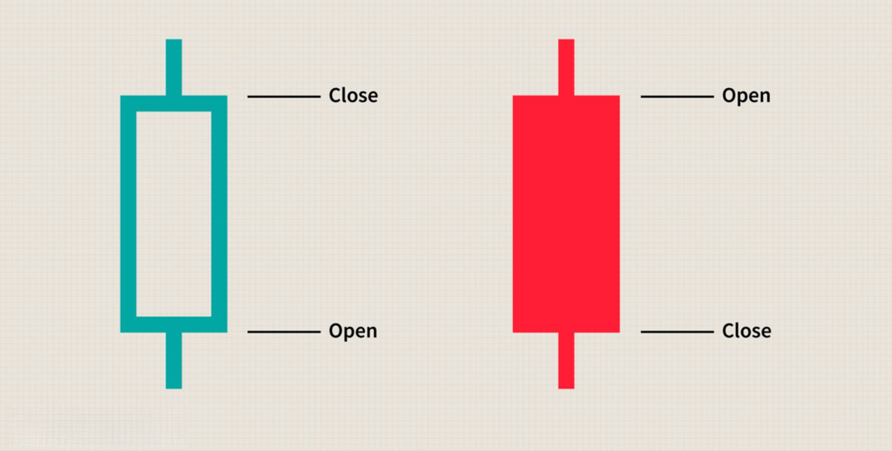

## Table of Contents

## What is a candlestick chart and how does it work?

A candlestick chart is a type of chart used to show how the price of something, like a stock or a currency, changes over time. Each "candlestick" on the chart represents the price movement of the thing you're looking at during a certain time period, like a day or an hour. The candlestick has a wide part, called the "body," and sometimes thin lines above and below the body, called "wicks" or "shadows." The body shows the opening and closing prices, while the wicks show the highest and lowest prices during that time.

Candlestick charts are helpful because they make it easy to see patterns in how prices move. For example, if the body of a candlestick is filled or dark, it means the closing price was lower than the opening price, which shows that the price went down during that time. If the body is empty or light, it means the closing price was higher than the opening price, showing that the price went up. By looking at a series of candlesticks, you can spot trends and make guesses about where the price might go next. This makes candlestick charts a popular tool for people who trade stocks or other financial things.

## What are the basic components of a candlestick?

A candlestick has two main parts: the body and the wicks. The body is the wide part of the candlestick. It shows the opening and closing prices of the thing you're looking at, like a stock or a currency. If the body is filled or dark, it means the closing price was lower than the opening price. If the body is empty or light, it means the closing price was higher than the opening price.

The wicks are the thin lines that stick out from the top and bottom of the body. The top wick shows the highest price reached during the time period, and the bottom wick shows the lowest price. Sometimes, a candlestick might not have any wicks if the opening or closing price was the highest or lowest price during that time. By looking at the body and the wicks, you can see how the price moved during that time period.

## How do different colors in candlestick charts represent price movements?

In candlestick charts, colors help show if the price went up or down during a certain time. If a candlestick is green or white, it means the price ended higher than it started. The bottom of the body is the opening price, and the top of the body is the closing price. This is called a bullish candlestick because it shows that the price is going up, which is good for people who own the thing being traded.

On the other hand, if a candlestick is red or black, it means the price ended lower than it started. The top of the body is the opening price, and the bottom of the body is the closing price. This is called a bearish candlestick because it shows that the price is going down, which is not good for people who own the thing being traded. By looking at the colors, you can quickly see if the price is going up or down over time.

## What are the most common color schemes used in candlestick charts?

The most common color schemes used in candlestick charts are green and red, or white and black. These colors help people see if the price went up or down during a certain time. If a candlestick is green or white, it means the price ended higher than it started. This is called a bullish candlestick because it shows that the price is going up, which is good for people who own the thing being traded.

On the other hand, if a candlestick is red or black, it means the price ended lower than it started. This is called a bearish candlestick because it shows that the price is going down, which is not good for people who own the thing being traded. By using these colors, people can quickly tell if the price is going up or down just by looking at the chart.

## How can color variations in candlestick charts help in identifying trends?

Color variations in candlestick charts make it easy to spot trends in price movements. When you look at a chart, you can see if the price is going up or down over time by looking at the colors of the candlesticks. If you see a lot of green or white candlesticks in a row, it means the price is going up, and that's called an uptrend. This tells you that more people want to buy the thing being traded, which is good for people who own it.

On the other hand, if you see a lot of red or black candlesticks in a row, it means the price is going down, and that's called a downtrend. This shows that more people want to sell the thing being traded, which is not good for people who own it. By looking at the colors and how they change over time, you can see if the price is going up, down, or staying the same, which helps you make better decisions about buying or selling.

## What are the psychological impacts of different colors in candlestick charting?

Different colors in candlestick charts can affect how people feel about buying or selling. When people see a lot of green or white candlesticks, they might feel happy and confident because it means the price is going up. This can make them want to buy more of the thing being traded because they think the price will keep going up. On the other hand, seeing a lot of red or black candlesticks can make people feel worried or scared because it means the price is going down. This might make them want to sell what they have before the price goes down even more.

The colors can also make people think differently about what might happen next. For example, if someone sees a green candlestick after a lot of red ones, they might feel hopeful that the price will start going up again. This can make them more likely to buy. But if they see a red candlestick after a lot of green ones, they might feel nervous that the price will start going down, and they might decide to sell. So, the colors in candlestick charts can really change how people feel and what they decide to do with their money.

## How do you customize color settings in popular trading platforms for candlestick charts?

In popular trading platforms like MetaTrader 4 or TradingView, you can change the colors of your candlestick charts to make them easier to read or to fit your style. To do this, you usually need to go into the settings or options menu. For example, in MetaTrader 4, you can right-click on the chart, choose "Properties," and then go to the "Colors" tab. There, you can pick different colors for bullish and bearish candlesticks. In TradingView, you can click on the chart settings icon, go to "Appearance," and then change the colors for up and down candlesticks.

Once you've picked your colors, you can save them so that every time you open a new chart, it will use the colors you like. This can help you spot trends faster because you'll be used to seeing the colors a certain way. Different people might choose different colors based on what they find easy to see or what makes them feel good about their trading decisions. By customizing the colors, you can make your trading experience more comfortable and effective.

## What are the advantages of using color variations over traditional black and white candlesticks?

Using color variations in candlestick charts makes it easier to see if the price is going up or down. When you see a green or white candlestick, you know right away that the price went up during that time. If you see a red or black candlestick, you know the price went down. This quick understanding helps you make faster decisions about buying or selling. With traditional black and white candlesticks, you have to look more closely to see if the body is filled or empty, which can slow you down and make it harder to spot trends.

Color variations also help with the way you feel about your trades. Seeing a lot of green or white candlesticks can make you feel happy and confident because it shows the price is going up. On the other hand, seeing a lot of red or black candlesticks can make you feel worried or scared because it shows the price is going down. These feelings can affect what you decide to do with your money. With black and white candlesticks, it's harder to get these quick emotional cues, which might make it tougher to react to the market in the way you want.

## How do different cultures perceive colors in candlestick charts, and how might this affect trading decisions?

Different cultures see colors in different ways, and this can change how they feel about candlestick charts. In many Western countries, green often means go or good, and red means stop or bad. So, when people in these places see green candlesticks, they might feel happy because it means the price is going up. But when they see red candlesticks, they might feel worried because it means the price is going down. This can make them more likely to buy when they see green and sell when they see red. In other cultures, like in China, red can mean good luck or happiness, which might make people feel differently about red candlesticks. They might not feel as worried about seeing red and could even see it as a sign to buy.

These different feelings about colors can affect how people trade. If someone from a culture where red means good luck sees a red candlestick, they might think it's a good time to buy, even if the price is going down. On the other hand, someone from a culture where red means danger might see the same red candlestick and decide to sell right away. This shows that the way people see colors can really change their trading choices. Traders need to think about their own feelings and the feelings of others in the market when they look at candlestick charts.

## What advanced techniques involve color variations for predicting market movements?

Color variations in candlestick charts can help traders use advanced techniques to predict market movements. One way is by looking at patterns. If you see a lot of green candlesticks in a row, it might mean the price will keep going up. But if you see a red candlestick after many green ones, it could be a sign that the price might start going down soon. This is called a reversal pattern. By watching the colors and how they change, traders can guess what might happen next and make better decisions about buying or selling.

Another technique is using color to spot support and resistance levels. These are prices where the market often stops going up or down. If you see a lot of green candlesticks stop at the same price, that price might be a resistance level. If you see a lot of red candlesticks stop at the same price, that might be a support level. By looking at the colors and where they stop, traders can predict where the price might go next. This can help them decide when to buy or sell to make more money.

## How can algorithmic trading systems utilize color variations in candlestick charts?

Algorithmic trading systems can use color variations in candlestick charts to make decisions about buying and selling. These systems look at the colors of the candlesticks to see if the price is going up or down. For example, if the system sees a lot of green candlesticks, it might decide to buy because it thinks the price will keep going up. If it sees a lot of red candlesticks, it might decide to sell because it thinks the price will keep going down. By using colors, the system can spot trends and patterns faster and make quicker trading choices.

Some algorithmic systems also use color to find special patterns that can predict what the market will do next. For instance, if the system sees a red candlestick after many green ones, it might think the price is about to start going down. This is called a reversal pattern. The system can then use this information to decide whether to buy or sell at the right time. By understanding how colors show price movements, these systems can make smarter trades and help traders make more money.

## What are the latest research findings on the effectiveness of color variations in candlestick charting for expert traders?

Recent research shows that color variations in candlestick charts can help expert traders make better decisions. Studies have found that using colors like green for up and red for down makes it easier and faster for traders to see trends and patterns. This quick understanding can help them react faster to changes in the market. Experts who use color-coded charts often feel more confident in their trading choices because they can spot when prices are going up or down more easily.

However, some research also shows that too much focus on colors can sometimes make traders miss other important signs in the market. For example, if a trader only looks at the colors and not at other parts of the chart, they might not see other patterns that could tell them more about what will happen next. So, while colors can be a big help, expert traders need to use them along with other tools and information to make the best trading decisions.

## References & Further Reading

[1]: Bergstra, J., Bardenet, R., Bengio, Y., & Kégl, B. (2011). ["Algorithms for Hyper-Parameter Optimization."](https://dl.acm.org/doi/10.5555/2986459.2986743) Advances in Neural Information Processing Systems 24.

[2]: ["Advances in Financial Machine Learning"](https://www.amazon.com/Advances-Financial-Machine-Learning-Marcos/dp/1119482089) by Marcos Lopez de Prado

[3]: ["Evidence-Based Technical Analysis: Applying the Scientific Method and Statistical Inference to Trading Signals"](https://www.amazon.com/Evidence-Based-Technical-Analysis-Scientific-Statistical/dp/0470008741) by David Aronson

[4]: ["Machine Learning for Algorithmic Trading"](https://github.com/stefan-jansen/machine-learning-for-trading) by Stefan Jansen

[5]: ["Quantitative Trading: How to Build Your Own Algorithmic Trading Business"](https://www.amazon.com/Quantitative-Trading-Build-Algorithmic-Business/dp/1119800064) by Ernest P. Chan