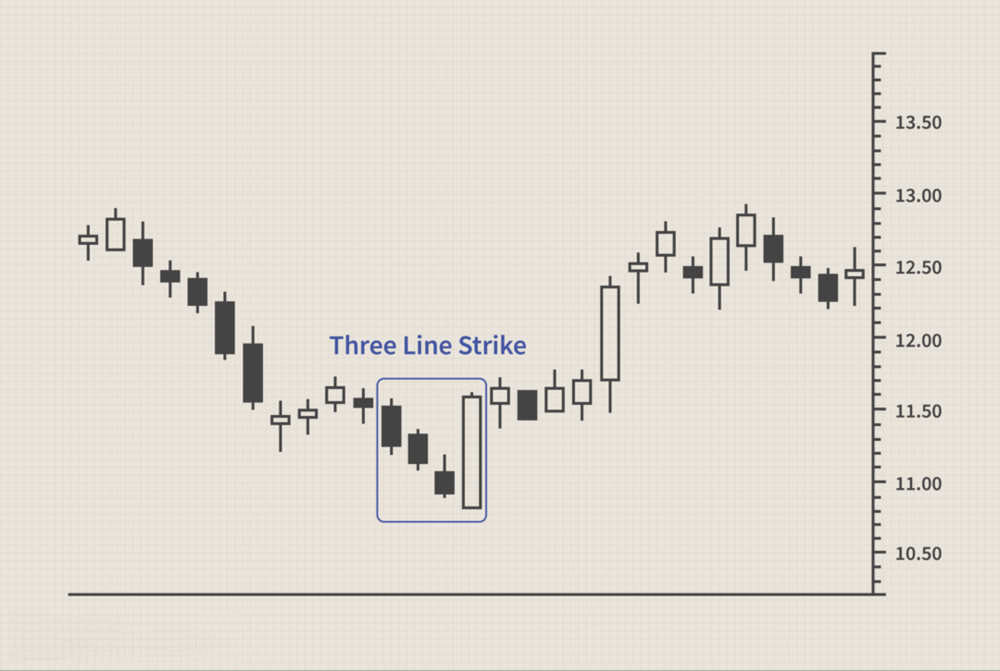

## Table of Contents

## What is a candlestick pattern?

A candlestick pattern is a way to show how the price of something, like a stock or a currency, changes over time. It uses a special kind of chart that looks like candles. Each "candle" shows the price at the start, the highest price, the lowest price, and the price at the end of a certain time, like a day or an hour. If the price goes up, the candle is usually green or white. If the price goes down, the candle is usually red or black.

People who trade or invest use these patterns to try to guess what the price might do next. There are many different candlestick patterns, and each one can mean something different. For example, a "hammer" pattern might mean that the price could go up soon, while a "shooting star" might mean the price could go down. By looking at these patterns, people can make better decisions about when to buy or sell.

## How did candlestick patterns originate?

Candlestick patterns started a long time ago in Japan. A man named Munehisa Homma, who lived in the 1700s, is often said to have created them. He was a rice trader and used candlestick charts to understand the rice market better. He noticed that the emotions of traders affected the price of rice, and he used this information to make his charts. His work helped him become very successful and rich.

Later, in the late 1980s and early 1990s, a man named Steve Nison brought candlestick charts to the Western world. He wrote a book called "Japanese Candlestick Charting Techniques," which explained how to use these charts. Since then, candlestick patterns have become very popular among traders and investors all over the world. They are now used to analyze all kinds of markets, not just rice.

## What are the basic components of a candlestick?

A candlestick has four main parts that show what the price did during a certain time. The first part is the body of the candlestick. The body shows the opening price and the closing price. If the closing price is higher than the opening price, the body is usually green or white. If the closing price is lower than the opening price, the body is usually red or black.

The other two parts are the wicks, or shadows, of the candlestick. The top wick shows the highest price during that time, and the bottom wick shows the lowest price. The wicks can be long or short, depending on how much the price moved up and down. Together, the body and the wicks give you a clear picture of how the price changed during that time.

## Can you explain the difference between a bullish and a bearish candlestick?

A bullish candlestick means that the price went up during the time it shows. You can see this because the closing price is higher than the opening price. On a chart, a bullish candlestick usually has a body that is green or white. The bottom of the body is where the price started, and the top is where it ended. If there are wicks, the top wick shows the highest price, and the bottom wick shows the lowest price during that time. When traders see a bullish candlestick, they might think the price will keep going up.

A bearish candlestick means that the price went down during the time it shows. You can see this because the closing price is lower than the opening price. On a chart, a bearish candlestick usually has a body that is red or black. The top of the body is where the price started, and the bottom is where it ended. If there are wicks, the top wick shows the highest price, and the bottom wick shows the lowest price during that time. When traders see a bearish candlestick, they might think the price will keep going down.

## What are some common candlestick patterns beginners should know?

Some common candlestick patterns that beginners should know are the Doji, the Hammer, and the Shooting Star. A Doji happens when the opening and closing prices are very close or the same, making the body of the candlestick very small or invisible. It shows that the market is unsure about which way the price will go next. A Hammer has a small body at the top and a long bottom wick. It means that the price dropped a lot during the time but then came back up, which could mean the price might go up soon. A Shooting Star is the opposite of a Hammer. It has a small body at the bottom and a long top wick, showing that the price went up a lot but then came back down, which could mean the price might go down soon.

These patterns can help beginners understand what might happen next with the price. For example, if you see a Hammer after a time when the price was going down, it might be a good sign to buy because the price could start going up. On the other hand, if you see a Shooting Star after a time when the price was going up, it might be a good sign to sell because the price could start going down. By learning these simple patterns, beginners can make better decisions about when to buy or sell.

## How can candlestick patterns be used in technical analysis?

Candlestick patterns are used in technical analysis to help people understand what might happen with the price of something, like a stock or a currency. By looking at these patterns, traders and investors can see if the price might go up or down next. For example, if you see a Hammer pattern after the price has been going down for a while, it might mean that the price is ready to start going up. This could be a good time to buy. On the other hand, if you see a Shooting Star after the price has been going up, it might mean that the price is ready to start going down. This could be a good time to sell.

These patterns are not perfect and they don't always work, but they can give you a good idea of what might happen. Traders often use candlestick patterns along with other tools, like trend lines and moving averages, to make their decisions. By combining different kinds of analysis, they can get a better picture of the market and make smarter choices about when to buy or sell. Learning to read candlestick patterns can help beginners become better at understanding the market and making good trades.

## What is the significance of the doji candlestick pattern?

A doji candlestick pattern is important because it shows that the market is not sure which way the price will go next. It happens when the opening and closing prices are very close or the same, making the body of the candlestick very small or invisible. This means that during that time, the price went up and down a lot, but it ended up back where it started. When traders see a doji, they think that the market might be ready for a change. If the price was going up before the doji, it could mean that the price might start going down soon. If the price was going down before the doji, it could mean that the price might start going up soon.

The doji is a good pattern for beginners to learn because it helps them understand what the market is thinking. It can be used with other patterns and tools to make better guesses about what will happen next. For example, if you see a doji after a long time of the price going up or down, it might be a good sign to pay attention. Traders use this information to decide when to buy or sell. By watching for doji patterns, beginners can start to see the signs of when the market might change direction.

## How do candlestick patterns integrate with other technical indicators?

Candlestick patterns work well with other technical indicators to help traders understand the market better. For example, if you see a bullish candlestick pattern like a Hammer, you might look at other indicators like the Relative Strength Index (RSI) or Moving Averages to see if they also show that the price might go up. If the RSI is low and the price is below the moving average, it can make you more sure that the Hammer pattern means the price will go up soon. This way, you use different tools together to make better guesses about what will happen next.

Another way to use candlestick patterns with other indicators is to look at trend lines and support and resistance levels. If you see a bearish pattern like a Shooting Star near a resistance level, it can be a strong sign that the price might go down. You can also use [volume](/wiki/volume-trading-strategy) indicators to see if a lot of people are trading when you see a pattern. If the volume is high with a bullish pattern, it can mean that the price is more likely to go up. By combining candlestick patterns with other tools, traders can get a fuller picture of the market and make smarter decisions about when to buy or sell.

## What are some advanced candlestick patterns and their interpretations?

Some advanced candlestick patterns include the Morning Star and the Evening Star. A Morning Star pattern happens after the price has been going down for a while. It has three candles: a long bearish candle, a small candle that can be bullish or bearish, and then a long bullish candle. This pattern means that the price might start going up soon. It's like the market is waking up after being down. Traders see this as a good time to buy because it shows that the downward trend might be over. An Evening Star pattern is the opposite. It happens after the price has been going up for a while. It also has three candles: a long bullish candle, a small candle that can be bullish or bearish, and then a long bearish candle. This pattern means that the price might start going down soon. It's like the market is going to sleep after being up. Traders see this as a good time to sell because it shows that the upward trend might be over.

Another advanced pattern is the Three White Soldiers, which shows strong buying pressure. It has three long bullish candles in a row, each one opening within the body of the previous candle and closing higher than the previous one. This pattern means that the price is likely to keep going up. It's a very strong sign for traders to buy because it shows that the market is very confident in going up. The opposite pattern is the Three Black Crows, which shows strong selling pressure. It has three long bearish candles in a row, each one opening within the body of the previous candle and closing lower than the previous one. This pattern means that the price is likely to keep going down. It's a very strong sign for traders to sell because it shows that the market is very confident in going down. By understanding these advanced patterns, traders can make better decisions about when to buy or sell.

## How reliable are candlestick patterns in predicting market movements?

Candlestick patterns can be helpful for guessing what the market might do next, but they are not always right. They work best when you use them with other tools like trend lines and moving averages. For example, if you see a bullish pattern like a Hammer and the price is also below a moving average, it can make you more sure that the price will go up soon. But sometimes, even if you see a strong pattern, the market can still do something different. That's why it's good to use candlestick patterns with other things to get a better idea of what might happen.

The reliability of candlestick patterns can also depend on how often you see them and how clear they are. If you see a pattern a lot, it might not be as special and might not mean as much. Also, if a pattern is very clear and happens at an important time, like near a support or resistance level, it can be more reliable. But no pattern is perfect, and the market can be unpredictable. That's why it's important to keep learning and to use different tools together to make the best guesses about what the market will do next.

## What are the limitations and potential pitfalls of using candlestick patterns?

Candlestick patterns are not always right. They can help you guess what the market might do next, but they don't work every time. Sometimes, you might see a pattern that looks like it means the price will go up, but then the price goes down instead. This can happen because the market can be hard to predict. Also, if you see the same pattern a lot, it might not be as special and might not mean as much. So, it's important not to rely only on candlestick patterns to make your decisions.

Another problem with candlestick patterns is that they can be tricky to read. Sometimes, what looks like one pattern might actually be another, and this can confuse you. It's also easy to see patterns that aren't really there, especially if you really want the market to do something. This is called confirmation bias. To avoid these problems, it's a good idea to use candlestick patterns with other tools, like trend lines and moving averages. By looking at different things together, you can get a better idea of what might happen next and make smarter choices about when to buy or sell.

## How can one backtest the effectiveness of candlestick patterns in trading strategies?

To backtest the effectiveness of candlestick patterns in trading strategies, you can use historical price data to see how well the patterns would have worked in the past. First, you need to collect data on the prices of the thing you want to trade, like a stock or a currency. Then, you look at this data to find the candlestick patterns you want to test. For each time you see a pattern, you can see what happened to the price after that. Did the price go up or down like the pattern said it would? You can keep track of this information to see how often the patterns are right.

After you have tested the patterns with the old data, you can see how good they are at guessing what the market will do. If a pattern is right a lot of the time, it might be a good one to use in your trading strategy. But if it's wrong a lot, you might want to try a different pattern or use other tools to help you make decisions. Remember, [backtesting](/wiki/backtesting) can help you understand how well candlestick patterns work, but the market can change, so what worked in the past might not always work in the future.

## References & Further Reading

[1]: Bergstra, J., Bardenet, R., Bengio, Y., & Kégl, B. (2011). ["Algorithms for Hyper-Parameter Optimization."](https://dl.acm.org/doi/10.5555/2986459.2986743) Advances in Neural Information Processing Systems 24.

[2]: ["Advances in Financial Machine Learning"](https://www.amazon.com/Advances-Financial-Machine-Learning-Marcos/dp/1119482089) by Marcos Lopez de Prado

[3]: ["Evidence-Based Technical Analysis: Applying the Scientific Method and Statistical Inference to Trading Signals"](https://www.amazon.com/Evidence-Based-Technical-Analysis-Scientific-Statistical/dp/0470008741) by David Aronson

[4]: ["Machine Learning for Algorithmic Trading"](https://github.com/stefan-jansen/machine-learning-for-trading) by Stefan Jansen

[5]: ["Quantitative Trading: How to Build Your Own Algorithmic Trading Business"](https://www.amazon.com/Quantitative-Trading-Build-Algorithmic-Business/dp/1119800064) by Ernest P. Chan