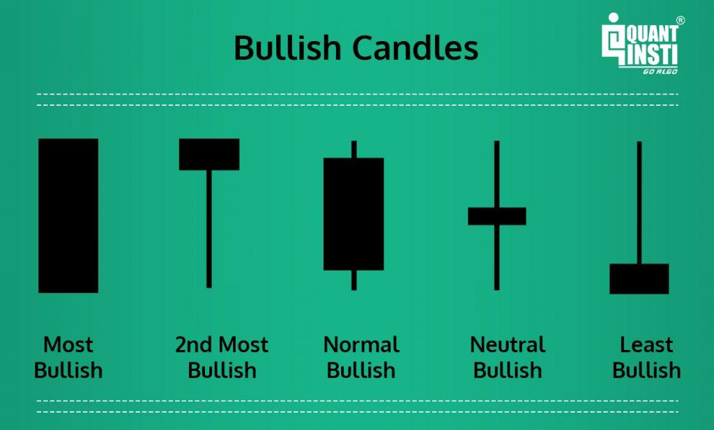

## Table of Contents

## What are candlestick patterns and why are they important in trading?

Candlestick patterns are visual representations of price movements in trading. They are made up of individual "candles" that show the opening, closing, high, and low prices of a security over a specific time period. Each candle has a body and wicks, or shadows, that indicate the range of price movement. Traders use these patterns to predict future price movements based on historical data. Some common patterns include doji, hammer, and engulfing patterns, each signaling different potential market directions.

These patterns are important in trading because they help traders make informed decisions. By recognizing specific candlestick patterns, traders can anticipate whether the price of a security is likely to rise or fall. This information is crucial for deciding when to buy or sell. For example, a bullish engulfing pattern might suggest that it's a good time to buy, while a bearish pattern could indicate a good time to sell. Understanding these patterns can improve a trader's ability to manage risk and potentially increase their chances of making profitable trades.

## How do you read a basic candlestick chart?

A basic candlestick chart shows how the price of something, like a stock, changes over time. Each "candle" on the chart represents a set period, like a day or an hour. The candle has a wide part called the body and thin lines above and below it called wicks or shadows. The top of the body shows the closing price if it's a green or white candle, or the opening price if it's a red or black candle. The bottom of the body shows the opposite: the opening price for green/white candles and the closing price for red/black candles. The wicks show the highest and lowest prices during that time period.

If a candle is green or white, it means the price went up during that time. The bottom of the body is where the price started, and the top is where it ended. If the candle is red or black, it means the price went down. The top of the body is where the price started, and the bottom is where it ended. The wicks show how much the price moved up and down but didn't stay at those levels by the end of the period. By looking at these candles, you can see if the price is going up or down and how much it's changing.

## What is the difference between a bullish and a bearish candlestick pattern?

A bullish candlestick pattern means that people think the price of something, like a stock, will go up. You can see this on a chart when the candles are green or white. These candles show that the price at the end of the time period was higher than at the start. Bullish patterns can make traders want to buy because they think the price will keep going up. Some examples of bullish patterns are the hammer and the bullish engulfing pattern.

A bearish candlestick pattern means that people think the price will go down. On a chart, these candles are usually red or black. They show that the price at the end of the time period was lower than at the start. Bearish patterns can make traders want to sell because they think the price will keep going down. Some examples of bearish patterns are the shooting star and the bearish engulfing pattern.

Understanding these patterns helps traders decide what to do with their money. If they see a bullish pattern, they might buy to make money as the price goes up. If they see a bearish pattern, they might sell to avoid losing money as the price goes down.

## Can you explain the Doji candlestick pattern and what it signifies?

A Doji candlestick pattern looks like a cross or plus sign on a chart. It happens when the price at the start and end of a time period is almost the same, so the body of the candle is very small or looks like a line. The wicks can be long or short, but what's important is that the opening and closing prices are very close together. This pattern shows that buyers and sellers were fighting, but neither side won, so the price didn't change much by the end.

The Doji pattern can mean that the market is unsure about what will happen next. It shows that people are thinking and might change their minds about whether to buy or sell. If you see a Doji after prices have been going up or down a lot, it might mean that the trend could be about to change. Traders watch for Doji patterns to help them decide when to buy or sell, but it's important to look at other things on the chart too, not just the Doji by itself.

## What is a Hammer pattern and how can it be used to predict market movements?

A Hammer pattern is a type of candlestick that looks like a hammer. It has a small body at the top and a long wick at the bottom. The body can be green or white, meaning the price went up a little, or red or black, meaning the price went down a little. The long wick shows that the price dropped a lot during the time period but then came back up near where it started. This pattern usually shows up when prices have been going down for a while.

Traders use the Hammer pattern to guess that the price might start going up soon. They see it as a sign that even though the price went down a lot, buyers came in and pushed the price back up. This can mean that the sellers are losing power and the buyers might take over, making the price rise. But, traders don't just look at the Hammer by itself. They also check other things on the chart to make sure it's a good time to buy.

## How does the Shooting Star pattern indicate a potential market reversal?

A Shooting Star pattern looks like a star with a small body at the bottom and a long wick at the top. It usually appears when prices have been going up for a while. The long wick shows that the price went up a lot during the time period but then came back down near where it started. This pattern means that even though buyers tried to push the price higher, sellers came in and brought it back down. 

Traders see the Shooting Star as a sign that the price might start going down soon. It suggests that the buyers are losing power and the sellers might take over, making the price fall. But, traders don't just look at the Shooting Star by itself. They also check other things on the chart to make sure it's a good time to sell.

## What is the Engulfing pattern and how reliable is it for predicting trend changes?

An Engulfing pattern is when you see two candles next to each other on a chart. The first candle is smaller, and the second candle is bigger and completely covers, or "engulfs," the first one. If the second candle is green or white, it's called a Bullish Engulfing pattern, which means the price might go up. If the second candle is red or black, it's called a Bearish Engulfing pattern, which means the price might go down. This pattern shows that the people buying or selling are getting stronger and might change the direction the price is going.

The reliability of the Engulfing pattern for predicting trend changes can vary. It's a good sign that the price might change direction, but it's not perfect. Traders often look at other things on the chart, like other patterns or indicators, to be more sure. The more signs they see that agree with the Engulfing pattern, the more likely it is that the price will actually change direction. So, while the Engulfing pattern can be helpful, it's best used along with other tools to make better guesses about what the market will do next.

## Can you describe the Morning Star and Evening Star patterns and their implications?

The Morning Star pattern is a three-candle pattern that can signal that the price of a stock might start going up. It shows up after a time when prices have been going down. The first candle is long and red or black, showing that the price went down a lot. The second candle is small and can be any color, showing that the price didn't change much. The third candle is long and green or white, showing that the price went up a lot. This pattern means that the sellers were strong at first, but then the buyers started to take over, which could mean the price will keep going up.

The Evening Star pattern is also a three-candle pattern, but it can signal that the price of a stock might start going down. It shows up after a time when prices have been going up. The first candle is long and green or white, showing that the price went up a lot. The second candle is small and can be any color, showing that the price didn't change much. The third candle is long and red or black, showing that the price went down a lot. This pattern means that the buyers were strong at first, but then the sellers started to take over, which could mean the price will keep going down.

Both patterns are important for traders because they can help them guess what the market will do next. But, like all patterns, they work better when you look at other things on the chart too. The more signs you see that agree with the Morning Star or Evening Star, the more likely it is that the price will actually change direction.

## How do complex patterns like the Three White Soldiers and Three Black Crows form?

The Three White Soldiers pattern is made up of three long green or white candles that show up one after the other. Each candle opens within the body of the previous candle and closes higher than the previous candle's close. This pattern usually happens after prices have been going down for a while. It shows that buyers are getting stronger and the price might keep going up. Traders see this as a good sign to buy because it means the price could keep rising.

The Three Black Crows pattern is the opposite. It's made up of three long red or black candles that show up one after the other. Each candle opens within the body of the previous candle and closes lower than the previous candle's close. This pattern usually happens after prices have been going up for a while. It shows that sellers are getting stronger and the price might keep going down. Traders see this as a good sign to sell because it means the price could keep falling.

## What role do candlestick patterns play in conjunction with other technical indicators?

Candlestick patterns are like clues that help traders guess what might happen next with the price of something, like a stock. But, these clues work even better when you use them with other tools called technical indicators. These indicators can show things like how fast the price is moving or if it's going up or down too much. When you see a candlestick pattern and it matches what the technical indicators are saying, it can make you feel more sure about what to do next, like buying or selling.

For example, if you see a Bullish Engulfing pattern, which can mean the price might go up, you can check other indicators like the Relative Strength Index (RSI) or Moving Averages to see if they agree. If the RSI is low and starting to go up, or if the price is above a moving average, it can make you more confident that the price really will go up. So, using candlestick patterns with other technical indicators helps traders make smarter choices by giving them more information to look at.

## How can one backtest the effectiveness of candlestick patterns in different market conditions?

Backtesting the effectiveness of candlestick patterns means looking at old price data to see how well these patterns worked in the past. You can use a computer program or a trading platform that lets you go back in time and see what happened after certain patterns showed up. You would pick a time when the market was going up, down, or staying the same, and then look at how often a pattern like the Hammer or the Shooting Star led to the price moving in the expected way. This helps you see if the pattern is more likely to work in some market conditions than others.

For example, you might find that the Bullish Engulfing pattern works better when the market is going down, but not as well when it's going up. By doing this kind of testing, you can learn which patterns to trust more in different situations. It's important to test with a lot of data from different times and markets to get a good idea of how reliable the patterns are. Remember, past results don't guarantee future results, but [backtesting](/wiki/backtesting) can give you a better sense of what might happen.

## What are some advanced strategies for combining multiple candlestick patterns to enhance trading decisions?

Combining multiple candlestick patterns can help traders make better guesses about what the market will do next. For example, if you see a Hammer pattern, which can mean the price might start going up, you can look for other patterns to see if they agree. If a Bullish Engulfing pattern shows up right after the Hammer, it can make you more sure that the price will go up. The Hammer shows that buyers are starting to fight back, and the Bullish Engulfing confirms that they are getting stronger. By looking at more than one pattern, you can feel more confident about your trading decisions.

Another strategy is to use reversal patterns like the Morning Star and Three White Soldiers together. If you see a Morning Star after a long time of prices going down, it can mean that the price might start going up. If the Three White Soldiers pattern follows the Morning Star, it adds even more evidence that the price will keep going up. The Morning Star shows that the sellers are losing power, and the Three White Soldiers show that the buyers are taking over. By watching for these patterns together, you can get a clearer picture of what might happen next in the market.

## References & Further Reading

[1]: Bergstra, J., Bardenet, R., Bengio, Y., & Kégl, B. (2011). ["Algorithms for Hyper-Parameter Optimization."](https://dl.acm.org/doi/10.5555/2986459.2986743) Advances in Neural Information Processing Systems 24.

[2]: ["Advances in Financial Machine Learning"](https://www.amazon.com/Advances-Financial-Machine-Learning-Marcos/dp/1119482089) by Marcos Lopez de Prado

[3]: ["Evidence-Based Technical Analysis: Applying the Scientific Method and Statistical Inference to Trading Signals"](https://www.amazon.com/Evidence-Based-Technical-Analysis-Scientific-Statistical/dp/0470008741) by David Aronson

[4]: ["Machine Learning for Algorithmic Trading"](https://github.com/stefan-jansen/machine-learning-for-trading) by Stefan Jansen

[5]: ["Quantitative Trading: How to Build Your Own Algorithmic Trading Business"](https://books.google.com/books/about/Quantitative_Trading.html?id=j70yEAAAQBAJ) by Ernest P. Chan