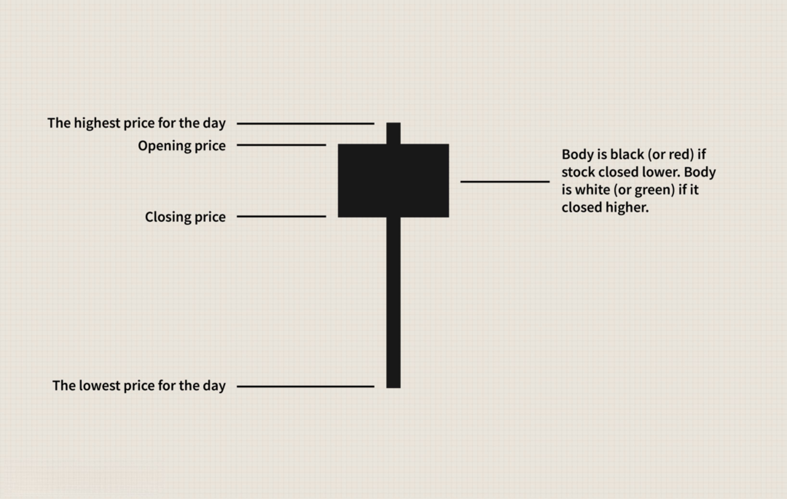

In financial markets, traders constantly seek tools that facilitate informed decision-making. Among these tools, candlestick patterns have been a staple in technical analysis, providing a visual representation of market sentiment. Originating in Japan, these patterns consist of individual candlesticks on price charts, each representing the open, high, low, and close prices over a specific time period. The interpretation of these patterns offers insights into potential market movements and investor psychology.

With the rise of algorithmic trading, candlestick patterns are increasingly integrated into automated systems to enhance trading strategies. Algorithmic trading utilizes complex algorithms to execute trades automatically based on predefined criteria. By incorporating candlestick patterns into these algorithms, traders can enhance the precision of their market entry and exit points. This fusion of traditional chart analysis and modern technology allows for rapid decision-making, which is crucial in volatile markets.



This article explores the intersection of candlestick patterns, technical analysis, and algorithmic trading, and how they collectively influence market participation. The integration of these elements not only aids in understanding market dynamics but also empowers traders to optimize their strategies, potentially leading to more successful trading outcomes. As traders continue to adapt to evolving market conditions, the role of these tools in shaping trading strategies becomes increasingly significant.

## Table of Contents

## Understanding Candlestick Patterns

Candlestick charts, a staple of modern technical analysis, trace their origins back to Japan in the 18th century. These charts have become an essential tool for traders worldwide, providing a visual representation of price movements over a specific time period. Each candlestick on the chart conveys the open, high, low, and close prices for that period, offering insights into the market sentiment.

The anatomy of a candlestick comprises two main parts: the body and the shadows (or wicks). The body signifies the range between the open and close prices, with its color typically indicating the market's direction during the period. A bullish candle, often depicted as green or white, indicates that the close price was higher than the open price, signifying a potential upward movement. Conversely, a bearish candle, typically shown as red or black, suggests that the close price was lower than the open price, indicating a downward trend.

Basic candlestick patterns include formations like the Bullish Engulfing, Bearish Engulfing, Doji, and Hammer, each with unique implications for market sentiment and potential price movement:

- **Bullish Engulfing Pattern**: This pattern emerges when a small bearish candle is followed by a large bullish candle that completely engulfs the prior candle's body. It suggests a potential reversal from a downtrend to an uptrend.

- **Bearish Engulfing Pattern**: The opposite of the bullish engulfing, this pattern occurs when a small bullish candle is overshadowed by a subsequent larger bearish candle, indicating a possible reversal from an uptrend to a downtrend.

- **Doji**: A doji forms when the open and close prices are virtually identical, resulting in a very small body. It often signifies indecision in the market, where buying and selling pressures are nearly equal.

- **Hammer**: This pattern consists of a small body with a lengthy lower shadow, appearing after a downtrend. It indicates that despite selling pressure during the period, buying pressure prevailed, hinting at an impending bullish reversal.

Traders meticulously analyze these candlestick formations to forecast potential shifts in market trends. This analysis involves considering the context of preceding price movements and [volume](/wiki/volume-trading-strategy) to strengthen the accuracy of predictions. Candlestick patterns, when combined with other technical indicators, aid traders in crafting more informed trading strategies that anticipate future market movement scenarios.

## Algo Trading: Incorporating Candlestick Patterns

Algorithmic trading utilizes sophisticated algorithms to execute trades automatically based on predefined criteria. This method leverages the speed and precision of computers to perform trading activities that might be difficult for humans to achieve manually. Within this domain, candlestick patterns serve as crucial indicators. By recognizing these patterns, algorithms can swiftly make informed trading decisions, optimizing market entry and [exit](/wiki/exit-strategy) points and potentially enhancing profitability.

Candlestick patterns are graphical representations of price movements in a specific timeframe. Algorithms can be programmed to detect these patterns, such as Bullish Engulfing or Doji, and act accordingly. The seamless ability of algorithms to identify these formations allows traders to preemptively position themselves in the market. For example, when a Bullish Engulfing pattern is detected, signaling a potential increase in price, the algorithm can trigger a buy order.

To enhance the robustness of trading strategies, these candlestick patterns are often used in conjunction with other technical indicators, such as Moving Averages and the Relative Strength Index (RSI). The integration of multiple indicators provides a more comprehensive view of market conditions, allowing for increased accuracy in trade execution. For instance, a candlestick pattern that is reinforced by a bullish crossover in the Moving Average might represent a stronger buy signal.

Python, with its extensive libraries, offers tools to automate the detection of candlestick patterns and trigger trading signals. Libraries such as NumPy and pandas provide functionalities to handle and process large datasets of historical price data. In addition, specialized libraries like TA-Lib can simplify technical analysis by providing built-in functions for pattern recognition and indicator calculations.

Below is a basic example of how Python can be used to detect a bullish engulfing pattern and execute a hypothetical buy order:

```python
import pandas as pd

# Load historical price data
data = pd.read_csv("price_data.csv")

# Example condition for a bullish engulfing pattern
def is_bullish_engulfing(data, index):
    if index == 0:
        return False
    prev_candle = data.iloc[index - 1]
    curr_candle = data.iloc[index]

    # Check for a bearish previous candle followed by a bullish current candle with higher open and close
    return (
        prev_candle['Open'] > prev_candle['Close'] and
        curr_candle['Open'] < curr_candle['Close'] and
        curr_candle['Open'] < prev_candle['Close'] and
        curr_candle['Close'] > prev_candle['Open']
    )

# Scan for patterns and execute trades
for i in range(1, len(data)):
    if is_bullish_engulfing(data, i):
        print("Buy signal at index:", i)
```

This code illustrates an elementary approach to pattern recognition. It checks for conditions indicative of a bullish engulfing pattern in the price data and prints a buy signal when such a pattern is identified. While this is a simplified example, more sophisticated models can incorporate additional criteria and handle real-time data to execute actual trades via integrated trading platforms.

Incorporating candlestick patterns through [algorithmic trading](/wiki/algorithmic-trading) combines the visual insights of technical analysis with the operational efficiency of automated systems, offering significant potential for optimized trading strategies.

## Impact of Technical Analysis on Trading Strategies

Technical analysis leverages candlestick charts to predict future price movements through an examination of historical market data. This approach is predicated on the assumption that past trading activity and price changes can be indicative of future movements. Candlestick patterns serve as a fundamental component of this analysis, offering visual signs of market sentiment which can be pivotal in developing trading strategies. Each pattern can signal different market sentiments, such as reversals or continuations, aiding traders in making informed decisions.

Combining candlestick patterns with technical indicators like the Moving Average Convergence Divergence (MACD) and Bollinger Bands can substantially deepen analytical insights. The MACD is a trend-following [momentum](/wiki/momentum) indicator that reveals the relationship between two moving averages of a security's price. It consists of three components: the MACD line, the signal line, and a histogram which represents the difference between the MACD line and the signal line. A typical MACD strategy involves analyzing when the MACD line crosses above or below the signal line, indicating potential buy or sell signals.

Bollinger Bands, developed by John Bollinger, encompass a set of trendlines usually plotted two standard deviations away from a simple moving average (SMA) of a security's price. Traders use Bollinger Bands to gain a probabilistic estimate of price levels being overbought or oversold. When combined with candlestick patterns, they can help determine the [volatility](/wiki/volatility-trading-strategies) of the market and offer visual cues on market overextensions, thereby assisting in refining entry and exit points in trading strategies.

This analytical blend aids traders in identifying crucial support and resistance levels. Support levels indicate where a downtrend can be expected to pause due to a concentration of demand, while resistance levels are areas where a rising price can face difficulty due to a concentration of selling interest. Recognizing these levels is crucial for traders to enhance strategy refinement, as it helps in setting appropriate stop-loss orders, determining profit targets, and planning trades more efficiently.

Incorporating technical analysis into trading strategies thus provides traders with a multi-dimensional view of the market. By synthesizing candlestick patterns and technical indicators, traders can enhance their ability to forecast market behavior, leading to potentially more successful trading outcomes. However, it is essential for traders to employ these tools with an understanding of underlying market contexts and not in isolation, given the complex and dynamic nature of financial markets.

## Risks and Challenges in Algo Trading with Candlestick Patterns

Algorithmic trading with candlestick patterns offers numerous advantages, such as increased speed and accuracy in trade execution. However, it also presents significant risks and challenges that traders must navigate to ensure effective outcomes. One of the most notable risks is market volatility, which can lead to rapid price fluctuations that might not align with the historical data on which algorithms are primarily built. This is a critical concern, as algorithms rely heavily on pre-existing patterns and data, assuming market conditions remain relatively stable—a premise that is often unrealistic.

Another significant challenge is the occurrence of technical glitches. These can range from minor software bugs to severe system failures that might result in substantial financial losses. Given the speed at which algorithmic trading operates, even a brief lapse in system functionality can trigger a cascade of misplaced trades.

Over-reliance on historical data is another pitfall. Candlestick patterns, as a component of technical analysis, generally assume that history tends to repeat itself. However, market dynamics are influenced by myriad factors, such as economic indicators and geopolitical events, which historical data may not fully capture. This can lead to inaccuracies in pattern recognition and consequently, suboptimal trading decisions. Algorithms may identify and act on a candlestick pattern based on historical success, but unforeseen market contexts could render such decisions ineffective.

To mitigate these risks, continuous monitoring of algorithmic activities is paramount. Trading systems should ideally be equipped with real-time data updates and the ability to react adaptively to market changes. This requires sophisticated software engineering to ensure reliability and robustness under varying market conditions.

Additionally, implementing robust risk management strategies is essential. This may involve setting stop-loss orders, which automatically sell assets when they reach a certain price threshold, thereby limiting potential losses. Furthermore, diversification of trading strategies can aid in reducing dependency on any single pattern or method, spreading risk across various approaches.

To improve algorithmic decision-making, incorporating [machine learning](/wiki/machine-learning) techniques that can adapt to new data and evolving market conditions might be beneficial. For example, a Python script utilizing the `scikit-learn` library could dynamically adjust trading parameters based on the latest market data:

```python
from sklearn.linear_model import LinearRegression
import numpy as np

# Example feature data and target variables (historical and current market data)
X = np.array([[1, 2], [2, 3], [3, 4], [5, 6]])  # Historical feature set
y = np.array([2, 3, 4, 6])  # Market outcome we're predicting

# Train the model
model = LinearRegression().fit(X, y)

# Predict using new input (current market conditions)
new_data = np.array([[4, 5]])
predicted_outcome = model.predict(new_data)

print("Predicted market response:", predicted_outcome)
```

By taking such measures, traders can reduce their exposure to the risks inherent in algo trading with candlestick patterns, ensuring that their trading activities remain effective and aligned with broader market dynamics.

## Conclusion

In the ever-evolving landscape of modern trading, the fusion of candlestick patterns, technical analysis, and algorithmic trading has emerged as a cornerstone for traders seeking to navigate complex market environments. This strategic integration empowers traders by providing a comprehensive framework to decipher market dynamics, thereby enhancing decision-making capabilities and improving trading outcomes. 

The utilization of candlestick patterns, a time-tested visual tool in technical analysis, offers traders insights into market sentiment and potential future price movements. By incorporating these patterns within algorithmic trading systems, traders can automate and refine trade execution, leveraging the speed and precision of algorithms to capitalize on market opportunities. This integration allows for the swift identification of entry and exit points, optimizing trading strategies and potentially increasing profitability.

Despite the advantages, traders must remain vigilant and adaptive to the ever-changing market conditions. The dynamic nature of financial markets implies that historical data, upon which many algorithms rely, may not always accurately predict future trends. Therefore, it is crucial for traders to continuously monitor and update their strategies, incorporating robust risk management practices to mitigate potential drawbacks. 

By staying informed and flexible, traders can fully harness the potential of these tools, adapting to new market developments and technological advancements to maintain a competitive edge. The synergy of candlestick patterns, technical analysis, and algorithmic trading offers a powerful toolkit for navigating the complexities of the financial markets, paving the way for informed and successful trading decisions.

## References & Further Reading

[1]: Bergstra, J., Bardenet, R., Bengio, Y., & Kégl, B. (2011). ["Algorithms for Hyper-Parameter Optimization."](https://dl.acm.org/doi/10.5555/2986459.2986743) Advances in Neural Information Processing Systems 24.

[2]: ["Advances in Financial Machine Learning"](https://www.amazon.com/Advances-Financial-Machine-Learning-Marcos/dp/1119482089) by Marcos Lopez de Prado

[3]: ["Evidence-Based Technical Analysis: Applying the Scientific Method and Statistical Inference to Trading Signals"](https://www.amazon.com/Evidence-Based-Technical-Analysis-Scientific-Statistical/dp/0470008741) by David Aronson

[4]: ["Machine Learning for Algorithmic Trading, 2nd Edition"](https://www.amazon.com/Machine-Learning-Algorithmic-Trading-alternative/dp/1839217715) by Stefan Jansen

[5]: ["Quantitative Trading: How to Build Your Own Algorithmic Trading Business"](https://www.amazon.com/Quantitative-Trading-Build-Algorithmic-Business/dp/1119800064) by Ernest P. Chan