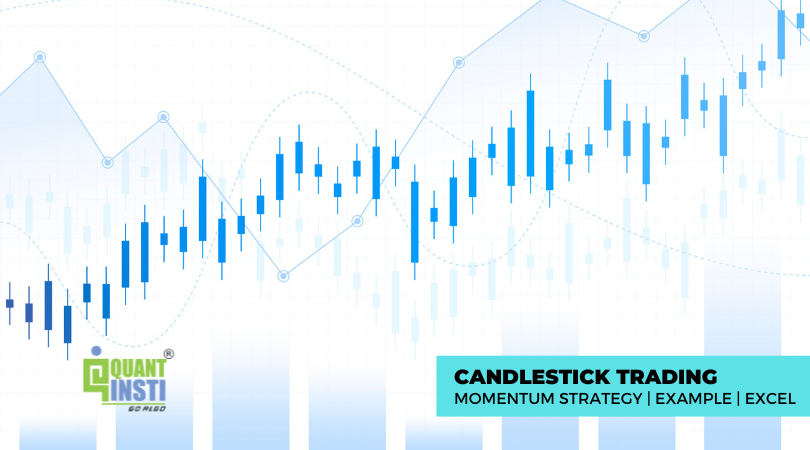

## Table of Contents

## What is candlestick trading and why is it important for momentum strategies?

Candlestick trading is a way to look at price movements in the stock market using special charts called candlestick charts. These charts show the opening, closing, high, and low prices of a stock for a certain time period, like a day or an hour. Each "candlestick" on the chart looks like a candle with a body and wicks. The body shows the opening and closing prices, and the wicks show the highest and lowest prices during that time. Traders use these charts to see patterns that can help them decide when to buy or sell stocks.

Candlestick trading is important for momentum strategies because it helps traders spot trends and changes in the market quickly. Momentum strategies are all about following the direction of the market and making trades based on the strength of that movement. By looking at candlestick patterns, traders can see if the momentum is getting stronger or weaker. For example, if they see a series of candlesticks with higher highs and higher lows, it might mean the stock's price is gaining momentum, and it could be a good time to buy. This way, candlestick trading helps traders make better decisions and take advantage of market trends.

## How do candlestick patterns help in identifying market trends?

Candlestick patterns help traders see what the market is doing by showing how prices move over time. Each candlestick tells a story about whether buyers or sellers were in control during a certain period. For example, if a candlestick has a long body and closes higher than it opened, it means buyers were strong and pushed the price up. On the other hand, if the candlestick closes lower than it opened, it shows that sellers were in control and pushed the price down. By looking at a series of candlesticks, traders can spot patterns that show if the market is going up, down, or staying the same.

These patterns help traders figure out if a trend is starting, continuing, or ending. For instance, a pattern called "bullish engulfing" happens when a small bearish candlestick is followed by a larger bullish candlestick that completely covers it. This can signal that a downtrend might be ending and an uptrend could be starting. Similarly, a "bearish engulfing" pattern can show that an uptrend might be turning into a downtrend. By recognizing these patterns, traders can make better guesses about where the market might go next and decide when to buy or sell.

## What are the basic candlestick patterns a beginner should know?

For beginners, knowing a few basic candlestick patterns can really help understand what the market is doing. One simple pattern is the "Doji." A Doji looks like a plus sign or a cross and happens when the opening and closing prices are almost the same. It shows that buyers and sellers were fighting, but neither won. Seeing a Doji can mean the market might be getting ready to change direction, so it's good to watch what happens next.

Another important pattern is the "Hammer." A Hammer has a small body at the top and a long lower wick, kind of like a hammer's handle. This pattern often shows up at the bottom of a downtrend and means that even though sellers were pushing the price down, buyers stepped in and pushed it back up. It's a sign that the market might start going up soon. The opposite of a Hammer is a "Shooting Star," which has a small body at the bottom and a long upper wick. It often shows up at the top of an uptrend and means that even though buyers were pushing the price up, sellers stepped in and pushed it back down. This can be a sign that the market might start going down soon.

Lastly, beginners should know about "Engulfing Patterns." There are two types: a "Bullish Engulfing" and a "Bearish Engulfing." A Bullish Engulfing happens when a small bearish candlestick is followed by a larger bullish candlestick that completely covers it. This can mean that a downtrend might be ending and an uptrend could start. A Bearish Engulfing is the opposite, where a small bullish candlestick is followed by a larger bearish candlestick that covers it, suggesting an uptrend might be ending and a downtrend could start. These patterns are easy to spot and can give beginners a good idea of what the market might do next.

## How can one use candlestick patterns to enter and exit trades?

Using candlestick patterns to enter and exit trades can be a good way to make smart choices in the market. When you see a pattern like a Bullish Engulfing at the end of a downtrend, it might be a good time to enter a trade. This pattern shows that buyers are taking over and the price might start going up. So, you could buy the stock or whatever you're trading right after you see this pattern. On the other hand, if you see a Bearish Engulfing at the top of an uptrend, it could be a sign to exit your trade. This pattern means sellers are taking control and the price might start going down, so selling or getting out of your trade could help you avoid losing money.

Another useful pattern is the Hammer. If you spot a Hammer at the bottom of a downtrend, it could be a good signal to enter a trade. The Hammer shows that even though the price went down a lot, buyers stepped in and pushed it back up, which might mean the price will keep going up. So, you might want to buy at this point. Conversely, if you see a Shooting Star at the top of an uptrend, it might be time to exit your trade. The Shooting Star shows that even though the price went up a lot, sellers came in and pushed it back down, suggesting the price might start going down. By watching for these patterns, you can decide when to get into and out of trades to try and make the most money.

## What is a momentum strategy in trading and how does it relate to candlestick analysis?

A momentum strategy in trading is about following the direction of the market and making trades based on how strong that movement is. Traders using this strategy look for stocks or other things that are moving a lot in one direction, either up or down. They believe that if a stock's price is going up fast, it will keep going up for a while, and if it's going down fast, it will keep going down. So, they buy when they see strong upward movement and sell when they see strong downward movement, hoping to make money from these trends.

Candlestick analysis helps with momentum strategies by showing traders how the market is moving. Each candlestick on a chart tells a story about whether buyers or sellers were in control during a certain time. By looking at these candlesticks, traders can see if the momentum is getting stronger or weaker. For example, if they see a series of candlesticks with higher highs and higher lows, it might mean the stock's price is gaining momentum, and it could be a good time to buy. If they see candlesticks with lower highs and lower lows, it might mean the momentum is going down, and it could be a good time to sell. This way, candlestick analysis helps traders make better decisions about when to enter and exit trades based on the momentum of the market.

## Can you explain the significance of the doji, hammer, and engulfing patterns in momentum trading?

In momentum trading, the doji, hammer, and engulfing patterns are important because they show changes in how strong the market is moving. A doji looks like a plus sign and happens when the opening and closing prices are almost the same. Seeing a doji can mean that the market might be getting ready to change direction. If you're using a momentum strategy, a doji at the top of an uptrend could mean the upward movement is losing steam, and it might be a good time to sell. On the other hand, a doji at the bottom of a downtrend could mean the downward movement is slowing down, and it might be a good time to buy.

The hammer and engulfing patterns also help with momentum trading. A hammer has a small body at the top and a long lower wick, and it often shows up at the bottom of a downtrend. This pattern means that even though the price went down a lot, buyers stepped in and pushed it back up. If you see a hammer, it might mean the downward momentum is weakening, and it could be a good time to enter a trade. An engulfing pattern is when one candlestick completely covers the one before it. A bullish engulfing pattern at the end of a downtrend shows that buyers are taking over, suggesting the price might start going up. A bearish engulfing pattern at the top of an uptrend shows that sellers are taking control, suggesting the price might start going down. These patterns help traders decide when to buy or sell based on the strength of the market's movement.

## How do you set up an Excel model to track candlestick patterns and momentum?

To set up an Excel model for tracking candlestick patterns and momentum, start by creating a spreadsheet with columns for date, open, high, low, and close prices. These are the basic data points needed to draw candlesticks. Next, use formulas to calculate the difference between the open and close prices to determine if a candlestick is bullish or bearish. For example, if the close price is higher than the open price, the candlestick is bullish. You can use conditional formatting to color the candlesticks green for bullish and red for bearish. Then, add columns to calculate other key data like the size of the body and the length of the wicks, which are important for identifying patterns like doji, hammer, and engulfing patterns.

After setting up the basic data, create formulas to identify specific candlestick patterns. For a doji, you can check if the difference between the open and close prices is very small compared to the overall range of the candlestick. For a hammer, you can look for a small body near the top and a long lower wick. An engulfing pattern can be identified by comparing the size and position of consecutive candlesticks. To track momentum, add columns to calculate moving averages, like a 5-day or 10-day moving average of the closing prices. This will help you see if the price is trending up or down. By comparing these moving averages with the candlestick patterns, you can make better decisions about when to enter or exit trades based on the strength of the market's movement.

## What are some common mistakes traders make when using candlestick patterns for momentum trading?

One common mistake traders make when using candlestick patterns for momentum trading is relying too much on just one pattern. They might see a doji or a hammer and think it's a sure sign to buy or sell, but they forget to look at the bigger picture. The market can be tricky, and one pattern by itself might not mean much. It's better to use candlestick patterns along with other tools like moving averages or trend lines to get a fuller view of what's going on.

Another mistake is not waiting for confirmation. Sometimes traders jump into a trade right after they see a pattern, but they don't wait to see if the market really does what the pattern suggests. For example, if they see a bullish engulfing pattern, they might buy right away, but if the price doesn't keep going up, they could lose money. It's smarter to wait a bit and see if the price moves in the direction the pattern predicts before making a move.

## How can advanced traders combine candlestick patterns with other technical indicators for better results?

Advanced traders can get better results by using candlestick patterns along with other technical indicators. One good way is to use moving averages. A moving average smooths out price data to show the trend over time. When traders see a bullish candlestick pattern like a hammer or a bullish engulfing, they can check if the price is above a key moving average, like the 50-day or 200-day moving average. If it is, it adds more proof that the trend might keep going up, making it a stronger signal to buy. On the other hand, if they see a bearish pattern like a shooting star or a bearish engulfing, and the price is below a key moving average, it's a stronger sign to sell.

Another useful tool is the Relative Strength Index (RSI), which shows if a stock is overbought or oversold. When traders see a bullish candlestick pattern and the RSI is below 30, it means the stock might be oversold and ready to go up. This can make the bullish pattern even more powerful. If they see a bearish pattern and the RSI is above 70, it means the stock might be overbought and ready to go down, making the bearish pattern more reliable. By combining candlestick patterns with moving averages and RSI, advanced traders can make smarter decisions and improve their chances of making money in the market.

## What are the psychological aspects of trading based on candlestick patterns?

Trading based on candlestick patterns can bring up a lot of feelings. When traders see a pattern like a hammer or a bullish engulfing, they might feel excited and think it's a good time to buy. But if they see a bearish pattern, they might feel worried and want to sell. These feelings can make traders do things without thinking, like buying or selling too fast. It's important for traders to stay calm and not let their feelings control their choices. They should take a step back and look at the bigger picture, using other tools and not just candlestick patterns to make smart decisions.

Another part of trading with candlestick patterns is the fear of missing out, or FOMO. When traders see a strong pattern and the market starts moving, they might jump in quickly because they don't want to miss the chance to make money. But this can lead to bad choices, like buying at the top of a trend or selling at the bottom. Traders need to be patient and wait for the right time to act. By understanding their feelings and using other tools along with candlestick patterns, traders can make better choices and do well in the market.

## Can you provide a real-world example of a successful momentum trade using candlestick analysis?

Imagine a trader named Sarah who is using candlestick patterns to make a momentum trade. She's been watching the stock of a tech company, and she notices a bullish engulfing pattern on the chart after a long downtrend. This pattern shows a small bearish candlestick followed by a larger bullish candlestick that completely covers it. Sarah sees this as a sign that the downward trend might be over and the price could start going up. She decides to buy the stock right after she sees this pattern, hoping to ride the new upward momentum.

The next few days, Sarah keeps an eye on the stock and sees that the price is indeed going up, with higher highs and higher lows on the candlestick chart. She uses a 50-day moving average to confirm the upward trend and notices that the stock price is now above this average, adding to her confidence. A week later, the stock has gained 10% in value, and Sarah decides to sell, making a nice profit. By using the bullish engulfing pattern along with other tools like moving averages, Sarah successfully made a momentum trade and took advantage of the market's upward movement.

## How can one backtest a candlestick-based momentum strategy using Excel?

To backtest a candlestick-based momentum strategy in Excel, first, you need to gather historical price data for the stock or asset you want to analyze. This data should include the date, open, high, low, and close prices for each trading day. Set up your Excel sheet with columns for these data points. Then, create formulas to identify the candlestick patterns you want to use, like doji, hammer, or engulfing patterns. For example, you can use an IF statement to check if the difference between the open and close prices is small enough to be considered a doji. Next, add columns to calculate the momentum, such as moving averages, to see if the price is trending up or down.

Once you have your data and formulas set up, you can start testing your strategy. For each instance where a specific candlestick pattern appears, record whether you would have bought or sold based on the pattern. Use the price data to calculate what would have happened if you followed this strategy. For example, if you saw a bullish engulfing pattern and bought, you would track the price until you sold, calculating the profit or loss. Keep track of all these trades over time to see how well your strategy works. By comparing the results of your trades, you can see if your candlestick-based momentum strategy would have been successful in the past, helping you refine it for future use.

## How can we incorporate risk management?

In algorithmic trading, integrating robust risk management practices is crucial to maintaining financial stability and optimizing strategy performance. Candlestick patterns, which provide insights into market trends, play a vital role in establishing effective risk management by setting strategic pivot points for stop-loss and take-profit orders.

One of the core methods to manage risk is through the application of stop-loss orders. These are predetermined price levels at which a trade is automatically closed to prevent further losses. By employing candlestick patterns, traders can identify significant price levels that serve as logical points to set these orders. For instance, a trader might use the low of a hammer candlestick as a stop-loss point, assuming it represents a bottom in the price movement. Similarly, take-profit orders can be strategically placed to secure gains once the price reaches a favorable level, as indicated by the patterns.

$$
\text{Stop-Loss Price} = \text{Pivot Point} - \text{Buffer}
$$

$$
\text{Take-Profit Price} = \text{Pivot Point} + \text{Expected Movement}
$$

Where \text{Pivot Point} is determined from key price levels identified through candlestick patterns, and \text{Buffer} represents an additional margin to account for market noise.

In algorithmic systems, these risk management rules are codified within the trading strategy algorithms. Consider the following Python code snippet as an example:

```python
def calculate_pivot_point(candlestick_data):
    high = max(candlestick_data)
    low = min(candlestick_data)
    close = candlestick_data[-1]
    return (high + low + close) / 3

def set_stop_loss_take_profit(pivot_point, buffer, expected_movement):
    stop_loss = pivot_point - buffer
    take_profit = pivot_point + expected_movement
    return stop_loss, take_profit

# Example usage with hypothetical candlestick data
candlestick_data = [100, 105, 98, 102]  # [open, high, low, close]
pivot_point = calculate_pivot_point(candlestick_data)
stop_loss, take_profit = set_stop_loss_take_profit(pivot_point, buffer=2, expected_movement=5)
```

By incorporating these risk management measures, algorithmic trading systems are better equipped to respond to market [volatility](/wiki/volatility-trading-strategies). This responsiveness reduces potential financial harm and enhances the overall resilience of trading strategies. Moreover, it ensures that the system operates within predefined risk parameters, thereby aligning trading activities with the trader's risk tolerance and investment objectives.

## References & Further Reading

[1]: ["Japanese Candlestick Charting Techniques"](https://www.amazon.com/Japanese-Candlestick-Charting-Techniques-Second/dp/0735201811) by Steve Nison

[2]: ["Trading with Candlestick Charts"](https://www.investopedia.com/trading/candlestick-charting-what-is-it/) by Clive Lambert

[3]: ["Quantitative Technical Analysis: An integrated approach to trading system development and trading management"](https://www.amazon.com/Quantitative-Technical-Analysis-integrated-development/dp/0979183855) by Dr. Howard B. Bandy

[4]: ["Algorithmic Trading: Winning Strategies and Their Rationale"](https://www.wiley.com/en-us/Algorithmic+Trading%3A+Winning+Strategies+and+Their+Rationale-p-9781118460146) by Ernest P. Chan

[5]: ["Technical Analysis of the Financial Markets: A Comprehensive Guide to Trading Methods and Applications"](https://www.amazon.com/Technical-Analysis-Financial-Markets-Comprehensive/dp/0735200661) by John J. Murphy