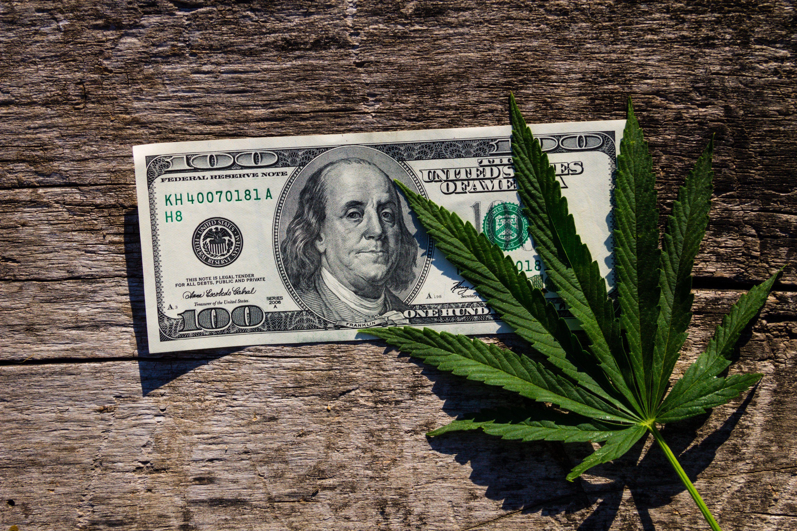

## Table of Contents

## What is cannabis alternative data?

Cannabis alternative data refers to information that comes from sources outside of traditional financial reports and public records. This type of data can include things like social media posts, satellite images, and even online search trends. Companies and investors use this data to learn more about the cannabis industry, which can help them make better decisions.

For example, by looking at social media posts, a company might see that more people are talking about a certain cannabis product. This could mean the product is becoming more popular. Or, by using satellite images, investors might see that a cannabis farm is growing bigger. This kind of information can give them a better idea of how well the farm is doing, even before official reports come out.

## Why is alternative data important in the cannabis industry?

Alternative data is really important in the cannabis industry because it helps companies and investors see what's happening in the market before everyone else knows. The cannabis industry is still pretty new and can change a lot. By looking at things like social media posts or online searches, companies can find out what people like or what's becoming popular. This helps them make products that people want and make decisions faster.

Also, because the cannabis industry is still growing and laws are different in different places, it can be hard to get good information from regular reports. Alternative data fills in these gaps. For example, satellite images can show how big a cannabis farm is getting, or how much they are growing. This kind of information can help investors decide if a company is doing well or if it's a good time to invest.

## What are the sources of alternative data for cannabis?

One source of [alternative data](/wiki/best-alternative-data) for cannabis is social media. People often talk about what they like or don't like on platforms like Twitter or Instagram. Companies can look at these posts to see which cannabis products are getting popular. They can also see what people are saying about different brands. This helps companies know what to make more of or how to make their products better.

Another source is online search trends. When more people start searching for a certain type of cannabis product, it might mean that product is becoming more popular. Companies can use this information to see what people are interested in and plan their business around it. For example, if a lot of people are searching for CBD oil, a company might decide to make more of it.

Satellite images are also a useful source of alternative data. These images can show how big a cannabis farm is or how much it's growing. Investors can use this to see if a company is doing well. If a farm is getting bigger, it might mean the company is making more money. This kind of information helps investors decide if they should put their money into that company.

## How can alternative data be used to analyze cannabis market trends?

Alternative data can be used to analyze cannabis market trends by looking at what people are talking about on social media. When more people start posting about a certain cannabis product or brand, it can show that it's becoming popular. Companies can use this information to see which products people like and which ones they don't. For example, if a lot of people are posting good things about a new type of cannabis gummy, a company might decide to make more of that kind of product. By keeping an eye on social media, companies can stay ahead of the market and make things that people want.

Another way to use alternative data is by looking at online search trends. If more people are searching for information about cannabis edibles, it might mean that this part of the market is growing. Companies can use this data to see where the market is going and plan their business around it. For instance, if searches for CBD oil are going up, a company might decide to focus more on making and selling CBD products. This helps companies be ready for what people will want next.

Satellite images are also a helpful source of alternative data for analyzing market trends. These images can show how big a cannabis farm is getting or how much it's growing. If a farm is expanding, it might mean that the company is doing well and that the demand for cannabis is going up. Investors can use this information to decide if it's a good time to put money into that company. By using satellite images, people can see real changes in the market and make smarter decisions.

## What are the legal considerations when collecting cannabis alternative data?

Collecting cannabis alternative data comes with some legal things to think about. In many places, cannabis is still against the law at the national level, even if some states or countries allow it. This means that when you collect data about cannabis, you need to be careful. You have to make sure you are not breaking any laws by collecting or using this data. For example, if you are looking at social media posts about cannabis, you need to know the rules about privacy and data protection in the places where you are collecting the data.

Another thing to consider is how you use the data. If you are going to use the data to make decisions about investing or running a business, you need to be sure you are not using it in a way that breaks the law. This includes not sharing the data with people who might use it to do something illegal. It's a good idea to talk to a lawyer who knows about cannabis laws and data privacy to make sure you are doing everything right.

## How does alternative data help in predicting cannabis stock performance?

Alternative data can help predict how cannabis stocks will do by looking at things like social media posts and online searches. When more people start talking about a certain cannabis product or brand on social media, it might mean that product is getting popular. This can be a sign that the company making that product could see its stock price go up. For example, if lots of people are posting about a new type of cannabis gummy, it might mean the company making those gummies will do well, and their stock could go up.

Another way alternative data helps is by using satellite images to see how big a cannabis farm is getting. If a farm is growing bigger, it might mean the company is making more money because more people want their cannabis. This can be a good sign for investors, as it might mean the company's stock will go up. By using this kind of data, people can see changes in the market before everyone else knows about them, and they can make better guesses about which cannabis stocks will do well.

## What tools and technologies are used to gather and analyze cannabis alternative data?

To gather and look at cannabis alternative data, people use different tools and technologies. One common tool is social media analytics software. This software helps companies see what people are saying on social media about cannabis products and brands. It can count how many posts there are about a certain product and see if people are saying good or bad things about it. Another tool is web scraping software, which can collect data from websites like online forums or news sites. This helps companies see what people are talking about and what's happening in the cannabis world.

Another important technology is satellite imagery. Companies use special software to look at pictures taken from space. These pictures can show how big a cannabis farm is or if it's getting bigger. This helps investors see if a company is doing well. Also, there are tools that track online search trends. These tools can tell companies what people are looking for when it comes to cannabis products. By knowing what people are searching for, companies can see what's becoming popular and plan their business around it.

## Can you explain a case study where alternative data impacted a cannabis business decision?

A cannabis company called GreenLeaf wanted to know if they should make more of their new cannabis-infused chocolate. They used social media analytics to see what people were saying about it. They found out that a lot of people were posting good things about the chocolate and asking where they could buy it. This showed that the chocolate was becoming popular. So, GreenLeaf decided to make more of the chocolate and sell it in more stores. This helped them make more money because they were giving people what they wanted.

Another case was with a company called HighGrow, which grew cannabis. They used satellite images to see how big their farms were getting. The images showed that their farms were growing bigger, which meant they were making more cannabis. HighGrow shared this information with investors, who saw that the company was doing well. This made more people want to invest in HighGrow, and their stock price went up. By using satellite images, HighGrow was able to show that they were growing and doing well, which helped them get more money to keep growing their business.

## How do privacy concerns affect the use of alternative data in the cannabis sector?

Privacy concerns are a big deal when it comes to using alternative data in the cannabis sector. When companies collect data from social media or online searches, they need to be careful about people's privacy. In many places, there are laws that say you can't just take and use anyone's information without their permission. So, if a cannabis company wants to use social media posts to see what people like, they have to make sure they are not breaking any privacy laws. This can be tricky because the rules can be different in different places, especially since cannabis laws are also different everywhere.

Because of these privacy concerns, companies might not be able to use all the data they want. They might have to be careful about what they collect and how they use it. For example, if they use web scraping to get information from online forums, they need to make sure they are not taking personal information that they are not allowed to have. This means they might miss out on some useful data, but it's important to respect people's privacy. By being careful and following the rules, companies can use alternative data to help their business while still keeping people's information safe.

## What are the challenges in integrating alternative data with traditional cannabis market analysis?

One challenge in mixing alternative data with regular cannabis market analysis is that the data can be messy. Alternative data like social media posts or satellite images can be hard to understand and organize. It's different from the numbers and reports that companies usually use. So, it takes a lot of work to make sure the alternative data is correct and useful. Companies need special tools and people who know how to use them to turn this messy data into something they can use to make decisions.

Another challenge is that the laws and rules about cannabis can make things harder. Since cannabis is legal in some places but not in others, it can be tough to collect and use alternative data without breaking the law. Companies have to be careful about privacy and make sure they are not using data in a way that's against the rules. This means they might not be able to use all the data they want, which can make their analysis less complete. But by being careful and following the rules, companies can still use alternative data to learn more about the market and make better choices.

## How can machine learning enhance the analysis of cannabis alternative data?

Machine learning can make it easier for cannabis companies to understand alternative data like social media posts or online searches. It can look at a lot of data very quickly and find patterns that people might miss. For example, [machine learning](/wiki/machine-learning) can see if more people are talking about a certain cannabis product and if they are saying good or bad things about it. This helps companies know what people like and what they don't like. By using machine learning, companies can make better decisions about which products to make more of and how to make their products better.

Another way machine learning helps is by predicting what might happen in the future. It can use the data it has to guess what people will want next. For example, if machine learning sees that more people are searching for CBD oil, it can predict that this product will become more popular. This helps companies plan ahead and be ready for what people will want. By using machine learning, cannabis companies can use alternative data to make smarter choices and stay ahead of the market.

## What future trends can we expect in the use of alternative data within the cannabis industry?

In the future, we can expect that more cannabis companies will use alternative data to learn about the market. They will use tools like social media analytics and satellite images to see what people like and how big their farms are growing. This will help them make better products and know when to expand their business. As more people start using cannabis, companies will need to keep up with what people want, and alternative data will be a big help in doing that.

Another trend will be using machine learning to make sense of all the data. Machine learning can look at a lot of information quickly and find patterns that people might miss. This will help companies predict what will happen next in the market. For example, if machine learning sees that more people are searching for a certain type of cannabis product, it can guess that this product will become popular. By using machine learning, cannabis companies can make smarter decisions and stay ahead of the competition.

## References & Further Reading

[1]: Asquith, G., & Paul, J. (2020). ["Cannabis Capital: How to Get Your Business Off the Ground"](https://www.academia.edu/68331605/Lessons_in_Corporate_Finance_A_Case_Studies_Approach_to_Financial_Tools_Financial_Policies_and_Valuation). Cloverleaf.

[2]: Gu, S., Kelly, B., & Xiu, D. (2020). ["Empirical Asset Pricing via Machine Learning"](https://www.nber.org/papers/w25398). The Review of Financial Studies, 33(5), 2223-2273.

[3]: Lopez de Prado, M. (2018). ["Advances in Financial Machine Learning"](https://www.amazon.com/Advances-Financial-Machine-Learning-Marcos/dp/1119482089). Wiley.

[4]: Mulvey, J. M., & Erwan, J. (2018). ["Alternative Data in Portfolio Management"](https://www.scholars.northwestern.edu/en/publications/identifying-economic-regimes-reducing-downside-risks-for-universi). INFORMS.

[5]: Schatsky, D., & Mahidhar, V. (2014). ["The Age of Analytics: Competing in a Data-Driven World"](https://www.mckinsey.com/capabilities/quantumblack/our-insights/the-age-of-analytics-competing-in-a-data-driven-world). Deloitte Review, Issue 15.

[6]: Zgodzinski, E. J. (2021). ["Cannabis Data in The Evolving Ecosystem of Finance and Trading"](https://academic.oup.com/jncimono/article/2021/58/39/6446219). Tilburg University.