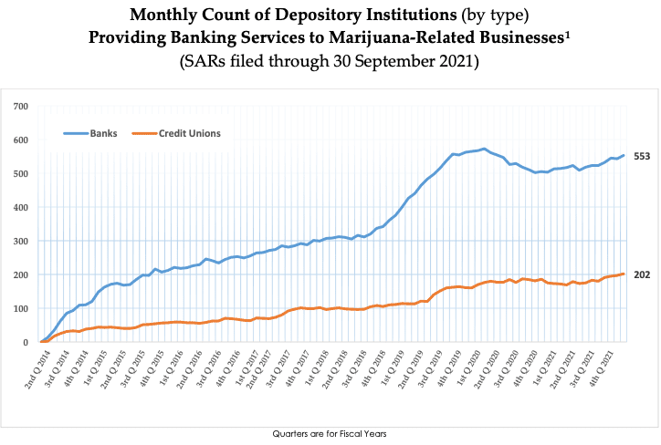

The cannabis industry in the United States is experiencing substantial transformation, primarily driven by the evolving landscape of state marijuana regulations and cannabis laws. With the legislative environment changing rapidly, it is imperative for stakeholders—ranging from investors and entrepreneurs to policymakers—to understand this complex regulatory framework. As the trend towards legalization continues, staying informed about these developments has never been more critical for anyone involved or interested in the cannabis market.

Currently, the U.S. presents a patchwork of cannabis regulations that reflect a tension between federal prohibition and state-level legalization efforts. While cannabis remains classified as a Schedule I drug under the Controlled Substances Act of 1970, numerous states have enacted legislation permitting both medical and recreational cannabis use. This state-by-state approach has resulted in a diverse and often contradictory legal landscape, which significantly impacts business operations and consumer access within the market.

This article offers a comprehensive overview of U.S. cannabis regulations, examining the varying state marijuana legislations and their implications. Additionally, it considers the intersection of these legal frameworks with cutting-edge investment strategies such as algorithmic trading. The increasing interest among investors has given rise to cannabis-focused exchange-traded funds (ETFs) and stocks, hinting at the vast economic opportunities within this burgeoning industry.

Through this exploration, we aim to shed light on how these regulatory changes and innovative investment strategies are shaping the future of the cannabis market. As the industry progresses towards a potential federal reevaluation of cannabis laws, understanding these dynamics will be crucial for strategic planning and adaptation in this ever-evolving sector.

## Table of Contents

## Overview of U.S. Cannabis Regulations

The United States operates under a complex legal framework regarding cannabis, characterized by a discord between federal prohibition and state-level legalization. At the federal level, the Controlled Substances Act of 1970 classifies marijuana as a Schedule I drug, which denotes it as a substance with high potential for abuse, no accepted medical use, and a lack of accepted safety for use under medical supervision. This classification creates a significant legal inconsistency, as it does not acknowledge the medical utility of cannabis despite emerging research supporting its therapeutic benefits.

However, this federal stance is juxtaposed with varying state regulations that permit the use of cannabis for medicinal or recreational purposes. As of now, a considerable number of states have enacted laws allowing for the medical use of cannabis, with a growing number also sanctioning recreational use. This state-level legislation often requires the creation of regulatory bodies to oversee the licensing, taxation, and sale of cannabis products, with frameworks differing significantly across states.

The divergence between federal prohibition and state legalization results in conflicting regulations affecting businesses and consumers alike. For businesses operating in the cannabis industry, this dichotomy poses considerable challenges, such as difficulties in accessing banking services due to federal restrictions, hindering operational capacity and financial transactions. Consumers, on the other hand, are subject to widely varying laws depending on state jurisdiction, which can lead to confusion and potential legal risks when crossing state lines.

Understanding the dichotomy between federal guidelines and state-specific exemptions is crucial for stakeholders navigating this industry. Those involved must remain cognizant of both local and federal laws to comply effectively while also anticipating potential changes in legislation that could impact operational and strategic decisions. As the industry continues to evolve, businesses and policymakers must actively engage with ongoing regulatory developments to capitalize on the opportunities presented by this burgeoning market.

## State Marijuana Legislation: A Diverse Landscape

State marijuana legislation in the United States is characterized by significant variability, reflecting diverse approaches to legalization, regulation, and market dynamics. This diversity arises due to the autonomy each state exercises in crafting its cannabis policies, thereby impacting licensing, taxation, sale, and consumption regulations.

States such as Colorado, California, and New York exemplify distinct regulatory frameworks. Colorado, an early adopter of full legalization, has established a robust system that balances regulation and market freedom. The state mandates rigorous licensing requirements for growers, retailers, and distributors, while imposing a 15% excise tax on recreational marijuana sales. This taxation policy has generated substantial revenue for the state, funding public education and infrastructure projects.

California, boasting the largest cannabis market in the nation, has similarly embraced recreational legalization. The state's licensing structure is multifaceted, demanding compliance with both state and local policies. California imposes a 15% excise tax on recreational sales, alongside local taxes, affecting overall market prices. Despite these taxes, California's market continues to thrive due to its large consumer base and progressive laws.

New York, a relative newcomer to the recreational cannabis scene, legalized recreational marijuana in 2021. Its regulatory framework is still evolving, but it already emphasizes social equity. The state allocates a portion of tax revenue to community reinvestment, supporting communities disproportionately affected by past drug policies. New York's framework may set a precedent for integrating social equity into cannabis legislation more thoroughly than other states.

Recent trends indicate a nationwide shift from medical-only legalization to full recreational use. As of 2023, over 20 states have legalized recreational marijuana, responding to changing public perceptions and the economic potential of cannabis. This transition influences market dynamics, as states adjust their regulatory and taxation structures to accommodate the recreational market.

However, despite progressive state laws, several challenges persist. Banking limitations remain a significant issue for cannabis businesses due to federal prohibition. Many financial institutions hesitate to provide services to cannabis businesses, forcing them to operate predominantly in cash, which presents security and logistical challenges.

Interstate commerce prohibitions also impact the cannabis industry's growth potential. Federal restrictions prevent the transport of cannabis products across state lines, resulting in fragmented markets and preventing economies of scale. Each state operates as an independent market, complicating operations for multi-state cannabis companies and inhibiting nationwide trade.

In conclusion, the diverse landscape of state marijuana legislation reflects an ongoing evolution in U.S. cannabis policies. States continue to balance economic benefits with regulatory challenges, while addressing social equity and market dynamics. The future trajectory of state legislation will likely continue to influence the national cannabis market, urging policymakers to navigate the complexities of legalization with keen precision.

## Legalization and Its Economic Impact

The legalization of cannabis has profoundly impacted state economies, evidenced by job creation, increased tax revenue, and stimulated local markets. States like Colorado and Illinois offer compelling case studies. Colorado, one of the first states to legalize recreational cannabis in 2012, has seen over $12 billion in marijuana sales by 2021, translating into more than $2 billion in tax revenue. This revenue has been channeled into education, infrastructure, and public health services, showcasing how legalization can benefit diverse sectors ([source](https://tax.colorado.gov/marijuana-data)).

Similarly, Illinois, which legalized recreational marijuana in 2020, reported over $1 billion in sales in its first year, generating significant tax revenue funneling into social programs and public services. The economic impact extends beyond direct tax benefits; the cannabis industry has created tens of thousands of jobs in cultivation, distribution, and retail sectors.

At a national level, federal legalization could amplify these benefits, contributing an estimated $128 billion in tax revenue and over 1 million jobs. However, this potential is tempered by challenges such as regulatory compliance costs, which can burden small businesses, hindering their ability to compete. Additionally, the persistence of a black market remains an obstacle, driven by lower prices and the absence of tax costs. The black market's continued existence reflects gaps in state-level regulation compliance, necessitating strategic interventions.

Social equity programs play a crucial role in ensuring fair economic benefit distribution. These initiatives aim to rectify the disproportionate impact of past cannabis prohibitions on minority communities, providing support through grants, training, and business licenses.

Efforts to address these challenges include enhancing regulatory frameworks to streamline compliance and incentivizing legal market participation. Such measures can reduce black market appeal, reinforcing the economic benefits of legalization. Strategies that integrate community-based solutions ensure that the social and economic impacts of legalization are equitably shared, maximizing the positive outcomes for all stakeholders.

## The Role of Algorithmic Trading in the Cannabis Industry

Algorithmic trading involves the use of automated systems to execute trades in financial markets based on predefined strategies, often driven by complex mathematical models and algorithms. In the context of the cannabis industry, the legalization of cannabis across various U.S. states has generated considerable interest from investors. This interest has resulted in the development of cannabis-focused exchange-traded funds (ETFs) and individual cannabis stocks, making the market ripe for [algorithmic trading](/wiki/algorithmic-trading) applications.

The cannabis market is characterized by high [volatility](/wiki/volatility-trading-strategies), driven by rapid regulatory changes and emerging market dynamics. Algorithmic trading can enhance investment efficiency in such a volatile market by enabling quick and precise execution of trades, minimizing human errors, and capturing short-lived opportunities. The ability to process vast amounts of data swiftly and apply complex trading strategies without direct human intervention provides a significant advantage for traders looking to navigate the unpredictable nature of cannabis investments.

Despite its potential benefits, algorithmic trading in the cannabis sector faces several challenges. Regulatory barriers are a significant hurdle, as the legal status of cannabis varies widely across jurisdictions, leading to complexities in compliance and risk management. Additionally, the volatility of cannabis stocks can pose a risk for algo traders whose models may not easily adapt to sudden market shifts or regulatory announcements. 

Nonetheless, the future prospects for algorithmic trading in the cannabis industry remain promising. The integration of advanced technologies like [artificial intelligence](/wiki/ai-artificial-intelligence) (AI) and [machine learning](/wiki/machine-learning) can further enhance trading strategies by improving the ability to predict market trends and adapt to unforeseen changes. These technologies can analyze large datasets, recognizing patterns and correlations that might not be immediately evident to human traders, thereby refining trading algorithms to better suit the unique characteristics of the cannabis market.

By leveraging AI, traders can devise more sophisticated models that account for various factors affecting the cannabis industry, from policy changes to consumer behavior shifts. With ongoing advancements in technology and increased legalization efforts, the intersection of algorithmic trading and the cannabis industry is poised for significant growth, offering new opportunities for investors and enhancing market efficiency.

## Future Outlook: Federal vs. State Dynamics

The potential shift in federal cannabis policy is a subject of considerable interest as different political administrations could lead to varying outcomes. Historically, federal cannabis policy has been characterized by prohibition, primarily due to the classification of marijuana as a Schedule I drug under the Controlled Substances Act (CSA) of 1970. However, as public opinion supports legalization gains traction, there emerges a possibility that future administrations might pursue the rescheduling or descheduling of cannabis.

If cannabis were to be federally legalized or rescheduled, the implications for state regulations would be significant. Currently, the contradiction between federal prohibition and state-level legalization leads to complex legal and operational challenges for businesses and consumers. Federal legalization might streamline these inconsistencies, potentially harmonizing regulations across states. This could lead to a standardized regulatory framework, easing cross-state trade and finance issues that arise from inconsistent state laws. However, states might still retain the power to enforce stricter regulations, akin to the alcohol regulatory framework.

In envisioning the future dynamics of federal and state cannabis policies, several scenarios can be considered. A pivotal scenario involves the federal government maintaining a hands-off approach, allowing states to regulate cannabis independently while removing legal barriers at the federal level. Alternatively, a comprehensive federal regulatory regime could be established, setting a baseline for states to follow but allowing state-specific adjustments. Another scenario could envisage the federal government incentivizing states to adopt cannabis-friendly laws through grants or tax benefits, encouraging a more uniform legal landscape nationwide.

To strategically prepare for potential regulatory changes, businesses operating within the cannabis sector need to maintain adaptability. This involves creating flexible business models that can quickly adjust to new legal environments and engage in comprehensive risk assessments. Moreover, companies can invest in compliance infrastructure to ensure adherence to evolving standards, potentially giving them a competitive advantage in periods of legislative flux.

Advocacy groups and public opinion are set to play a crucial role in shaping future cannabis laws. As public support for legalization grows, advocacy groups can leverage this [momentum](/wiki/momentum) to influence policymakers at both state and federal levels. Public opinion often acts as a catalyst for legislative change, and as the cannabis industry continues to grow, stakeholders who effectively harness advocacy efforts may find a more conducive legal environment for business expansion.

In conclusion, while uncertainty remains the norm in the cannabis regulatory landscape, the evolving interplay between federal and state dynamics could offer new opportunities. Engaging with policymakers, fostering public support, and building robust adaptation mechanisms will be crucial for navigating this transitional phase in the U.S. cannabis industry.

## Conclusion

U.S. cannabis regulations present a unique patchwork of laws and guidelines, offering both opportunities and challenges for participants within the industry. With federal prohibition juxtaposed against varying degrees of state-level legalization, stakeholders must remain informed and adaptable to thrive amidst this evolving landscape. 

For businesses, investors, and policymakers, staying up-to-date on regulatory developments is crucial. As states continue to reform their cannabis laws, opportunities arise from new markets, while challenges persist due to the ongoing discrepancies between federal and state regulations. The intersection of these regulatory frameworks with innovative investment strategies, such as algorithmic trading, presents new avenues for market participation. Algorithmic trading, for instance, can potentially mitigate risks in the inherently volatile cannabis market by leveraging data and technology to execute trading strategies more efficiently.

As the industry moves toward potential federal legalization, stakeholders should prepare for significant shifts that could alter market dynamics. Federal changes could harmonize regulations, enhance market clarity, and stimulate broader economic growth. However, navigating these complexities will require a strategic outlook and proactive engagement to capitalize on opportunities and address forthcoming challenges. The evolving cannabis regulatory landscape will continue to impact sectors beyond the cannabis industry, prompting stakeholders to maintain keen observation and adaptive strategies in response to legislative changes.

## References & Further Reading

[1]: Caulkins, J. P. (2010). ["The Taxation and Regulation of Recreational Marijuana."](https://www.rand.org/content/dam/rand/pubs/research_reports/RR800/RR864/RAND_RR864.pdf) Applied Economic Perspectives and Policy.

[2]: Bachhuber, M. A., et al. (2014). ["Medical Cannabis Laws and Opioid Analgesic Overdose Mortality in the United States, 1999-2010."](https://pubmed.ncbi.nlm.nih.gov/25154332/) JAMA Internal Medicine.

[3]: ["The Marijuana Conviction: A History of Marijuana Prohibition in the United States"](https://www.ojp.gov/ncjrs/virtual-library/abstracts/marijuana-conviction-history-marijuana-prohibition-united-states) by Richard J. Bonnie and Charles H. Whitebread.

[4]: Deloitte. (2018). ["The Deloitte Green Rush: The Economic Impact of Legalizing Pot in Canada."](https://www2.deloitte.com/content/dam/Deloitte/global/Documents/About-Deloitte/gx-deloitte-2018-global-impact-report.pdf) 

[5]: Sevigny, E. L., Pacula, R. L., & Heaton, P. (2014). ["The Effects of Medical Marijuana Laws on Pot Use and Other Risky Health Behaviors."](https://pubmed.ncbi.nlm.nih.gov/25558490/) Journal of Economic Literature.