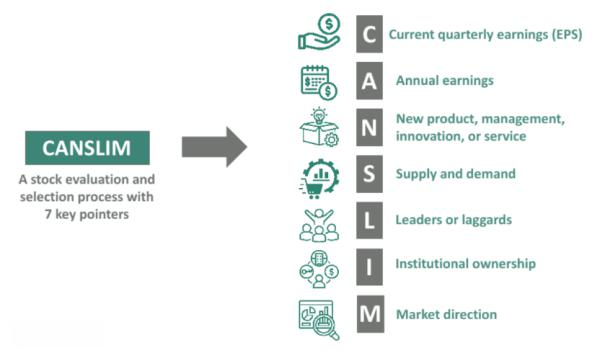

In trading and investment, strategies are developed, tested, and frequently discarded. However, the CANSLIM method, devised by renowned investor William O’Neil, has remained a steadfast approach. This strategy, noted for its systematic evaluation of stocks, combines both fundamental and technical analysis components, enabling traders to identify high-growth opportunities.

In this article, we explore CANSLIM reviews within the context of algorithmic trading to assess its enduring relevance and effectiveness. As algorithmic trading gains traction for its precision, speed, and ability to handle large data sets, understanding the integration of traditional strategies like CANSLIM into this modern approach becomes imperative for both new and seasoned traders.



Algorithmic trading automates the trading process using pre-set rules and data analysis, thereby eliminating human emotional biases. The question arises whether methods like CANSLIM, steeped in detailed stock evaluation, can be faithfully adapted into the algorithmic frameworks that dominate today's markets. With this backdrop, we discuss the potential for CANSLIM to not only fit but thrive in automated trading environments, ensuring investors maximize their potential to yield favorable returns.

As markets evolve with technological advancements, combining traditional methodologies with modern innovations may offer traders new avenues for success. In unfolding how CANSLIM can be effectively utilized alongside algorithmic trading technologies, we aim to provide insights into crafting a robust and adaptive trading strategy that leverages the strengths of both worlds.

## Table of Contents

## What is the CANSLIM Method?

CANSLIM is an investment strategy formulated by the prominent investor and author William O’Neil, meant to aid stock selection by focusing on specific growth indicators. The acronym CANSLIM stands for seven distinct criteria that analyze various aspects of a company's financial performance and market conditions.

1. **Current Quarterly Earnings**: This criterion emphasizes the need for a significant increase in a company's quarterly earnings per share (EPS) compared to the same quarter the previous year. A typical benchmark is an increase of at least 20%, indicating robust short-term growth.

2. **Annual Earnings Increases**: Investors are encouraged to look for companies with substantial annual EPS increases over the past five years. Consistent upward trends in annual earnings suggest long-term growth potential.

3. **New Products, Services, or Management**: Companies introducing innovative products or services, or those undergoing managerial changes, can experience rapid growth. This criterion focuses on the potential for increased earnings driven by innovation or improved leadership.

4. **Supply and Demand**: The law of supply and demand greatly influences stock prices. CANSLIM examines the trading volume, rewarding stocks with increased demand that often leads to price appreciation. Lesser shares available for trading can also create upward pressure on prices.

5. **Leader or Laggard**: This aspect evaluates whether a company is leading its industry or trailing behind. Leaders in strong industries are preferred as they typically outperform their competitors. This can be measured using relative price strength, highlighting stocks with superior market performance.

6. **Institutional Sponsorship**: CANSLIM assesses the level of interest from institutional investors such as mutual funds and pension plans. Growing institutional ownership can be a positive indicator, as these entities have significant resources to thoroughly analyze and invest in promising companies.

7. **Market Direction**: The method acknowledges that even fundamentally strong stocks are not immune to broader market trends. It encourages investors to consider the market’s overall direction, as determined by benchmarks like the S&P 500 or NASDAQ Composite, before making investment decisions.

Overall, the CANSLIM strategy is designed to identify stocks that have strong growth prospects, particularly in bullish market environments. By focusing on these seven criteria, investors can systematically pinpoint companies with the potential for significant price appreciation.

## Algorithmic Trading and CANSLIM: A Perfect Match?

Algorithmic trading has significantly transformed financial markets by enabling traders to execute strategies automatically, thus minimizing human emotions and biases often present in manual trading. At its core, [algorithmic trading](/wiki/algorithmic-trading) employs computer programs to swiftly analyze and act on market data according to predefined rules.

The CANSLIM strategy, devised by William O’Neil, is inherently quantitative and, therefore, well-suited for integration into algorithmic trading systems. By codifying CANSLIM's seven criteria—Current Quarterly Earnings, Annual Earnings Increases, New Products or Management, Supply and Demand, Leader or Laggard, Institutional Sponsorship, and Market Direction—into algorithms, traders can systematically evaluate stocks based on these parameters. The automation of this evaluation allows for swift identification of stocks showing high growth potential, thus improving traders' response time to favorable market changes.

For example, a Python-based algorithm could be developed to screen stocks that meet the defined CANSLIM criteria by pulling data from financial APIs and applying the necessary filters. This process could look like the following pseudocode:

```python
import requests

def fetch_stock_data(stock_symbol):
    response = requests.get(f"financial_api/{stock_symbol}")
    return response.json()

def canslim_criteria(stock_data):
    return (stock_data['quarterly_earnings'] > threshold_1 and
            stock_data['annual_earnings_increase'] > threshold_2 and
            stock_data['new_products'] == True and
            stock_data['supply_demand'] == 'high' and
            stock_data['is_leader'] == True and
            stock_data['institutional_sponsorship'] > threshold_3 and
            stock_data['market_direction'] == 'bullish')

stocks = ['AAPL', 'MSFT', 'GOOGL']
promising_stocks = [stock for stock in stocks if canslim_criteria(fetch_stock_data(stock))]

print(promising_stocks)
```

This script retrieves real-time stock data, checks each stock against the CANSLIM criteria, and outputs a list of stocks that satisfy the conditions, allowing traders to act swiftly on the information.

Moreover, the adaptation of CANSLIM into algorithmic approaches enhances the strategy's efficiency by enabling vast amounts of data to be processed in a fraction of the time that would be required manually. This synergy not only makes the trading process more efficient but also potentially more profitable by capturing market opportunities that might otherwise be missed. Algorithmic trading equips CANSLIM with a modern edge, ensuring its criteria are applied consistently and promptly across diverse market conditions.

## Performance and Backtesting of CANSLIM in Algo Trading

Historical performance assessments of the CANSLIM strategy indicate that it has generally surpassed the performance of the S&P 500 over extended periods, though with notable [volatility](/wiki/volatility-trading-strategies) and drawdowns. This highlights the potential of CANSLIM to identify and benefit from high-[growth stocks](/wiki/growth-stocks), albeit with inherent risks associated with market swings.

Backtesting is pivotal for examining the viability of CANSLIM within algorithmic trading frameworks. By applying algorithmic models to large historical datasets, traders can evaluate the potential returns and risks linked to this strategy. This process contributes to a deeper understanding of how CANSLIM can perform under various market conditions, thereby aiding in the refinement of trading rules and criteria to better optimize strategy execution.

For example, a [backtesting](/wiki/backtesting) scenario would involve coding the CANSLIM criteria into an algorithm and running it against historical stock data to simulate trading decisions. Here's a simplified example in Python, assuming you have a basic dataset of stock performance metrics:

```python
import pandas as pd

# Sample DataFrame with historical stock data
data = {
    'QuarterlyEarnings': [1.2, 0.9, 1.5, 1.1],
    'AnnualEarnings': [5.1, 4.9, 6.0, 5.5],
    'NewProducts': [True, False, True, True],
    'SupplyDemandRatio': [2.5, 1.7, 2.8, 3.0],
    'LeaderIndex': [1, 0, 1, 1],  # 1: Leader, 0: Laggard
    'InstitutionalSponsorship': [1.8, 1.4, 2.0, 2.2],
    'MarketDirection': ['Up', 'Up', 'Down', 'Up']
}

df = pd.DataFrame(data)

# Applying a basic CANSLIM filter with arbitrary thresholds
def canslim_filter(row):
    return (row['QuarterlyEarnings'] > 1.0 and
            row['AnnualEarnings'] > 5.0 and
            row['NewProducts'] and
            row['SupplyDemandRatio'] > 2.0 and
            row['LeaderIndex'] == 1 and
            row['InstitutionalSponsorship'] > 1.5 and
            row['MarketDirection'] == 'Up')

# Performing backtest
df['CANSLIM_Pass'] = df.apply(canslim_filter, axis=1)
selected_stocks = df[df['CANSLIM_Pass']]

print(selected_stocks)
```

In this example, stocks are filtered based on simplified CANSLIM criteria. The code assesses historical data for alignment with the strategy's rules and identifies which stocks would have been selected according to CANSLIM principles.

Despite the insights provided by backtesting, it's vital to recognize that past performance doesn't assure future outcomes. Markets are dynamic, and strategies like CANSLIM must be continuously assessed and adjusted. Backtesting serves as a foundational tool in this iterative process, offering valuable feedback on the robustness and adaptability of trading strategies.

## Pros and Cons of CANSLIM in Algorithmic Trading

The CANSLIM method, when integrated into algorithmic trading, offers distinct advantages and challenges. Among its notable strengths is the structured approach it provides for identifying high-potential stocks. The seven criteria of CANSLIM allow for comprehensive analysis, which is compatible with technology-driven assessments, making it suitable for algorithmic implementation. This structured analysis can be automated, enabling traders to efficiently scan and identify stocks that meet the specific growth criteria outlined in the CANSLIM methodology.

Algorithmic trading, by nature, offers speed and precision in executing trades based on CANSLIM criteria. Automation reduces human emotional biases that often interfere with trading decisions, facilitating consistency and discipline in trade execution. For instance, algorithms can instantly process vast datasets to determine if a company’s earnings growth meets the thresholds set forth by CANSLIM. This rapid assessment enhances the trader’s ability to respond to market fluctuations promptly.

Despite these benefits, certain limitations must be acknowledged. CANSLIM’s efficacy can be reduced in market downturns since it primarily focuses on bullish market conditions. The strategy is designed to exploit growth opportunities, which are less prevalent in bearish markets, thus potentially impacting its performance during such periods. Additionally, the discretionary nature of some CANSLIM criteria can pose challenges in adapting it to entirely rule-based systems. For example, evaluating ‘New Products or Management’ requires qualitative judgment, which is inherently difficult to codify into a rigid algorithmic framework.

Critics also point out that while CANSLIM can be partially automated, its reliance on broader market and industry trends complicates its full integration into algorithmic systems that ideally thrive on clear, quantifiable data points. Despite these challenges, the synergy between CANSLIM and algorithmic trading continues to offer promising opportunities, especially when traders adapt the criteria to align with the computational rigor of automated systems.

## Practical Tips for Implementing CANSLIM in Algo Trading

To effectively implement CANSLIM in algorithmic trading, a well-defined framework is essential. This involves selecting a robust algo-trading platform capable of both backtesting strategies and executing trades in real-time. Popular platforms that offer these functionalities include MetaTrader, QuantConnect, and TradeStation. These platforms provide the necessary tools to simulate CANSLIM criteria, allowing traders to evaluate the strategy's performance against historical data.

Fine-tuning the thresholds for CANSLIM criteria is a crucial step. Adjust these parameters to reflect current market conditions and personal risk tolerance. For instance, if the market exhibits high volatility, you might adjust the criteria for 'Current Quarterly Earnings' to be more conservative. This requires dynamic alteration of thresholds for each criterion based on statistical analysis or [machine learning](/wiki/machine-learning) models that continuously evaluate market indicators and optimize settings.

Automate the screening process to efficiently identify stocks meeting CANSLIM standards. Create scripts that automatically filter stock data and compare it to CANSLIM benchmarks. In Python, this could involve using libraries like Pandas for data manipulation and NumPy for numerical analysis. For instance:

```python
import pandas as pd

# Sample stock data
data = {'Earnings': [1.5, 2.0, 3.5, 4.0, 2.5],
        'AnnualChange': [20, 25, 30, 15, 10],
        'NewProducts': [True, False, True, True, False]}

df = pd.DataFrame(data)

# CANSLIM criteria
criteria = (df['Earnings'] > 2) & (df['AnnualChange'] >= 20) & (df['NewProducts'] == True)

# Filter stocks
filtered_stocks = df[criteria]
print(filtered_stocks)
```

This script filters stocks based on predefined CANSLIM criteria, ensuring trades are executed only for stocks that align with the strategy.

Lastly, continuous monitoring and adjustment are paramount. Markets are dynamic, and fixed algorithms can become obsolete rapidly. Implement a monitoring system that tracks market changes and adjusts algorithm parameters as necessary. This could involve machine learning models that learn and adapt from new data, continuously improving the strategy's effectiveness.

In conclusion, the integration of CANSLIM into algorithmic trading involves precise platform choice, criteria customization, automation, and adaptive monitoring—all of which contribute to a more efficient and potentially profitable trading framework.

## Conclusion

The integration of the CANSLIM method into algorithmic trading frameworks offers a significant improvement in terms of efficiency and decision-making. CANSLIM's structured criteria inherently lend themselves to algorithmic application, thus enabling traders to analyze large datasets quickly and precisely, reducing the impact of human error and emotion. This integration fosters a systematic approach that combines time-tested stock selection methods with cutting-edge technology.

As financial markets continue to evolve, it is essential for trading strategies and tools to adapt in tandem. The dynamic nature of markets necessitates a continuous reassessment of the approaches and technologies traders deploy. By merging the traditional CANSLIM strategy with contemporary algorithmic trading technology, traders are well-positioned to exploit both historical insights and modern advancements. This synthesis not only enhances the ability to identify promising stocks but also optimizes trade executions promptly.

Understanding market dynamics and adapting trading strategies accordingly remains crucial for achieving success. Algorithmic trading provides the flexibility required to adapt to swift market changes, offering a distinct advantage over more static trading approaches. Therefore, a meticulous blend of traditional methods like CANSLIM with algorithmic systems can potentially lead to superior trading results, making it a compelling choice for modern investors aiming to stay competitive in a rapidly evolving marketplace.

## FAQs

### How does CANSLIM work in a bear market?

CANSLIM, primarily geared towards identifying growth stocks, is less effective during bear markets. In such environments, growth stocks tend to suffer as market sentiment shifts towards risk aversion and capital preservation. CANSLIM's criteria focus on bullish market conditions, such as improving earnings and strong institutional sponsorship, which may be scarce in bear markets. Traders may need to adjust the strategy, possibly by lowering the threshold for certain criteria or combining it with defensive strategies that are more suitable for downturns.

### Is CANSLIM suitable for short-term trading strategies?

While CANSLIM is primarily designed for longer-term investments, targeting stocks with growth potential over months or years, certain aspects may be adapted for short-term trading. Elements like Current Quarterly Earnings and Market Direction can identify potential short-term price movements when combined with technical analysis indicators. However, the strategy's strength lies in identifying long-term opportunities, and its full potential may not be realized in short-term trading.

### What are the risks of using CANSLIM in algorithmic trading?

Implementing CANSLIM in algorithmic trading carries several risks. The criteria's discretionary nature can complicate rule-based implementation, and the strategy's bullish bias may result in underperformance during market downturns. Additionally, reliance on historical data for backtesting may not accurately predict future movements, especially as market conditions change. Lastly, the precision of algorithmic trading could amplify errors if algorithms misinterpret or improperly weigh CANSLIM's criteria.

### How can I learn more about coding CANSLIM trading algorithms?

To code CANSLIM trading algorithms, one can start with resources such as online courses on algorithmic trading and programming languages like Python. Books and tutorials on financial algorithms, specifically focusing on stock trading, provide valuable insights. Communities such as QuantConnect and Algorithmic Trading Reddit offer forums to discuss strategies and share code examples. Learning platforms like Coursera or Udemy often feature comprehensive courses on financial algorithms and programming.

### Which platforms offer tools for backtesting CANSLIM-based strategies?

Several platforms provide robust tools for backtesting CANSLIM-based strategies. QuantConnect is popular for its extensive library and community support for Python and C# users. TradingView offers a user-friendly interface with Pine Script for observing historical performance. MetaTrader, primarily used for [forex](/wiki/forex-system) and CFDs, also supports backtesting with MQL5. Additionally, NinjaTrader focuses on futures and provides advanced backtesting and simulation features, ideal for implementing CANSLIM criteria.

## References & Further Reading

[1]: O'Neil, W. J. (2009). ["How to Make Money in Stocks: A Winning System in Good Times and Bad, Fourth Edition"](https://www.amazon.com/How-Make-Money-Stocks-Winning/dp/0071614133). McGraw-Hill Education.

[2]: Lopez de Prado, M. (2018). ["Advances in Financial Machine Learning"](https://www.amazon.com/Advances-Financial-Machine-Learning-Marcos/dp/1119482089). Wiley.

[3]: Aronson, D. (2006). ["Evidence-Based Technical Analysis: Applying the Scientific Method and Statistical Inference to Trading Signals"](https://www.amazon.com/Evidence-Based-Technical-Analysis-Scientific-Statistical/dp/0470008741). Wiley.

[4]: Jansen, S. (2018). ["Machine Learning for Algorithmic Trading: Predictive models to extract signals from market and alternative data for systematic trading strategies with Python, 2nd Edition"](https://www.amazon.com/Machine-Learning-Algorithmic-Trading-alternative/dp/1839217715). Packt Publishing.

[5]: Chan, E. P. (2008). ["Quantitative Trading: How to Build Your Own Algorithmic Trading Business"](https://github.com/ftvision/quant_trading_echan_book). Wiley.

[6]: Pring, M. J. (2002). ["Technical Analysis Explained: The Successful Investor's Guide to Spotting Investment Trends and Turning Points"](https://www.amazon.com/Technical-Analysis-Explained-Fifth-Successful/dp/0071825177). McGraw-Hill Education.