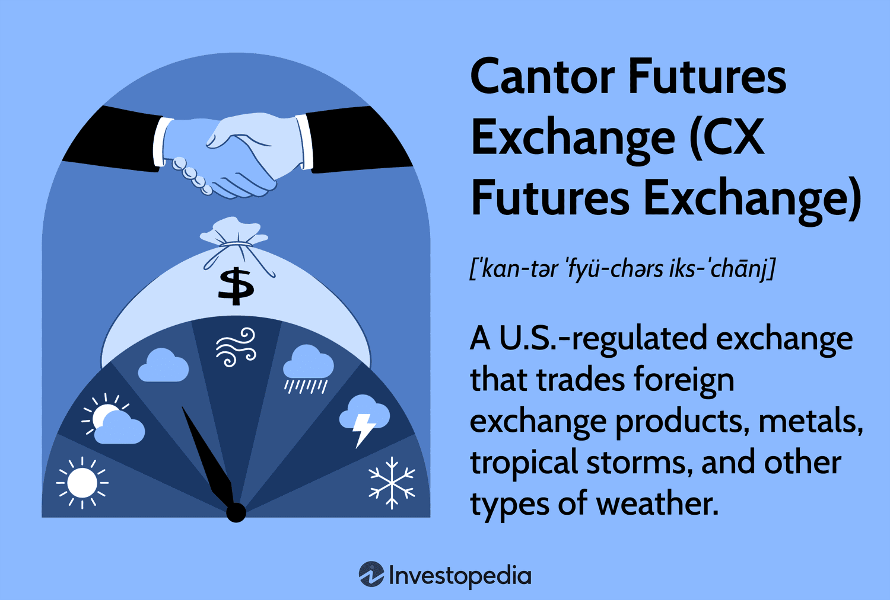

The Cantor Exchange, also recognized as CX Futures Exchange, offers a dynamic and intricate platform where futures trading meets cutting-edge technology. CX Futures stands out in a crowded financial market landscape due to its unique focus on niche derivatives like weather and foreign exchange (forex) products, allowing traders to engage with assets not typically available on other American exchanges. This distinctiveness positions the exchange as a forward-thinking entity in the financial trading ecosystem.

Algorithmic trading plays a pivotal role at CX Futures, facilitating transactions with enhanced precision, speed, and efficiency. By harnessing advanced algorithms, traders at CX Futures can automate trading decisions that often result in quicker and more accurate order execution than traditional manual methods. Algorithmic trading algorithms can analyze vast amounts of market data, identify trading opportunities, and optimize strategies, minimizing human error and maximizing profitability.



The growing popularity of futures trading globally reflects broader technological advancements, which have paved the way for more sophisticated trading strategies and tools. At CX Futures, technological innovations are at the core of its operations, supporting the integration of algorithmic trading that empowers market participants to execute strategies on a scale and with a responsiveness previously unattainable.

The uniqueness of CX Futures in the financial market stems from its offerings and its commitment to leveraging technology to enhance trading experiences. The exchange's focus on non-standardized asset classes like weather derivatives offers a diversification avenue for traders, alongside more conventional instruments like forex products. This diversifying strategy appeals to both speculators and hedgers looking to manage risk in innovative ways.

Algorithmic trading provides several advantages, such as reduced transaction costs, improved liquidity, and the capability to handle multiple trading strategies simultaneously. By automating processes that would otherwise require extensive manual input, algorithmic trading can streamline operations, making it an indispensable tool in the modern trader’s arsenal. As technology continues to evolve, so will the capabilities of algorithmic trading systems, potentially offering even more sophisticated and efficient solutions in the near future.

In summary, CX Futures Exchange illustrates the synergy between evolving trading methodologies and the fast-paced world of technological innovation. Its distinct market offerings combined with the intrinsic benefits of algorithmic trading solidify its standing as a unique player in the world of futures trading.

## Table of Contents

## What is CX Futures Exchange?

The Cantor Exchange, now known as the CX Futures Exchange, represents a pivotal institution in the evolution of futures trading. Originally influenced by the established financial expertise of Cantor Fitzgerald, a globally recognized financial services firm, CX Futures Exchange has adapted to meet the demands of modern financial markets. 

Cantor Exchange was initially established to introduce innovative financial products, primarily aiming to expand beyond traditional futures markets. Over time, the exchange evolved, leading to the inception of CX Futures Exchange. One of the core motivations for this evolution was to cater to niche markets, such as weather derivatives and foreign exchange ([forex](/wiki/forex-system)) products, thereby setting CX Futures apart from many other exchanges.

The CX Futures Exchange operates under a rigorous regulatory framework governed by the Commodity Futures Trading Commission (CFTC). The CFTC is a federal agency responsible for overseeing futures and options markets in the United States, ensuring market integrity, protecting market participants, and fostering open, transparent, competitive, and financially sound markets. This regulatory oversight is crucial in providing traders and investors with confidence in the safety and legality of the financial products offered.

CX Futures specializes in providing a diverse range of financial products. Notably, it offers weather derivatives, which are contracts that allow users to hedge or speculate on weather-related risks. These derivatives are essential for industries heavily influenced by weather conditions, such as agriculture, energy, and insurance. Additionally, the exchange provides forex derivatives, which offer traders the ability to engage in currency exchange markets, a space known for its [liquidity](/wiki/liquidity-risk-premium) and [volatility](/wiki/volatility-trading-strategies).

Cantor Fitzgerald's foundational role in establishing the CX Futures Exchange cannot be understated. With decades of experience in financial services, Cantor Fitzgerald brought strategic insight and a robust financial infrastructure to support the exchange's operations. This affiliation with a seasoned institution has been instrumental in crafting a credible and innovative platform for derivative trading.

As part of its mission, CX Futures continually seeks to develop and introduce products that are unique to the U.S. market, drawing from Cantor Fitzgerald’s expertise and resources. Over the years, the exchange has managed to carve out a niche by focusing on innovative derivatives products, such as those based on weather forecasts, which are not typically found in conventional exchanges. 

In summary, the CX Futures Exchange is a product of strategic evolution within the financial market, spearheaded by the foresight of Cantor Fitzgerald. Governed by the CFTC, it remains committed to providing niche market derivatives, primarily focusing on weather and forex, underscoring its distinctive presence in the financial landscape.

## Algorithmic Trading at CX Futures

Algorithmic trading refers to the use of computer algorithms to automate trading processes based on pre-defined criteria. These algorithms execute trades at speeds and frequencies that are impossible for human traders. The significance of [algorithmic trading](/wiki/algorithmic-trading) in modern financial markets lies in its ability to handle complex calculations quickly, facilitate high-frequency trading, and provide liquidity and efficiency to markets.

At CX Futures Exchange, algorithmic trading plays a crucial role in its operations, particularly in trading weather and forex derivatives. Algorithms at CX Futures are designed to analyze vast amounts of data to predict market trends, execute trades rapidly, and manage risk more effectively. These algorithms assess historical and real-time data to determine optimal trading strategies.

The benefits of algorithmic trading at CX Futures are manifold. Firstly, precision is a significant advantage; algorithms can execute trades at the exact moment they detect an opportunity, minimizing human error. Secondly, the speed of algorithmic trading is unmatched; trades are processed in milliseconds, allowing traders to capitalize on even the smallest market movements. Lastly, efficiency is enhanced as algorithms can scan and react to the entire market more quickly than human traders, optimizing transaction costs and exploiting [arbitrage](/wiki/arbitrage) opportunities.

In trading weather derivatives, algorithms might analyze meteorological data and historical weather patterns to forecast demand for energy products. For instance, a Python script could be used to predict temperature fluctuations, which in turn influence the price of weather derivatives. An example of a simple algorithm might be:

```python
import numpy as np

def weather_derivative_pricing(temperature_forecast, historical_data):
    mean_temp = np.mean(historical_data)
    deviation = np.std(historical_data)
    risk_factor = (temperature_forecast - mean_temp) / deviation
    return max(0, temperature_forecast - mean_temp) * risk_factor

# Example usage
forecast = 85  # Example forecast temperature
historical_temps = [80, 82, 81, 79, 83]  # Example historical temperatures
price = weather_derivative_pricing(forecast, historical_temps)
```

In the forex market, algorithms are used to monitor currency pairs and execute trades based on exchange rate movements and economic indicators. Here, trading algorithms might deploy [statistical arbitrage](/wiki/statistical-arbitrage) strategies or exploit macroeconomic announcements, executing trades within milliseconds of data release.

Overall, algorithmic trading transforms how transactions are conducted at CX Futures Exchange, amplifying precision, speed, and operational efficiency. This technological advancement allows CX Futures to maintain competitiveness and offer sophisticated trading opportunities in weather and forex markets.

## Key Features and Offerings of CX Futures

CX Futures Exchange stands out in the financial landscape due to its distinctive offerings in weather derivatives, forex, and binary options. These markets cater to different trading strategies and provide unique opportunities for both speculators and hedgers.

In the weather derivatives market, CX Futures takes an innovative approach by allowing trades on weather-related events. This market is particularly attractive to businesses and individuals wishing to hedge against the financial risk posed by weather unpredictability. For instance, agricultural producers may use weather derivatives to mitigate risks associated with adverse weather conditions that could affect crop yields. The contracts are typically structured around measurable weather indices, such as temperature, precipitation, or wind speed, allowing participants to speculate or hedge based on predicted meteorological outcomes.

The forex market within CX Futures offers standard currency trading opportunities, allowing traders to participate in one of the most liquid markets globally. Forex derivatives at CX Futures provide a platform for traders to speculate on currency price movements or to hedge any adverse effects of currency volatility on international transactions. This market draws significant interest from both institutional investors looking to manage exchange rate risks and individual speculators aiming to profit from currency fluctuations.

Binary options are another essential part of the CX Futures offerings, allowing traders to make bets on the outcome of specific market events with predefined risks and rewards. These instruments are popular due to their simplicity and the clear delineation of risk, as they offer a fixed return based on whether a binary condition is met at the expiry time.

Furthermore, CX Futures provides innovative products not available on other U.S. exchanges, such as DBOR (Dynamic Binary Outcome Reversion) contracts. These contracts offer dynamic payout structures, providing diverse opportunities for traders seeking to capitalize on market conditions. The unique nature of these products attracts a niche segment of traders who are interested in deploying advanced trading strategies that might not be feasible on traditional derivatives platforms.

Speculators in these markets aim to profit from the price movements of these derivatives by predicting future trends accurately. On the other hand, hedgers use these instruments to reduce exposure to adverse price movements that could affect their core business operations. This dual participation enriches market liquidity and contributes to more robust price discovery mechanisms.

In summary, CX Futures Exchange's offerings in weather, forex, and binary options markets, alongside innovative products like DBOR contracts, underscore its unique place in the financial markets, attracting a varied demographic of traders and bolstering its reputation as a center for cutting-edge derivatives trading.

## Growth and Opportunities in CX Futures

Cantor Exchange (CX) Futures presents numerous growth opportunities within the algorithmic trading space. Algorithmic trading, which uses complex algorithms to automate trading decisions and executions, has gained significant traction due to its capacity for high-speed data processing, accuracy, and efficiency. As the financial markets become more complex, CX Futures can capitalize on these advancements by further integrating algorithmic trading into its platform, thus enhancing its attractiveness to traders.

To draw more traders, CX Futures can develop innovative products like binary options and weather derivatives, which appeal to both speculative traders and institutional hedgers. These products can be marketed as unique opportunities for diversification and risk management. Innovations such as the Daily Binary Option Range (DBOR) contracts further demonstrate CX Futures' commitment to offering unique and valuable trading products not typically found on other exchanges.

Expansion into additional derivatives and markets can be a powerful growth catalyst for CX Futures. By diversifying its offerings to include new types of contracts or even creating bespoke derivatives that suit the needs of niche markets, CX Futures can widen its customer base. Strategic collaborations with fintech companies and leveraging distributed ledger technology can also streamline transactions and enhance security, further appealing to modern traders.

From a technological standpoint, continuous improvement of trading infrastructure is critical. CX Futures can enhance trading experiences by investing in state-of-the-art technology that reduces latency and increases system reliability. Advanced predictive analytics and [machine learning](/wiki/machine-learning) can also be integrated to provide traders with insightful market data, thereby facilitating more informed trading decisions.

In conclusion, by focusing on product innovation, market expansion, and technological advancements, CX Futures is well-positioned to leverage algorithmic trading for substantial growth. These strategies not only attract a broader range of traders but also solidify CX Futures' position as a competitive player in the evolving financial markets landscape.

## Challenges and Considerations

Futures trading, while offering substantial profit opportunities, presents several risks and regulatory challenges. The Commodity Futures Trading Commission (CFTC) regulates futures markets to ensure transparency and protect against market manipulation and fraud. Compliance with regulations, such as reporting and maintaining adequate capital reserves, is vital for exchanges like CX Futures to maintain their licenses and credibility.

Algorithmic trading introduces unique challenges due to its reliance on sophisticated software and high-speed data analysis. Technical glitches in algorithms can lead to erroneous trades, significantly impacting both traders and the market. For example, a minor bug in the code might cause discrepancies in buy/sell orders, leading to market disruptions. Additionally, the speed at which these algorithms operate can exacerbate market volatility, as they can react instantaneously to market changes and potentially trigger rapid price shifts. 

To illustrate, consider an algorithm that predicts weather patterns for weather derivatives trading. If a sudden data feed error occurs, the algorithm might incorrectly forecast a weather event, leading to substantial financial losses. Thus, ensuring robust error-checking and validation processes in algorithmic systems is crucial.

Responsible trading and risk management are essential when dealing with complex futures markets. Traders should establish clear risk management strategies, including setting stop-loss orders and diversifying their portfolios to mitigate potential losses. Moreover, continuous monitoring and reviewing algorithm performance can help identify issues early and adjust strategies as necessary.

CX Futures operates in a competitive landscape with numerous other exchanges offering similar products. Exchanges like the Chicago Mercantile Exchange (CME) and Intercontinental Exchange (ICE) provide a wide array of futures contracts, creating a competitive environment for attracting traders. CX Futures must differentiate itself through unique product offerings, enhanced technological infrastructure, and competitive pricing. By leveraging innovations in algorithmic trading and offering niche products like weather derivatives, CX Futures can position itself as a distinctive player in the futures trading market.

In summary, navigating the challenges of futures trading requires a robust understanding of regulatory requirements, technology, and market dynamics. As CX Futures continues to evolve, addressing these considerations will be pivotal in maintaining a secure and efficient trading environment.

## Conclusion

The Cantor Exchange, known as CX Futures Exchange, distinguishes itself as a dynamic contributor to the evolving landscape of the financial market. With its unique focus on markets such as weather and forex derivatives, CX Futures stands out by offering products that are not typically found on other exchanges, such as Daily Binary Option Rates (DBOR) contracts. This innovation in trading instruments highlights the exchange's capability to cater to both speculators and hedgers looking for novel ways to manage risk and capitalize on market movements.

A critical feature of CX Futures is its integration of algorithmic trading, playing a pivotal role in shaping the futures market. Algorithmic trading brings several advantages such as increased precision, speed, and efficiency in executing trades. These benefits are particularly significant in the fast-paced trading environment of CX Futures, where timely and accurate execution of trades can lead to improved investment outcomes. The algorithms employed allow for complex analysis and real-time data processing, which can enhance decision-making and strategy development for traders.

Looking ahead, the future prospects for CX Futures Exchange appear promising. The exchange is well-positioned to harness the growth opportunities in the algorithmic trading space, especially as technology continues to advance at a rapid pace. By leveraging strategic advancements, CX Futures can enhance the trading experience, attracting a larger and more diverse pool of traders. Moreover, with the potential to expand into additional derivatives and markets, CX Futures may further solidify its role as a pioneering force in the financial sector.

The sustainability and long-term potential of CX Futures and its algorithmic trading strategies are reinforced by their adaptability to changing market dynamics and regulatory environments. As the exchange continues to innovate and adopt new technologies, it is likely to maintain its competitive edge and contribute significantly to the broader futures market. Through responsible trading practices and proactive risk management, CX Futures can navigate the challenges of a volatile market, ensuring its continued growth and success.

## References & Further Reading

[1]: Bergstra, J., Bardenet, R., Bengio, Y., & Kégl, B. (2011). ["Algorithms for Hyper-Parameter Optimization."](https://papers.nips.cc/paper/4443-algorithms-for-hyper-parameter-optimization) Advances in Neural Information Processing Systems 24.

[2]: ["Advances in Financial Machine Learning"](https://www.amazon.com/Advances-Financial-Machine-Learning-Marcos/dp/1119482089) by Marcos Lopez de Prado

[3]: ["Evidence-Based Technical Analysis: Applying the Scientific Method and Statistical Inference to Trading Signals"](https://www.amazon.com/Evidence-Based-Technical-Analysis-Scientific-Statistical/dp/0470008741) by David Aronson

[4]: ["Machine Learning for Algorithmic Trading"](https://github.com/stefan-jansen/machine-learning-for-trading) by Stefan Jansen

[5]: ["Quantitative Trading: How to Build Your Own Algorithmic Trading Business"](https://www.amazon.com/Quantitative-Trading-Build-Algorithmic-Business/dp/1119800064) by Ernest P. Chan

[6]: Doerr, S., & Gambacorta, L. (2020). ["Covid-19 and fintech: Digital finance against the resilience of cash."](https://www.sciencedirect.com/science/article/pii/S0165176521003797) BIS Bulletins.

[7]: Makarov, I., & Schoar, A. (2020). ["Trading and arbitrage in cryptocurrency markets."](https://www.sciencedirect.com/science/article/pii/S0304405X19301746) The Review of Financial Studies, 33(5), 1908-1954.

[8]: Hull, J. C. (2017). ["Options, Futures, and Other Derivatives."](https://www.semanticscholar.org/paper/Options%2C-Futures%2C-and-Other-Derivatives-Hull/89bdee500c8623864fc9eb7a471546aa713acc44) Pearson Education.

[9]: Fabozzi, F. J., & Modigliani, F. (2009). ["Capital Markets: Institutions and Instruments."](https://archive.org/details/capitalmarketsin0000fabo_b7q6) Prentice Hall.

[10]: Harris, L. (2003). ["Trading and Exchanges: Market Microstructure for Practitioners."](https://academic.oup.com/book/52292) Oxford University Press.