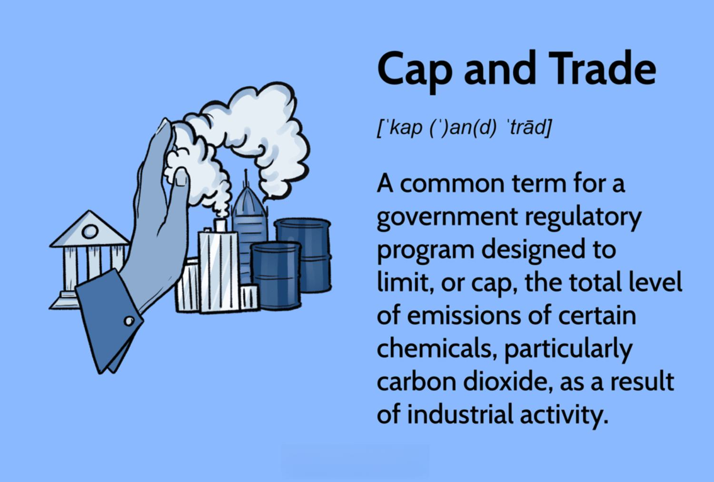

Emissions trading and cap and trade systems play a critical role in addressing the urgent issue of climate change. These systems are designed to limit greenhouse gas emissions by establishing a market where businesses can buy and sell allowances. The fundamental concept involves setting a cap on the total level of emissions allowed and letting market mechanisms determine the distribution of emission allowances among companies. By doing so, these systems aim to incentivize reductions in emissions, encouraging companies to innovate and invest in cleaner technologies.

Cap and trade systems have emerged as vital components of international and domestic climate policies. They work by providing economic incentives for businesses to minimize their carbon footprint, promoting both environmental sustainability and economic efficiency. This method of emissions control is seen as a scalable option for governments and international bodies to implement, with the potential to adapt to varying economic and environmental conditions.

A crucial aspect of emissions trading is the balance between environmental goals and economic flexibility. These systems offer businesses the flexibility to meet emissions targets in cost-effective ways, providing room for innovation and technological advancements. However, they also necessitate robust regulatory frameworks to ensure compliance and effectiveness. This article will explore the multifaceted nature of cap and trade, addressing its benefits, challenges, and the novel integration of algorithmic trading strategies that aim to enhance market efficiency and liquidity.

With the growing importance of these systems in global environmental policy, understanding their intricacies becomes essential. As more countries and regions adopt emissions trading schemes, these markets are expected to expand and evolve. Future developments may include greater integration of advanced technologies and policy innovations to improve their impact. This exploration will provide insights into how emissions trading and cap and trade systems are not only responding to current environmental challenges but are also shaping the future of sustainable economic development.

## Table of Contents

## What is Cap and Trade?

Cap and trade is a regulatory framework designed to control pollution by setting a cap on total emissions and enabling the trading of emission allowances. This system allows firms to buy, sell, or trade allowances that permit the emission of specific amounts of pollutants, primarily greenhouse gases. Each allowance typically corresponds to one tonne of carbon dioxide (CO2) equivalent emissions. By setting a cap, authorities effectively limit the total level of greenhouse gas emissions permissible across participating entities, which can include companies, industries, or regions.

The cap is strategically set to decrease over time. This gradual reduction aims to encourage industries to adopt cleaner technologies and innovative practices that result in lower emissions. This decline in the cap generates a scarcity of allowances over time, thus driving up their value and increasing the economic incentives for reducing pollution.

Companies will receive these allowances in different manners, including free allocation based on historical emissions or sectors of strategic importance, and auctioning, where firms must purchase the limited allowances at market-determined prices. The balance between these allocation methods can significantly affect the cost distribution and overall compliance effectiveness of the cap and trade system.

An essential feature of cap and trade is the flexibility it provides. Firms can comply by either reducing their emissions or purchasing additional allowances if they exceed their limits. Enterprises that emit less than their allowance can sell excess permits to other companies, creating an economic incentive to reduce emissions beyond mandated levels. This aspect serves to internalize the social cost of pollution and allows for cost-efficiency in meeting environmental targets.

Additionally, some systems allow banking of allowances, where unused permits can be saved for future use or trade. Banking provides companies with the flexibility to manage their emissions over multiple periods, aligning economic incentives with long-term environmental policy goals.

Cap and trade systems aim to balance environmental goals with economic realities by providing a market-driven approach to emissions reduction. By placing a price on carbon, these programs foster innovation and environmental responsibility while leveraging market mechanisms to achieve compliance in a cost-effective manner.

## Understanding Emissions Trading

Emissions trading is a market-based system designed to control pollution by allowing companies to buy and sell emission permits or allowances. This approach provides companies with the flexibility to select their compliance strategies while adhering to an overall emissions cap established by regulatory authorities. By trading these allowances, companies can economically balance their emissions with their operational and innovation strategies.

At the core, emissions trading assigns a financial value to the right to emit a specified amount of pollutants. This valuation incentivizes companies to invest in cleaner technologies and practices to minimize their emissions, potentially allowing them to sell their surplus allowances to other entities. For example, if a company innovates by adopting energy-efficient technologies and reduces its emissions below the allocated amount, it can sell its leftover permits, thereby creating an additional revenue stream.

The successful implementation of emissions trading necessitates accurate emissions measurement. Reliable data is critical to ensure that companies are compliant and that the total emissions do not exceed the prescribed limits. Moreover, robust regulatory frameworks are essential to maintain the integrity and transparency of the trading system. These frameworks ensure that companies report their emissions accurately, tradable allowances are authenticated, and trading practices are fair and transparent.

Additionally, these systems can incorporate various mechanisms to enhance their effectiveness. For example, a floor price for allowances can prevent the market price from falling too low, which would diminish the economic incentive to reduce emissions. Conversely, a ceiling price can cap costs for companies, providing economic protection while still promoting environmental objectives.

Overall, emissions trading provides a pragmatic approach to managing greenhouse gas emissions by aligning economic incentives with environmental goals, encouraging the gradual transition to a low-carbon economy through market mechanisms and regulatory oversight.

## Advantages and Disadvantages of Cap and Trade

Cap and trade systems offer several advantages as a mechanism for reducing greenhouse gas emissions. One of their primary benefits is the economic incentive they provide for emission reductions. By placing a cost on carbon emissions, companies are motivated to develop and adopt cleaner technologies and processes to reduce their carbon footprint. The flexibility inherent in cap and trade systems is another advantage. Companies can choose how to meet their emissions reductions targets, whether through internal improvements or by purchasing allowances from other companies.

Additionally, cap and trade systems can generate significant revenue for governments through the auctioning of emission allowances. These funds can be reinvested into further environmental initiatives or used to mitigate the economic impact of transitioning to a low-carbon economy. This market-based approach fosters an environment where innovation is financially rewarded, encouraging a more rapid development of sustainable practices across industries.

However, cap and trade systems are not without their disadvantages. One major challenge is setting the emissions cap at the right level. If the cap is set too high, it may not effectively drive reductions, as companies will have less incentive to cut emissions. Conversely, if the cap is set too low, it could impose excessive financial burdens on industries, potentially leading to negative economic consequences.

Another challenge is the risk of non-compliance. Ensuring that companies adhere to the rules requires robust monitoring and regulatory frameworks. The administrative complexities involved in monitoring emissions and verifying compliance can be significant, requiring substantial investment in infrastructure and oversight.

Critics also point out that allowances may be too lenient, allowing companies to delay investing in cleaner technologies. This can lead to a situation where emissions reductions are achieved on paper but not reflected in tangible environmental benefits.

Despite these challenges, many see cap and trade as a viable solution for addressing climate change. By aligning economic incentives with environmental goals, cap and trade systems can drive meaningful emissions reductions while promoting economic stability. They offer a flexible, market-based approach that can be adapted to the specific needs and circumstances of different regions and industries, making them a critical tool in the global effort to combat climate change.

## Algorithmic Trading in Emissions Markets

Algorithmic trading, a technique widely adopted in financial markets, is becoming increasingly relevant in emissions trading systems. This strategy leverages computer algorithms to automate trading decisions, enhancing both efficiency and scalability. By processing vast amounts of market data and executing trades rapidly, [algorithmic trading](/wiki/algorithmic-trading) optimizes the timing and pricing of transactions. These efficiencies can lead to increased [liquidity](/wiki/liquidity-risk-premium) and improved market efficiency, enabling a more dynamic response to supply and demand fluctuations in emissions markets.

The integration of algorithmic trading within emissions markets involves several critical components. Algorithms employ advanced statistical models and [machine learning](/wiki/machine-learning) techniques to analyze market trends and predict price movements. The goal is to maximize profits or minimize costs by strategically buying and selling emission allowances. For instance, algorithms can instantaneously process new information, such as regulatory changes or economic indicators, adjusting trading strategies in real-time.

However, the introduction of algorithmic trading in emissions markets is not without challenges. One concern is the potential for market manipulation, where sophisticated participants might exploit algorithmic strategies to unduly influence prices. This could undermine the fairness and transparency of emissions trading systems, compromising their environmental goals. Additionally, regulatory frameworks need to evolve to address the risks inherent in algorithmic trading, ensuring proper oversight and preventing practices like high-frequency trading from creating systemic risks.

Moreover, the technical infrastructure required to support algorithmic trading poses a significant barrier to entry. Participants must invest in advanced computing systems and data analytics capabilities, which may not be feasible for all market players. As a result, there is a risk of increased consolidation in the market, where only major players with substantial resources can participate effectively.

In summary, algorithmic trading has the potential to revolutionize emissions markets by increasing efficiency and liquidity. Yet, it comes with challenges that require careful management. Regulatory frameworks must adapt to ensure market integrity, prevent manipulation, and promote fair competition. As these systems evolve, technological advancements in algorithmic trading could play a crucial role in achieving the environmental objectives of emissions trading schemes.

## Challenges in Implementing Cap and Trade Systems

Implementing cap and trade systems presents several challenges that regulators and policymakers must address to ensure their effectiveness. One of the most significant issues is setting the correct emissions cap. If the cap is set too high, it can reduce the system's effectiveness by allowing excessive emissions, thus failing to incentivize companies to reduce their greenhouse gas outputs. Conversely, a cap that is too low imposes a significant burden on industries, potentially leading to economic repercussions such as increased operational costs and reduced competitiveness.

Another critical [factor](/wiki/factor-investing) in the success of cap and trade is the reliability of emissions data. Accurate data is essential for assessing compliance and ensuring that the system operates efficiently. Inaccuracies, whether due to technological limitations or reporting errors, can undermine the system's credibility, leading to discrepancies in the allocation and trading of allowances. Therefore, robust methodologies for emissions measurement and verification are crucial.

Global implementation is further complicated by international variations in environmental standards and regulations. These differences can lead to a lack of consistency and coherence in how cap and trade systems are implemented across countries. For instance, a company operating in multiple regions may face a complex web of differing regulations, complicating its compliance efforts and potentially leading to market distortions.

The costs associated with monitoring, verification, and enforcement are substantial and add complexity to the system. Implementing a cap and trade system requires significant investment in infrastructure to track emissions accurately and ensure compliance. This includes developing and maintaining sophisticated monitoring technologies, conducting regular audits, and establishing legal frameworks for enforcement. These efforts necessitate significant financial and human resources, posing a challenge for both developed and developing nations.

In summary, setting appropriate emissions caps, ensuring data accuracy, harmonizing international standards, and managing the costs of monitoring and enforcement are key challenges in implementing cap and trade systems. Addressing these issues is essential to maximize the environmental and economic benefits of cap and trade policies globally.

## Real-World Examples of Cap and Trade

The European Union Emissions Trading Scheme (EU ETS) stands out as a pioneering model in the application of cap and trade mechanisms. Launched in 2005, the EU ETS is recognized as the world's first major carbon market and remains the largest in terms of traded [volume](/wiki/volume-trading-strategy) and market value. It covers more than 11,000 power stations and manufacturing plants across the European Union, Norway, Iceland, and Liechtenstein, accounting for around 40% of the EU's total greenhouse gas emissions. The cap within the EU ETS is reduced annually by a fixed amount, ensuring a steady decline in emissions over time. Data from the European Environment Agency indicates that, between 2005 and 2019, the sectors covered by the EU ETS reduced their emissions by approximately 35%, which surpasses the target set for 2020.

California's cap-and-trade program, initiated in 2013, offers another noteworthy case study. It is a central component of California’s strategy to reduce its greenhouse gas emissions to 1990 levels by 2020 and further reduce them by 40% below 1990 levels by 2030. The program includes various sectors such as electricity generation, large industrial plants, and fuel distributors. By creating a flexible compliance structure, California’s system has not only achieved significant emissions reductions but also generated substantial revenue, which is reinvested in green initiatives and disadvantaged communities. Reports from the California Air Resources Board indicate that the state's emissions have consistently declined, showcasing the program's effectiveness.

Both the EU ETS and California’s program highlight the potential efficacy of cap and trade systems in reducing emissions through economic incentives. However, they also reveal challenges and areas for improvement. For instance, the EU ETS initially faced issues with an over-allocation of allowances, which depressed carbon prices and reduced the incentive for companies to invest in emission reduction technologies. Over time, reforms have been implemented to address these challenges, such as the introduction of a Market Stability Reserve to adjust the supply of allowances.

Similarly, California’s system has faced scrutiny regarding the risk of carbon leakage, where companies might relocate to areas with less stringent regulations. This has led to continuous adjustments to ensure that the program remains effective and equitable. Both examples underscore the importance of robust regulatory frameworks and adaptive policy adjustments to optimize the performance of cap and trade systems.

## The Future of Cap and Trade and Algorithmic Trading

As climate challenges intensify, cap and trade programs are projected to play an increasingly pivotal role in global efforts to reduce greenhouse gas emissions. The expansion of these programs will likely be driven by both the increasing urgency to combat climate change and the proven track record of cap and trade as an effective market-based approach. 

With the growing integration of algorithmic trading into emissions markets, there is potential for increased market efficiency. Algorithmic trading refers to the use of computer algorithms to automate trading decisions, allowing for rapid execution and improved liquidity. This technological advancement has the potential to optimize trading processes, making emissions markets more dynamic and responsive. However, this evolution necessitates vigilant oversight to prevent issues such as market manipulation and to ensure that trading activities remain transparent and equitable.

Innovations in technology and policy will be critical in shaping the future trajectory of emissions trading systems. Advancements in data analytics and machine learning could enhance the precision of emission measurements and forecasts, thereby strengthening the credibility and effectiveness of cap and trade systems. Enhanced monitoring techniques, possibly powered by IoT devices and satellite technology, might provide more accurate and timely data on emissions, allowing for more informed policy decisions and compliance checks.

On the policy front, harmonizing international standards is essential to facilitate the global expansion of cap and trade. Aligning different national and regional systems can help create a cohesive and interoperable global market for emissions trading. This would not only increase the scale and impact of cap and trade but also prevent carbon leakage, where emissions are transferred from regions with stringent controls to those with looser regulations.

Continued research and adaptation are imperative for these systems to remain effective tools for environmental protection. Exploring new methodologies and frameworks for setting emissions caps, along with innovative trading instruments, can further enhance the system’s adaptability to future environmental and economic conditions. As cap and trade programs expand and evolve, they could potentially integrate with complementary mechanisms like carbon taxes or direct regulation to form a comprehensive strategy against climate instability.

Ultimately, the successful future of cap and trade, augmented by algorithmic trading, hinges on the balance of technology and regulation. A collaborative effort among governments, industries, and technology developers will be crucial to harness these innovations for sustainable economic and environmental progress.

## Conclusion

Cap and trade continues to be a vital mechanism in the worldwide endeavor to decrease greenhouse gas emissions. This system offers a blend of economic and environmental benefits, providing a market-based approach to emission reductions that aligns with both regulatory demands and corporate interests. The strategic integration of algorithmic trading into emissions markets introduces substantial new dynamics, potentially enhancing market efficiency. By automating trading decisions, algorithmic systems can improve liquidity and streamline transactions, making the market more accessible and reactive.

Nevertheless, significant challenges persist. The successful implementation of cap and trade systems hinges on the establishment of comprehensive and robust regulatory frameworks. These regulations must ensure transparency, prevent market manipulation, and standardize emissions data to maintain the system’s integrity and public trust. Furthermore, consistent international standards are necessary to facilitate cooperation and synchronization across global markets, overcoming disparities in environmental policies and practices.

Despite these challenges, cap and trade, coupled with technological advancements, presents a promising path toward a sustainable future. The evolution of these systems, driven by continuous innovation and research, carries the potential to significantly mitigate the impacts of climate change. With diligent oversight and adaptive policy-making, cap and trade could serve as a cornerstone in the quest for environmental preservation and sustainable economic development.

## References & Further Reading

[1]: Tietenberg, T. H. (2006). "Emissions Trading: Principles and Practice." Resources for the Future.

[2]: Ellerman, A. D., Joskow, P. L., & Harrison, D. Jr. (2003). ["Emissions Trading in the U.S.: Experience, Lessons, and Considerations for Greenhouse Gases."](https://globalchange.mit.edu/publication/13922) MIT Center for Energy and Environmental Policy Research.

[3]: Kruger, J. A., & Egenhofer, C. (2005). ["Confidence through Compliance in Emissions Trading Markets."](https://digitalcommons.wcl.american.edu/cgi/viewcontent.cgi?article=1319&context=sdlp) International Environmental Agreements: Politics, Law and Economics, Vol. 5, Issue 2.

[4]: Stavins, R. N. (2008). ["A Meaningful U.S. Cap-and-Trade System to Address Climate Change."](https://scholar.harvard.edu/files/stavins/files/helr_cap_trade_stavins.pdf) Harvard Environmental Law Review.

[5]: Harrison, D., & Fazekas, D. (2013). ["California's Cap-and-Trade Program: An Overview."](https://ww2.arb.ca.gov/our-work/programs/cap-and-trade-program) Resources for the Future Discussion Paper.

[6]: European Commission. (2020). ["The EU Emissions Trading System: An Introduction."](https://www.eea.europa.eu/publications/the-eu-emissions-trading-system-1/download) Directorate-General for Climate Action.

[7]: Newell, R. G., Pizer, W. A., & Raimi, D. (2013). ["Carbon Markets 15 Years after Kyoto: Lessons Learned, New Challenges."](https://pubs.aeaweb.org/doi/pdfplus/10.1257/jep.27.1.123) Journal of Economic Perspectives, Vol. 27, No. 1.

[8]: Chan, H. S., & Lenox, M. J. (2000). ["Industry Self-Regulation in the Presence of a Safety Net: The Case of the Chemical Industry's Responsible Care Program."](https://pmc.ncbi.nlm.nih.gov/articles/PMC8483964/) Academy of Management Journal.